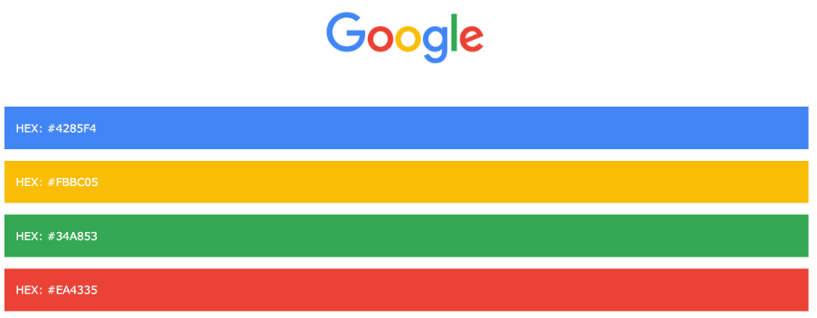
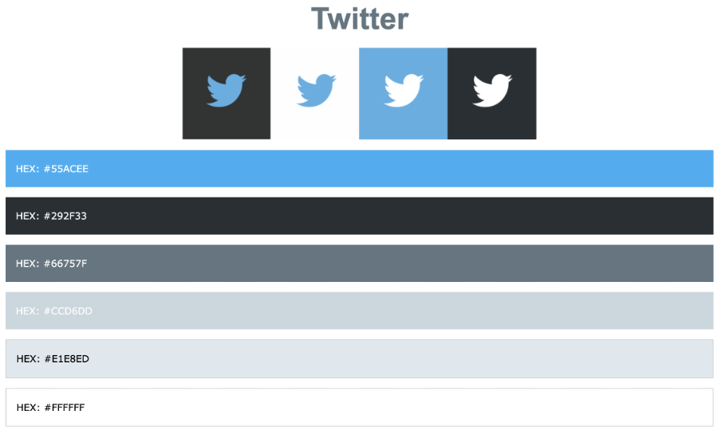

Рад са бојама
=============

Након ове лекције ћеш бити у стању да дефинишеш визуалне карактеристике основних веб-докумената који се састоје од текстуалних елемената. Додатно, разумећеш зашто је одабир боја и разних атрибута текста важна ставка у контексту веб-дизајна.

У језику CSS за подешавање боје елемената можеш користити следећа два својства:

- Својство ”color” задаје боју текста која се налази у садржају елемента.
- Својство ”background-color” задаје боју позадине елемента.

Већ је било прилике да видиш својство ”color” на делу. Вредности овог својства које смо навели у претходним примерима су била имена боја, као што су: ”blue”, “red”, “green”, “yellow”, “violet”, “pink”, “brown”, итд. Ових имена боја има 140 и цео списак, заједно са приказима боја, можеш пронаћи на адреси https://www.w3schools.com/colors/colors_names.asp.

.. petlja-editor:: Boje

    index.html
    <!-- Poglavlje3/9/index.html -->
    
    <!DOCTYPE html>
    <html lang="sr">
        <head>
            <meta charset="utf-8">
            <title>CSS - рад са бојама</title>

            <link rel="stylesheet" type="text/css" href="index.css">
        </head>
        <body>
            <h1>Наслов</h1>
            
Пасус

        </body>
    </html>
    ~~~
    index.css
    /* Poglavlje3/9/index.css */
    
    h1 {
        color: blueviolet;
        background-color: aquamarine;
    }

    p {
        color: blue;
        background-color: violet;
    }

Поред навођења имена боје, постоје и други начини за задавање боје. На пример, могуће је користити комбинацију јачине црвеног, зеленог и плавог светла, тзв. RGB формат. Овај формат се задаје користећи CSS функције ”rgb” или ”rgba”. Обе функције имају заједничка прва три параметра, а то су: удео црвене светлости (цели број из интервала 0-255), удео зелене светлости (цели број из интервала 0-255) и удео плаве светлости (цели број из интервала 0-255). Функција “rgba” има и додатни параметар, а то је степен прозирности, који се често назива и параметар алфа (број у покретном зарезу из интервала 0.0-1.0).

.. petlja-editor:: Boje2
    
    index.html
    <!-- Poglavlje3/10/index.html -->
    
    <!DOCTYPE html>
    <html lang="sr">
        <head>
            <meta charset="utf-8">
            <title>CSS - рад са бојама</title>

            <link rel="stylesheet" type="text/css" href="index.css">
        </head>
        <body>
            
Боја текстa овог пасуса користи RGB формат за задавање вредности боје.

            
Позадинска боја овог пасуса има постављен и параметар алфа за 50% прозирности...

            
...за разлику од позадинске боје овог пасуса који има исту боју, али није прозиран.

        </body>
    </html>
    ~~~
    index.css
    /* Poglavlje3/10/index.css */
    
    #prvi-pasus {
        color: rgb(141, 62, 215);
    }

    #drugi-pasus {
        background-color: rgba(115, 195, 185, 0.5);
    }

    #treci-pasus {
        background-color: rgba(115, 195, 185, 1);
    }

Коначно, боју је могуће задати и шестоцифреним хексадекадним бројем, тзв. HEX форматом. Прве две цифре означавају удео црвене светлости (тј. двоцифрени хексадекадни број из интервала 00-FF), друге две цифре означавају удео зелене светлости (тј. двоцифрени хексадекадни број из интервала 00-FF) и последње две цифре означавају удео плаве светлости (тј. двоцифрени хексадекадни број из интервала 00-FF). Опционо, могуће је навести додатне две хексадекадне цифре (тј. двоцифрени хексадекадни број из интервала 00-FF) које означавају ниво прозирности боје (тј. параметар алфа).

Боја у HEX формату се наводи као вредност тако што се наведе карактер ”#” за којим следи (шестоцифрен или осмоцифрен) хексадекадни број.

.. petlja-editor:: Boje3
    
    index.html
    <!-- Poglavlje3/11/index.html -->
    
    <!DOCTYPE html>
    <html lang="sr">
        <head>
            <meta charset="utf-8">
            <title>CSS - рад са бојама</title>

            <link rel="stylesheet" type="text/css" href="index.css">
        </head>
        <body>
            
Боја текстa овог пасуса користи HEX формат за задавање вредности боје.

            

            Позадинска боја овог пасуса има постављене и додатне две хексадекадне цифре (тј. параметар алфа) за 50%
            прозирности...
            

            
...за разлику од позадинске боје овог пасуса који има исту боју, али није прозиран.

        </body>
    </html>
    ~~~
    index.css
    /* Poglavlje3/11/index.css */
    
    #prvi-pasus {
        color: #8d3ed7;
    }

    #drugi-pasus {
        background-color: #73c3b9;
    }

    #treci-pasus {
        background-color: #73c3b9;
    }

Одабир боје веб-страница треба да буде у складу са дефинисаним визуалним елементима веб-сајта, односно, треба да буду у складу са темом и метафором дизајна. Те боје су део визуалног идентитета (енг. *brand*) производа или услуге које веб-сајт нуди. Већина људи веома добро памти производе које имају аутентичан визуални идентитет. Због тога треба пажљиво водити рачуна о одабиру боја које се користе.

