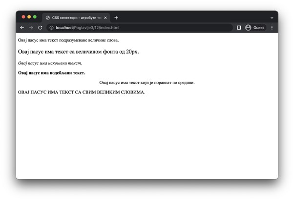
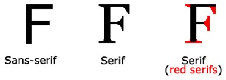
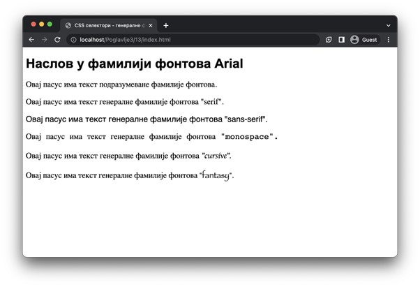
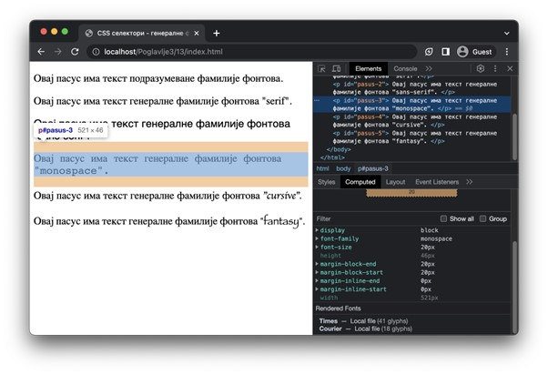
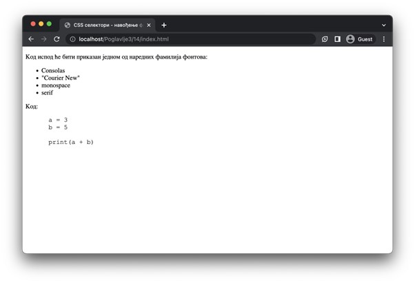

Стилизовање текстуалног садржаја
================================

И сам текстуални садржај треба да одговара дизајну веб-сајта. Није свеједно да ли ћеш користити велика или мала слова, да ли ће делови текста бити наглашени или не, да ли ће фонт бити озбиљније или слободније природе, итд. Сви ови елементи такође утичу на свеопшти утисак посетилаца твој веб-сајта.

Подешавање атрибута текста
__________________________

Постоји велики број атрибута текста које можеш подешавати у језику CSS. Нека од ових својстава су наведена у наставку:

- Својство ”font-size” служи за подешавање величине слова. Вредности овог својства су дужине, односно, нумеричке вредности праћене одговарајућом јединицом мере. Језик CSS подржава неколико дужина, међу којима су: центиметри (“cm”), инчи (”in”), пиксели (”px”), тачке (”pt”), проценти (”%”), и др.
- Својство ”font-style” контролише искошеност слова. Вредности овог својства су: ”normal” (усправна слова), ”italic” (искошена слова) и “oblique” (накошена слова; слично као ”italic”, али мање подржано од веб-прегледача).
- Својство ”font-weight” контролише подебљање слова. Вредности овог својства су: ”normal” (подразумевана дебљина), ”bold” (подебљана слова), ”bolder” (више подебљана слова) и ”lighter” (тања слова).
- Својство ”text-align” контролише хоризонтално поравнање текста. Вредности овог својства су: ”left” (лево поравнање), ”right” (десно поравнање), ”center” (поравнање по средини) и ”justify” (поравнато уз леву и десну ивицу).
- Својство ”text-transform” се користи за дефинисање трансформације слова. Вредности овог својства су: ”uppercase” (сва слова се трансформишу у велика), ”lowercase” (сва слова се трансформишу у мала) и ”capitalize” (прво слово свих речи се трансформише у велико).

.. petlja-editor:: Stilizovanje0

    index.html
    <!DOCTYPE html>
    <html lang="sr">
        <head>
            <meta charset="utf-8">
            <title>CSS - атрибути текста</title>

            <link rel="stylesheet" type="text/css" href="index.css">
        </head>
        <body>
            
Овај пасус има текст подразумеване величине слова.

            
Овај пасус има текст са величином фонта од 20px.

            
Овај пасус има искошени текст.

            
Овај пасус има подебљани текст.

            
Овај пасус има текст који је поравнат по средини.

            
Овај пасус има текст са свим великим словима.

        </body>
    </html>
    ~~~
    index.css
    .tekst-20 {
        font-size: 20px;
    }

    .tekst-iskosen {
        font-style: italic;
    }

    .tekst-podebljan {
        font-weight: bold;
    }

    .tekst-centriran {
        text-align: center;
    }

    .tekst-velika-slova {
        text-transform: uppercase;
    }

Подешавање фонтова
__________________

Поред стилизовања изгледа текста разним својствима које смо претходно демонстрирали, могуће је постављање фамилије фонта текста. Фамилија фонтова (енг. *font family*) дефинише генерални изглед сваког карактера. Угрубо, све фамилије фонтова се могу поделити у наредних пет група (које се називају још и генералне фамилије фонтова (енг. *general font family*)):

- Кукичаве фамилије фонтова (енг. *serif*) карактерише постојање кукица који на неки начин украшавају ивице карактера. Примери кукичавих фамилија фонтова су: Times New Roman, Georgia, итд.
- Бескукичаве фамилије фонтова (енг. *sans-serif*) карактерише одсуство кукица, односно, карактери у овим фонтовима имају “чист” изглед. На рачунарским екранима се препоручује коришћење безкукичавих фамилија фонтова за лакше читање. Примери бескукичавих фамилија фонтова су: Arial, Helvetica, итд.
- Фамилије фонтова карактера једнаких ширина (енг. *monospace*) карактеришу, као што им и само име каже, карактери који сви заузимају једнаку ширину. Обично се ове фамилије фонтова сматрају најбољим за приказивање изворног кода програма. Примери фамилија фонтова једнаких ширина су: Courier New, Lucida Console, итд.
- Писане фамилије фонтова (енг. *cursive*) карактеришу карактери који делују као да су писани руком. Примери писаних фамилија фонтова су: Comic Sans, Snell Roundhand, итд.
- Декоративне фамилије фонтова (енг. *fantasy*) карактеришу нестандардни карактери који се обично користе за наслове или за посебно истицање неких карактера. Примери декоративних фамилија фонтова су: Impact, Luminary, итд.

С обзиром да су прве две групе фамилија фонтова највише коришћене, на наредној слици дат је приказ разлике између једне бескукичаве и једне кукичаве фамилије фонтова на слову ”F”, као и одговарајуће кукице по којима се ово слово разликује.

Навођење фамилије фонтова се врши својством ”font-family”. Фамилија фонтова се може задати по свом називу, на пример, ”Arial” или ”DejaVu Serif”. Уколико назив фамилије фонтова садржи размаке, препоручује се коришћење наводника. Такође, уместо неке конкретне фамилије фонтова, могуће је навести и неку од генералних фамилија фонтова, која може бити једна од наредних вредности: ”serif”, ”sans-serif”, ”monospace”, ”cursive” и ”fantasy”.

.. petlja-editor:: Stilizovanje1

    index.html
    <!DOCTYPE html>
    <html lang="sr">
        <head>
            <meta charset="utf-8">
            <title>CSS - генералне фамилије фонтова</title>

            <link rel="stylesheet" type="text/css" href="index.css">
        </head>
        <body>
            <h1>Наслов у фамилији фонтова Arial</h1>

            
Овај пасус има текст подразумеване фамилије фонтова.

            
Овај пасус има текст генералне фамилије фонтова "serif".

            
Овај пасус има текст генералне фамилије фонтова "sans-serif".

            
Овај пасус има текст генералне фамилије фонтова "monospace".

            
Овај пасус има текст генералне фамилије фонтова "cursive".

            
Овај пасус има текст генералне фамилије фонтова "fantasy".

        </body>
    </html>
    ~~~
    index.css
    h1 {
        font-family: Arial;
    }

    p {
        font-size: 20px;
    }

    #pasus-1 {
        font-family: serif;
    }

    #pasus-2 {
        font-family: sans-serif;
    }

    #pasus-3 {
        font-family: monospace;
    }

    #pasus-4 {
        font-family: cursive;
    }

    #pasus-5 {
        font-family: fantasy;
    }

Различити веб-прегледачи имају различите базе фамилија фонтова. Уколико веб-прегледач не садржи неку фамилију фонтова, он се може ослонити на оперативни систем. Међутим, немају ни сви оперативни системи исте базе фамилија фонтова. На пример, ако твој веб-прегледач или оперативни систем немају подршку за фамилију фонтова ”Arial”, онда наслов у претходном примеру неће бити приказан том фамилијом фонтова, већ неком другом. Штавише, некада чак ни све генералне фамилије фонтова нису подржане! Примети разлику у опхођењу веб-прегледача Google Chrome према латиничним и ћириличним словима у претходном примеру. Генералне фамилије фонтова ”serif” и ”sans-serif” су примењене на исти начин на оба писма. Остале генералне фамилије фонтова су примењене на латинична слова, али не и на ћирилична.

Можеш да провериш које фамилије фонтова су употребљене за HTML садржај тако што у оквиру језичка ”Elements” алата за развој у веб-прегледачу одабереш жељени елемент и посматраш језичак ”Computed”. Овај језичак ти нуди списак свих CSS својстава која су примењена на одабрани HTML елемент, као и списак свих фамилија фонтова и броја карактера (у терминима фонтова, говоримо о глифовима) који користе сваку од наведених фамилија фонтова.

Због описаног понашања, језик CSS нуди могућност да се наведе више фамилија фонтова као вредност својства ”font-family” (свака од њих је раздвојена карактером ”,”). Ова функционалност се углавном користи тако што се прво наводе пожељније фамилије фонтова, а на самом крају се наведе нека од генералних фамилија фонтова. Веб-прегледач ће покушавати да пронађе и примену једну по једну фамилију фонтова све док или не пронађе једну која је наведена или не исцрпи све опције (што резултује у примени подразумеване фамилије фонтова).

.. petlja-editor:: Stilizovanjelast

    index.html
    <!DOCTYPE html>
    <html lang="sr">
        <head>
            <meta charset="utf-8">
            <title>CSS - навођење фамилије фонтова</title>

            <link rel="stylesheet" type="text/css" href="index.css">
        </head>
        <body>
            
Код испод ће бити приказан једном од наредних фамилија фонтова:

            <ul>
            <li>Consolas</li>
            <li>"Courier New"</li>
            <li>monospace</li>
            <li>serif</li>
            </ul>

            
Код:

            <pre>
            a = 3
            b = 5

            print(a + b)
            </pre>
        </body>
    </html>
    ~~~
    index.css
    pre {
        font-family: Consolas, "Courier New", monospace, serif;
    }

Приказана својства су ти довољна да можеш да започнеш размишљање о визуалном идентитету својих веб-сајтова. Наредни пут када будеш у процесу развијања веб-сајта, не заборави на ове важне елементе и на који начин ће они утицати на корисничко искуство посетилаца твог веб-сајта.