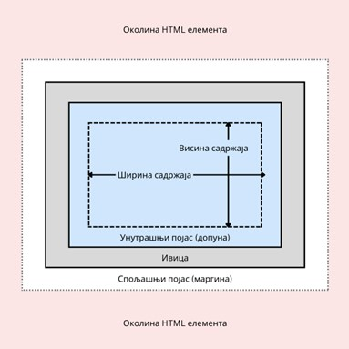

Шта је модел кутије?
====================

Након што одабереш визуални идентитет свог веб-сајта, поред текстуалних елемената, важно је да одредиш димензије елемената. Да ли ће се нека табела прожимати целом ширином веб-странице? Да ли ће логотип бити део главне навигације као слика малих димензија или ће заузимати читаво заглавље? Колики ће бити простор између ставки листе? Зарад исправног подешавања свих ових карактеристика, треба да разумеш један важан концепт у језику CSS.

Све HTML елементе можеш да замислиш као правоугаонике који се слажу једни поред других у случају линијских елемената, односно, једни испод других у случају блоковских елемената. Испоставља се да језик CSS дефинише неколико својстава којима се може управљати овим правоугаоницима како би се добила одговарајућа визуална презентација.

У сврху бољег разумевања како ова својстава функционишу, увешћемо модел који и сам језик CSS користи. Овај модел се назива модел кутије (енг. *box model*) и њиме се подразумева да се сваки HTML елемент простире одговарајућом дводимензионалном површином на веб-страници. Величина ове површине зависи од четири вредности, које заједно чине модел кутије. Те величине су:

- Садржај (енг. *content*) представља површину у којој се приказује текст, слика или било који други садржај HTML елемента.
- Унутрашњи појас или допуна (енг. padding) представља површину око садржаја. Површину коју чине садржај и допуна заједно зовемо унутрашњошћу HTML елемента. Површина допуне је подразумевано прозирна, али на њу је могуће утицати неким CSS својствима, као што је ”background-color”.
- Ивица (енг. *border*) представља површину која се може сматрати границом елемента. Другим речима, ивица дели унутрашњост елемента од спољашности. Ивица подразумевано није постављена.
- Спољашњи појас или маргина (енг. *margin*) представља површину око ивице елемента, који пре свега служи да створи ”безбедни појас” око елемента и одвоји га од околних елемената. Маргина је увек прозирна.

На наредној слици можеш да видиш однос између сваких од ових површина.

У наредним лекцијама ћеш научити о свакој од ових површина.