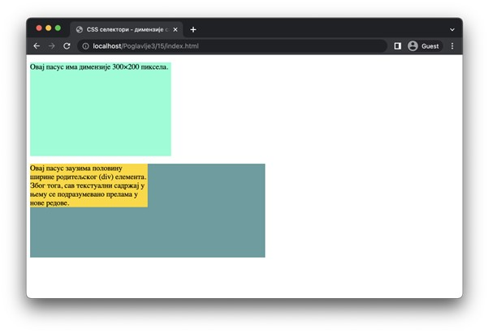
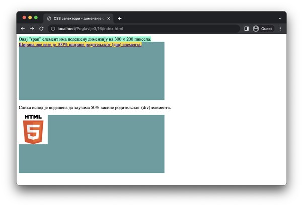

Садржај елемената
=================

Одређеним HTML елементима је могуће променити подразумеване димензије садржаја коришћењем својстава ”width” и ”height”. Прво од њих се односи на ширину садржаја, а друго на висину. Њихове вредности могу бити било које од дужина које смо већ описали.

::

    Poglavlje3/15/index.html
    Poglavlje3/15/index.css

Међутим, то не важи за све елементе. На пример, већина линијских елемената за обележавање текста (”span”, ”i”, “strong”, и др.) и елемент за обележавање веза (”а”) неће променити димензије садржаја. За ове елементе важи да ће увек заузимати онолику површину колико заузима њихов садржај. Наведени елементи су сви линијски елементи, и заиста, за већину линијских елемената ово правило важи. Међутим, на линијски елемент ”img” је ипак могуће применити својства ”width” и “height”. Штавише, ако на тај елемент применимо само једно својство, оно друго ће бити аутоматски подешено тако да размер слике остане непромењен.

::

    Poglavlje3/16/index.html
    Poglavlje3/16/index.css

