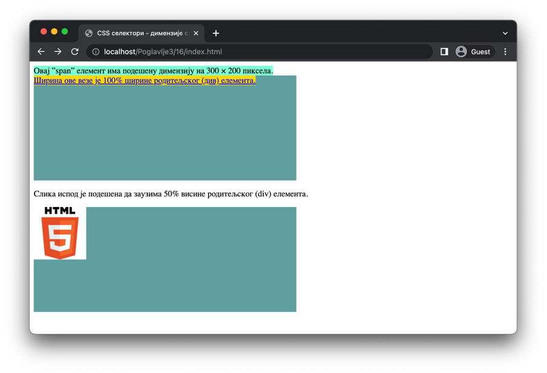

Садржај елемената
=================

Одређеним HTML елементима је могуће променити подразумеване димензије садржаја коришћењем својстава ”width” и ”height”. Прво од њих се односи на ширину садржаја, а друго на висину. Њихове вредности могу бити било које од дужина које смо већ описали.

.. petlja-editor:: Poglavlje3/15

    index.html
    <!-- Poglavlje3/15/index.html -->
    
    <!DOCTYPE html>
    <html lang="sr">
        <head>
            <meta charset="utf-8">
            <title>CSS - димензије садржаја</title>

            <link rel="stylesheet" type="text/css" href="index.css">
        </head>
        <body>
            
Овај пасус има димензије 300&times;200 пиксела.

            

            

                Овај пасус заузима половину ширине родитељског (div) елемента. Због тога, сав текстуални садржај у њему се
                подразумевано прелама у нове редове.
            

            

        </body>
    </html>
    ~~~
    index.css
    /* Poglavlje3/15/index.css */
    
    #pasus-1 {
        width: 300px;
        height: 200px;
        background-color: aquamarine;
    }

    div {
        width: 500px;
        height: 200px;
        background-color: cadetblue;
    }

    #pasus-2 {
        width: 50%;
        background-color: gold;
    }

Међутим, то не важи за све елементе. На пример, већина линијских елемената за обележавање текста (”span”, ”i”, “strong”, и др.) и елемент за обележавање веза (”а”) неће променити димензије садржаја. За ове елементе важи да ће увек заузимати онолику површину колико заузима њихов садржај. Наведени елементи су сви линијски елементи, и заиста, за већину линијских елемената ово правило важи. Међутим, на линијски елемент ”img” је ипак могуће применити својства ”width” и “height”. Штавише, ако на тај елемент применимо само једно својство, оно друго ће бити аутоматски подешено тако да размер слике остане непромењен.

.. code-block:: html

    <!-- Poglavlje3/16/index.html -->
    
    <!DOCTYPE html>
    <html lang="sr">
    <head>
        <meta charset="utf-8">
        <title>CSS - димензије садржаја</title>

        <link rel="stylesheet" type="text/css" href="index.css">
    </head>
    <body>
        Овај ”span” елемент има подешену димензију на 300 &times; 200 пиксела.

        

        <a href="./html5.png">Ширина ове везе је 100% ширине родитељског (див) елемента.</a>
        

        
Слика испод је подешена да заузима 50% висине родитељског (div) елемента.

        

        
        

    </body>
    </html>

.. code-block:: css

    /* Poglavlje3/16/index.css */
    
    span {
        width: 300px;
        height: 200px;
        background-color: aquamarine;
    }

    div {
        width: 500px;
        height: 200px;
        background-color: cadetblue;
    }

    a {
        width: 100%;
        background-color: gold;
    }

    img {
        height: 50%;
    }

