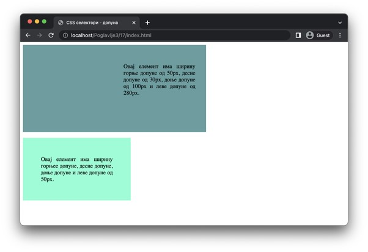

Унутрашњи појас елемената
=========================

Допуна представља површину око садржаја елемента, те постоје четири својства којима је могуће управљати допуном – за сваку страну по једно. То су својства ”padding-top” (горња допуна), ”padding-right” (десна допуна), ”padding-bottom” (доња допуна) и ”padding-left” (лева допуна). Њихове вредности могу бити неке од дужина и представљају ширину допуне на одговарајућој страни. Подразумевана вредност свих допуна је ”0”.

Постоји и својство ”padding” којим се могу навести димензије допуна за све стране одједном. Постоји неколико варијанти употребе овог својства, а ми ћемо их овде приказати на конкретним примерима како би ти било лакше да их запамтиш:

- Декларацијом ”padding: 10px 20px 30px 40px” постављају се следеће ширине допуна: 10px за горњу допуну, 20px за десну допуну, 30px за доњу допуну и 40px за леву допуну. Примети да редослед одговара смеру кретања казаљке на сату, почевши од горње стране. Већина ”скраћених” својстава функционише на овај начин, па није лоше да већ сада упамтиш ово понашање.
- Декларацијом ”padding: 50px 60px” постављају се следеће ширине допуна: 50px за горњу и доњу допуну и 60px за десну и леву допуну.
- Декларацијом ”padding: 100px” поставља се ширина од 100px за све четири стране допуне.

::

    Poglavlje3/17/index.html
    Poglavlje3/17/index.css

