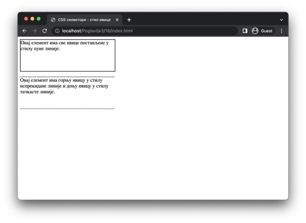
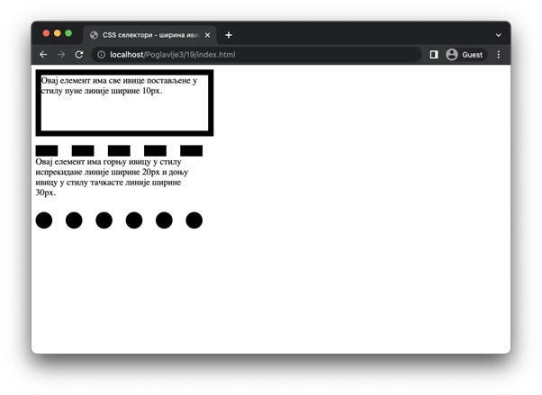
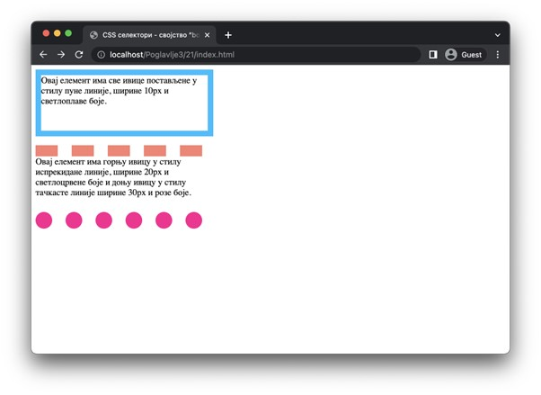
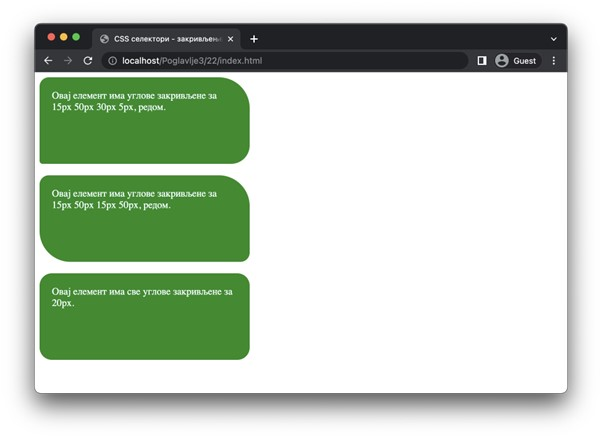

Ивица елемената
===============

У језику CSS могуће је управљати различитим карактеристикама ивице елемената. Свака од ових карактеристика има одговарајућа својства. Ова својства можеш да наведеш за сваку страну посебно, или за више страна одједном, на исти начин као што је то случај са допуном елемента.

Стил ивице
__________

Стилом ивице управљаш помоћу својства ”border-style”, односно, својствима ”border-top-style”, ”border-right-style”, ”border-bottom-style” и ”border-right-style”. Неке од могућих вредности ових својстава су:

- Вредност ”solid” означава стил пуне линије.
- Вредност ”dashed” означава стил испрекидане линије. 
- Вредност ”dotted” означава стил тачкасте линије.
- Вредност ”double” означава стил дупле пуне линије.
- Вредност ”hidden” означава да ивица неће бити видљива, али је могуће управљати осталим карактеристикама.

::

    Poglavlje3/18/index.html
    Poglavlje3/18/index.css

Уколико желиш да подесиш било коју од наредних карактеристика ивице, обавезно мораш да прво подесиш стил ивице. У супротном, те карактеристике неће бити примењене.
Ширина ивице
Када поставиш стил ивице, она добија подразумевану ширину од ”1px”. Ово можеш да промениш коришћењем својства ”border-width”, односно неког од својстава ”border-top-width”, ”border-right-width”, ”border-bottom-width” и ”border-left-width”. Ширина ивице се може задати у разним дужинама. 

::

    Poglavlje3/19/index.html
    Poglavlje3/19/index.css

Боја ивице
__________

Након што подесиш стил ивице, приметићеш да је она подразумевано црне боје. Ако желиш да подесиш неку другу боју, можеш да искористиш својство ”border-color” или неко од својстава ”border-top-color”, ”border-right-color”, ”border-bottom-color” и ”border-left-color”. Вредности које ова својства могу добити су боје, задате било путем њихових назива, RGB или HEX формата.

::

    Poglavlje3/20/index.html
    Poglavlje3/20/index.css

Својство ”border”
_________________

Ако желиш да поставиш више карактеристика одједном, поред навођења одговарајућих својстава као што смо до сада приказали, можеш да искористиш и својство ”border” које омогућава скраћени запис примене карактеристика ивице. Ово својство се односи на све ивице одједном, а постоје и варијанте ”border-top”, ”border-right”, ”border-bottom” и ”border-left”. 

Приликом навођења овог својства, обавезно је да наведеш стил ивице као прву карактеристику. Остала својства (боју и ширину), ако желиш да их подесиш, можеш навести у произвољном редоследу.

::

    Poglavlje3/21/index.html
    Poglavlje3/21/index.css

Закривљење ивице
________________

Ивицу је могуће закривити чиме се добија обла линија у угловима правоугаоника елемента. За подешавање степена закривљења се може користити својство ”border-radius” чија вредност може узимати различите дужине. И овом својству је могуће навести неколико дужина, а у зависности од броја наведених дужина, ефекти се разликују:

- Декларацијом ”border-radius: 15px 50px 30px 5px” ће горњи-леви угао бити закривљен за 15px, горњи-десни угао за 50px, доњи-десни угао за 30px и доњи-леви угао за 5px.
- Декларацијом ”border-radius: 15px 50px” ће горњи-леви и доњи-десни углови бити закривљени за 15px, а горњи-десни и доњи-леви углови за 50px.
- Декларацијом ”border-radius: 20px” ће сва четири угла бити закривљена за 20px.

::

    Poglavlje3/22/index.html
    Poglavlje3/22/index.css

