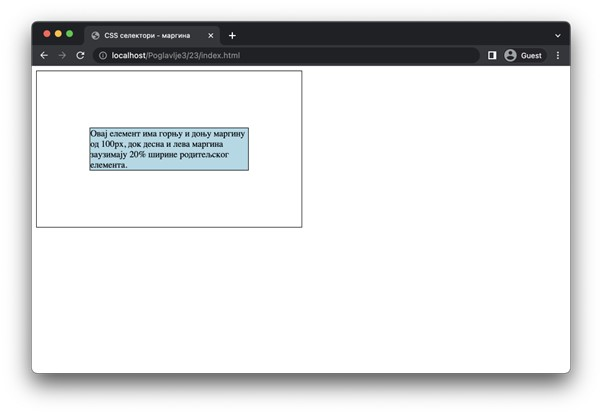

Спољашњи појас елемената (маргина)
==================================

Маргина представља површину која раздваја ивицу елемента од осталих елемената. Попут допуне, и за маргину постоје четири својства којима је могуће подешавати површину спољашњег појаса за различите стране. То су својства ”margin-top” (горња маргина), ”margin-right” (десна маргина), ”margin-bottom” (доња маргина) и ”margin-left” (лева маргина). Њихове вредности могу бити неке од дужина и представљају ширину маргине на одговарајућој страни. Подразумевана вредност маргина зависи од елемента, али у већини случајева је ”0”.

Постоји и својство ”margin” којим се могу навести димензије маргина за све стране одједном. Ово својство функционише на исти начин као својство ”padding”.

::

    Poglavlje3/23/index.html
    Poglavlje3/23/index.css

