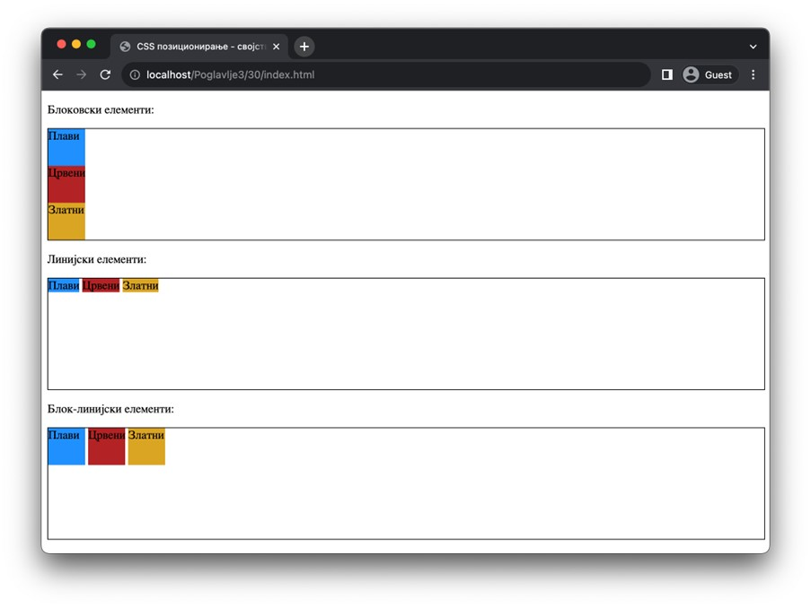
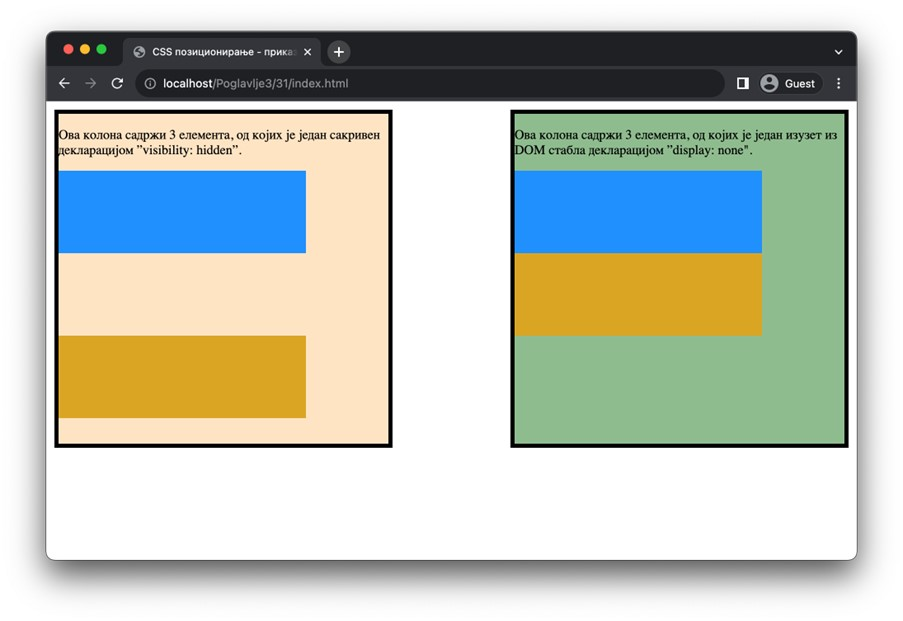

Приказивање и сакривање елемената
=================================

Често је потребно да елементе прикажеш са неким другачијим својствима од оних која су им подразумевано додељена. У језику CSS постоји својство display које одређује како HTML елемент треба да буде приказан у оквиру веб-странице. Постоје различите вредности за ово својство које утичу на начин приказа елемента, а најчешће коришћене вредности су: *block, inline, inline-block* и *none*.

Вредности *block* и *inline* користиш да промениш понашање елемента тако да има карактеристике блоковских, односно, линијских елемената, редом. О овим карактеристикама је било речи раније. Постављањем вредности *inline-block* за својство display омогућаваш HTML елементу да се понаша и као блоковски и као линијски елемент. Прецизније, HTML елемент на кога делује ова вредност се приказује у истом реду са текстом и другим *inline* елементима, али му се такође може поставити ширина и висина, као код *block* елемената.

::

    Poglavlje3/30/index.html
    Poglavlje3/30/index.css

Поред ових вредности, својство *display* може имати и вредност *none*. Ову вредност користиш када је потребно да уклониш HTML елемент са веб-странице.

У ту сврху можеш да користиш још једно својство језика CSS. У питању је својство *visibility*, које има могуће вредности *hidden* и *visible*. Вредност *hidden* користиш ради прикривања HTML елемената на веб-страници, док се вредношћу *visible* приказују претходно прикривени елементи.

Важно је да разумеш разлику између декларација *display: none* и *visibility: hidden*. Применом прве декларације на неки HTML елемент, ти тај елемент уклањаш из DOM стабла, чиме утичеш на распоред осталих елемената на веб-страници. Са друге стране, применом друге декларације, тај елемент и даље заузима исти простор на веб-страници, али је невидљив.

::

    Poglavlje3/31/index.html
    Poglavlje3/31/index.css

