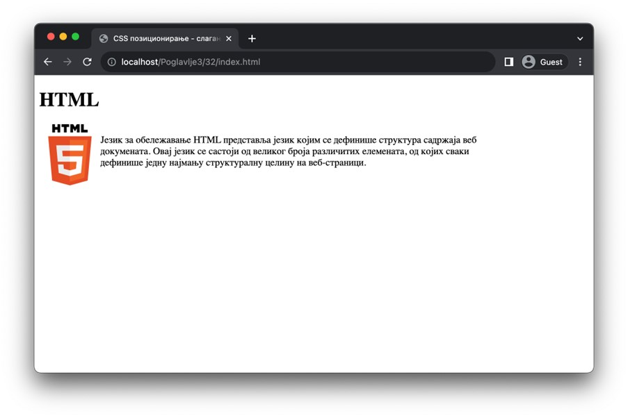
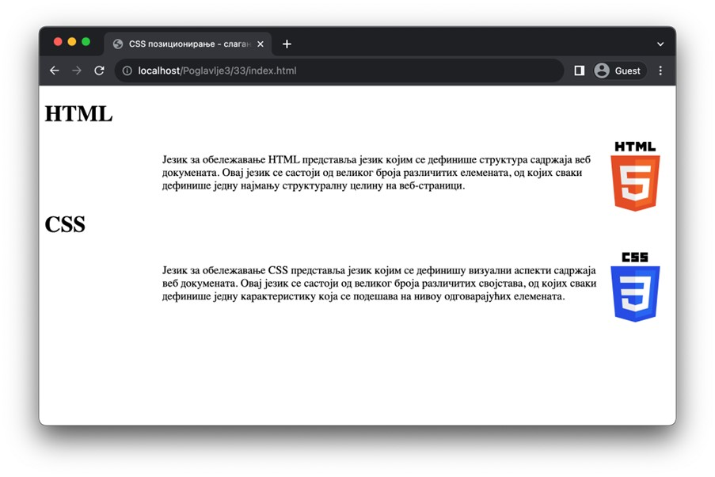

Слагање елемената
=================

Позиционирање елемената уме бити сложено, поготово ако се на веб-страници наниже велики број HTML елемената. Један од једноставнијих механизама за распоређивање елемената јесте слагање елемената у тзв. токове, од којих постоје два типа: леви и десни. Леви ток подразумева да се елемент постави уз леву ивицу његовог наредног елемента (у истој линији), док десни ток подразумева да се елемент постави уз десну ивицу на сличан начин.

За слагање елемената користиш својство float, а вредности овог својства су left за леви ток и right за десни ток. У наредној примеру можеш видети како се слика поставља уз леву ивицу пасуса, што је омогућено придруживањем декларације *float: left* на елемент слике.

Слагање елемената се врши у истој линији све док има места за те елементе. Када понестане места, преостали елементи ће прећи у наредни ред и наставити слагање на исти начин. На пример, ако се на страници налази шест елемената *div* ширине 30% (и сложени су левим током), онда ће се прва три елемента наћи у првом реду, а преостала три елемента у другом реду.

.. petlja-editor:: Poglavlje3/32

    index.html
    <!DOCTYPE html>
    <html lang="sr">
    <head>
        <meta charset="utf-8">
        <title>CSS позиционирање - слагање елемената</title>

        <link rel="stylesheet" type="text/css" href="index.css">
    </head>
    <body>
        <h1>HTML</h1>

        
        

        Језик за обележавање HTML представља језик којим се дефинише структура садржаја веб докумената. Овај језик се
        састоји од великог броја различитих елемената, од којих сваки дефинише једну најмању структуралну целину на
        веб-страници.
        

    </body>
    </html>
    ~~~
    index.css
    img,
    p {
        float: left;
    }

    p {
        width: 70%;
    }

Ако желиш да прекинеш слагање елемената, потребно је да искористиш декларацију *clear: both* која ће „очистити“ ток по којем се елементи слажу један за другим. У наредном примеру смо искористити ово својство како би се насловни елемент са текстом *„CSS“* позиционирао на устаљени начин, уместо да се слаже на остале елементе.

.. petlja-editor:: Poglavlje3/33

    index.html
    <!DOCTYPE html>
    <html lang="sr">
    <head>
        <meta charset="utf-8">
        <title>CSS позиционирање - слагање елемената</title>

        <link rel="stylesheet" type="text/css" href="index.css">
    </head>
    <body>
        <h1>HTML</h1>

        
        

        Језик за обележавање HTML представља језик којим се дефинише структура садржаја веб докумената. Овај језик се
        састоји од великог броја различитих елемената, од којих сваки дефинише једну најмању структуралну целину на
        веб-страници.
        

        <h1>CSS</h1>

        
        

        Језик за обележавање CSS представља језик којим се дефинишу визуални аспекти садржаја веб докумената. Овај језик
        се састоји од великог броја различитих својстава, од којих сваки дефинише једну карактеристику која се подешава на
        нивоу одговарајућих елемената.
        

    </body>
    </html>
    ~~~
    index.css
    img,
    p {
        float: right;
    }

    p {
        width: 70%;
    }

    h1 {
        clear: both;
    }

