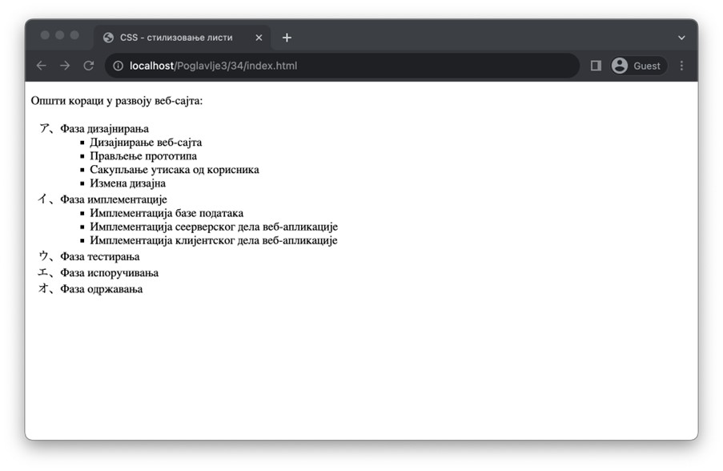
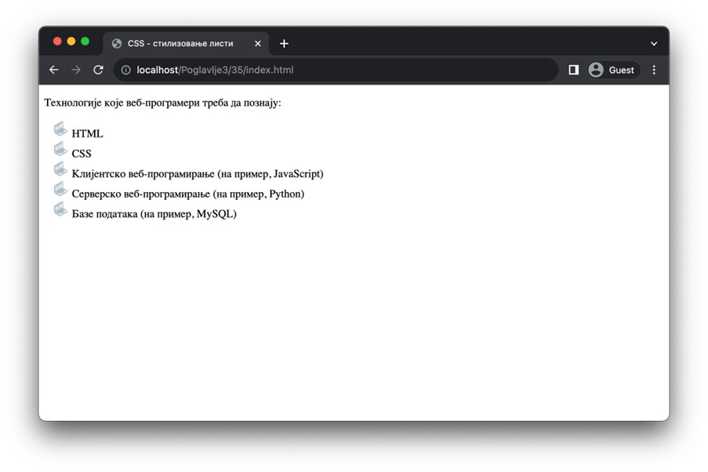

Стилизовање листи
=================

У некој од претходних лекција си прочитао да су листе, као и њихове ставке, припадници блоковских елемената, те је на њих могуће применити сва својства која су заједничка блоковским елементима. Међутим, листе имају и неке посебне карактеристике које ћеш научити у овој лекцији.

У лекцији о листама смо поменули да уређене слике подразумевано користе арапске бројеве за набрајање и, у ту сврху, показали смо да се променом атрибута *type* може утицати на стил набрајања, са оскудним избором опција. Испоставља се да у језику CSS постоји подршка за велики број других опција, а додатно, можеш стилизовати и неуређене листе, што у језику HTML није било могуће.

За подешавање стила набрајања, како уређених тако и неуређених листи, користиш својство *list-style-type*. У зависности од типа листе, доступне су ти различите вредности које се односе на набрајање својствено том типу листе. Тако за уређене листе, поред бројева, арапских и римских бројева, можеш користити слова грчког алфабета, хебрејског писма, па чак и јапанску кану. За неуређене листе су ти доступни испуњени и неиспуњени кругови, као и квадратићи. Иако се све вредности могу навести за оба типа листи, препоручљиво је користити оне које су намењене одговарајућем типу листе. Више о овом својству можеш пронаћи на адреси https://www.w3schools.com/cssref/pr_list-style-type.php.

::

    Poglavlje3/34/index.html
    Poglavlje3/34/index.css

Није реткост да дизајн веб-странице подразумева посебан стил за неуређене листе, те да опције које су доступне језиком CSS нису довољне. Уколико ти је потребно да поставиш специјалне ознаке за ставке неуређених листи, на располагању ти је својство *list-style-image*, која за вредност узима локацију слике-ресурса (која се наводи позивом уграђене CSS функције *url*), a која ће бити коришћена на месту ознаке ставке. Води рачуна о томе да ће слика бити искоришћена у димензијама са диска, те се препоручује коришћење слика чије се димензије визуелно уклапају са текстом.

::

    Poglavlje3/35/index.html
    Poglavlje3/35/index.css

