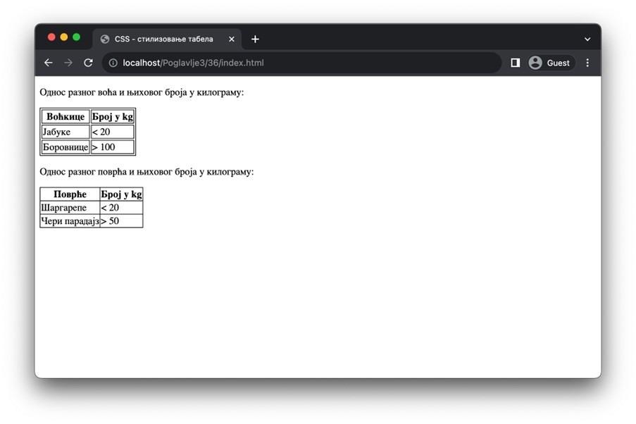
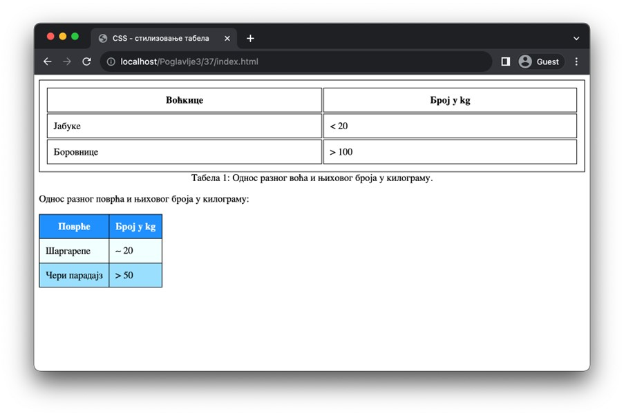

Стилизовање табела
==================

Попут листи, и разне елементе који учествују у формирању табеларног приказа садржаја је могуће стилизовати различитим CSS својствима. У овој лекцији ћеш упознати својства која су својеврсна табелама.

Подразумевано, табеле немају ивицу, али она им се лако може придружити добро познатим CSS својством *border* (и осталим својствима из те фамилије). Ивицу можеш поставити око читаве табеле (применом својства *border* на HTML елемент *table*), али и на нивоу појединачних ћелија (применом својства *border* на HTML елементе *td* или *th*). Уколико се определиш за оба приступа, онда се можеш одлучити да ли табела треба да прикаже све ивице или да споји суседне ивице како би се добио традиционални табеларни приказ. Ову опцију можеш контролисати навођењем својства *border-collapse*, чија вредност separate означава раздвојене ивице, а вредност *collapse* означава спојене ивице.

::

    Poglavlje3/36/index.html
    Poglavlje3/36/index.css

Својство *caption-side* користиш за подешавање позиције наслова табеле. Као што ти је познато, наслов табеле се увек наводи (ако се наводи) као први потомак елемента *table* и подразумевано се приказује изнад табеле. Овом понашању одговара вредност *top* својства *caption-side*. Са друге стране, постављањем овог својства на вредност *bottom*, омогућаваш наслову да се пребаци испод табеле. 

::

    Poglavlje3/37/index.html
    Poglavlje3/37/index.css

