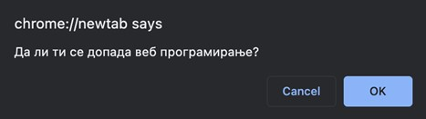

Програмски језик JavaScript
===========================

Програмски језик JavaScript тренутно представља најпопуларнији језик за програмирање клијентских веб-апликација. Као што знаш, клијентске веб-апликације су оне које се извршавају на клијентској страни комуникације, најчешће у оквиру веб-прегледача. Због тога, пре него што научиш да програмираш у овом језику, важно је да разумеш како се JavaScript код извршава у веб-прегледачима.

.. infonote::

    **Напомена:** У *htdocs* директоријуму XAMPP инсталационог директоријума направи нови директоријум и назови га *Poglavlje4*. Користи овај директоријум за смештање кодова из примера у овој теми. Такође, као и у случају са претходном темом, саветујемо да сваки пример наводиш у посебном директоријуму.

Извршавање JavaScript кода у веб-прегледачима
_____________________________________________

Како је језик JavaScript осмишљен за израду клијентских веб-страница, сасвим је природно да савремени веб-прегледачи имплементирају механизме за превођење изворног кода написаног у овом језику и извршавање преведених наредби. Део веб-прегледача који има управо ова задужења назива се JavaScript машина (*JavaScript engine*). С обзиром да се процес превођења изворног кода и извршавања наредби одвија у позадини, нећемо улазити у детаље овог процеса. Из перспективе програмера, овај процес изгледа као да се наредбе језика извршавају једна-по-једна, што је одлика великог броја скрипт језика. Овај процес се назива интерпретирање (*interpretation*), а део JavaScript машине који тај процес обавља се назива интерпретер (*interpreter*).

Најједноставнији начин да извршиш неки JavaScript код јесте да у оквиру веб-прегледача отвориш HTML документ који садржи JavaScript код. Овај документ може бити на локалном диску или га можеш дохватити са неког веб-сервера навођењем његове URL адресе. У сваком случају, процес је исти. Прикажимо прво различите начине за навођење JavaScript кода у оквиру HTML докумената, па ћемо описати процес након тога.

JavaScript код у оквиру HTML датотеке наводиш помоћу HTML елемента *script*. Постоје два начина употребе овог елемента. Први је тако што JavaScript код уметнеш као садржај овог елемента. Наредни пример илуструје овај начин.

::

    Poglavlje4/1/index.html

Други начин јесте да JavaScript код изместиш у засебну датотеку, која може имати произвољан назив, али обично се завршава екстензијом *.js* (скраћено од *JavaScript*). Да би код написан у тој датотеци био укључен у HTML документ, потребно је да елементу *script* поставиш вредност атрибута *src* на локацију датотеке која садржи JavaScript код. Као и у случају са другим веб ресурсима, локација може бити релативна путања или URL адреса. Наредни пример илуструје овај начин.

::

    Poglavlje4/2/index.html
    Poglavlje4/2/index.js

.. infonote::

   ** Напомена:** Није дозвољено комбиновање оба приступа. Дакле, JavaScript код ћеш или навести као садржај елемента *script* или ћеш га укључити у HTML документ помоћу атрибута *src*.

Покрени у веб-прегледачу било који од ова два примера, посећивањем адресе http://localhost/Poglavlje4/1/index.html или http://localhost/Poglavlje4/2/index.html. Добићеш приказ као на наредној слици.

Наизглед, осим HTML кода, делује као да се ништа није догодило. Међутим, ако отвориш језичак Console у алатима за развој, приметићеш да овај језичак приказује поруку која је наведена у JavaScript коду.

Шта се овде догодило? Прво, веб-прегледач је дохватио веб-страницу на датој адреси. Затим, веб-прегледач је започео обраду HTML кода. Када наиђе на елемент script, веб-прегледач JavaScript код (било из садржаја елемента, било након што га дохвати са локације наведене као вредност атрибута src) прослеђује JavaScript машини у целости и привремено зауставља обраду HTML кода. JavaScript интерпретер извршава наредбе редом и, када изврши и последњу наредбу, враћа контролу назад веб-прегледачу који наставља са обрадом HTML кода.

.. infonote::
    
    **Напомена:** Од оба наведена примера извршавања JavaScript кода, преферира се коришћење приступа са укључивањем спољашње JavaScript датотеке у HTML датотеку из истих разлога као што је то случај са стилским листовима. Веб-прегледачи могу да кеширају JavaScript датотеке тако да се следећи пут код брже дохвата са веб-сервера, а и одржавање веб-сајтова је једноставније када постоји јасно одвајање између HTML кода и JavaScript кода.

Web API
_______

Пре него што завршимо ову лекцију, остало је да објаснимо какав је ефекат програмског кода из претходних примера. У оквиру JavaScript машине савремених веб-прегледача, поред JavaScript интерпретера, доступан је и велики број библиотека које имплементирају разне функционалности веб-прегледача. JavaScript машина имплементира ове функционалности и омогућава нам њихов приступ кроз разне конструкције програмског језика JavaScript, као што су објекти, функције и методи. Све ове библиотеке се називају једном именом *Web API*.

Конзола веб-прегледача
______________________

Једна од библиотека која припада *Web API* библиотекама јесте *Console API*. Ову библиотеку карактерише објекат који се назива конзола (*console*), а који служи за приказивање порука о понашању клијентске веб-апликације. Поруке које се приказују у конзоли су пре свега намењене за програмере и најчешће се користе приликом развоја веб-апликације.

Конзоли се приступа путем објекта *console* над којим постоји неколико метода, али убедљиво најкоришћенији је метод log којем се исписује жељена порука. Да приступиш овом методу из објекта *console*, користиш синтаксу *console.log*, а да би позвао овај метод, користиш заграде ”(” и ”)”, између којих се наводи порука која се исписује под наводницима. Са овом синтаксом ћеш се детаљније упознати у наредним лекцијама.

У оквиру веб-прегледача, конзоли можеш приступити управо путем језичка *Console*, који ће приказати све поруке исписане методом *console.log*. Примети да се поред поруке налази и назив датотеке, као и број линије у тој датотеци, у којем се налази наредба којом је порука исписана. Ово ће ти веома значити у сложенијим апликацијама да пронађеш који од неколико десетина или стотина позива *console.log* метода исписује баш ту поруку коју посматраш.

.. questionnote::

    **Задатак:** Направи HTML датотеку која укључује JavaScript код који у конзоли исписује твоје име и презиме. Сачувај датотеку на веб-серверу и дохвати је путем веб-прегледача. Увери се да се твоје име и презиме заиста приказује у конзоли веб-прегледача.

Напоменимо и да метод *console.log* може исписивати више вредности одједном, које ће у конзоли бити исписани са карактером размака између, на пример:

::

    console.log("Пера", "Перић", "има", 15, "година");

Кориснички прозори
___________________

Често је приликом извршавања програма потребно приказати неке поруке кориснику, или од корисника захтевати унос података. Иако се за приказивање порука најчешће користи HTML садржај веб-странице, а за унос података се користе формулари, приказаћемо неке једноставне функције које приказују разне корисничке прозоре.

Функција *alert* се користи за приказивање поруке кориснику. Порука коју је потребно приказати се прослеђује као ниска приликом позива ове функције. На пример, позив функције

::

    alert("Нешто се догодило!");

кориснику приказује прозор као на наредној слици. Извршавање програма се привремено зауставља док корисник не одабере дугме *ОК*.

Функција *confirm* се користи за постављање ”да/не” питања кориснику. Питање које је потребно приказати се прослеђује као ниска приликом позива ове функције. Кориснички прозор који се приказује ће имати два дугмета, једно за потврђивање, а друго за поништавање избора. На пример, позив функције 

.. code-block:: javascript

    confirm("Да ли ти се допада веб програмирање?");

кориснику приказује прозор као на наредној слици. Извршавање програма се привремено зауставља док корисник не одабере једно од понуђених дугмића. Ако корисник одабере дугме *ОК*, функција враћа потврдну вредност (тј. Булову вредност *true*), а ако корисник одабере дугме *Cancel*, функција враћа одричну вредност (тј. Булову вредност *false*).

Функција *prompt* омогућава кориснику да унесе произвољни текст у прозору који се појављује. На пример, позив 

.. code-block:: javascript

    prompt("Твој омиљени програмски језик је:");

кориснику приказује прозор као на наредној слици. Одабиром дугмета *ОК* функција као повратну вредност враћа ниску која садржи текст који је корисник унео. Одабиром дугмета *Cancel* функција враћа специјалну вредност *null* о којој ћемо нешто више рећи у наредним лекцијама.

Ако желиш да сазнаш више о корисничким прозорима, можеш посетити наредне веб-странице:

- https://developer.mozilla.org/en-US/docs/Web/API/Window/alert
- https://developer.mozilla.org/en-US/docs/Web/API/Window/confirm
- https://developer.mozilla.org/en-US/docs/Web/API/Window/prompt 

.. infonote::

    **Напомена:** Важно је да разумеш да конзола, кориснички прозори, као ни друге библиотеке које чине Web API нису део програмског језика JavaScript. То значи да различита JavaScript окружења могу имати различите имплементације ових библиотека, а неке од њих могу да уопште не подржавају неке библиотеке. На пример, JavaScript окружења која се извршавају у командној линији (као што је окружење Node.js) немају приступ библиотекама за обраду DOM стабла или приступ корисничким прозорима, али имплементирају напредне библиотеке за рад са системом датотека (за разлику од веб-прегледача који имају веома ограничен приступ диску). Са друге стране, окружења за извршавање JavaScript кода на малим уређајима (**embedded device**) вероватно имају врло минималан скуп функционалности с обзиром на ограничене рачунарске ресурсе које ови уређаји поседују.

Сада када знаш како да покренеш JavaScript код у свом омиљеном веб-прегледачу, можеш да пређеш на конструкције језика JavaScript. Такође, приликом прегледања веб-страница у веб-прегледачу не заборави да отвориш језичак *Console* да видиш резултате извршавања JavaScript кода. Уколико желиш да сазнаш више информација о конзоли, можеш да посетиш адресу https://developer.mozilla.org/en-US/docs/Web/API/Console_API. 