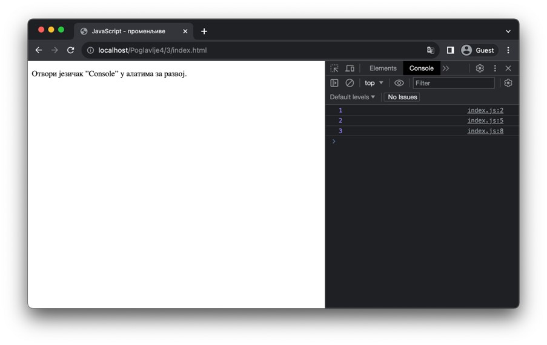

Основни елементи програмског језика
===================================

Чест је случај да се програмски језици уводе навођењем њихових основних елемената – типовима података и променљивама, па ћеш у овој лекцији научити управо о њима.

Типови података
_______________

Програмски језик JavaScript подржава типове података који су дати у наредним табелама. Табеле садрже називе типова које ћемо користити у наредним лекцијама, а уз њих су наведени и примери вредности које можеш сусрести у примерима кодова.

Прва табела садржи типове који су најкоришћенији у JavaScript програмима. Ове типове, као и разне операције које су подржане над њиховим вредностима, детаљно ћеш упознати у наредним лекцијама.

+--------------------------+-------------------------------+-----------------------------------------------------------+
| **Назив типа**           | **Резултат оператора typeof** | **Примери вредности типа**                                |
+==========================+===============================+===========================================================+
| **Бројеви**              | "number"                      | 3, -42, 1.345, 0, 0.0, 12e-4, Infinity, -Infinity, NaN, … |
+--------------------------+-------------------------------+-----------------------------------------------------------+
| **Ниске**                | "string"                      | "Пера", 'Перић', `IV-2`                                   |
+--------------------------+-------------------------------+-----------------------------------------------------------+
| **Булове вредности**     | "boolean"                     | true, false                                               |
+--------------------------+-------------------------------+-----------------------------------------------------------+
| **Функције**             | "function"                    | вишелинијског текста`, …                                  |
+--------------------------+-------------------------------+-----------------------------------------------------------+
| **Објекти**              | "object"                      | [], [1,2,3], {}, { ime: "Пера" }, null, …                 |
+--------------------------+-------------------------------+-----------------------------------------------------------+
| **Недостајућа вредност** | "undefined"                   | undefined                                                 |
+--------------------------+-------------------------------+-----------------------------------------------------------+

Наредна табела садржи преостале типове података. Вредности ових типова се користе у специфичним ситуацијама, те их нећемо обрађивати у овом курсу, али наводимо их ради комплетности.

+--------------------+-------------------------------+-----------------------------------+
| **Назив типа**     | **Резултат оператора typeof** | **Примери вредности типа**        |
+====================+===============================+===================================+
| **Велики бројеви** | "bigint"                      | -23n, 9007199254740991n, …        |
+--------------------+-------------------------------+-----------------------------------+
| **Симболи**        | "symbol"                      | Symbol(), Symbol("мој симбол"), … |
+--------------------+-------------------------------+-----------------------------------+

Посебно ћемо се осврнути на колону ”Резултат оператора *typeof*”. Наиме, у програмском језику JavaScript постоји оператор *typeof* који се може применити на било коју вредност. Резултат овог оператора је ниска која садржи званичну ознаку типа вредности над којим је оператор примењен. Тако, на пример, резултат примене овог оператора на број 5, тј. *typeof* 5 производи ниску "number". То нам говори да је у питању број. Овај оператор ћеш користити када год је потребно да провериш којег је типа нека вредност, на пример, за проверу типа повратне вредности функције која може вратити вредности различитих типова.

Променљиве
__________

Као што ти је познато из других програмских језика са којима је било прилике да се сусретнеш до сада, променљиве (*variable*) представљају делове рачунарске меморије које служе да складиште податке од значаја за неки програм. Програмери овим деловима меморије приступају путем имена.

Програмски језик JavaScript нуди могућност програмерима да креирају променљиве које могу да мењају вредности током рада програма. Такве променљиве се дефинишу кључном речи *let*. Са друге стране, у језику JavaScript је могуће дефинисати и променљиве које садрже тачно једну вредност од тренутка њиховог креирања до краја рада програма. Ове променљиве се дефинишу кључном речи *const* и од прве врсте променљивих ћемо их разликовати називом константе (*constant*). Наредни пример илуструје дефинисање променљивих и константи.

.. petlja-editor:: Poglavlje4/3

    index.html
    <!DOCTYPE html>
    <html lang="sr">
        <head>
            <meta charset="utf-8">
            <title>JavaScript - променљиве</title>
        </head>
        <body>
            
Отвори језичак ”Console” у алатима за развој.

            
        </body>
    </html>
    ~~~
    index.js
    let x = 1;
    console.log(x);

    x = 2;
    console.log(x);

    const y = 3;
    console.log(y);

Као што видиш, приликом дефинисања променљиве, не наводи се њен тип. То је зато што језик JavaScript има особину која се назива динамичка типизираност (*dynamic typing*). Ова особина говори о томе да променљиве могу узимати вредности различитих типова током рада програма. На пример, у једном тренутку променљива може представљати број, а у неком другом тренутку ниску.

.. infonote::

    **Напомена:** У некој литератури ћеш видети да се за дефинисање променљивих може користити и кључна реч *var*. Она има слично понашање као кључна реч *let*, али управо због разлика између њих њено коришћење лако доводи непажљиве програмере до неочигледних грешака у коду. Због тога, данас се не препоручује њено коришћење, те је ни ми нећемо користити у осталим лекцијама.

Коментари

Као што примећујеш из претходног примера, програмски језик JavaScript дозвољава програмерима да оставе коментаре у изворном коду. Постоје две врсте коментара:

- Једнолинијски коментари, који се наводе у једној линији након карактера ”//”
- Вишелинијски коментари, који започињу карактерима ”/*” и завршавају се карактерима ”*/” и могу се простирати кроз више линија. 

Као и у другим програмским језицима, коментари неће бити извршени од стране JavaScript интерпретера, већ се игноришу.