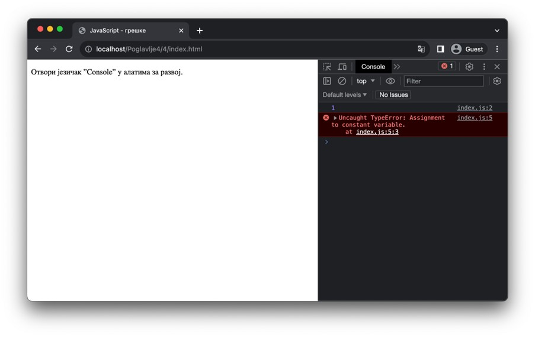

Грешке
======

Програмери често праве грешке приликом писања кода. Неке од тих грешака потичу од недовољног разумевања домена проблема који се решава. Такве грешке се решавају поновном анализом функционалних захтева, а затим осмишљавањем и имплементацијом новог решења.

Међутим, друга врста грешака долази од погрешних претпоставки о функционисању самог програмског језика. У претходној лекцији је било речи о константама и томе како се њихове вредности не могу мењати. Ако ипак покушаш да доделиш нову вредности константи, као што ти то наредни пример илуструје, у конзоли можеш да приметиш поруку као на наредној слици.

.. petlja-editor:: Poglavlje4/4

    index.html
    <!DOCTYPE html>
    <html lang="sr">
        <head>
            <meta charset="utf-8">
            <title>JavaScript - грешке</title>
        </head>
        <body>
            
Отвори језичак ”Console” у алатима за развој.

            
        </body>
    </html>
    ~~~
    index.js
    const y = 1;
    console.log(y);

    // Наредна линија производи грешку!
    y = 2;

    console.log(y);

*TypeError* је једна врста грешака која се може јавити приликом извршавања неисправног JavaScript програма. Ова врста грешака се углавном односи на неисправно коришћење конструкција језика везаних за типове података и њихове вредности. Постоје и друге врсте грешака, а неке од њих су:

- *ReferenceError*, који се јавља приликом неисправног баратања променљивама (на пример, коришћење променљиве која није претходно дефинисана).
- *SyntaxError*, који се јавља приликом превођења синтаксно неисправног изворног кода од стране интерпретера.

На адреси https://developer.mozilla.org/en-US/docs/Web/JavaScript/Reference/Errors можеш пронаћи опсежан списак грешака, као и детаљне описе за сваку од њих. Овај ресурс можеш да искористиш уколико наиђеш на грешку која ти није била позната, а у циљу разумевања на који начин можеш да исправиш ту грешку. Присети се да ћеш у конзоли веб-прегледача, поред саме поруке о грешци, пронаћи и датотеку, односно, линију у којој се грешка догодила, што ти може знатно олакшати дебагирање апликације.