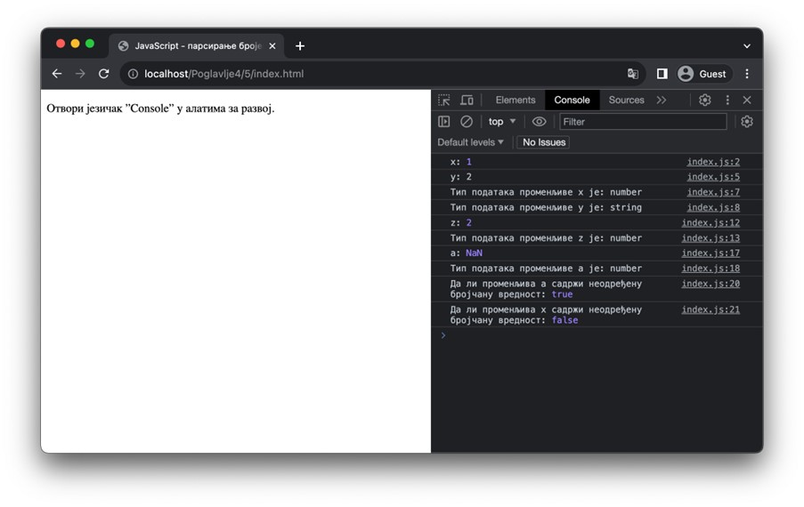
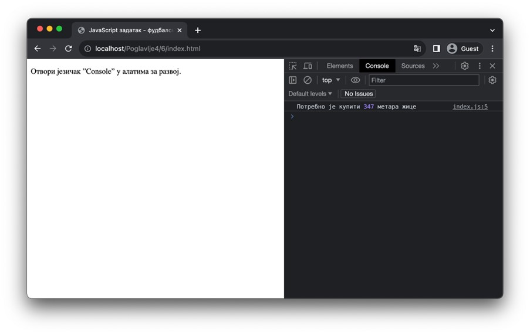
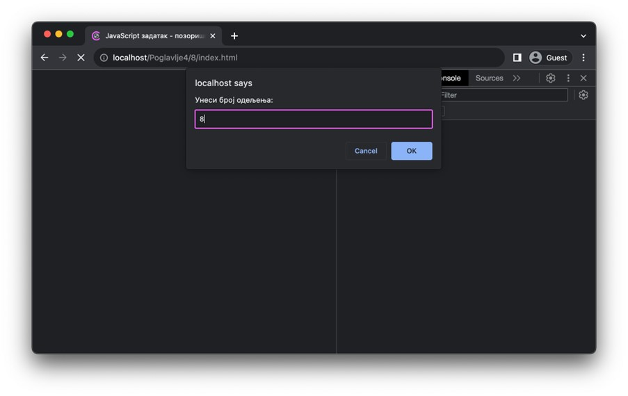
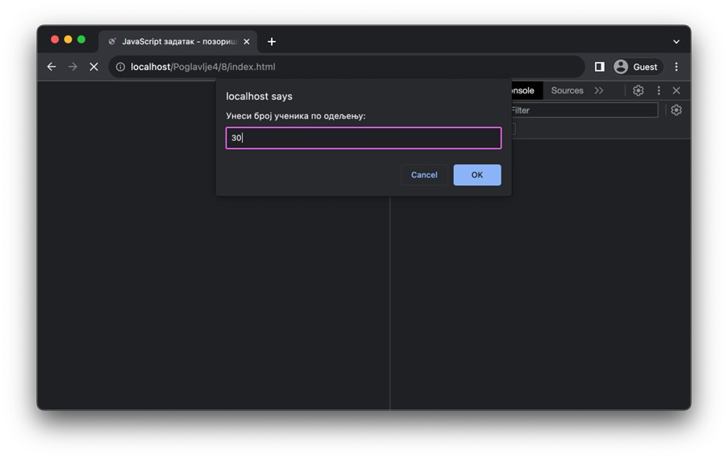
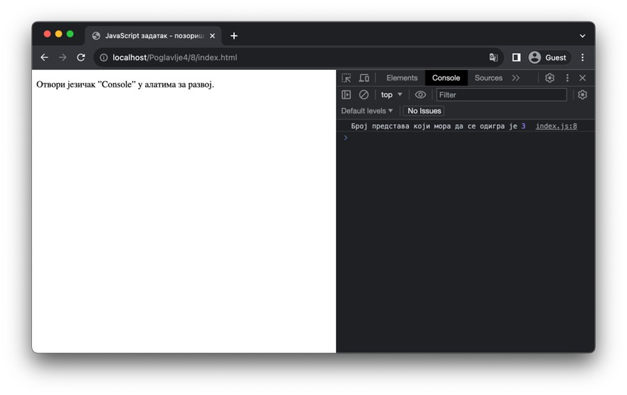
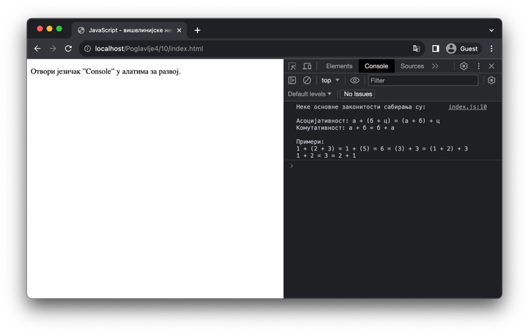
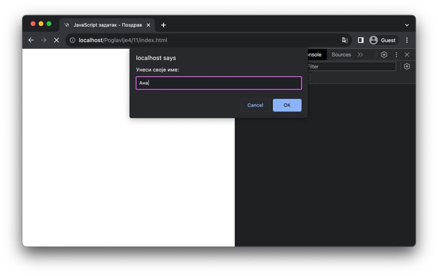
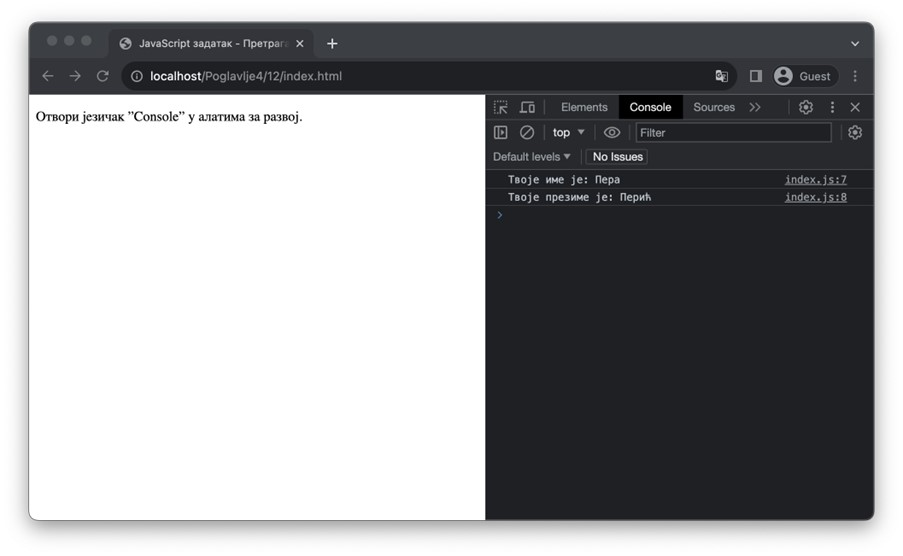
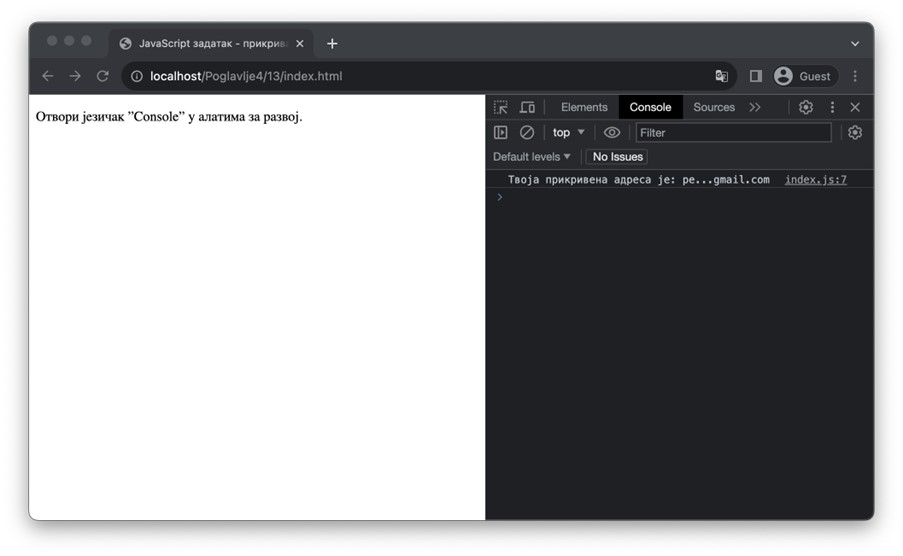
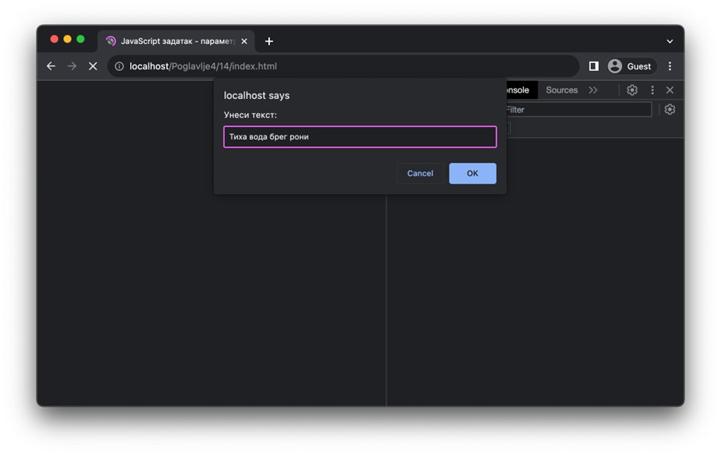

Бројеви и ниске
===============

Ова лекција је посвећена основним типовима података који представљају незаобилазни елемент практично свих JavaScript програма – бројеви и ниске. Сваки од ових типова, као и операција које су доступне над њима, илустроваћемо кроз неколико задатака.

Бројеви
________

Бројевне вредности се користе за репрезентацију бројчаних података и за писање програма који анализирају те вредности и израчунавање бројчаних израза. Све бројевне вредности одговарају тачно једном типу података – оном за које ће оператор *typeof* пријавити ниску "*number*".

Бројеве можеш навести на различите начине:

- Цели бројеви су: *0, 15, -23*, итд.
- Децимални бројеви су: *0.0, 13.5, -24.543*, итд.
- Запис са експонентом: :math:`1е5` (то је број :math:`1⋅10^5=100000`), :math:`23е-4` (то је број :math:`23⋅10^{-4})=0.0023`), итд.
- Бесконачности: *Infinity, -Infinity*
- Неодређена бројчана вредност: *NaN*

Бесконачности се могу добити као резултати неких посебних, али валидних, математичких операција као што је израз *1/0* (што резултује вредношћу *Infinity*), односно, израз *-1/0* (што резултује вредношћу *-Infinity*). 

Са друге стране, неодређена бројчана вредност *NaN* се добија као резултат невалидних математичких операција, као што је израз *0/0* или као резултат израчунавања неких нематематичких операција за које се очекује број, али сама операција се не може успешно извршити. Пример такве операције је парсирање броја из текста. Ова операција је доступна методама *Number.parseInt* за парсирање целих бројева и *Number.parseFloat* за парсирање децималних бројева. Оба метода очекују да им се проследи ниска која садржи цео број, односно, децималан број, а повратна вредност је бројчана вредност која се садржи у тој ниски. Ипак, уколико се неком од ових метода проследи ниска која не садржи број, онда ће се као резултат добити вредност *NaN*. Провера да ли је неки број неодређена вредност или не се може извршити методом *Number.isNaN*. Наредни пример илуструје коришћење ових метода.

::

    Poglavlje4/5/index.html
    Poglavlje4/5/index.js

Пређимо сада на задатке у којима ћеш видети примере програма који користе бројевне вредности. Као што очекујеш, језик JavaScript подржава разне математичке операције, што наредни задаци демонстрирају.

.. questionnote::

    **Задатак:** Потребно је поставити ограду око фудбалског терена дужине 105 метара и ширине 68.5 метара. Напиши JavaScript програм који израчунава колико метара ограде је потребно купити?

::

    Poglavlje4/6/index.html
    Poglavlje4/6/index.js

.. questionnote::

   **Задатак:** Пешчани сат облика пирамиде се попуњава песком. Дужина и ширина основе пешчаног сата су :math:`5cm`, а висина је :math:`12cm`. Ако се у једној секунди песком напуни :math:`2cm^3` пешчаног сата, напиши JavaScript програм који израчунава за колико секунди ће бити попуњен цео сат.

::

    Poglavlje4/7/index.html
    Poglavlje4/7/index.js

За наредни задатак се поред математичких операција користи и метод *Math.ceil* за заокругљивање бројева на већи цели број. У наредној табели можеш да пронађеш неке сличне корисне функције.

+-----------------------------+-------------------------------------------------+
| **Метод**                   | **Опис**                                        |
+=============================+=================================================+
| *Math.floor(број)*          | Заокругљивање броја на мањи цели број.          |
+-----------------------------+-------------------------------------------------+
| *Math.ceil(број)*           | Заокругљивање броја на већи цели број.          |
+-----------------------------+-------------------------------------------------+
| *Math.round(број)*          | Заокругљивање броја на најближи цели број.      |
+-----------------------------+-------------------------------------------------+
| *Math.max(број1, број2, …)* | Највећи од бројева број1, број2, …              |
+-----------------------------+-------------------------------------------------+
| *Math.min(број1, број2, …)* | Најмањи од бројева број1, број2, …              |
+-----------------------------+-------------------------------------------------+
| *Math.sin, Math.cos*, и сл. | Тригонометријске функције синус, косинус, и сл. |
+-----------------------------+-------------------------------------------------+

.. questionnote::

    **Задатак:** Позориште жели да обезбеди бесплатне карте за позоришну представу у једној школи. Сала у којој се представа одиграва има 100 седишта. Напиши програм који од корисника захтева број одељења и број ученика по одељењу и исписује у конзоли колико најмање представа позориште мора да организује како би сви ученици видели представу.

::

    Poglavlje4/8/index.html
    Poglavlje4/8/index.js

Ниске
______

Текст је веома моћан тип података зато што можеш да представиш најразличитије податке. На пример, у случају веб-апликације електронског дневника, текстуалне вредности можеш да користиш за идентификацију ученика, као што су: име, презиме, ЈМБГ, и др. Са друге стране, у веб-продавници се текстуалне вредности могу користити за описивање производа, рецензије корисника, и др.

Ниске у језику JavaScript представљају непроменљиве текстуалне вредности. Ниједна операција која постоји у језику не мења ниску, већ се у случају било каквих измена конструише нова ниска. Ову чињеницу је важно да запамтиш приликом учења о операцијама у овој лекцији.

У језику JavaScript, ниске можеш записати на три начина. Прва два се користе равноправно, а то је навођењем текста између једноструких (') или двоструких (") наводника. У оба случаја, текст који се наводи је једнолинијски, а текстови великих дужина се могу записати оператором надовезивања (*concatenation*) ниски (у питању је оператор *+*), као што наредни пример илуструје.

::

    Poglavlje4/9/index.html
    Poglavlje4/9/index.js

Поред ова два приступа, ниске се могу навести и косим наводницима (`). Ове ниске се могу наводити у више линија, при чему се сви карактери белина између наводника чувају у целости. Постоји још једна карактеристика својствена овим начином записа ниски која се назива интерполација (*string interpolation*). Ако у тексту наведеш шаблон *${}*, онда између витичастих заграда ”{” и ”}” можеш да наведеш произвољни JavaScript израз чија ће вредност, након израчунавања, бити уметнута уместо шаблона. Свака вишелинијска ниска може садржати више појављивања ових шаблона.

::

    Poglavlje4/10/index.html
    Poglavlje4/10/index.js

Поред операције надовезивања ниски, важно је да знаш како се одређује дужина неке ниске и како да приступиш карактерима. Свака ниска има своју дужину која одговара броју карактера у тој ниски. Да одредиш дужину неке ниске, користиш својство *length* којем се, попут метода, приступа помоћу нотације са тачком. На пример:

::

    "Pera Peric".length // Овај израз се израчунава у број 10

Сваки карактер у ниски има своју позицију, која се назива и индекс. Својеврсно већини програмских језика, индекси карактера у нискама почињу од 0, тако да је последњи карактер ниске на позицији која одговара дужини ниске умањеној за 1. Приступање карактерима се врши позивом метода *charAt* над самом ниском. Важно је да запамтиш да не постоји тип за карактере у језику JavaScript (као што је то случај са неким другим програмским језицима попут C, C++, Java, C#, итд.), већ да позив метода *charAt* враћа нову ниску. На пример:

.. code-block:: javascript

    let ime_prezime = "Pera Peric";

    // Овај израз се израчунава у ниску "P"
    ime_prezime.charAt(0)

    // Овај израз се израчунава у ниску "c"
    ime_prezime.charAt(ime_prezime.length) 

.. questionnote::

    **Задатак:** Напиши JavaScript програм који од корисника захтева да унесе име и презиме, а затим у конзоли исписује поруку ”Здраво, {презиме име}! Твоји иницијали су {иницијали}.” (Замени текст у витичастим заградама унетим подацима од корисника.)

::

    Poglavlje4/11/index.html
    Poglavlje4/11/index.js

Разни методи су доступни над нискама који имплементирају операције за конструкцију нових ниски од постојећих. Неки од тих метода су наведени у наредној табели. Поред саме дефиниције и описа метода, у табели можеш да пронађеш пример позива метода и резултат примене. Сви описи се односе на ниску над којом се метод позива.

+--------------------+-------------------------------------------------------------------------------+------------------------------------------------------------+---------------------------------+
| **Метод**          | **Опис**                                                                      | **Пример позива**                                          | **Резултат (нова ниска)**       |
+====================+===============================================================================+============================================================+=================================+
| *substring(a, b)*  | Конструише подниску између индекса *a* и *b* (укључујући почетни индекс *а*). | *"Здраво, свете!".substring(8, 13)*                        | *"свете"*                       |
+--------------------+-------------------------------------------------------------------------------+------------------------------------------------------------+---------------------------------+
| *substr(a, n)*     | Конструише подниску почевши од индекса *a* дужине *n*.                        | *"Здраво, свете!".substr(8, 5)*                            | *"свете"*                       |
+--------------------+-------------------------------------------------------------------------------+------------------------------------------------------------+---------------------------------+
| *replace(x, y)*    | Замењује прво појављивање ниске *x* новом ниском *y*.                         | *"Тамо где здрава трава спава".replace("ава", "АВА")*      | *"Тамо где здрАВА трава спава"* |
+--------------------+-------------------------------------------------------------------------------+------------------------------------------------------------+---------------------------------+
| *replaceAll(x, y)* | Замењује сва појављивања ниске *x* новом ниском *y*.                          | *"Тамо где здрава трава   спава".replaceAll("ава", "АВА")* | *"Тамо где здрАВА трАВА спАВА"* |
+--------------------+-------------------------------------------------------------------------------+------------------------------------------------------------+---------------------------------+
| *toUpperCase()*    | Замењује сва мала слова великим словима.                                      | *"Здраво, свете!".toUpperCase()*                           | *"ЗДРАВО, СВЕТЕ!"*              |
+--------------------+-------------------------------------------------------------------------------+------------------------------------------------------------+---------------------------------+
| *toLowerCase()*    | Замењује сва велика слова малим словима.                                      | *"Здраво, свете!".toLowerCase()*                           | *"здраво, свете!"*              |
+--------------------+-------------------------------------------------------------------------------+------------------------------------------------------------+---------------------------------+
| *trim()*           | Одстрањује карактере белина са почетка и краја ниске                          | *"  Пера Перић       ".trim()*                             | *"Пера Перић"*                  |
+--------------------+-------------------------------------------------------------------------------+------------------------------------------------------------+---------------------------------+

Једна од најважнијих карактеристика текста јесте претраживање информација. Језик JavaScript дефинише велики број метода којима можеш да претражујеш текст на различите начине. У наредној табели ћеш пронаћи примере позива ових метода. Сви описи се односе на ниску над којом се метод позива.

+---------------------+------------------------------------------------------------------------------------------------------------------------------------------+-------------------------------------------------------+---------------------------+
| **Метод**           | **Опис**                                                                                                                                 | **Пример позива**                                     | **Резултат (нова ниска)** |
+=====================+==========================================================================================================================================+=======================================================+===========================+
| *indexOf(t, s)*     | Проналази индекс првог појављивања ниске *t* (почевши од позиције *s*, ако се наведе). Ако ниска *t* не постоји у тексту, враћа -1.      | *"Мала чигра игра око тигра".indexOf("игра")*         | *6*                       |
|                     |                                                                                                                                          +-------------------------------------------------------+---------------------------+
|                     |                                                                                                                                          | *"Мала чигра игра око тигра".indexOf("игра", 10)*     | *11*                      |
+---------------------+------------------------------------------------------------------------------------------------------------------------------------------+-------------------------------------------------------+---------------------------+
| *lastIndexOf(t, e)* | Проналази индекс последњег појављивања ниске *t* (закључно до позиције *e*, ако се наведе). Ако ниска *t* не постоји у тексту, враћа -1. | *"Мала чигра игра око тигра".lastIndexOf("игра")*     | *21*                      |
|                     |                                                                                                                                          +-------------------------------------------------------+---------------------------+
|                     |                                                                                                                                          | *"Мала чигра игра око тигра".lastIndexOf("игра", 10)* | *6*                       |
+---------------------+------------------------------------------------------------------------------------------------------------------------------------------+-------------------------------------------------------+---------------------------+
| *includes(t)*       | Проверава да ли ниска *t* постоји у тексту.                                                                                              | *"На вр’ брда врба мрда!".includes("врба")*           | *true*                    |
+---------------------+------------------------------------------------------------------------------------------------------------------------------------------+-------------------------------------------------------+---------------------------+
| *startsWith(t)*     | Проверава да ли текст почиње ниском *t*.                                                                                                 | *"На вр’ брда врба мрда!".startsWith("на")*           | *false*                   |
+---------------------+------------------------------------------------------------------------------------------------------------------------------------------+-------------------------------------------------------+---------------------------+
| *endsWith(t)*       | Проверава да ли се текст завршава ниском *t*.                                                                                            | *"На вр’ брда врба мрда!".endsWith("!")*              | *true*                    |
+---------------------+------------------------------------------------------------------------------------------------------------------------------------------+-------------------------------------------------------+---------------------------+

.. questionnote::

    **Задатак:** Напиши JavaScript програм који од корисника захтева да унесе име и презиме, а затим у конзоли исписује поруке ”Твоје име је {име}” и ”Твоје презиме је {презиме}”. (Замени текст у витичастим заградама унетим подацима од корисника.)

::

    Poglavlje4/12/index.html
    Poglavlje4/12/index.js

.. questionnote::

    **Задатак:** Напиши JavaScript програм који од корисника захтева да унесе адресу електронске поште, а затим у конзоли исписује прикривену адресу. Адреса се прикрива тако што се задржавају прва два карактера корисничког имена адресе на које се дописују три тачке, а затим и остатак адресе. На пример, за адресу *john_doe@gmail.com* прикривена адреса би била *jo…@gmail.com*.

::

    Poglavlje4/13/index.html
    Poglavlje4/13/index.js

.. image:: ../../_images/web_144n.jpg
    :width: 780
    :align: center

.. questionnote::

    **Задатак:** Напиши JavaScript који од корисника захтева да унесе текст, а затим извршава токенизацију унетог текста и исписује резултат у конзоли. На пример, токенизацијом текста ”Тиха Вода Брег Рони” добија се текст ”тиха-вода-брег-рони”.

::

    Poglavlje4/14/index.html
    Poglavlje4/14/index.js

