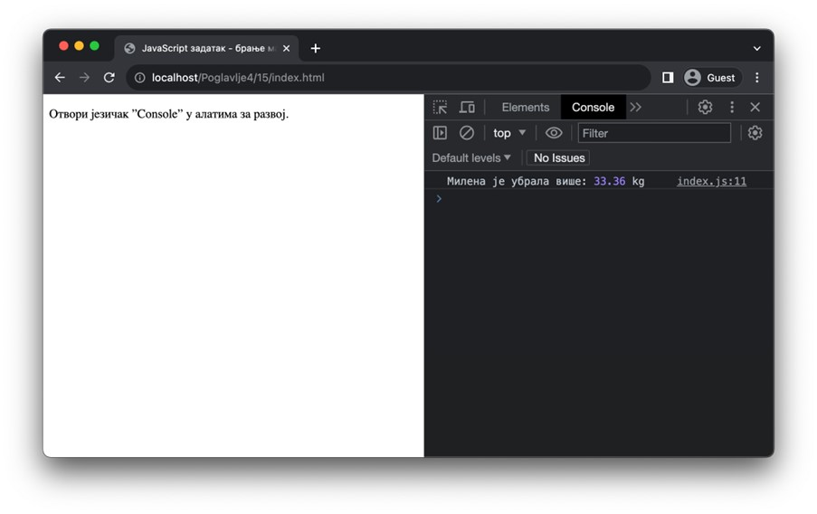
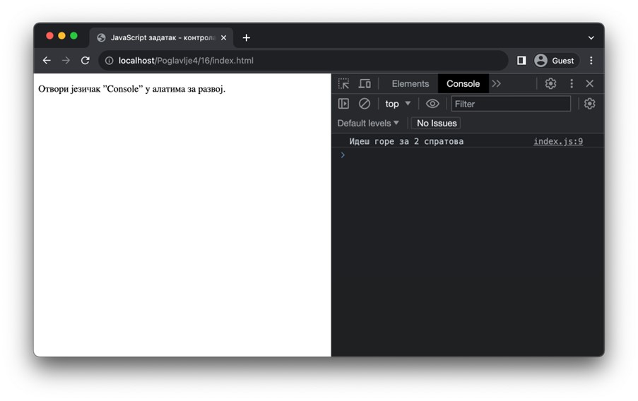
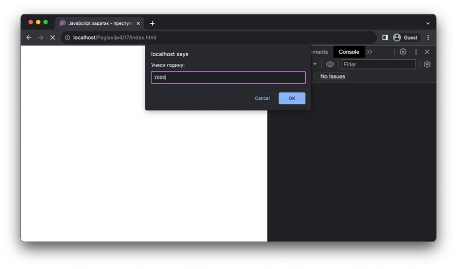
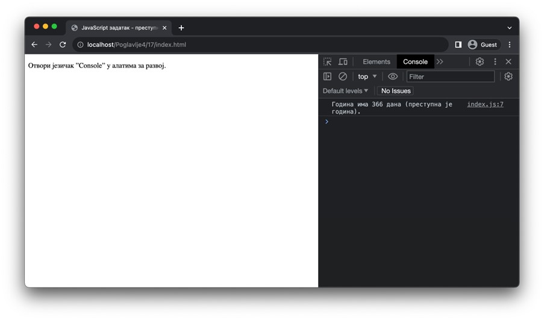
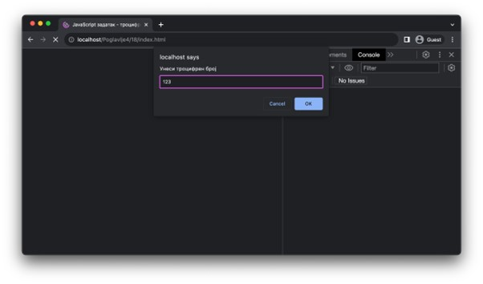
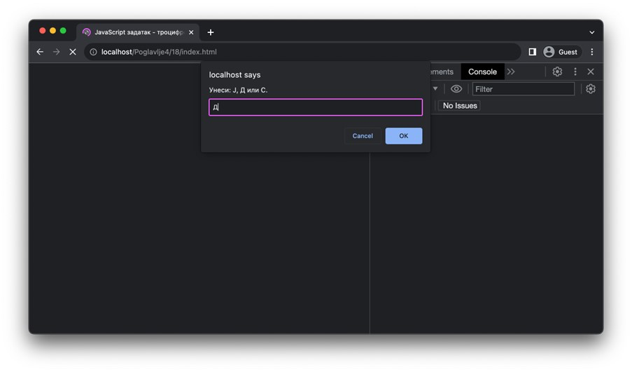

Булове вредности и изборне контроле тока
========================================

Велики број израза се може израчунати у само две вредности – тачно и нетачно. Питања ”Да ли је број 14 већи од броја -3?” или ”Да ли Ивана има 18 година?” само су неки од примера оваквих вредности. Без обзира да ли се резултат добија као вредност неког израза (на пример, :math:`14 > -3` у случају првог питања), позива некакве функције (на пример, *proveri_broj_godina("Ивана”, 18)* у случају другог питања) или на неки други начин, у језику JavaScript на располагању ти стоји тип *boolean* (Булове вредности) које ћеш користити у таквим случајевима. До сада је било прилике да се сусретнеш са Буловим вредностима више пута, али да ли знаш да само две вредности у језику JavaScript имају овај тип? То су вредност true и вредност *false*.

Поред непосредног коришћења ових вредности, одређени оператори или позиви функција производе ове вредности. Неке од њих је било прилике да упознаш у претходној лекцији. Ево још неких оператора који до сада нису поменути, а чије израчунавање се своди на неку Булову вредност.

+--------------+---------------------+--------------+
| **Оператор** | **Пример употребе** | **Резултат** |
+==============+=====================+==============+
| <            | 3 < 4               | *true*       |
+--------------+---------------------+--------------+
| <=           | 4 <= 3              | *false*      |
+--------------+---------------------+--------------+
| >            | “ab” > “ab”         | *false*      |
+--------------+---------------------+--------------+
| >=           | “ab” >= “ab”        | *true*       |
+--------------+---------------------+--------------+
| ===          | 10 === 10.0         | *true*       |
+--------------+---------------------+--------------+
| !==          | 2 !== “2”           | *true*       |
+--------------+---------------------+--------------+

Значење оператора <, <=, > и >= зависи од типова података на које се примењује. У случају бројева, ови оператори одговарају добро познатим математичким релацијама. У случају ниски, ови оператори врше лексикографско поређење ниски. 

.. infonote::

    **Напомена:** У случају примене ових оператора на остале типове вредности, није на први поглед јасно зашто неки изрази производе одређене резултате. На пример, такав је израз *true > false* који је тачан. Одговор лежи у сложеним механизмима имплицитне конверзије уграђене у правила овог језика. Наиме, приликом израчунавања израза *true > false*, вредност *true* се конвертује у 1, а вредност *false* у 0, па се израчунава вредност израза* 1 > 0* (што се, очигледно, израчунава у вредност *true*). Механизми имплицитне конверзије вредности језика JavaScript су толико сложени да су често предмет великог броја пошалица на овај језик. Ако желиш да пронађеш више информација о правилима за израчунавање оператора *<* (а слична правила се примењују и за друге операторе), можеш посетити https://developer.mozilla.org/en-US/docs/Web/JavaScript/Reference/Operators/Less_than.

Наредба if
___________

Булове вредности представљају основу за имплементација избора у програмима. Често је неопходно да се у зависности од неке Булове вредности понаша на два (или више) различита начина. Кажемо да се програм грана (*branch*). У језику JavaScript можеш да користиш изборну контролу тока која се зове наредба if. Ова наредба у својој основној варијанти изгледа као:

.. code-block:: javascript

    if (uslov) {
    // Код који се извршава у случају да је uslov тачан 
    // (тј. да се израчунава на true)
    }
    else {
    // Код који се извршава у случају да је uslov нетачан 
    // (тј. да се израчунава на false)
    }

.. questionnote::

    **Задатак:** Милена и Јован су одлучили да једног викенда беру малине. Првог дана бербе, Милена је убрала :math:`3,77kg` малина, а Петар је три пута више. Другог дана бербе, Петар је убрао :math:`8,34kg` малина, а Милена је два пута више. Напиши JavaScript програм који израчунава ко је убрао више малина.

.. petlja-editor:: Poglavlje4/15

    index.html
    <!DOCTYPE html>
    <html lang="sr">
    <head>
        <meta charset="utf-8">
        <title>JavaScript задатак - брање малина</title>
    </head>
    <body>
        
Отвори језичак ”Console” у алатима за развој.

        
    </body>
    </html>
    ~~~
    index.js
    const milenin_prvi_dan = 3.77;
    const petrov_prvi_dan = 3 * milenin_prvi_dan;

    const petrov_drugi_dan = 8.34;
    const milenin_drugi_dan = 2 * petrov_drugi_dan;

    const milena_ukupno = milenin_drugi_dan + milenin_drugi_dan;
    const petar_ukupno = petrov_prvi_dan + petrov_drugi_dan;

    if (milena_ukupno> petar_ukupno) {
    console.log("Милена је убрала више:", milena_ukupno, "kg");
    } else {
    console.log("Петар је убрао више:", petar_ukupno, "kg");
    }

Налик другим програмским језицима, грана if је обавезна да се наведе, а грана else се може изоставити у случају да не постоји код који треба извршити у случају да услов није тачан.

Уколико услова може бити више, при чему само један може бити испуњен, могуће је додати за сваки додатни услов по једну грану else if, што изгледа као:

.. code-block:: javascript

    if (uslov1) {
    // Код који се извршава у случају да је uslov1 тачан 
    }
    еlse if (uslov2) {
    // Код који се извршава у случају да је 
    // uslov1 нетачан и uslov2 тачан 
    }
    еlse if (uslov3) {
    // Код који се извршава у случају да су 
    // uslov1 и uslov2 нетачни и uslov3 тачан 
    }
    // ...
    else {
    // Код који се извршава у случају да 
    // ниједан од uslov1, uslov2, uslov3, ... нису тачни 
    }

.. questionnote::

    **Задатак:** Станар у згради улази у лифт у којем се налази таблет за контролу лифта. Напиши JavaScript програм за таблет за контролу лифта који од станара зграде очекује да унесе број спрата на којем се налази, а затим број спрата на који жели да га лифт одведе. У зависности од избора, исписати у конзоли једну од порука ”Идеш горе за {број} спратова”, ”Идеш доле за {број} спратова” или ”Већ се налазиш на одабраном спрату”. (Замени шаблон ”{број}” у порукама одговарајућим бројем спратова колико ће лифт одвести станара.)

.. petlja-editor:: Poglavlje4/16

    index.html
    <!DOCTYPE html>
    <html lang="sr">
    <head>
        <meta charset="utf-8">
        <title>JavaScript задатак - контрола лифта</title>
    </head>
    <body>
        
Отвори језичак ”Console” у алатима за развој.

        
    </body>
    </html>
    ~~~
    index.js
    const trenutni_sprat_niska = prompt("Унеси спрат на коме се налазиш:");
    const zeljeni_sprat_niska = prompt("Унеси спрат до којег желиш да те лифт одведе:");

    const trenutni_sprat = Number.parseInt(trenutni_sprat_niska);
    const zeljeni_sprat = Number.parseInt(zeljeni_sprat_niska);

    if (trenutni_sprat < zeljeni_sprat) {
    const broj_spratova = zeljeni_sprat - trenutni_sprat;
    console.log(`Идеш горе за ${broj_spratova} спратова`);
    } else if (trenutni_sprat> zeljeni_sprat) {
    const broj_spratova = trenutni_sprat - zeljeni_sprat;
    console.log(`Идеш доле за ${broj_spratova} спратова`);
    } else {
    console.log("Већ се налазиш на одабраном спрату");
    }

Булови оператори
________________

Булове вредности, као и изрази који се израчунавају на њих, могу се комбиновати операторима којима се добијају нове Булове вредности. Ови оператори се називају Булови оператори и користе се за дефинисање сложених (Булових) израза. Наредна табела ти даје преглед најчешћих Булових оператора у језику JavaScript.

+--------------+---------------------+----------------------+--------------+
| **Оператор** | **Опис**            | **Пример употребе**  | **Резултат** |
+==============+=====================+======================+==============+
| *&&*         | Конјукција (”и”)    | *(1 < 2) && (2 < 3)* | *true*       |
+--------------+---------------------+----------------------+--------------+
| *||*         | Дисјункција (”или”) | *(1 < 2) || (3 < 2)* | *true*       |
+--------------+---------------------+----------------------+--------------+
| *!*          | Негација (”не”)     | *!(1 < 2)*           | *false*      |
+--------------+---------------------+----------------------+--------------+

.. questionnote::

    **Задатак:** Преступна година је година која има 366 дана, за разлику од простих година које имају 365 дана. Преступна је свака четврта година, осим у случају да је дељива бројем 100, а није дељива бројем 400. Напиши JavaScript програм који од корисника тражи да унесе годину, а затим исписује колико дана има у тој години.

.. petlja-editor:: Poglavlje4/17

    index.html
    <!DOCTYPE html>
    <html lang="sr">
    <head>
        <meta charset="utf-8">
        <title>JavaScript задатак - преступна година</title>
    </head>
    <body>
        
Отвори језичак ”Console” у алатима за развој.

        
    </body>
    </html>
    ~~~
    index.js
    const godina_niska = prompt("Унеси годину:");
    const godina = Number.parseInt(godina_niska);

    if (godina % 4 !== 0 || (godina % 100 === 0 && godina % 400 !== 0)) {
    console.log("Година има 365 дана (проста је година).");
    } else {
    console.log("Година има 366 дана (преступна је година).");
    }

Посебну пажњу треба посветити операторима* === *и *!==*. Први од њих проверава једнакост две вредности, а други од њих проверава да ли су две вредности различите. У случају провере (не)једнакости две вредности истог типа (за бројеве, ниске и Булове вредности), резултат ће бити *true* само ако се обе вредности исте. У случају провере вредности различитих типова, оператор *===* ће увек резултовати у *false*, док ће оператор *!==* увек резултовати у *true*. Другим речима, две вредности различитог типа нису никада једнаке, односно, увек су различите.

.. infonote::

    **Напомена:** У језику JavaScript постоје и оператори *==* и *!=* који на другачији начин третирају случај поређења две вредности различитих типова од оператора *===* и *!==*. Наиме, приликом примене ових оператора, ако се типови вредности не поклапају, примењују се изузетно сложена правила имплицитне конверзије, о којима је већ било прилике да прочиташ у овој лекцији. Као што можеш да претпоставиш, ова правила је веома напорно учити, те несмотрена употреба ових оператора може довести до грешака у коду које је веома тешко открити и поправити. Због тога, примена ових оператора се не препоручује.

.. questionnote::

    **Задатак:** Учитељи у једној основној школи желе да омогуће својим ученицима да вежбају разумевање троцифрених бројева. Напиши JavaScript програм који ће им у томе помоћи. Програм од ученика захтева да унесе троцифрени број, а затим један од карактера Ј, Д или С. У зависности од унетог карактера, програм у конзоли треба да издвоји и у конзоли испише цифру на позицији:

- Јединице, за ниску Ј.
- Десетице, за ниску Д.
- Стотине, за ниску С.

Уколико се унесе било каква друга ниска, програм треба да испише у конзоли ”Унета ниска није исправна. Унеси: Ј, Д или С.”

.. petlja-editor:: Poglavlje4/18

    index.html
    <!DOCTYPE html>
    <html lang="sr">
    <head>
        <meta charset="utf-8">
        <title>JavaScript задатак - троцифрени бројеви</title>
    </head>
    <body>
        
Отвори језичак ”Console” у алатима за развој.

        
    </body>
    </html>
    ~~~
    index.js
    const broj_niska = prompt("Унеси троцифрен број");
    const broj = Number.parseInt(broj_niska);

    const karakter = prompt("Унеси: Ј, Д или С.");

    if (karakter === "Ј") {
    const cifra_jedinice = broj % 10;
    console.log("Цифра на позицији јединице је:", cifra_jedinice);
    } else if (karakter === "Д") {
    const cifra_desetice = Math.floor((broj % 100) / 10);
    console.log("Цифра на позицији десетице је:", cifra_desetice);
    } else if (karakter === "С") {
    const cifra_stotine = Math.floor((broj % 1000) / 100);
    console.log("Цифра на позицији стотине је:", cifra_stotine);
    } else {
    console.log("Унета ниска није исправна. Унеси: Ј, Д или С.");
    }

Наредба switch
_______________

Претходни задатак је могао да се имплементира и помоћу изборне контроле тока која се назива наредба *switch*. Ова наредба изгледа као у наредном коду:

.. code-block:: javascript

    switch (izraz) {
    case vrednost1: {
        // код који се извршава ако izraz==vrednost1
    break;
    }
    case vrednost2: {
        // код који се извршава ако izraz==vrednost2
    break;
    }
    // ...
    default: {
        // код који се извршава 
        // ако izraz није једнак ниједној вредности
    }
    }

Налик другим програмским језицима, обавезно је навођење макар једне гране case, док грана *default* није обавезна. Наредба *break* се наводи како би се завршило извршавање наредбе *switch* (најчешће на крају неке гране *case*, како би се означио крај кода у тој грани). Ако се не наведе, онда ће се извршавање наставити у наредној грани, све док се не наиђе на прву следећу наредбу *break* или до краја наредбе *switch*.
 
.. questionnote::

    **Задатак:** Напиши JavaScript програм који имплементира захтев из претходног задатка, али коришћењем наредбе *switch*.

.. petlja-editor:: Poglavlje4/19

    index.html
    <!DOCTYPE html>
    <html lang="sr">
    <head>
        <meta charset="utf-8">
        <title>JavaScript задатак - троцифрени бројеви</title>
    </head>
    <body>
        
Отвори језичак ”Console” у алатима за развој.

        
    </body>
    </html>
    ~~~
    index.js
    const broj_niska = prompt("Унеси троцифрен број");
    const broj = Number.parseInt(broj_niska);

    const karakter = prompt("Унеси: Ј, Д или С.");

    switch (karakter) {
    case "Ј": {
        const cifra_jedinice = broj % 10;
        console.log("Цифра на позицији јединице је:", cifra_jedinice);
        break;
    }
    case "Д": {
        const cifra_desetice = Math.floor((broj % 100) / 10);
        console.log("Цифра на позицији десетице је:", cifra_desetice);
        break;
    }
    case "С": {
        const cifra_stotine = Math.floor((broj % 1000) / 100);
        console.log("Цифра на позицији стотине је:", cifra_stotine);
        break;
    }
    default: {
        console.log("Унета ниска није исправна. Унеси: Ј, Д или С.");
    }
    }

Булове вредности, оператори поређења и изборне контроле тока представљају окосницу развоја програма у којима ток извршавања може да пролази кроз разне путеве.