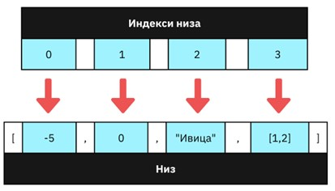

Низови и понављајуће контроле тока (циклуси)
============================================

Променљиве представљају важан механизам програмских језика за складиштење података пре, током, или после неке обраде. Међутим, променљиве имају два важна недостатка:

1. Број променљивих је неопходно одредити у фази писања програма. То значи да, ако имамо податке за које унапред не знамо колико инстанци их може бити или уколико се број података може мењати током рада програма, немогуће је припремити унапред довољно променљивих за складиштење и обраду таквих података.
2. Уколико је већи број података потребно обрадити на исти начин, веома је напорно имплементирати и одржавати код који понавља исту процедуру неколико пута, са једином разликом у називима променљивих које учествују у тој обради. Измена кода на једном месту повлачи измену у свим поновљеним деловима кода.

Оба проблема можеш да превазиђеш ако користиш колекције података. Језик JavaScript ти ставља на располагање једну веома корисну колекцију података која се може користити у најразличитијим програмима. У питању је низ (*array*). Низови представљају вредности које потпадају под типом *"object"*.

Низови у језику JavaScript су секвенцијалне структуре података, што значи да су подаци организовани по принципу следбеника, односно, сваки податак (надаље ћемо говорити ”елемент”) следбеник је неког другог елемента, осим првог, који се сматра почетним елементом низа. Такође, само један елемент низа нема свог следбеника и он се сматра последњим елементом низа. Низови се у језику JavaScript наводе помоћу угластих заграда ”[“ и “]”, између којих се наводе елементи раздвојени запетом. Елементи низова могу бити било које JavaScript вредности, па чак и други низови. Низови могу бити и празни. 

Оваква организација омогућава да се сваком елементу додели јединствени индекс помоћу којег се може приступити елементу низа. Почетном елементу низа је додељен индекс 0, његовом следбенику индекс 1, а његовом следбенику 2, итд. Последњем елементу одговара индекс који је једнак дужини низа умањеној за 1. За приступање елементу низа користи се оператор индексирања (оператор *[]*), којем се наводи индекс елемента којем желимо да приступимо.

.. code-block:: javascript

    let imena = ["Марија", "Светислав", "Растко"];

    imena[0] // "Марија"
    imena[1] // "Светислав"
    imena[2] // "Растко"

Дужина низа се у сваком тренутку може једноставно добити приступањем својству *length* помоћу нотације са тачком, на сличан начин као што је то био случај са нискама.

.. code-block:: javascript

    let imena = ["Марија", "Светислав", "Растко"];

    imena.length // 3

Од важних метода који су доступни над низовима, издвајамо операцију за додавање елемента на крај низа (метод *push*) и операцију за уклањање елемента са краја низа (метод *pop*).

.. code-block:: javascript

    let imena = ["Марија", "Светислав", "Растко"];

    imena.push("Јелена");
    imena.length // 4

    imena.pop();
    imena.length // 3

Низови и циклуси
_________________

Како би се олакшала обрада података у низовима, језик JavaScript подржава неколико наредби које служе управо тој сврси. Ове наредбе се једним именом називају понављајуће контроле тока или циклуси (*loop*). Један од циклуса је и наредба *for*, чији облик одговара сличним наредбама у другим програмским језицима:

.. code-block:: javascript

    for (inicijalizacija; uslov; korak) {
      telo
    }

Опишимо и елементе наредбе *for*:

- Иницијализација представља наредбу којом се постављају почетне вредности пре него што се циклус започне.
- Услов представља израз који се проверава пре сваке итерације циклуса. Уколико је његова вредност *true*, онда се итерација наставља. У супротном, циклус се завршава.
- Корак представља наредбу која се извршава на крају сваке итерације циклуса, а пре провере услова.
- Тело представља једну или више наредби које представљају операцију која се понавља у свакој итерацији циклуса.

Иако овде о циклусима говоримо у контексту обраде низова, циклусе је могуће користити и за задатке у којима не учествују низови. На пример, наредни код илуструје како је могуће исписати у конзоли бројеве од 1 до 10.

.. code-block:: javascript

    for (let broj = 1; broj <= 10; broj = broj + 1) {
      console.log(broj);
    }

Објаснимо детаљније сваки од елемената овог циклуса:

- У иницијализацији циклуса се поставља почетна вредност променљиве *broj* која ће у свакој итерацији представљати бројчану вредност коју желимо да испишемо у конзоли. С обзиром да бројање почињемо од 1 у овом примеру, има смисла поставити почетну вредност променљиве *broj* на 1.
- У услову циклуса проверавамо вредност променљиве *broj*. Последња вредност коју желимо да обрадимо јесте број 10, тако да услов који постављамо јесте да је вредност променљиве *broj* највише 10. Алтернативно, могли смо поставити и услов *broj < 11*.
- У кораку циклуса наводимо на који начин ће се почетна вредност променљиве broj мењати на крају сваке итерације. С обзиром да исписујемо све целе бројеве од 1 до 10, желимо да се вредност променљиве увећава за 1 на крају сваке итерације циклуса.
- У телу циклуса наводимо саму операцију, што је у овом случају исписивање *броја* у конзолу.

.. infonote::

    **Напомена:** Наредбу *broj = broj + 1* можеш записати као *broj++* или *++broj*. Постоје разлике између ових наредби, али у контексту једноставних корака циклуса (као што је то случај са примером изнад), можеш их сматрати једнаким. Тамо где је то такав случај, наводићемо наредбе са краћим записом.

.. infonote::

    **Напомена:** Постоји још један запис наредбе :math:`x = x + {N}`, а то је :math:`x += {N}` (у свим овим наредбама, :math:`{N}` је ознака за било коју бројчану вредност). Поново, постоје неке разлике између ових приступа, али можеш их сматрати практично једнаким. Слично томе, наредбе :math:`x = x - {N}`, :math:`x = x * {N}` и :math:`x = x / {N}` можеш записати и као :math:`x -= {N}`, :math:`x += {N}` и :math:`x /= {N}`. Изрази *x++* и *++x* се користе само за увећање променљиве *x* за 1, а не и за било коју другу бројчану вредност. Слично, постоје изрази *x--* и *--x* који умањују вредност променљиве *x* за 1.

.. questionnote::

    **Задатак:** Ученици једног одељења су одлучили да прикупе новац који ће уплатити на рачун дечијег свратишта у добротворне сврхе. У сваком реду је по један ученик био задужен да прикупи новац у том реду, а од њих је новац прикупљао разредни старешина. Сваки ред је укупно прикупио наредне своте новца: 4200, 6300, 5100, 4100 и 5500. Напиши JavaScript програм који израчунава укупну своту новца коју су ученици прикупили.

::

    Poglavlje4/20/index.html
    Poglavlje4/20/index.js

Примети да претходни задатак можеш да имплементираш коришћењем пет променљивих за складиштење података (за сваку своту новца по једну), а затим сабирањем тих вредности. Део програма који се имплементира може изгледати као:

.. code-block:: javascript

    const prvi_red = 4200;
    const drugi_red = 6300;
    const treci_red = 5100;
    const cetvrti_red = 4100;
    const peti_red = 5500;

    let zbir = 0;
    zbir += prvi_red;
    zbir += drugi_red;
    zbir += treci_red;
    zbir += cetvrti_red;
    zbir += peti_red;

Међутим, било каква измена обраде ових података повлачи измену у свим линијама кода које врше ту обраду (у примеру кода изнад, то су линије које додају суме сваког реда у укупан збир). Са друге стране, измена обраде једног елемента имплементиране помоћу циклуса обухвата измену на само једном месту – у телу циклуса.

Задатак: Допуни решење претходног задатка тако да програм рачуна и исписује у конзоли провизију која је неопходна за уплату. Провизија се рачуна тако што се за износ мањи од 5000 динара рачуна фиксна провизија од 50 динара, док за остале износе провизија износи 1%.

::

    Poglavlje4/21/index.html
    Poglavlje4/21/index.js

Покушај да измениш пример кода без употребе циклуса и упореди приступе. Који ти се чини смисленијим?

Низови и ниске
_______________

У језику JavaScript, низови имају посебан однос са нискама. Наиме, неке операције које су имплементиране над нискама као резултат производе низове, а са друге стране, неке операције које су имплементиране над низовима као резултат производе ниске. Од ових операција издвојићемо наредне две: раздвајање ниске и спајање елемената низа. 

Прва операција се користи када желиш да издвојиш делове текста између којих се налази нека ознака (која се обично назива сепаратор). На пример, ако из текста желиш да издвојиш све реченице, можеш вршити раздвајање текста по карактеру тачке (у случају да су све реченице обавештајне). Ова операција је у језику JavaScript имплементирана помоћу метода *split* који се позива над ниском. Овај метод очекује један аргумент, а то је ниска која означава сепаратор по којем ће се вршити раздвајање текста. Резултат позива овог метода је низ чији су елементи ниске које се добијају раздвајањем текста по сепаратору.

.. code-block:: javascript

    "Од јутра до сутра".split(" ")
    // резултат -> ["Од", "јутра", "до", "сутра"]

.. questionnote::

    **Задатак:** Приближава се крај полугодишта и ученици желе да провере своје просечне оцене на предметима. Напиши JavaScript програм који од ученика захтева да унесе оцене из неког предмета раздвојене запетом, а затим израчунава и у конзоли исписује просечну оцену.

::

    Poglavlje4/22/index.html
    Poglavlje4/22/index.js

Друга операција се користи када желиш да елементе низа спојиш у једну ниску. Ова операција је у језику JavaScript имплементирана помоћу метода *join* који се позива над низом. Овај метод очекује један аргумент, а то је ниска која ће бити уметнута између свака два суседна елемента низа приликом надовезивања ниски. С обзиром да низови могу имати вредности различитих типова, све вредности које нису ниске се прво имплицитно конвертују у ниске, а затим се врши надовезивање тих ниски.

.. code-block:: javascript

    ["Од", "јутра", "до", "сутра"].join(" ")
    // резултат -> "Од јутра до сутра"

.. questionnote::

    **Задатак:** Напиши JavaScript програм који од корисника захтева да унесе два броја:math:`N` и :math:`M`, и генерише матрицу димензија :math:`N×M`. Матрицу представити као ниску која садржи табелу бројева од 1 до :math:`N⋅M`.

::

    Poglavlje4/23/index.html
    Poglavlje4/23/index.js

Низови представљају моћан алат за обраду великог броја података. Програмски језик JavaScript нуди велики број других метода који имплементирају честе операције над низовима. Неке од њих, заједно са примерима, можеш пронаћи на адреси https://www.w3schools.com/js/js_array_methods.asp. 