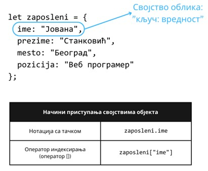

Објекти
=======

До сада је било прилике да видиш неке примере објеката, као што је објекат *console*, затим објекти *Number*, *Math* итд. JavaScript језик садржи велики број уграђених објеката, а њихова намена зависи од објекта до објекта. 

Уопштено говорећи, објекти представљају још једну врсту колекције података. За разлику од низова, објекти не представљају секвенцијалну колекцију података, већ ону која функционише по принципу ”кључ->вредност”. Другим речима, сваки податак у објекту има јединствени кључ на основу којег се приступа вредности тог податка. Кључ и вредност заједно називамо својством (*property*) неког објекта. Вредности својстава објеката могу бити произвољне JavaScript вредности. Специјално, ако је вредност неког својства функција, онда се то својство назива још и метод (*method*).

Попут низова, и објекти представљају вредности које потпадају под типом "*object*". Због тога, низове можеш посматрати и као специјалне објекте чији су кључеви (индекси) бројеви 0, 1, итд. 

Објекти можеш и ти да конструишеш у језику JavaScript навођењем витичастих заграда ”{” и ”}”, између којих наводиш својства објекта раздвојена запетом. Својство се наводи тако што се наведе кључ, затим карактер двотачке и, коначно, вредност тог својства. Објекат је празан ако нема ниједно својство. Својствима објеката се приступа или помоћу нотације са тачком или путем оператора индексирања (оператор *[]*), при чему вредност коју овај оператор очекује је ниска која представља неки од кључева (за разлику од низова, где оператор очекује индексе, тј. целобројне вредности).

.. infonote::

    **Напомена:** Води рачуна да се блокови програмских наредби наводе између витичастих заграда, исто као и конструкција објеката. Међутим, ово не треба да те збуњује с обзиром да језик JavaScript забрањује мешање синтаксе ових елемената језика. Другим речима, ако видиш витичасте заграде у програмском коду, а унутар њих се налазе наредбе, онда је у питању блок наредби. Са друге стране, ако унутар витичастих загради видиш навођење својстава, онда је у питању конструкција објеката.

На наредној слици можеш видети пример објекта и примере приступа његовим својствима. Овај објекат садржи податке о једном запосленом у компанији, али објекти се могу користити за репрезентацију великог броја других ентитета. Међутим, за све те ентитете важи да су њихови подаци уско повезани, због чега их има смисла груписати заједно. Тако, на пример, податке о тромесечним извештајима не би имало смисла навести уз податке о запосленом, већ би требало направити нови објекат који ће груписати те податке (или низ објеката – за сваки извештај по један објекат).

Вредности својстава у објекту могу бити и други објекти, па тада говоримо о угнежђеним објектима. На наредној слици можеш видети пример угнежђавања једног објекта у други (објекат који описује једну лекцију је угнежђен у објекат који описује један школски час).

Својствима из угнежђеног објекта се може приступити на идентичан начин као што је то случај са неугнежђеним објектима. Ако желимо да приступимо тeми лекције на часу, то можемо урадити на неки од следећих начина:

- *cas.lekcija.tema*
- *cas["lekcija"]["tema"]*
- *cas.lekcija["tema"]*
- *cas["lekcija"].tema*

.. infonote::

    Напоменимо да је добра пракса користити јединствен стил приступања својствима објеката. Ми ћемо се у наредним лекцијама држати првог стила (тј. преферираћемо нотацију са тачком).

.. questionnote::

    **Задатак:** За потребе апликације електронског дневника потребно је чувати следеће информације: Јелена Перић (име и презиме), 0101990123456 (ЈМБГ), 3 (година), 1 (одељење), Базе података (назив предмета), 3 (година), 4, 5, 5, 4 (оцене), 4,5 (просечна оцена). Напиши JavaScript програм који моделира ове податке помоћу објеката, а затим у конзоли испиши презиме и име ученика, назив предмета и просечну оцену.

.. petlja-editor:: Poglavlje4/24

    index.html
    <!-- Poglavlje4/24/index.html -->
    
    <!DOCTYPE html>
    <html lang="sr">
    <head>
        <meta charset="utf-8">
        <title>JavaScript задатак - објекти</title>
    </head>
    <body>
        
Отвори језичак ”Console” у алатима за развој.

        
    </body>
    </html>
    ~~~
    index.js
    /* Poglavlje4/24/index.js */
    
    const ucenik = {
        ime: "Јелена",
        prezime: "Перић",
        jmbg: "0101990123456",
        godina: 3,
        odeljenje: 1,
        predmet: {
            naziv: "Базе података",
            godina: 3,
            ocene: [4, 5, 5, 4],
            prosecna_ocena: 4.5,
        },
    };

    console.log("Ученик: ", ucenik.prezime + " " + ucenik.ime);
    console.log("Назив предмета:", ucenik.predmet.naziv);
    console.log("Просечна оцена:", ucenik.predmet.prosecna_ocena);

Вредност null
______________

Велики број програмских језика оставља могућност програмерима да на неки начин обраде случајеве у којима извршавање програма доводи до неочекиваног исхода. Можеш се записати шта би се десило када би наставник покушао да приступи информацијама о ученику о којем не постоје подаци у електронском дневнику. Операција која проналази ученика на основу улазних података (на пример, на основу редног броја ученика у неком одељењу) дужна је да обавести програмера апликације да ученик који одговара улазним подацима не може бити пронађен.

Постоји више начина на које ово понашање можеш да имплементираш. Један од њих јесте да операцију имплементираш тако да се у регуларном сценарију израчунава у објекат који представља студента, а у нерегуларном сценарију израчунава у специјалну вредност језика JavaScript – у питању је вредност *null*. Попут објеката и низова, тип ове вредности је "*object*", те се (макар из перспективе теорије типова) добро уклапа у описану имплементацију. У зависности од тога којом вредношћу се операција имплементирала, а уз помоћ наредбе *if*, можеш одредити ток којим апликација треба да се извршава како би испунила жељена очекивања. Наредни код илуструје пример позива функције за претрагу ученика и обраду резултата, под претпоставком описане имплементације.

.. code-block:: javascript

    let ucenik = pronadji_ucenika(1);

    if (ucenik === null) {
      alert("Ученик није пронађен. Покушај поново!");
    }
    else {
        // Можемо користити објекат ученика за, на пример,
        // исписивање имена и презимена
        alert("Име и презиме: " + ucenik.ime + " " + ucenik.prezime);
    }

О једнакости између вредности типа "object"
___________________________________________

Све вредности типа "object" деле једно занимљиво својство (овде говоримо о објектима у ширем смислу), а тиче се поређења по једнакости (и, слично, по неједнакости, па ћемо дискусију представити само за оператор поређења по једнакости).

Наиме, приликом поређења по једнакости две вредности неких од основних типова (бројеви, ниске и Булове вредности), када дефинишеш два пута исту вредност, те вредности ће бити једнаке, што наредни код илуструје.

.. code-block:: javascript

    let x = 1;
    let y = 1;

    console.log(x === y); // true

Међутим, за објекте ово не важи. Погледај наредни код.

.. code-block:: javascript

    let x = { ime: "Јован" };
    let y = { ime: "Јован" };

    console.log(x === y); // false

Разлика је у томе што сваки пут када се конструише објекат, тај објекат представља нову вредност смештену у меморији на потпуно другачијој меморијској адреси у односу на све објекте који су претходно конструисани. У претходном примеру, објекат *x* се може наћи да меморијској адреси *0x00000000*, док се објекат *y* може наћи на меморијској адреси *0xFFFFFFFF*. Оператор поређења по једнакости само ради проверу меморијских адреса објеката, а не и њиховог садржаја. 

Са друге стране, ако се две променљиве односе на исти објекат у меморији, оператор *===* ће израчунати вредност *true*. Наредни код илуструје ово понашање.

.. code-block:: javascript

    let x = { ime: "Јован" };
    let y = x;

    console.log(x === y); // true

Због овог понашања, непажљиви програмери често праве грешке као што је провера да ли је низ празан поређењем по једнакости са другим празним низом, као у наредном коду.

.. code-block:: javascript

    let x = [];

    if (x === []) {
      console.log("Низ је празан");	
    }
    else {
      console.log("Низ није празан");
    }

У примеру кода изнад, грана *if* се никада неће извршити, без обзира на садржај променљиве *x*. Уместо тога, исправније је испитати вредност својства *length*, као у наредном коду.

.. code-block:: javascript

    let x = [];

    if (x.length === 0) {
      console.log("Низ је празан");	
    }
    else {
      console.log("Низ није празан");
    }

Специјално, вредност *null* ће бити једнака само другој вредности *null*, док ће поређење са свим осталим (не-*null*) објектима вратити *false*, као што наредни код илуструје.

.. code-block:: javascript

    let x = { ime: "Јован" };
    let y = null;

    console.log(x === null); // false
    console.log(y === null); // true

Објекти су важан концепт језика JavaScript, делом због својих карактеристика као колекција података сродних података, делом што велики број библиотека из *Web API* колекције библиотека користе објекте у великом обиму. Због тога је важно да разумеш како можеш да приступаш својствима у објектима, да мењаш њихове вредности, позиваш методе, али и да умеш да обрађујеш случајеве у којима постоји могућност да израчунавања израза резултују као вредност *null* (углавном су то позиви функција, о којима ће бити више речи у наредним лекцијама).