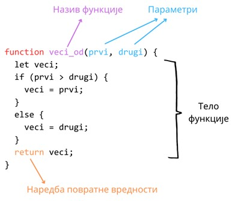
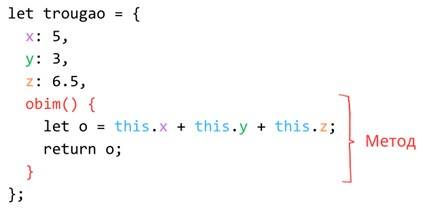

Функције
========

Велики део програма се састоји од извршавања процедура, које се састоје од десетине наредби, а њихова извршавања се понављају велики број пута. Уместо да, сваки пут када је потребно извршити такве сложене операције, кодираш читаву логику испочетка, код који имплементира неку процедуру можеш издвојити у део који називамо функција. Предност функција у односу на копирање кода јесте што група наредби која чини неку функцију има свој назив, тако да извршавање логике своди се на једноставан позив функције путем њеног назива. Додатно, функције је много лакше одржавати него дуплирани код, а одабир исправног назива функције значајно олакшава и убрзава разумевање кода.

Дефинисање функција
____________________

На наредној слици је дат пример дефиниције функција у језику JavaScript. Све функције представљају вредности типа "*function*". Функција, као што смо рекли, има свој назив који мора бити јединствен, а које се наводи након кључне речи *function*. Затим следи листа имена параметара функције у обичним заградама и, коначно, тело функције које представља блок наредби у витичастим заградама. Функције које враћају вредности позиваоцу би требало да у телу садрже и наредбу *return* којом се наводи повратна вредност. Функција приказана на слици израчунава већу од две вредности.

Функција се извршава (тј. позива) навођењем њеног назива, за којим следи листа аргумената у обичним заградама. Аргументи функције представљају вредности које ће заменити параметре функције у коду којим је функција дефинисана приликом њеног извршавања. Пример позива функције са претходне слике је дат у наставку.

.. code-block:: javascript

    let a = 2;
    let b = 3;
    let rezultat = veci_od(a, b);

    console.log("Већ број је:", rezultat); // 3

Параметри функције, као и њена повратна вредност, могу бити произвољне JavaScript вредности. На пример, функција *veci_od* се може искористити и за израчунавање која од две ниске је у лексикографском поређењу испред друге ниске.

.. code-block:: javascript

    let x = "веб";
    let y = "ВЕБ";
    let rezultat = veci_od(x, y);

    console.log("Ниска која је испред друге је:", rezultat); // "веб"

.. questionnote::

    **Задатак:** Напиши JavaScript програм који израчунава и у конзоли исписује површину једнакостраничног троугла. За рачунање квадратног корена можеш искористити метод *Math.sqrt*. Ивицу троугла затражити од корисника.

.. petlja-editor:: Poglavlje4/25

    index.html
    <!-- Poglavlje4/25/index.html -->
    
    <!DOCTYPE html>
    <html lang="sr">
    <head>
        <meta charset="utf-8">
        <title>JavaScript задатак - површина троугла</title>
    </head>
    <body>
        
Отвори језичак ”Console” у алатима за развој.

        
    </body>
    </html>
    ~~~
    index.js
    /* Poglavlje4/25/index.js */
    
    function povrsina_jednakostranicnog_trougla(a) {
        const povrsina = (a * a * Math.sqrt(3)) / 4;

        return povrsina;
    }

    const ivica = Number.parseFloat(prompt("Унеси ивицу једнакостраничног троугла:"));
    console.log("Површина троугла је:", povrsina_jednakostranicnog_trougla(ivica));

Функције и низови
__________________

Функције представљају веома користан начин да код који обрађује низове изместиш у одвојену (и именовану) логичку целину како би се повећала читљивост кода. У случају обраде низова помоћу циклуса, можеш издвојити тело циклуса у функцију, као и цео циклус у функцију.

Задатак: Напиши JavaScript програм који од корисника захтева да унесе број N између 1 и 10. Затим, за сваки од пречника кругова од 1 cm до N cm програм израчунава и у конзоли исписује обиме тих кругова. За број π можеш искористити вредност *Math.PI*.

.. petlja-editor:: Poglavlje4/26

    index.html
    <!-- Poglavlje4/26/index.html -->
    
    <!DOCTYPE html>
    <html lang="sr">
    <head>
        <meta charset="utf-8">
        <title>JavaScript задатак - обим кругова</title>
    </head>
    <body>
        
Отвори језичак ”Console” у алатима за развој.

        
    </body>
    </html>
    ~~~
    index.js
    /* Poglavlje4/26/index.js */
    
    function obim_kruga(r) {
        const obim = 2 * r * Math.PI;

        return obim;
    }

    const N = Number.parseInt(prompt("Унеси број између 1 и 10:"));

    for (let precnik = 1; precnik <= N; precnik++) {
        console.log(`Обим круга пречника ${precnik}cm износи ${obim_kruga(precnik)}cm.`);
    }

Оно што је важно да запамтиш јесте да, када прослеђујеш низове као аргументе функцијама, JavaScript **неће** направити копију низа, већ ће проследити оригинални низ. То значи да су низови подложни променама у оквиру функција. Ову чињеницу можеш да искористиш уколико је потребно да измениш оригиналне вредности низова.

.. infonote::

    **Напомена:** Ова чињеница је заједничка за све вредности типа "object", што значи не само за низове, већ и за објекте. 

.. questionnote::

    **Задатак:** Напиши JavaScript програм који из низа који садржи ниске скраћује све ниске које су дуже од :math:`N` карактера, тако да имају највише :math:`N` карактера, где је :math:`N` број који се захтева од корисника да унесе.

.. petlja-editor:: Poglavlje4/27

    index.html
    <!-- Poglavlje4/27/index.html -->
    
    <!DOCTYPE html>
    <html lang="sr">
    <head>
        <meta charset="utf-8">
        <title>JavaScript задатак - скраћивање ниски</title>
    </head>
    <body>
        
Отвори језичак ”Console” у алатима за развој.

        
    </body>
    </html>
    ~~~
    index.js
    /* Poglavlje4/27/index.js */
    
    function skrati_niske(niz_niski, najveca_duzina) {
        for (let i = 0; i < niz_niski.length; i++) {
            const niska = niz_niski[i];

            if (niska.length> najveca_duzina) {
                const skracena_niska = niska.substr(0, najveca_duzina);
                niz_niski[i] = skracena_niska;
            }
        }
    }

    const niz = `Прича до сада: на почетку би створен универзум. 
    Ово је разбеснело многе људе и уопштено се сматра рђавим потезом.`.split(" ");
    const N = Number.parseInt(prompt("Унеси број:"));

    skrati_niske(niz, N);

    console.log(niz);

Води рачуна да некада ово понашање није пожељно, поготово уколико осталим програмерима није јасно да ће твој код изменити оригинални низ! У ту сврху, добро је да оставиш коментар који јасно наводи ову чињеницу, као што је то урађено у претходном задатку. Наредни задатак показује алтернативно решење, које враћа нови низ који испуњава жељена очекивања.

.. questionnote::

    **Задатак:** Реши претходни задатак тако да функција *skrati_niske* не мења оригинални низ.

.. petlja-editor:: Poglavlje4/28

    index.html
    <!-- Poglavlje4/28/index.html -->
    
    <!DOCTYPE html>
    <html lang="sr">
    <head>
        <meta charset="utf-8">
        <title>JavaScript задатак - скраћивање ниски</title>
    </head>
    <body>
        
Отвори језичак ”Console” у алатима за развој.

        
    </body>
    </html>
    ~~~
    index.js
    /* Poglavlje4/28/index.js */
    
    function skrati_niske(niz_niski, najveca_duzina) {
    const novi_niz = [];

    for (let i = 0; i < niz_niski.length; i++) {
            const niska = niz_niski[i];

            if (niska.length> najveca_duzina) {
                const skracena_niska = niska.substr(0, najveca_duzina);
                novi_niz.push(skracena_niska);
                } else {
                novi_niz.push(niska);
            }
        }

        return novi_niz;
    }

    const niz = `Прича до сада: на почетку би створен универзум. 
    Ово је разбеснело многе људе и уопштено се сматра рђавим потезом.`.split(" ");
    const N = Number.parseInt(prompt("Унеси број:"));

    const novi_niz = skrati_niske(niz, N);

    console.log(niz);
    console.log(novi_niz);

Функције и објекти
___________________

При раду са сложеним типовима података, као што су објекти, добро је да размишљаш како да поделиш логику програма у што мање целине. На пример, ако је потребно да обрадиш низ података, вероватно ћеш имати једну функцију за обраду самог низа, а затим другу функцију за обраду једног објекта-елемента низа.

.. questionnote::

    **Задатак:** На такмичењу из програмирања учествују Јанко, Јована и Јелена. Такмичење се састоји од три задатка. Резултати такмичара су дати у наредној табели и представљају проценте квалитета решења за сваки задатак. Напиши JavaScript програм који од организатора такмичења захтева да, за сваки задатак, унесу број бодова који задатак носи. Затим, програм израчунава и у конзоли исписује име такмичара који има највише поена.

+------------------+-------------------------------------+
|                  | **Име такмичара**                   |
+==================+===========+============+============+
| **Број задатка** | **Јанко** | **Јована** | **Јелена** |
+------------------+-----------+------------+------------+
| 1                | 20        | 70         | 80         |
+------------------+-----------+------------+------------+
| 2                | 40        | 30         | 100        |
+------------------+-----------+------------+------------+
| 3                | 80        | 20         | 50         |
+------------------+-----------+------------+------------+

.. petlja-editor:: Poglavlje4/29

    index.html
    <!-- Poglavlje4/29/index.html -->
    
    <!DOCTYPE html>
    <html lang="sr">
    <head>
        <meta charset="utf-8">
        <title>JavaScript задатак - резултати такмичења</title>
    </head>
    <body>
        
Отвори језичак ”Console” у алатима за развој.

        
    </body>
    </html>
    ~~~
    index.js
    /* Poglavlje4/29/index.js */
    
    function izracunaj_poene(takmicar, prvi, drugi, treci) {
        const poeni_1 = (takmicar.prvi * prvi) / 100;
        const poeni_2 = (takmicar.drugi * drugi) / 100;
        const poeni_3 = (takmicar.treci * treci) / 100;

        return poeni_1 + poeni_2 + poeni_3;
    }

    function odredi_rezultate(niz_takmicara, prvi, drugi, treci) {
        let najvise_poena = 0;
        let pobednik = "";

        for (let i = 0; i < niz_takmicara.length; i++) {
            const takmicar = niz_takmicara[i];
            const poeni = izracunaj_poene(takmicar, prvi, drugi, treci);

            if (poeni> najvise_poena) {
            najvise_poena = poeni;
            pobednik = takmicar.ime;
            }
        }

        return pobednik;
    }

    const takmicari = [
        {
            ime: "Јанко",
            prvi: 20,
            drugi: 40,
            treci: 80,
        },
        {
            ime: "Јована",
            prvi: 70,
            drugi: 30,
            treci: 20,
        },
        {
            ime: "Јелена",
            prvi: 80,
            drugi: 100,
            treci: 50,
        },
    ];

    const prvi = Number.parseFloat(prompt("Унеси број поена за први задатак:"));
    const drugi = Number.parseFloat(prompt("Унеси број поена за други задатак:"));
    const treci = Number.parseFloat(prompt("Унеси број поена за трећи задатак:"));

    const pobednik = odredi_rezultate(takmicari, prvi, drugi, treci);

    console.log("Победник је:", pobednik);

Функције као методи
___________________

Уколико је нека функција блиско повезана са подацима неког објекта, онда је корисно имплементирати ту функцију као метод тог објекта. Методи објекта се наводе нешто другачије у односу на друга својства. Наредна слика илуструје објекат који представља троугао и који садржи метод *obim*, који се може искористити за израчунавање обима тог троугла. Примети да се у дефиницији метода појављује нова кључна реч – *this*. Ову кључну реч можеш да користиш ради дохватања других својства у објекту, као што је у овом примеру случај са дохватањем дужина страница троугла.

.. questionnote::

    **Задатак:** Иван жели да прочита лектире за летњи распуст како би се боље припремио за часове српског језика и књижевности. Књиге које треба да прочита (са бројем страна у заградама) јесу: ”Мајстор и Маргарита” (372), ”Чекајући Годоа” (150) и ”Злочин и казна” (576). Напиши JavaScript програм који захтева од Ивана да унесе просечан број страница које планира да прочита дневно, па за сваки роман исписује у конзоли колико најмање дана ће му бити потребно да прочита сваку књигу.

.. petlja-editor:: Poglavlje4/30

    index.html
    <!-- Poglavlje4/30/index.html -->
    
    <!DOCTYPE html>
    <html lang="sr">
    <head>
        <meta charset="utf-8">
        <title>JavaScript задатак - читање лектира</title>
    </head>
    <body>
        
Отвори језичак ”Console” у алатима за развој.

        
    </body>
    </html>
    ~~~
    index.js
    /* Poglavlje4/30/index.js */
    
    const ivan = {
        lektire: [
            { naslov: "Мајстор и Маргарита", broj_strana: 372 },
            { naslov: "Чекајући Годоа", broj_strana: 150 },
            { naslov: "Злочин и казна", broj_strana: 576 },
        ],
        vreme_citanja(broj_stranica_po_danu) {
            for (let i = 0; i < this.lektire.length; i++) {
            const lektira = this.lektire[i];
            const broj_dana = Math.ceil(lektira.broj_strana / broj_stranica_po_danu);

            console.log(`Број дана за читање лектире ${lektira.naslov} је:`, broj_dana);
            }
        },
    };

    const prosecan_broj_stranica = Number.parseInt(prompt("Унеси број страница:"));
    ivan.vreme_citanja(prosecan_broj_stranica);

Функције као вредности
_______________________

С обзиром да су и функције JavaScript вредности, једна интересантна особина јесте да се једна функција може проследити другој функцији као аргумент. Наредни задатак показује како се ова особина може искористити за писање веома апстрактних процедура које се могу користити у различите сврхе (као што је функција *obradi_recenicu_rec_po_rec*).

.. questionnote::

    **Задатак:** Напиши JavaScript програм који од корисника захтева да унесе реченицу, а затим прави нову реченицу тако што у свакој речи у реченици мења прво слово на велико. Омогући да се исти код за обраду реченице може искористити и за прављење реченице која свако прво и последње слово у свакој речи мења у велико.

.. petlja-editor:: Poglavlje4/31

    index.html
    <!-- Poglavlje4/31/index.html -->
    
    <!DOCTYPE html>
    <html lang="sr">
    <head>
        <meta charset="utf-8">
        <title>JavaScript задатак - прва велика слова</title>
    </head>
    <body>
        
Отвори језичак ”Console” у алатима за развој.

        
    </body>
    </html>
    ~~~
    index.js
    /* Poglavlje4/31/index.js */
    
        function promeni_prvo_slovo_u_veliko(rec) {
        const prvo_slovo = rec.charAt(0).toUpperCase();
        const ostatak_reci = rec.substring(1);

        const nova_rec = prvo_slovo + ostatak_reci;
        return nova_rec;
    }

    function obradi_recenicu_rec_po_rec(recenica, obradi_rec) {
        const niz_reci = recenica.split(" ");
        const novi_niz_reci = [];

        for (let i = 0; i < niz_reci.length; i++) {
            const rec = niz_reci[i];

            const nova_rec = obradi_rec(rec);
            novi_niz_reci.push(nova_rec);
        }

    const nova_recenica = novi_niz_reci.join(" ");
    return nova_recenica;
    }

    const recenica = prompt("Унеси реченицу:");

    let nova_recenica = obradi_recenicu_rec_po_rec(recenica, promeni_prvo_slovo_u_veliko);
    console.log("Измењена реченица:", nova_recenica);

    // function promeni_prvo_i_poslednje_slovo_u_veliko(rec) {
    //   const prvo_slovo = rec.charAt(0).toUpperCase();
    //   const poslednje_slovo = rec.charAt(rec.length - 1).toUpperCase();
    //   const ostatak_reci = rec.substring(1, rec.length - 1);

    //   const nova_rec = prvo_slovo + ostatak_reci + poslednje_slovo;
    //   return nova_rec;
    // }

    // nova_recenica = obradi_recenicu_rec_po_rec(recenica, promeni_prvo_i_poslednje_slovo_u_veliko);
    // console.log("Измењена реченица:", nova_recenica);

Примети да је функција *obradi_recenicu_rec_po_rec* имплементирана тако да се исти код може применити за најразличитије задатке обраде текста. Писање апстрактног кода је напредна техника коју програмери стичу радом на пројектима и дискутовањем са својим колегама у тиму приликом развоја апликација.

Напомена: Функција може и вратити другу функцију као повратну вредност, али ово понашање има неке додатне ефекте које би требало објаснити, а који превазилазе обим курса.

Овом лекцијом завршавамо тему везану за програмски језик JavaScript. У наредној теми ћеш применити све што је до сада обрађено у циљу програмирања разноврсних динамичких клијентских апликација.
