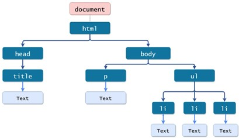
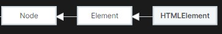

Основни елементи DOM API
========================

У теми о језику HTML рекли смо да се свака веб-страница представља једном дрволиком структуром у веб-прегледачу коју смо назвали DOM стабло. Чворови овог стабла представљају саме HTML елементи од којих је веб-страница сачињена. 

Међутим, поред HTML елемената, елементи овог стабла могу бити чворови који представљају разне друге конструкте језика HTML. Како би разни веб-прегледачи имплементирали DOM стабло на начин који је једноличан, у оквиру *Web API* колекције библиотека прописани су интерфејси који чворови DOM стабла треба да испуњавају, тј. сваки чвор одговарајућег типа би требало да имплементира одговарајуће функционалности како би веб програмери, путем језика JavaScript, могли да користе ове могућности у циљу развоја веб-сајтова.

Неки од најважнијих интерфејса су:

- *Document* представља интерфејс за корени чвор DOM стабла. Њиме се описују разне информације везане за веб-страницу. Додатно, овај интерфејс имплементира разне методе за претрагу елемената што у већини веб клијентских апликација представља први корак у имплементацији. Документацију за овај интерфејс можеш пронаћи на адреси https://developer.mozilla.org/en-US/docs/Web/API/Document.
- *Node* представља заједнички интерфејс за све чворове у стаблу, било то HTML елементи, атрибути или текстуални садржај. Њиме се углавном спецификују методи за обилазак DOM стабла релативно у односу на сам чвор. Документацију за овај интерфејс можеш пронаћи на адреси https://developer.mozilla.org/en-US/docs/Web/API/Node.
- *Element* представља основни интерфејс свих елемената (који не морају бити HTML елементи – на пример, SVG елементи не садрже текстуални садржај, те се ни својство којим се дохвата текстуални садржај неће пронаћи у овом интерфејсу). Овде можеш пронаћи својства као што су идентификатор, класа, садржај елемента, итд. Документацију за овај интерфејс можеш пронаћи на адреси https://developer.mozilla.org/en-US/docs/Web/API/Element.
- *HTMLElement* представља основни интерфејс свих HTML елемената. Чворови који имплементирају овај интерфејс дају ти на располагању заједничке функционалности свих HTML елемената, као што су, на пример: стил елемента, приступ текстуалном садржају, могућност кликтања на елемент, итд. HTML елементи могу имплементирати овај интерфејс директно, или могу „извести“ неки други интерфејс из њега као што је, на пример, интерфејс HTMLTableElement. Документацију за интерфејс *HTMLElement* можеш пронаћи на адреси https://developer.mozilla.org/en-US/docs/Web/API/HTMLElement.

Интересантно је знати да интерфејси *Node, Element и HTMLElement* имају посебну везу, која је представљена наредном сликом. Она ти говори да сваки чвор који испуњава интерфејс *HTMLElement* уједно испуњава и интерфејс *Element*. То значи да све функционалности које су доступне путем интерфејса *Element* доступне су и путем интерфејса *HTMLElement*. Слично важи и за везу *Element -> Node*. 

Као и до сада, саветујемо ти да документацију користиш упоредо са вежбањем. Ако посетиш документацију било ког од интерфејса, пронаћи ћеш велики број својстава и метода са врло детаљним описима и примерима употребе. То не значи да се од тебе, као будућег програмера, очекује да познајеш сваки детаљ сваког интерфејса напамет, већ да умеш да се самостално снађеш и пронађеш информацију која ти је потребна када наиђеш на проблем приликом вежбања.

Претрага елемената
__________________

У овој лекцији ћеш се упознати са интерфејсом *Document* који је имплементиран од стране објекта *document* (примети разлику између великих и малих слова у називима истоимених интерфејса и објекта). Овај објекат имплементира велики број метода за претрагу елемената. Међу њима, вероватно најкоришћенији методи су:

- Метод *getElementById* представља метод за проналажење једног елемента на основу његовог идентификатора. Метод прихвата ниску која садржи идентификатор и враћа објекат који представља пронађени елемент, уколико постоји. У супротном, метод враћа вредност *null*. Велики број апликација може да се имплементира коришћењем само овог метода за претрагу елемената, те ћемо се и ми придржавати њега и користити друге само када је то неопходно. Документацију за овај метод можеш пронаћи на адреси https://developer.mozilla.org/en-US/docs/Web/API/Document/getElementById. 
- Метод *querySelector* проналази први чвор који је обухваћен CSS селектором који му се проследи као ниска. Попут метода *getElementById*, и овај метод враћа један објекат уколико успе да га пронађе или вредност *null*. Овај метод је згодно да користиш ако желиш да дохватиш врло специфичан елемент који нема идентификатор. Документацију за овај метод можеш пронаћи на адреси https://developer.mozilla.org/en-US/docs/Web/API/Element/querySelector. 
- Метод *querySelectorAll* попут метода *querySelector* користи CSS селектор за претрагу. Разлика између овог метода и претходна два је у томе што он увек дохвата **низ** елемената, било да ли елементи који су обухваћени селектором постоје или не. Другим речима, ако постоје елементи који су обухваћени, овај метод ће вратити низ објеката, за сваки обухваћен елемент по један. Са друге стране, ако такви елементи не постоје, онда ће повратна вредност овог метода бити поново низ, али овога пута празан. Овај метод је веома користан када је потребно да обрадиш више елемената. Документацију за овај метод можеш пронаћи на адреси https://developer.mozilla.org/en-US/docs/Web/API/Element/querySelectorAll. 

.. infonote::

    **Напомена:** Често непажљиви програмери праве грешку приликом коришћења метода querySelectorAll и као проверу успешности пишу код сличан наредном:

    .. code-block:: javascript

        let pasusi = document.querySelectorAll("p");

        if (pasusi === null) {
          console.log("Не постоје пасуси у HTML садржају");
        }
        else {
          // Код за обраду пасуса
        }

Као што смо већ напоменули у лекцији о JavaScript објектима, вредност *null*, када се пореди по једнакости са било којом не-*null* вредношћу (што је увек вредност променљиве *pasusi* у коду изнад, било да ли низ има елементе или је празан), увек резултује вредношћу *false*, што значи да се грана *if* никада неће извршити.

Претрага елемената DOM стабла представља први корак у имплементацији већине динамичких клијентских веб апликација. Једном када су одговарајући елементи пронађени, може им се приступити како би се имплементирала жељена функционалност.
