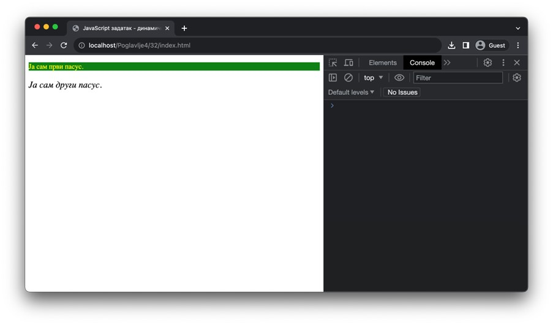
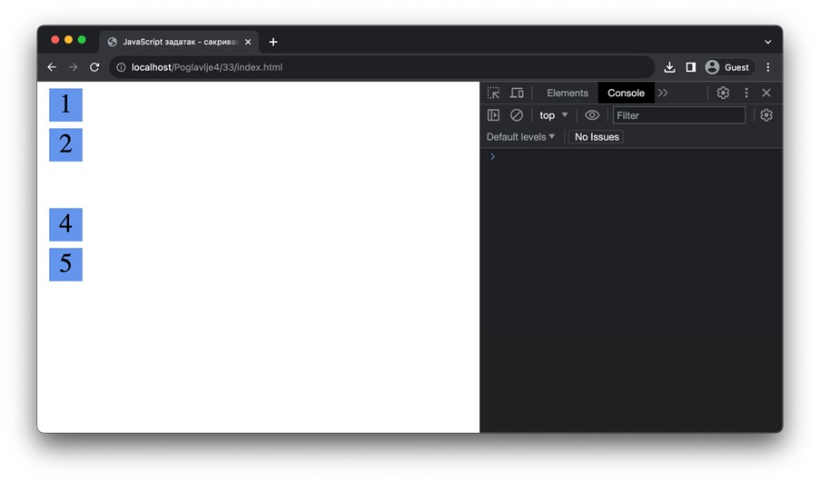
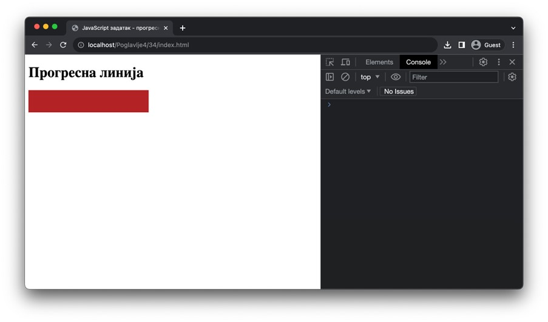
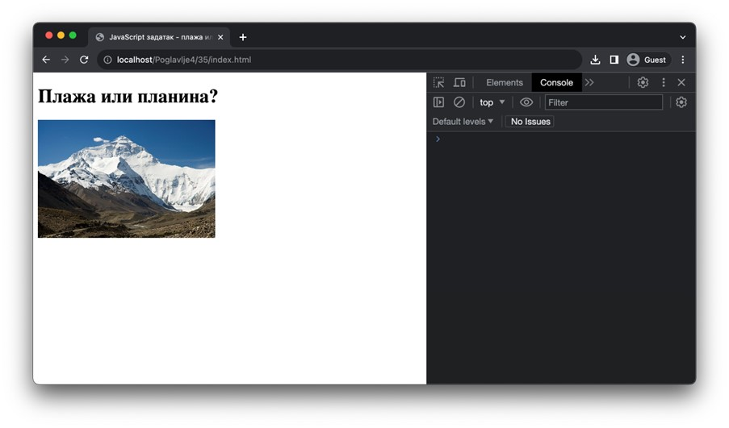
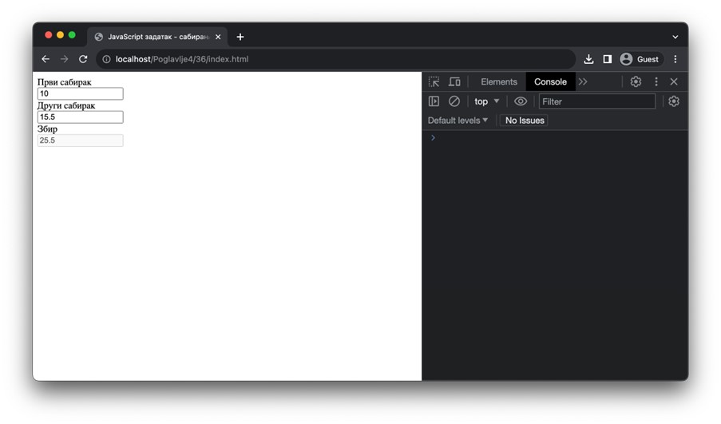
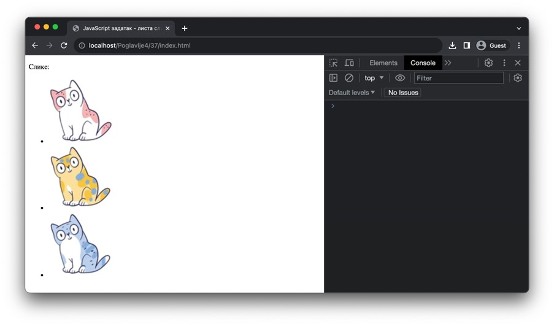

DOM API - измена елемената
==========================

У претходној лекцији смо видели како се могу претражити HTML елементи у DOM стаблу. У овој лекцији ћеш кроз велики број практичних примера научити на које све начине можеш управљати чворовима DOM стабла и какве ефекте производе измене које имплементираш.

Измена стила
____________

Најједноставнији начин да се елемент измени јесте да му се постави одговарајући стил. На пример, можеш променити боју текста или позадине, поставити ивице или маргине, приказати или сакрити елементе, итд. Ово ћеш најлакше урадити помоћу својства *style* који је доступан свим *HTMLElement* чворовима. 

Својство *style* представља објекат који описује стилове који су постављени над једним HTML елементом. Ако поставиш неки стил користећи ово својство, то је еквивалентно постављању својства коришћењем атрибута *style* у језику HTML. Сва CSS својства која су ти позната до сада можеш подешавати путем овог својства. Уз то, треба да имаш на уму следеће напомене:

- CSS својства чија имена немају цртице, као што је својство *color*, у објекту *style* биће доступна под истим именом. На пример, CSS декларацији `color: blue;` одговара постављање својства `html_cvor.style.color = "blue";` у језику JavaScript. 
- CSS својства чија имена имају цртице, као што је својство *background-color*, у објекту *style* биће доступна под камиљом нотацијом, тј. *backgroundColor*. На пример, CSS декларацији `background-color: red;` одговара постављање својства `html_cvor.style.backgroundColor = "red";` у језику JavaScript.
- Велики број вредности за CSS својства се наводе као ниске у језику JavaScript. У примерима изнад, боје *blue* и *red* у језику CSS су морале бити наведене као ниске *"blue"* и *"red"* у језику JavaScript.

.. questionnote::

    **Задатак:** На веб-страници се налазе два пасуса без стила: *„zuto-zeleni“* и *„velika-iskosena-slova“*. Напиши JavaScript програм који првом пасусу мења боју позадине у жуту, а боју текста у зелену, а другом пасусу мења текст у величину 20 пиксела и записује слова искошено. 

.. petlja-editor:: Poglavlje4/32

    index.html
    <!DOCTYPE html>
    <html lang="sr">
    <head>
        <meta charset="utf-8">
        <title>JavaScript задатак - динамички стилизовани пасуси</title>
    </head>
    <body>
        
Ја сам први пасус.

        
Ја сам други пасус.

        
    </body>
    </html>
    ~~~
    index.js
    const zuto_zeleni_pasus = document.getElementById("zuto-zeleni");
    if (zuto_zeleni_pasus !== null) {
        zuto_zeleni_pasus.style.backgroundColor = "green";
        zuto_zeleni_pasus.style.color = "yellow";
    } else {
        console.log("Нe postoji pasus sa identifikatorom zuto-zeleni");
    }

    const pasus_sa_velikom_slovima = document.getElementById("velika-iskosena-slova");
    if (pasus_sa_velikom_slovima !== null) {
        pasus_sa_velikom_slovima.style.fontSize = "20px";
        pasus_sa_velikom_slovima.style.fontStyle = "italic";
    } else {
        console.log("Нe postoji pasus sa identifikatorom velika-iskosena-slova");
    }

.. questionnote::

    **Задатак:** На веб-страници се налази пет кутија (елемената *div*) са бројевима од један до пет. Напиши JavaScript програм који од корисника захтева да унесе број од 1 до 5, а затим сакрива кутију са датим бројем на веб-страници. 

.. petlja-editor:: Poglavlje4/33

    index.html
    <!DOCTYPE html>
    <html lang="sr">
    <head>
        <meta charset="utf-8">
        <title>JavaScript задатак - сакривање кутија</title>
        <link rel="stylesheet" type="text/css" href="index.css">
    </head>
    <body>
        
1

        
2

        
3

        
4

        
5

        
    </body>
    </html>
    ~~~
    index.css
    div {
        width: 50px;
        height: 50px;
        background-color: cornflowerblue;
        font-size: 40px;
        text-align: center;
        margin: 10px;
    }
    ~~~
    index.js
    const broj_kutije = prompt("Унеси број кутије од 1 до 5:");
    const id_kutije = `kutija-${broj_kutije}`;

    const kutija = document.getElementById(id_kutije);
    if (kutija !== null) {
        kutija.style.visibility = "hidden";
    } else {
        console.log("Не постоји кутија са идентификатором:", id_kutije);
    }

.. questionnote::

    **Задатак:** На веб-страници је дат елемент div који представља линију прогреса текуће године. Напиши JavaScript програм који од корисника учитава број месеца (1-12), а затим ажурира приказ линије прогреса на веб-страници. 

.. petlja-editor:: Poglavlje4/34

    index.html
    <!DOCTYPE html>
    <html lang="sr">
    <head>
        <meta charset="utf-8">
        <title>JavaScript задатак - пpогресна линија</title>
        <link rel="stylesheet" type="text/css" href="index.css">
    </head>
    <body>
        <h1>Пpогресна линија</h1>
        

        
    </body>
    </html>
    ~~~
    index.css
    div {
        height: 50px;
        background-color: firebrick;
    }
    ~~~
    index.js
    const mesec = Number.parseInt(prompt("Унеси број месеца од 1 до 12:"));

    const linija = document.getElementById("progresna-linija");
    if (linija !== null) {
        const sirina = `${(mesec * 100) / 12}%`;
        linija.style.width = sirina;
    } else {
        console.log("Не постоји елемент са идентификатором: progresna-linija");
    }

Измена вредности атрибута
__________________________

Сваки појединачни чвор (објекат) у DOM стаблу који представља неки HTML елемент има дефинисана својства која се односе на атрибуте тог HTML елемента. Осим могућности читања вредности атрибута, које су постављене у HTML коду, *DOM API* ти омогућава да мењаш вредности тих атрибута.

Атрибутима HTML елемената приступаш на исти начин као и атрибуту/својству *style* из претходне лекције. Скуп доступних атрибута је одређен одговарајућим интерфејсом који чвор испуњава. Тако, на пример, елементу *a* који представља везу можеш променити локацију на коју се односи путем наредног кода:

.. code-block::

    const veza = document.getElementById("moja-veza");
    veza.href = "https://petlja.org/";

.. questionnote::

    **Задатак:** На веб-страници се налази фотографија плаже. Напиши JavaScript програм који са 50% вероватноће мења фотографију плаже у фотографију планине. За задатке у којима се јављају случајне величине можеш користити метод *Math.random*, који враћа псеудо случајан децимални број из интервала :math:`[0, 1)`.

.. petlja-editor:: Poglavlje4/35

    index.html
    <!DOCTYPE html>
    <html lang="sr">
    <head>
        <meta charset="utf-8">
        <title>JavaScript задатак - плажа или планина</title>
    </head>
    <body>
        <h1>Плажа или планина?</h1>
        

        
    </body>
    </html>
    ~~~
    index.js
    const verovatnoca = Math.random();

    if (verovatnoca < 0.5) {
        const slika = document.getElementById("slika");
        if (slika !== null) {
            slika.src = "./planina.jpg";
            slika.alt = "Планина";
    } else {
      console.log("Не постоји елемент са идентификатором: slika");
    }
    }

.. questionnote::

    **Задатак:** На веб-страници се налазе три једнолинијска текстуална поља: *„први сабирак“*, *„други сабирак“* и *„збир“*, при чему је трећем пољу онемогућен унос. Напиши JavaScript програм који чита вредности из прва два поља, а затим у треће поље уноси збир прочитаних вредности.

.. petlja-editor:: Poglavlje4/36

    index.html
    <!DOCTYPE html>
    <html lang="sr">
    <head>
        <meta charset="utf-8">
        <title>JavaScript задатак - сабирање</title>
    </head>
    <body>
        

        <label for="prvi-sabirak">Први сабирак</label>
         
        <input id="prvi-sabirak" type="text" value="10">
        

        

        <label for="drugi-sabirak">Други сабирак</label>
         
        <input id="drugi-sabirak" type="text" value="15.5">
        

        

        <label for="zbir">Збир</label>
         
        <input id="zbir" type="text" disabled>
        

        
    </body>
    </html>
    ~~~
    index.js
    function procitaj_sabirak_iz_polja(id_polja) {
    const polje = document.getElementById(id_polja);
    if (polje !== null) {
        const sadrzaj_polja = polje.value;
        const sabirak = Number.parseFloat(sadrzaj_polja);
        return sabirak;
    } else {
        console.log("Не постоји поље са идентификатором:", id_polja);
        return 0;
    }
    }

    function upisi_vrednost_u_polje(id_polja, vrednost) {
        const polje = document.getElementById(id_polja);
        if (polje !== null) {
            polje.value = vrednost.toString();
        } else {
            console.log("Не постоји поље са идентификатором:", id_polja);
        }
    }

    const prvi_sabirak = procitaj_sabirak_iz_polja("prvi-sabirak");
    const drugi_sabirak = procitaj_sabirak_iz_polja("drugi-sabirak");

    const zbir = prvi_sabirak + drugi_sabirak;
    upisi_vrednost_u_polje("zbir", zbir);

Измена садржаја
________________

Коначно, елементима је могуће прочитати или променити садржај. У зависности од тога да ли је реч о HTML садржају или о текстуалном садржају, користе се наредна два својства:

- Својство *innerHTML* користи се за приступање HTML садржају елемента. Приликом постављања нове вредности овом својству, очекује се да наведеш ниску која садржи HTML код. Интересантно је да запазиш да ће постављање неисправног HTML кода произвести грешку типа *SyntaxError*. Више о овом својству можеш прочитати на адреси https://developer.mozilla.org/en-US/docs/Web/API/Element/innerHTML.
- Својство *innerText* користи се за приступање текстуалног садржаја елемента, те се због тога не препоручује за коришћење уколико текстуални садржај садржи HTML код. Више о овом својству можеш прочитати на адреси https://developer.mozilla.org/en-US/docs/Web/API/HTMLElement/innerText.

.. questionnote::

    **Задатак:** На веб-страници се налази празна ненумерисана листа „Слике”. Напиши JavaScript програм који од корисника захтева да унесе број од 1 до 5, а затим у листи приказује онолико слика колико је корисник унео. (Називи датотека које садрже слике које треба приказати су *1.png*, *2.png*, итд.)

.. petlja-editor:: Poglavlje4/37

    index.html
    <!DOCTYPE html>
    <html lang="sr">
    <head>
        <meta charset="utf-8">
        <title>JavaScript задатак - листа слика</title>
    </head>
    <body>
        
Слике:

        <ul id="lista-slika"></ul>

        
    </body>
    </html>
    ~~~
    index.js
    const broj_slika = Number.parseInt(prompt("Унеси број слика од 1 до 5:"));

    const lista_slika = document.getElementById("lista-slika");
    if (lista_slika !== null) {
        let sadrzaj_liste = "";

        for (let i = 1; i <= broj_slika; i++) {
            const putanja_slike = `./${i}.png`;
            const stavka_liste = `
                <li>
                    
                </li>
            `;
            sadrzaj_liste += stavka_liste;
    }

    lista_slika.innerHTML = sadrzaj_liste;
    } else {
    console.log("Не постоји елемент са идентификатором: lista-slika");
    }

