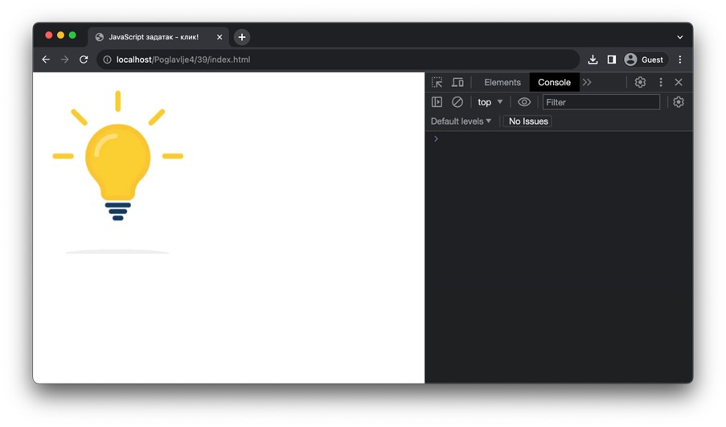

DOM API - рад са догађајима
===========================

Већина динамичких клијентских веб-апликација подразумева да постоји некаква реакција на корисникову интеракцију са веб-страницом. Неки примери интеракције корисника са веб-страницом и одговарајуће реакције веб-странице могу бити:

- Корисник кликће на дугме и веб-страница приказује (претходно сакривену) навигацију са стране.
- Корисник попуњава поље формулара и веб-страница проверава коректност уноса.
- Корисник кликће на дугме за подношење формулара и веб-страница проверава коректност свих унетих података пре слања.
- Корисник превлачи једну од слика из галерије слике и веб-страница мења редослед приказивања слика.
- Корисник прелази курсором миша преко текста и веб-страница повећава величину фонта тог текста.

Када се нека од ових (и њима сличних) интеракција догоди на веб-страници, кажемо да се окида догађај (*event*). Сваки HTML елемент дефинише скуп догађаја који се може окинути над њиме. На пример, већина HTML елемената подржава догађај "*click*" који се окида када корисник кликне на тај елемент. Слично њему, постоје и догађаји "*mouseenter*" и "*mouseleave*" који се окидају када корисник пређе курсором миша преко елемента (први се окида први пут када се курсор нађе преко елемента, а други се окида први пут када курсор напусти елемент). Са друге стране, поља формулара могу имати неке себи-својствене догађаје као што је догађај "*change*" који се окида када корисник промени вредност неког поља.

.. infonote::

    **Напомена:** Интерфејс `Element <https://developer.mozilla.org/en-US/docs/Web/API/Element#events>`_ дефинише велики број ових догађаја. Међутим, и интерфејс `HTMLElement <https://developer.mozilla.org/en-US/docs/Web/API/HTMLElement#events>`_ садржи неке корисне догађаје. Корисно је да проучиш документацију ових интерфејса и да упознаш њихове догађаје. Покушај да пронађеш називе догађаја који представљају честе интеракције које ти имаш са веб-апликацијама.

Имплементирање функционалности када се окине неки догађај је веома једноставно. Сваки HTML елемент дефинише метод *addEventListener* који користиш у ту сврху. Овај метод има два параметра: назив догађаја (ниска) и функцију која ће бити извршена када се тај догађај окине. 

Пример: На веб-страници се налази дугме „*Кликни ме!*“. Напиши JavaScript програм који у конзоли исписује поруку „*Клик!*“ када корисник кликне на дугме.

.. petlja-editor:: Poglavlje4/38

    index.html
    <!-- Poglavlje4/38/index.html -->
    
    <!DOCTYPE html>
    <html lang="sr">
    <head>
        <meta charset="utf-8">
        <title>JavaScript задатак - клик!</title>
    </head>
    <body>
        <input id="klik" type="button" value="Кликни ме!">

        
    </body>
    </html>
    ~~~
    index.js
    /* Poglavlje4/38/index.js */
    
    function na_klik_dugmeta() {
        console.log("Клик!");
    }

    const dugme = document.getElementById("klik");
    if (dugme !== null) {
        dugme.addEventListener("click", na_klik_dugmeta);
    }   else {
        console.log("Не постоји дугме са идентификатором: klik");
    }

Веома је важно да разумеш како JavaScript интерпретер извршава код из претходног примера. Примети да се, одмах по отварању веб-странице, у конзоли исписује порука „*Крај кода!*“, а да се порука „*Клик!*“ из функције *klikni_me* не исписује. Тек када кликнеш на дугме „*Кликни ме!*“, функција *klikni_me* се извршава и исписује се жељена порука. Другим речима, JavaScript интерпретер неће извршити код из прослеђене функције у тренутку позива метода *addEventListener* (за разлику од тога да позовеш функцију), већ само онда када се наведени догађај (у овом задатку, "*click*") окине над елементом над којим је овај метод позван. Ово можеш да разумеш као да позив метода *addEventListener* само каже JavaScript интерпретеру да запамти функцију која му се прослеђује (уз одговарајући догађај), а да ће њено позивање доћи тек касније (када се тај догађај окине).

Провежбај ово понашање кроз наредне задатке.

.. questionnote::

    **Задатак:** На веб-страници се налази слика угашене светиљке и два дугмета: „*укључи*“ и „*искључи*“. Напиши JavaScript програм који кликом на прво дугме мења фотографију на упаљену светиљку, а кликом на друго дугме мења фотографију на угашену светиљку.

.. code-block:: html

    <!-- Poglavlje4/39/index.html -->
    
    <!DOCTYPE html>
    <html lang="sr">
    <head>
        <meta charset="utf-8">
        <title>JavaScript задатак - сијалица</title>
    </head>
    <body>
        

        
    </body>
    </html>

.. code-block:: javascript

    /* Poglavlje4/39/index.js */
    
    let sijalica_je_ugasena = true;

    function na_klik_sijalice() {
        const sijalica = document.getElementById("sijalica");

        if (sijalica_je_ugasena) {
            sijalica.src = "./upaljena_sijalica.png";
        } else {
            sijalica.src = "./ugasena_sijalica.png";
        }

        sijalica_je_ugasena = !sijalica_je_ugasena;
    }

    const sijalica = document.getElementById("sijalica");
    if (sijalica !== null) {
        sijalica.addEventListener("click", na_klik_sijalice);
    } else {
        console.log("Не постоји слика са идентификатором: sijalica");
    }

.. questionnote::

    **Задатак:** На веб-страници се налазе два једнолинијска текстуална поља: *„први број“* и *„други број“*, четири ексклузивна дугмета са основним аритметичким операцијама: *„+“* (сабирањем), *„-“* (одузимањем), *„*“* (множењем) и *„/“* (дељењем), обично дугме „*Израчунај*“ и пасус са текстом „*Резултат*“. Напиши JavaScript програм који кликом на дугме „*Израчунај*“ чита бројевне вредности из једнолинијских текстуалних поља, а затим у пасус уписује резултат извршавања одабране аритметичке операције.

.. petlja-editor:: Poglavlje4/40

    index.html
    <!-- Poglavlje4/40/index.html -->
    
    <!DOCTYPE html>
    <html lang="sr">
    <head>
        <meta charset="utf-8">
        <title>JavaScript задатак - калкулатор</title>
    </head>
    <body>
        

        <label for="prvi-broj">Први број</label>
         
        <input id="prvi-broj" type="text">
        

        

        <label for="drugi-broj">Други број</label>
         
        <input id="drugi-broj" type="text">
        

        

        <input type="radio" name="operacija" id="zbir" value="zbir"> <label for="zbir">+</label>
         
        <input type="radio" name="operacija" id="razlika" value="razlika"> <label for="razlika">-</label>
         
        <input type="radio" name="operacija" id="mnozenje" value="mnozenje"> <label for="mnozenje">*</label>
         
        <input type="radio" name="operacija" id="deljenje" value="deljenje"> <label for="deljenje">/</label>
        

        <input id="dugme" type="button" value="Израчунај">

        
Резултат:

        
    </body>
    </html>
    ~~~
    index.js
    /* Poglavlje4/40/index.js */
    
    function procitaj_broj_iz_polja(id_polja) {
        const polje = document.getElementById(id_polja);
        if (polje !== null) {
            const sadrzaj_polja = polje.value;
            const broj = Number.parseFloat(sadrzaj_polja);
            return broj;
        } else {
            console.log("Не постоји поље са идентификатором:", id_polja);
            return 0;
        }
    }

    function dohvati_oznacenu_operaciju() {
        const operacije = ["zbir", "razlika", "mnozenje", "deljenje"];

        for (let i = 0; i < operacije.length; i++) {
            const operacija = operacije[i];

            const polje = document.getElementById(operacija);
            if (polje.checked) {
            return operacija;
            }
        }

        return null;
    }

    function upisi_rezultat(rezultat) {
        const polje = document.getElementById("rezultat");
        if (polje !== null) {
            polje.innerText = `Резултат: ${rezultat}`;
        } else {
            console.log("Не постоји поље са идентификатором: rezultat");
        }
    }

    function na_klik_dugmeta() {
        const prvi_broj = procitaj_broj_iz_polja("prvi-broj");
        const drugi_broj = procitaj_broj_iz_polja("drugi-broj");
        const operacija = dohvati_oznacenu_operaciju();

        switch (operacija) {
            case "zbir": {
                upisi_rezultat(prvi_broj + drugi_broj);
                break;
            }
            case "razlika": {
                upisi_rezultat(prvi_broj - drugi_broj);
                break;
            }
            case "mnozenje": {
                upisi_rezultat(prvi_broj * drugi_broj);
                break;
            }
            case "deljenje": {
                upisi_rezultat(prvi_broj / drugi_broj);
                break;
            }
            default: {
                console.log("Ниједна операција није означена");
            }
        }
    }

    const dugme = document.getElementById("dugme");
    if (dugme !== null) {
        dugme.addEventListener("click", na_klik_dugmeta);
    } else {
        console.log("Не постоји елемент са идентификатором: dugme");
    }
    ~~~

.. questionnote::

    **Задатак:** На веб-страници се налази текстуални садржај величине текста :math:`10pt`. Напиши JavaScript програм који, када корисник преже курсором преко текста, увећава величину фонта тог текста на :math:`14pt`. Приликом „напуштања“ текста, програм треба да врати величину текста на претходну.

.. petlja-editor:: Poglavlje4/41

    index.html
    <!-- Poglavlje4/41/index.html -->
    
    <!DOCTYPE html>
    <html lang="sr">
    <head>
        <meta charset="utf-8">
        <title>JavaScript задатак - текст који мења величину</title>
        <link rel="stylesheet" type="text/css" href="index.css">
    </head>
    <body>
        

        Пређи курсором преко мене да увећаш фонт. Када курсор напусти овај пасус, текст ће се вратити на претходну
        величину.
        

        
    </body>
    </html>
    ~~~
    index.css
    p {
        font-size: 10pt;
    }
    ~~~
    index.js
    /* Poglavlje4/41/index.js */
    
    function kursor_je_preko_pasusa() {
        const tekst = document.getElementById("tekst");
        tekst.style.fontSize = "14pt";
    }

    function kursor_je_napustio_pasus() {
        const tekst = document.getElementById("tekst");
        tekst.style.fontSize = "10pt";
    }

    const tekst = document.getElementById("tekst");
    if (tekst !== null) {
        tekst.addEventListener("mouseenter", kursor_je_preko_pasusa);
        tekst.addEventListener("mouseleave", kursor_je_napustio_pasus);
    } else {
        console.log("Не постоји пасус са идентификатором: tekst");
    }

.. infonote::

    **Напомена:** Постоји и метод `removeEventListener <https://developer.mozilla.org/en-US/docs/Web/API/EventTarget/removeEventListener>`_ који се користи да уклони функцију која је регистрована методом *addEventListener*. Обе функције имају идентичне параметре који се морају поклопити (као и чвор-објекат над којим се позивају) како би се уклонила исправна функција. Овај метод наводимо како бисмо ти скренули пажњу на његово постојање, али уклањање функција којима се реагује на догађаје је релативно ретка операција у развоја веб-апликација, те се нећемо удубљивати у функционисање овог метода.

Документацију за метод можеш пронаћи на адреси https://developer.mozilla.org/en-US/docs/Web/API/EventTarget/addEventListener. Као што ћеш приметити, овај метод је веома моћан и ми смо у овој лекцији тек окрзнули функционалности које нам он пружа. Ипак, оно што си научио ће ти бити довољно да имплементираш велики број динамичких клијентских веб-апликација.
