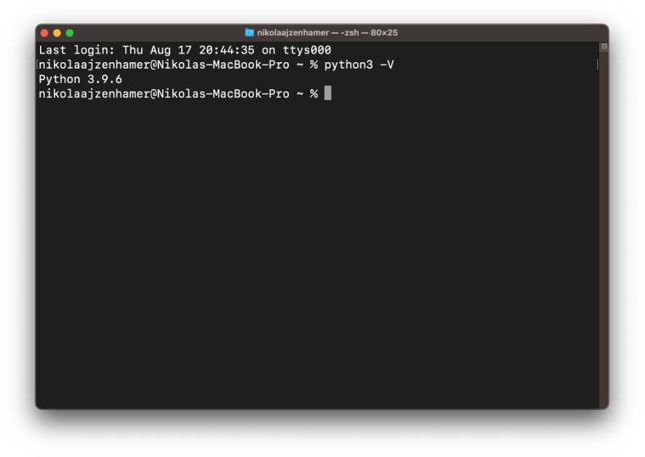
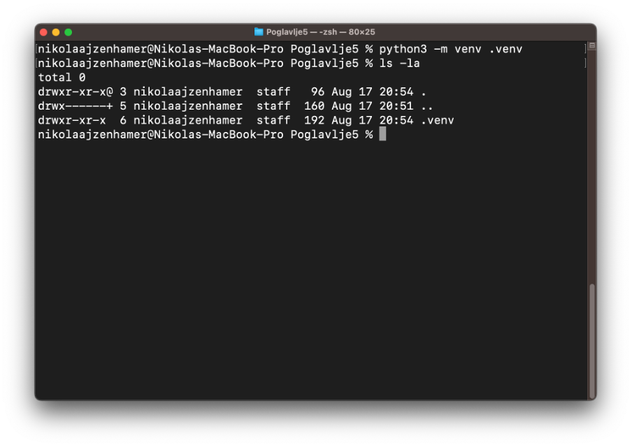
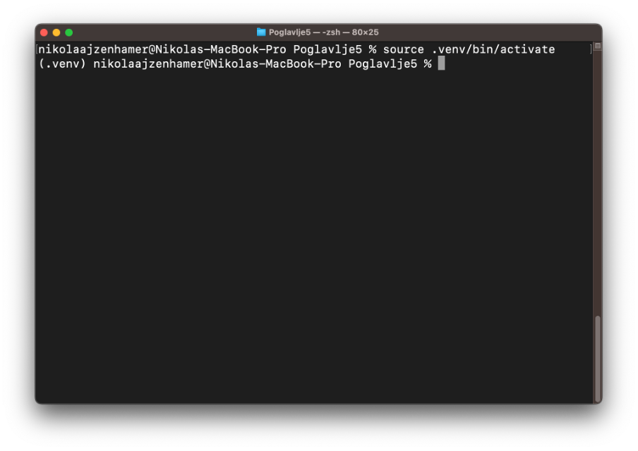

Основно о библиотеци Flask
==========================

Библиотека Flask представља једну од многих библиотека за програмски језик Python која ти нуди велики број функционалности за програмирање серверских веб-апликација. За разлику од неких других библиотека које се користе у пракси, елементи који чине библиотеку Flask се веома брзо усвајају. Једном када разумеш како ти елементи функционишу, можеш их користити изнова и изнова, а све у циљу имплементирања најразличитијих серверских веб-апликација, било да су у питању једноставне апликације или сложенији серверски системи.

.. technicalnote::

    Уколико у било ком тренутку наиђеш на проблем приликом програмирања неког од примера, можеш се упутити ка репозиторијуму `<https://github.com/Petlja/specit4_web_radni>`_, са којег можеш клонирати садржај у директоријум *htdocs* XAMPP алата, или преузети архиву са адресе `<https://github.com/Petlja/specit4_web_radni/archive/refs/heads/main.zip>`_, а затим распаковати њен садржај у том директоријуму. Сви примери из лекција 16 и 17 су део пете теме курса - развој серверских веб-апликација - па ћеш и све примере из ових лекција пронаћи у директоријуму ”Poglavlje5”. 

Подешавање окружења
____________________

Документацију за библиотеку Flask можеш пронаћи на адреси https://flask.palletsprojects.com/. Последња верзија која је била доступна током писања ове лекције је 2.3.2. Како би избегао потенцијалне разлике између верзија, саветујемо да инсталираш управо ту верзију. У овој лекцији ћеш видети како је могуће подесити окружење за рад са библиотеком Flask.

Прво што је неопходно да инсталираш јесу алати за програмирање у програмском језику Python. Они су доступни кроз пакет који можеш преузети са адресе https://www.python.org/downloads/ и инсталирати на свом оперативном систему. У зависности од оперативног система. Иако је коректно инсталирати било коју верзију језика Python3 која је 3.8 или већа, сви примери које ћеш видети користе верзију 3.9.6. Уколико имаш потешкоћа са покретањем примера, саветујемо да инсталираш управо ову верзију.

Покрени терминал оперативног система (или терминал у којем су ти доступни Python алати) и провери да ли су ти алати доступни покретањем наредне команде:

::

    python3 -V

У терминалу се позиционирај у директоријум у којем ћеш сместити програмски код својих веб-серверских апликација. То може бити нови директоријум у директоријуму *htdocs*, као што је то био случај у претходним лекцијама. Међутим, библиотека Flask долази са својим веб-сервером који се користи у фази развоја апликације, те није неопходно сместити код у директоријуму *htdocs*. Због тога, све наше примере ћемо чувати у директоријуму *Poglavlje5* на десктопу (директоријум *Desktop*).

Када позиционираш терминал у директоријум *Poglavlje5*, потребно је да креираш ново Python окружење. У оквиру овог окружења ћеш чувати све библиотеке, како те библиотеке не би утицале на остале пројекте које развијаш. Изврши наредну команду:

::

    python3 -m venv .venv

Након неколико секунди, можеш се уверити да је директоријум заиста креиран (можда ћеш морати да инструираш свој прегледач датотека да ти прикаже сакривене датотеке). Алтернативно, можеш користити алате командне линије за прегледање садржаја директоријума:

Окружење се креира само једном. Међутим, пре сваког коришћења (односно, сваки пут када отвориш нови терминал), окружење је потребно активирати пре него што се започне са инсталирањем библиотека или развојем апликација. У зависности од оперативног система, потребно је да извршиш једну од наредних команди:

- macOS/Linux:
    - *source .venv/bin/activate*
- Windows: 
    - *.venv\Scripts\activate*

Већина терминала ће променити испис како би ти наговестили да тренутно радиш у оквиру окружења, као што је приказано на наредној слици:

Након што си успешно активирао окружење, можеш инсталирати библиотеку Flask. 

::

    pip install Flask==2.3.2

Ако не наведеш верзију, биће ти инсталирана последња верзија доступна у тренутку инсталирања. Иако не би требало да имаш потешкоћа чак и да инсталираш последњу доступну верзију, саветујемо да се ипак држиш исте верзије као и оне која је коришћена приликом писања примера из наредних лекција. Наравно, библиотеку је потребно инсталирати само једном за све примере.

Сада када си припремио окружење, спреман си да се упознаш са првом веб-серверском апликацијом.
