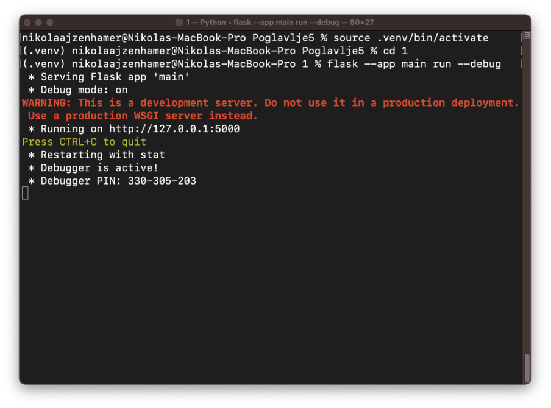

Први програм
============

У овој лекцији ћеш се упознати са првим програмом. Циљ ове лекције јесте да разумеш на који начин библиотека Flask описује понашање серверских веб-апликација.

Без одуговлачења, прикажимо изворни код првог програма.

.. code-block:: python

    # Poglavlje5/1/main.py
    
    from flask import Flask

    app = Flask(__name__)

    @app.route("/")
    def zdravo_svete():
        return "<h1>Здраво, свете!</h1>"

Погледајмо од чега се састоји овај програм:

1. Прво увозимо класу Flask из модула *flask* који смо инсталирали у претходној лекцији. Примети да, иако смо приликом инсталирања библиотеке у претходној лекцији користили назив ”Flask”, у програмском коду ова библиотека је доступна кроз модул назива ”flask”. 
2. Класа *Flask* коју си увезао се користи за креирање једне серверске веб-апликације. Ова апликација се креира позивом конструктора класе и, с обзиром да ћемо апликацију користити надаље, чувамо је у променљивој аpp. Уобичајено је да се конструктору прослеђује вредност *__name__*, која представља назив модула у којем се апликација развија. На овај начин говориш библиотеци Flask где може да пронађе ресурсе, као што су шаблони или статичке датотеке (о којима ће бити речи у осталим лекцијама).
3. За сваку функционалност коју желиш да програмираш у оквиру твоје серверске веб-апликације, потребно је да имплементираш по једну функцију. Таква је и функција *zdravo_svete* за коју желимо да врати (за сада окрњен) HTML код клијентској веб-апликацији. С обзиром да је подразумевано понашање серверске веб-апликације да враћа HTML садржај, довољно је да функција врати ниску која садржи HTML код.
4. Да би библиотека Flask знала да функција *zdravo_svete* представља функцију коју серверска веб-апликација треба да изврши као одговор на клијентски захтев, потребно ју је декорисати декоратором app.route, који очекује путању на коју клијент треба да пошаље захтев како би добио одговор за жељену услугу. У примеру смо навели путању "/" што значи да ће декорисана функција *zdravo_svete* бити позвана када клијент пошаље захтев за корени ресурс.

Како би се уверио да је овај једноставан код довољан да се програмира једна серверска веб-апликација, покрени наредну команду у терминалу:

::

    flask --app main run --debug

Опцијом *--app* наводиш који Python модул садржи изворни код серверске веб-апликације. С обзиром да смо код сачували у датотеци *main.py*, наводимо вредност *main*. Опцијом *--debug* наводиш да се користи режим за дебагирање, који је корисно укључити приликом развоја апликације како би добио детаљне информације о грешкама приликом извршавања апликације.

.. infonote::

    **Напомена:** Ако добијеш грешку приликом покретања команде *flask run*, пpовери да ли је покренуто окружење које си подесио у претходној лекцији. Ако није, прво покрени окружење из директоријума *Poglavlje5*, а затим се позиционирај у директоријум примера *1* и одатле покрени команду.

Ако у свом веб-прегледачу посетиш адресу http://127.0.0.1:5000 или http://localhost:5000, приметићеш да ће ти бити видљива порука из апликације.

.. image:: ../../_images/slika_162b.png
    :width: 600
    :align: center

Додатно, у терминалу у којем је покренута апликација можеш се уверити да је клијентски захтев заиста послат на корену адресу и да је серверска веб-апликација вратила одговор са статусним кодом 200.

Важно је да запамтиш да свака измена у изворном коду апликације повлачи да се серверска веб-апликација заустави и покрене испочетка. На пример, измени претходни код тако да функција враћа другу поруку, на пример:

.. code-block:: python3

    @app.route("/")
    def zdravo_svete():
        return "<h1>Hello, world!</h1>"

Сачувај измене, па затим освежиш веб-страницу у веб-прегледачу. Добићеш нову поруку у веб-прегледачу, као на наредној слици.

Додатно, у терминалу у којем је покренута серверска веб-апликација можеш пронаћи информациону поруку о томе да је препозната промена у изворном коду која је рестартовала апликацију.

Иако једноставан пример, занимљиво је приметити да ти је ово знање довољно да направиш најсложеније веб-апликације. Додавањем нових функција претходном коду и декорисањем тих функција можеш на овај начин имплементирати велики број веб-апликација. Наравно, што је веб-апликација сложенија, то је њено програмирање и одржавање на овај начин сложеније. Због тога ћеш у наредним лекцијама научити неке технике које ће ти олакшати програмирање сложенијих веб-апликација.

