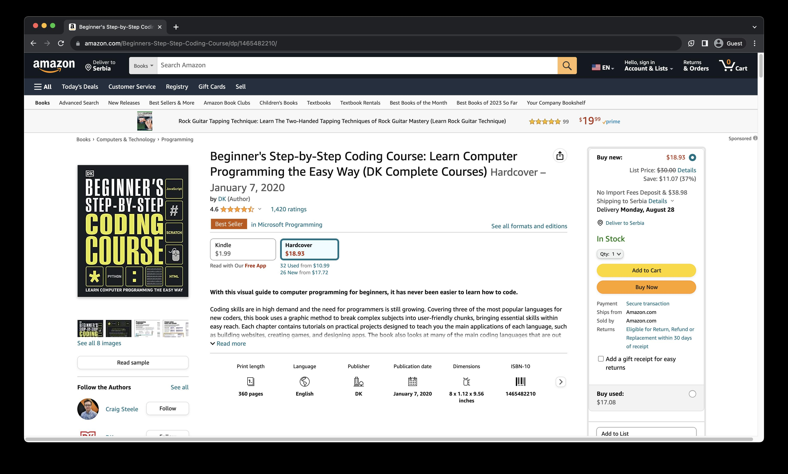
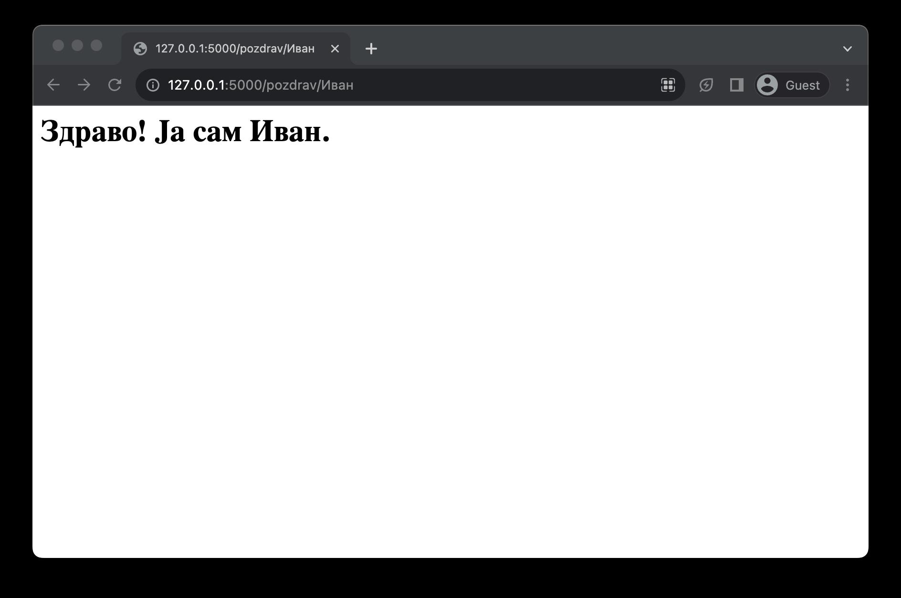

Рутирање захтева
================

Веб-апликације се обично састоје од већег броја веб-страница. Свака веб-страница нуди одређену функционалност, било да је то преглед садржаја, приказивање формулара који корисник попуњава, обрада тих формулара, итд. На серверској страни комуникације, свака од ових функционалности се јединствено одређује тзв. приступним тачкама (*endpoint*) путем којих клијенти шаљу захтеве. Као што смо о томе већ говорили у лекцији о HTTP протоколу, ове приступне тачке се одређују HTTP методом и URL адресом. 

Када клијент пошаље захтев серверској веб-апликацији, библиотека Flask треба да буде у стању да препозна о којој приступној тачки је реч и да изврши одговарајући програмски код. Прва функционалност се већ аутоматски извршава од стране библиотеке Flask, али друга функционалност се препушта програмерима. Другим речима, сваку приступну тачку коју желиш да твоја серверска веб-апликација имплементира треба да посебно дефинишеш у програмском коду. Ово се назива рутирање (*routing*) захтева.

У претходној лекцији си видео како се рутирање програмира у библиотеци Flask – дефинисањем функције и декорисањем помоћу декоратора *app.route*. Овај декоратор очекује URL путању која дефинише приступну тачку. Како свака приступна тачка треба да има јединствену URL адресу, то и сваки позив овог декоратора треба да садржи јединствену URL путању. Наредни пример илуструје веб-апликацију са две веб-странице.

.. code-block:: python

    from flask import Flask

    app = Flask(__name__)

    @app.route("/")
    def pocetna():
        return """<h1>Почетна страница</h1>"""

    @app.route("/o-nama")
    def o_nama():
        return """<h1>О нама</h1>"""

Отвори веб-прегледач и унеси URL адресу http://127.0.0.1:5000/ у адресној линији. Увери се да се приказује наслов почетне странице. Сада унеси URL aдресу http://127.0.0.1:5000/o-nama и увери се да се приказује наслов странице посвећене информацијама о веб-апликацији.

Подразумевано, рутирање се врши само за GET метод. У неком од наредних лекција ћеш видети како можеш навести библиотеку Flask да обрађује само POST методе.

Путање са параметрима
______________________

Често ти је потребно да одређене делове URL адресе учиниш променљивим. На пример, није реткост да се у оквиру веб-продавница детаљи и производима налазе на веб-страницама чије се URL адресе разликују само по идентификаторима тих производа. У наредној табели дат је пример две веб-странице на сајту Амазон које приказују два различита производа. Ако погледаш њихове URL адресе, приметићеш да се обе адресе састоје од истих елемената:

- Схема и ауторитет су заједнички: „https://www.amazon.com“
- Део путање који представља кратак назив производа: „Beginners-Step-Step-Coding-Course”, односно „Python-QuickStart-Guide-Hands-Applications“
- Део путање који је заједнички: „dp“
- Идентификатор производа: „1465482210“, односно „163610035X“

.. |web_163b| image:: ../../_images/web_163b.jpg
                :width: 600
                :align: middle

+----------------------------------------------------------+------------+
| URL адреса                                               | Страница   |
+----------------------------------------------------------+------------+
| Beginners-Step-Step-Coding-Course/dp/1465482210          | |web_163a| |
+----------------------------------------------------------+------------+
| Python-QuickStart-Guide-Hands-Applications/dp/163610035X | |web_163B| |
+----------------------------------------------------------+------------+

Било би изузетно компликовано програмирати веб-продавнице ако би за сваки могући производ требало да имплементираш једну-те-исту функцију која се разликује само по путањи у декоратору *app.route*. Уместо тога, библиотека Flask ти омогућава да делове путања (па чак и целе путање) параметризујеш како би уштедео на имплементацији. 

Параметре путања можеш да наведеш у оквиру URL адреса тако што наведеш *<ime_promenljive>* у оквиру путање. Затим, функцији која је декорисана оваквим оператором биће прослеђен аргумент чији је назив управо *ime_promenljive*, а чија ће вредност бити замењена приликом обраде клијентског захтева. Овакав аргумент је могуће користити у коду као и сваку другу променљиву. Наредни пример илуструје ово понашање.

.. code-block:: python

    from flask import Flask

    app = Flask(__name__)

    @app.route("/pozdrav/<ime>")
    def pozdrav(ime):
        return f"<h1>Здраво! Ја сам {ime}.</h1>"

Ако посетиш адресу http://127.0.0.1:5000/pozdrav/Иван, добићеш приказ као на наредној слици.

Функцијa *url_for*, поред назива функције чију путању израчунава, може прихватити и додатне именоване аргументе. Уколико именовани аргумент одговара називу неког параметра у путањи, онда ће вредност тог аргумента функције *url_for* бити замењена на месту истоименог параметра у путањи. У супротном, функција *url_for* ће такав аргумент сматрати као параметар адресе који наводи након упитника. Дајмо пример кода који илуструје ово понашање. Посматрај наредна рутирања у једној Flask веб-апликацији.

.. code-block:: python3

    @app.route("/")
    def pocetna():
        return "pocetna"

    @app.route("/prijava")
    def prijava():
        return "prijava"

    @app.route("/korisnici/<id_korisnika>")
    def profil(id_korisnika):
        return f"Профил корисника {id_korisnika}"

Наредна табела приказује разне позиве функције url_for и резултујуће путање.

+-------------------------------------+-------------------------+
| **Позив функције url_for**          | **Резултат**            |
+-------------------------------------+-------------------------+
| *url_for("pocetna")*                | /                       |
+-------------------------------------+-------------------------+
| *url_for("prijava")*                | /prijava                |
+-------------------------------------+-------------------------+
| *url_for("prijava")*                | /prijava?id_korisnika=1 |
+-------------------------------------+-------------------------+
| *url_for("profil", id_korisnika=1)* | /prijava/1              |
+-------------------------------------+-------------------------+

Параметри путања представљају користан алат помоћу којег можеш да програмираш динамичке апликације без да понављаш код. Уколико приметиш да се програмски код за две веб-странице поклапа, размисли да ли можеш параметризовати њихове путање и тиме смањити укупан број линија кода који треба да одржаваш. Поред тога, параметри путања можеш да користиш као једноставан механизам да пренесеш податке са клијентске стране на серверску страну у HTTP комуникацији. Ипак, за сложеније податке је погодније користити друге механизме које ћеш видети у наредним лекцијама.