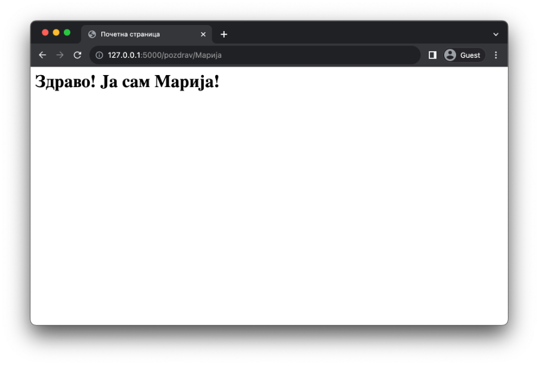
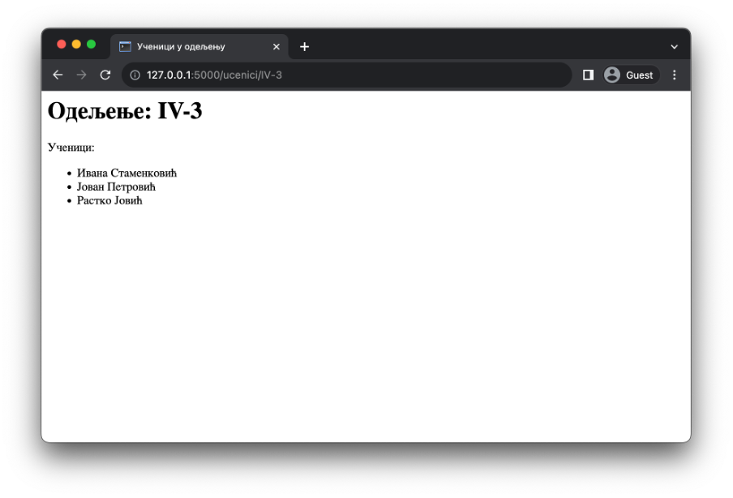

Шаблони и динамички генерисан садржај
=====================================

Сви примери које си видео до сада су садржали веома једноставан HTML код. У практичним употребама, веб-странице се састоје од неколико стотина, па чак и хиљада линија кода. Писање овог кода на начин који смо то до сада радили може бити веома напорно за одржавање, поготово уколико постоји велики број функција у нашој веб-апликацији. Такође, сав HTML код који пишеш је део ниске. Због тога, већина савремених едитора (као што је *Visual Studio Code*) неће ти нудити подршку за аутоматско допуњавање садржаја (*autocomplete*). Још већи проблем је тај што на овај начин долази до мешања HTML и Python кода у истој датотеци. Пробај да самостално имплементираш наредни пример у свом омиљеном едитору. Да ли ти је деловало смислено да пишеш програмски код на овај начин?

.. code-block:: python

    # Poglavlje5/4/main.py
    
    from flask import Flask

    app = Flask(__name__)

    @app.route("/")
    def pocetna():
        return """
            <html lang="sr">
                <head>
                    <title>Почетна страница</title>
                </head>
                <body>
                    <h1>Здраво, свете!</h1>
                </body>
            </html>
        """

Како би се сви ови, али и неки други проблеми пребродили, библиотека Flask долази са још једном библиотеком која омогућава да се HTML код пише у посебним датотекама које називамо шаблони (*template*). У питању је библиотека Jinja2. Документација за ову библиотеку се налази на адреси https://flask.palletsprojects.com/templating/ и послужиће ти као одличан ресурс приликом вежбања, као и уколико желиш да се упустиш у разумевање напредних функционалности програмирања шаблона.

Сви шаблони се подразумевано смештају у оквиру директоријума templates, а у оквиру веб-апликације се реферишу на основу назива датотеке и функције render_template коју увозиш у програм из модула flask. У наставку дајемо пример структуре директоријума и програмског кода који приказује исту веб-страницу као и претходни пример, али овога пута коришћењем шаблона.

::

    .
    ├── main.py
    └── templates
        └── index.html

.. code-block:: python

    # Poglavlje5/5/main.py
    
    from flask import Flask, render_template

    app = Flask(__name__)

    @app.route("/")
    def pocetna():
        return render_template("index.html")

.. code-block:: html

    <!-- Poglavlje5/5/templates/index.html -->

    <html lang="sr">
    <head>
        <title>Почетна страница</title>
    </head>
    <body>
        <h1>Здраво, свете!</h1>
    </body>
    </html>

Поред тога што шаблони омогућавају раздвајање HTML и Python кода, шаблони омогућавају једноставно писање динамичких веб-страница. На пример, шаблону можеш проследити вредност коју ће библиотека Jinja2 процесирати на одговарајући начин и приказати на страници.

.. code-block:: python

    # Poglavlje5/6/main.py
    from flask import Flask, render_template

    app = Flask(__name__)

    @app.route("/pozdrav/<ime>")
    def pozdrav(ime):
        return render_template("pozdrav.html", ime=ime)

.. code-block:: html

    <!-- Poglavlje5/6/templates/pozdrav.html -->

    <html lang="sr">
    <head>
        <title>Почетна страница</title>
    </head>
    <body>
        <h1>Здраво! Ја сам {{ime}}!</h1>
    </body>
    </html>

Приликом позива функције render_template, поред назива датотеке која садржи шаблон који треба вратити као одговор на клијентски захтев, могуће је проследити Python вредности које ће бити уписане у шаблону. Имена ових вредности морају бити валидни Python идентификатори. Што се тиче типова вредности, то могу бити бројеви, ниске, низови, речници и др. Како би се ове вредности исписале у шаблону, потребно је да на ту вредност референцираш преко њеног имена између двоструких витичастих заграда {{ и }}. Библиотека Jinja2 ће уместо ових заграда исписати вредност која јој је прослеђена приликом позива функције render_template.

Поред исписивања вредности, могуће је користити и разне друге језичке конструкте. Документације библиотеке Jinja2 описује све ове конструкте, а овде ћеш упознати два најважнија – гранање и петљу.

Гранање има наредни облик:

.. code-block:: javascript

    
        ...
    
        ...
    

Уколико је *uslov* тачан (или се може конвертовати у *True*), онда ће све оно што се налази у оквиру гране *if* бити приказано на веб-страници која се генерише. У супротном, биће генерисано све у оквиру гране *else* (коју можеш изоставити уколико ти није потребна). Поред тога што гранање можеш користити за приказивање или сакривање садржаја у зависности од Булових вредности, оно је корисно и за проверавање да ли је нека вредност уопште послата шаблону, да ли листа или речник имају неке елементе итд.

Поред гранања, петља је незаобилазан део свих шаблона у пракси с обзиром да ти омогућава да на динамички начин генеришеш HTML код са различитим вредностима. Тако, на пример, можеш приказати списак свих ученика у листи, списак свих производа са њиховим описима и ценама, галерију слика итд. Обично се ови подаци дохватају из неких база података пре него што се проследе шаблону (о томе ће бити речи нешто касније). За сада, прикажимо основни облик петље:

.. code-block:: javascript

    
        ...
    

Наредни пример илуструје коришћење гранања и петље за генерисање динамичких веб-страница:

.. code-block:: python

    # Poglavlje5/7/main.py
    
    from flask import Flask, render_template

    app = Flask(__name__)

    @app.route("/ucenici/<odeljenje>")
    def pozdrav(odeljenje):
        return render_template(
            "ucenici.html",
            odeljenje=odeljenje,
            ucenici=["Ивана Стаменковић", "Јован Петровић", "Растко Јовић"],
        )

.. code-block:: html

    <!-- Poglavlje5/7/templates/ucenici.html -->

    <html lang="sr">
    <head>
        <title>Ученици у одељењу</title>
    </head>
    <body>
        
            <h1>Одељење: {{odeljenje}}</h1>
         
        
            
Ученици:

            <ul>
            
                <li>{{ucenik}}</li>
            
            </ul>
        
    </body>
    </html>

Наслеђивање шаблона
___________________

С обзиром да свака веб-страница у оквиру веб-сајта представља HTML документ за себе, очекивано је да за сваку веб-страницу треба да направиш по један шаблон. Наредни пример илуструје веб-сајт гимназије која садржи две веб-странице.

.. code-block:: python

    # Poglavlje5/8/main.py
    
    from flask import Flask, render_template

    app = Flask(__name__)

    @app.route("/")
    def pocetna():
        return render_template("pocetna.html")

    @app.route("/odeljenja")
    def odeljenja():
        return render_template(
            "odeljenja.html", razredi=["Први", "Други", "Трећи", "Четврти"]
        )

.. code-block:: html

    <!-- Poglavlje5/8/templates/pocetna.html -->

    <html lang="sr">
        <head>
            <title>Гимназија "Десанка Максимовић"</title>
            <link rel="stylesheet" type="text/css" href="stil.css">
        </head>
        <body>
            <header>
            
            <h1 id="glavni-naslov">Гимназија <q>Десанка Максимовић</q></h1>
            <nav>
                <a href="pocetna.html">Почетна</a>
                <a href="odeljenja.html">Одељења</a>
            </nav>
            </header>

            <h2>Одељења</h2>
            <ul>
            
            <li>{{razred}} разред</li>
            
            </ul>

            
        </body>
    </html>

.. code-block:: html

    <!-- Poglavlje5/8/templates/odeljenja.html -->

    <html lang="sr">
        <head>
            <title>Гимназија "Десанка Максимовић"</title>
            <link rel="stylesheet" type="text/css" href="stil.css">
        </head>
        <body>
            <header>
            
            <h1 id="glavni-naslov">Гимназија <q>Десанка Максимовић</q></h1>
            <nav>
                <a href="pocetna.html">Почетна</a>
                <a href="odeljenja.html">Одељења</a>
            </nav>
            </header>

            <h2>Почетна страница</h2>
            
Добродошли на веб-сајт гимназије <q>Десанка Максимовић</q>!

            
        </body>
    </html>

.. infonote::

    **Напомена:** За сада можеш да игноришеш везе и ресурсе који су наведени илустрације ради. Видећеш у наредним лекцијама да постоји много бољи начин да се они наведу у оквиру веб-странице.

Обе странице испуњавају различите функционалности које овај веб-сајт нуди. Међутим, обе странице садрже идентичан, а значајан део HTML кода. Измена на једном месту, на пример, додавањем нове везе у навигацији највишег нивоа повлачи измену у другој датотеци. Ово понашање је непожељно.

Уместо да шаблони садрже идентичан HTML код, боље је да издвојиш тај код у посебну датотеку (опет шаблон), па затим искористиш технику која се зове наслеђивање шаблона (*template inheritance*). Ова техника се састоји од два корака:

- Направити шаблон који садржи заједнички HTML код који је издвојен из веб-страница. Делове које нису заједнички се обележавају тзв. блоковима (*block*).
- У шаблонима из којих се издвојио заједнички HTML код прво наводиш од којег шаблона се врши наслеђивање. Затим наводиш блокове из наслеђеног шаблона, а као садржај тих блокова наводиш HTML код који је специфичан за тај шаблон.

Наредни пример илуструје технику наслеђивања шаблона.

.. code-block:: python

    # Poglavlje5/9/main.py
    
    from flask import Flask, render_template

    app = Flask(__name__)

    @app.route("/")
    def pocetna():
        return render_template("pocetna.html", naslov="Почетна страница")

    @app.route("/odeljenja")
    def odeljenja():
        return render_template(
            "odeljenja.html",
            naslov="Одељења",
            razredi=["Први", "Други", "Трећи", "Четврти"],
        )

.. code-block:: html

    <!-- Poglavlje5/9/templates/osnovni_sablon.html -->

    <html lang="sr">
        <head>
            <title>Гимназија "Десанка Максимовић"</title>
            <link rel="stylesheet" type="text/css" href="stil.css">
        </head>
        <body>
            <header>
            
            <h1 id="glavni-naslov">Гимназија <q>Десанка Максимовић</q></h1>
            <nav>
                <a href="pocetna.html">Почетна</a>
                <a href="odeljenja.html">Одељења</a>
            </nav>
            </header>

            <h2>{{naslov}}</h2>
            
            

            
        </body>
    </html>

Шаблон *osnovni_sablon.html* представља онај који садржи заједнички код. Поред тога што исписује Python вредност *naslov*, овај шаблон садржи један блок који је назван *sadrzaj*. Примети да су блокови облика:

.. code-block:: javascript

     
    

Шаблон *osnovni_sablon.html* се не користи сам по себи. Уместо тога, за веб-страницу која користи овај шаблон као своју основу за генерисање садржаја треба да направиш додатни шаблон који ћеш проследити функцији *render_template*. 

.. code-block:: html

    <!-- Poglavlje5/9/templates/pocetna.html -->

    
    
        
Добродошли на веб-сајт гимназије <q>Десанка Максимовић</q>!

    

.. code-block:: html

    <!-- Poglavlje5/9/templates/odeljenja.html -->

    
    
        <ul>
            
                <li>{{razred}} разред</li>
            
        </ul>
    

Шаблони *pocetna.html* и *odeljenja.html* деле исту структуру. Сваки од ових шаблона започиње навођењем команде *extends* за наслеђивање шаблона. Ову команду прати назив датотеке који садржи шаблон који се наслеђује. Након тога следи листа блокова са садржајем који ће бити замењен у наслеђеном шаблону приликом обраде. Наведимо и општу синтаксу за наслеђивање шаблона:

.. code-block:: javascript

    
    
      ...
    

.. infonote::

    **Напомена:** С обзиром да се у шаблону *osnovni_sablon.html* исписује Python вредност *naslov*, то је неопходно да приликом позива функције *render_template* наведеш вредност за ово име, иако се ова вредност не помиње ни у једном од шаблона *pocetna.html* и *odeljenja.html*. У супротном, библиотека Jinja2 неће исписати ништа на месту где се та вредност реферише у шаблону *osnovni_sablon.html*.

Шаблони представљају неизоставан механизам у развоја серверских веб-апликација. Осим тога што ти омогућавају да генеришеш динамичке веб-странице, организација изворног кода по датотекама ти омогућава лакше одржавање читавог пројекта.