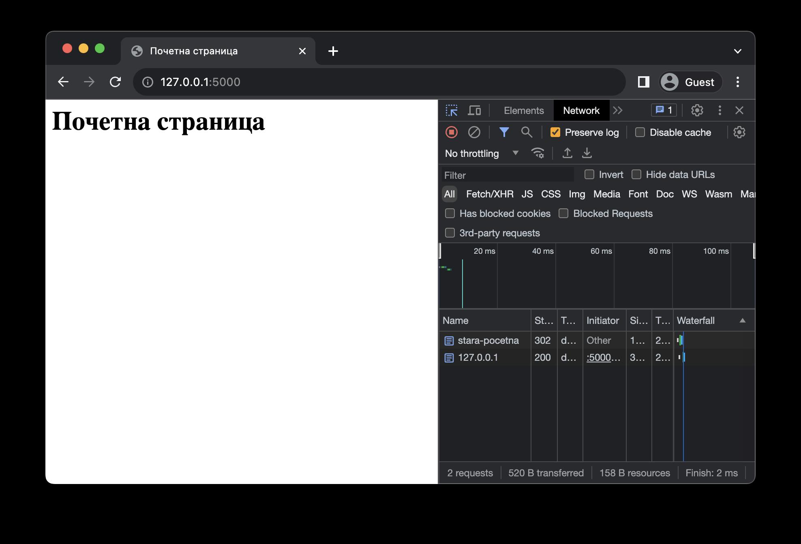
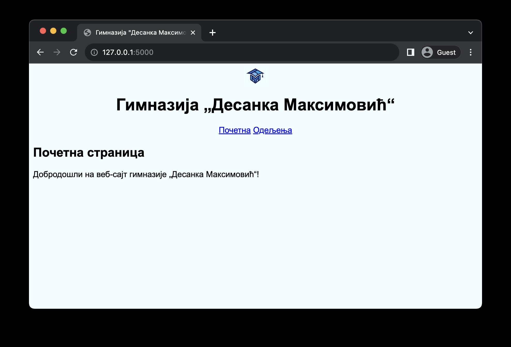

Везе унутар веб-апликације
==========================

У претходној лекцији смо показали примере веб-страница које садрже везе ка другим веб-страницама у оквиру истог веб-сајта. Међутим, тада смо напоменули да те везе нису исправне, с обзиром да су користиле путање до датотека, на сличан начин као што смо навикли то да програмирамо у статичким веб-страницама. Међутим, у библиотеци Flask ово није исправно. 

Уместо тога, препоручени начин за креирање веза унутар веб-апликације јесте да користиш функцију *url_for* којој прослеђујеш назив Python функције која одређује приступну тачку ка којој правиш везу. На пример, ако веб-сајт има страницу за контакт која се добија позивом Python функције *kontakt* у датотеци *main.py*, онда ћеш везу ка тој страници направити позивом функције *url_for("kontakt")*. Другим речима, ова функција очекује назив Python функције којом се добија жељени ресурс. Библиотека Flask ће за тебе конструисати исправну URL адресу. 

.. infonote::

    **Напомена:** С обзиром да се ради о позиву функције, у шаблону је обавезно да тај позив наведеш између двоструких витичастих заграда, како би се резултујућа веза исписала на одговарајућем месту у шаблону. На пример, *{{ url_for("kontakt") }}*.

.. code-block:: python

    #Poglavlje5/10/main.py

    from flask import Flask, render_template

    app = Flask(__name__)

    @app.route("/")
    def pocetna():
        return render_template("pocetna.html", naslov="Почетна страница")

    @app.route("/odeljenja")
    def odeljenja():
        return render_template(
            "odeljenja.html",
            naslov="Одељења",
            razredi=["Први", "Други", "Трећи", "Четврти"],
        )

.. code-block:: html

   <!-- Poglavlje5/10/templates/osnovni_sablon.html -->

    html lang="sr">
        <head>
            <title>Гимназија "Десанка Максимовић"</title>
        </head>
        <body>
            <header>
            <h1 id="glavni-naslov">Гимназија <q>Десанка Максимовић</q></h1>
            <nav>
                <a href="{{url_for('pocetna')}}">Почетна</a>
                <a href="{{url_for('odeljenja')}}">Одељења</a>
            </nav>
            </header>

            <h2>{{naslov}}</h2>
            
        
        </body>
    </html>

.. code-block:: html

   <!-- Poglavlje5/10/templates/pocetna.html -->

    
    
    
Добродошли на веб-сајт гимназије <q>Десанка Максимовић</q>!

    

.. code-block:: html 
    
    <!-- Poglavlje5/10/templates/odeljenja.html -->

    
    
    <ul>
        
        <li>{{razred}} разред</li>
        
    </ul>
    

    

Покрени овај пример и отвори веб-прегледач на адреси http://127.0.0.1:5000/. Увери се да обе везе у навигацији највишег нивоа раде исправно.

Функцију *url_for* можеш да користиш и у Python коду, увожењем из модула *flask*. Она се обично користи за преусмеравање (*redirect*) захтева на неку другу URL адресу. Преусмеравање се ради позивом функције *redirect*, која очекује URL aдресу. И функцију *redirect* је потребно да увезеш из модула *flask* пре употребе.

.. code-block:: python

    # Poglavlje5/11/main.py

    from flask import Flask, render_template, url_for, redirect

    app = Flask(__name__)

    @app.route("/")
    def pocetna():
        return render_template("pocetna.html")

    @app.route("/stara-pocetna")
    def stara_pocetna():
        return redirect(url_for("pocetna"))

.. code-block:: html
    
    <!-- Poglavlje5/11/templates/pocetna.html -->
    
    <html lang="sr">
        <head>
            <title>Почетна страница</title>
        </head>
        <body>
            <h1>Почетна страница</h1>
        </body>
    </html>

Покрени овај пример и отвори веб-прегледач на адреси http://127.0.0.1:5000/stara-pocetna. Посматрањем језичка ”Network” увери се да ће веб-прегледач преусмерити захтев на почетну страницу. Осигурај се да је означена опција ”Preserve log” приликом посматрања језичка како би ти веб-прегледач задржао све HTTP захтеве.

Испоручивање статичког садржаја
_______________________________

HTML код веб-страница обично садржи и ресурсе који се клијентима испоручују у неизмењеном облику. За овакве ресурсе кажемо да су статички. Међу њима се налазе: датотеке стилских листова писане у језику CSS, датотеке са клијентским кодом писане у језику JavaScript, мултимедијални садржаји (слике, видео и звучни записи), разне друге датотеке итд. 

Све статичке ресурсе у библиотеци Flask смешташ у директоријум *static*, који има слично значење за статичке ресурсе као што директоријум templates има за шаблоне. Пример структуре директоријума може бити следећи:

::

    .
    ├── main.py
    ├── static
    │   ├── klijentski_kod.js
    │   ├── logo.png
    │   └── stil.css
    └── templates
        ├── odeljenja.html
        ├── osnovni_sablon.html
        └── pocetna.html

Везе ка статичким ресурсима у шаблонима наводиш помоћу функције *url_for*, али са једном разликом у односу на приступ који си видео до сада. Приликом конструисања URL адреса за статичке ресурсе, функција *url_for* очекује два аргумента: 

- Први аргумент је увек ниска "*static*" која говори да ће ресурс бити испоручен статички.
- Други аргумент, *filename*, представља назив датотеке у директоријуму *static* која се испоручује.

У шаблону *osnovni_sablon.html* из наредног примера можеш видети примере конструисања URL адреса за сва три статичка ресурса. Наравно, функцију *url_for* можеш користити на овај начин и у Python коду.

.. code-block:: python

    # Poglavlje5/12/main.py

    from flask import Flask, render_template

    app = Flask(__name__)

    @app.route("/")
    def pocetna():
        return render_template("pocetna.html", naslov="Почетна страница")

    @app.route("/odeljenja")
    def odeljenja():
        return render_template(
            "odeljenja.html",
            naslov="Одељења",
            razredi=["Први", "Други", "Трећи", "Четврти"],
        )

.. code-block:: html

    <!-- Poglavlje5/12/templates/osnovni_sablon.html -->
    
    <html lang="sr">
    <head>
        <title>Гимназија "Десанка Максимовић"</title>
        <link
        rel="stylesheet"
        type="text/css"
        href="{{url_for('static', filename='stil.css')}}"
    >
    </head>
    <body>
        <header>
        
        <h1 id="glavni-naslov">Гимназија <q>Десанка Максимовић</q></h1>
        <nav>
            <a href="{{url_for('pocetna')}}">Почетна</a>
            <a href="{{url_for('odeljenja')}}">Одељења</a>
        </nav>
        </header>

        <h2>{{naslov}}</h2>
        
    

        
    </body>
    </html>

.. code-block:: html

    <!-- Poglavlje5/12/templates/pocetna.html -->
    
    
    
    
Добродошли на веб-сајт гимназије <q>Десанка Максимовић</q>!

    

.. code-block:: html

    <!-- Poglavlje5/12/templates/odeljenja.html -->

    
    
    <ul>
        
        <li>{{razred}} разред</li>
        
    </ul>
    

.. code-block:: javascript

    // Poglavlje5/12/static/klijentski_kod.js

    console.log("Поздрав из конзоле веб-прегледача!");

.. code-block:: css

    /* Poglavlje5/12/static/stil.css */

    img {
        width: 40px;
        display: block;
        margin: auto;
    }

    body {
        font-family: Arial, Helvetica, sans-serif;
        background-color: rgb(241, 252, 255);
    }

    h1,
    nav {
        text-align: center;
    }

    

