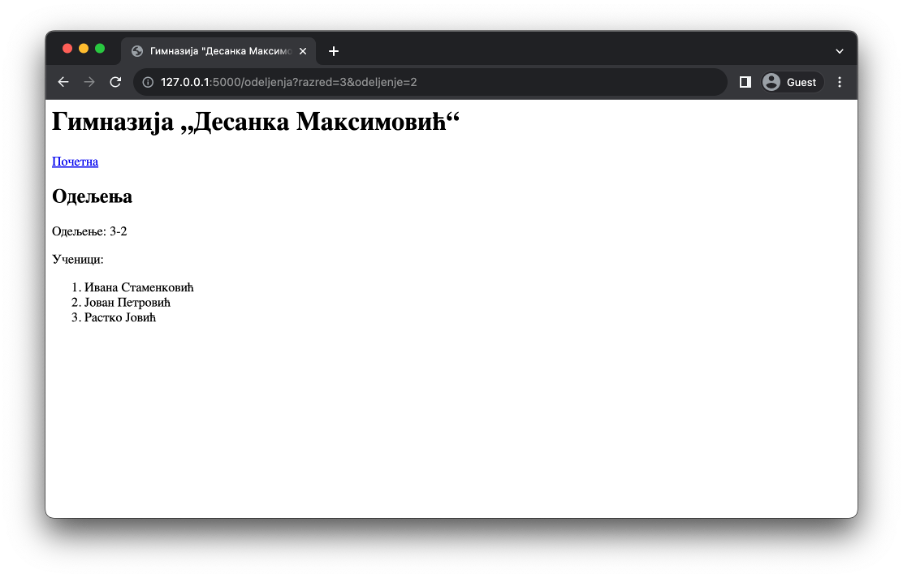
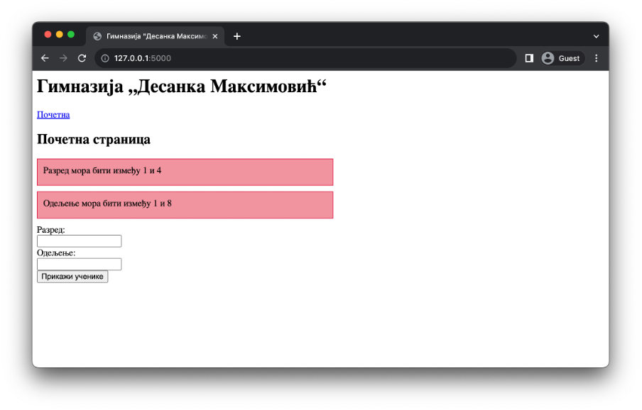
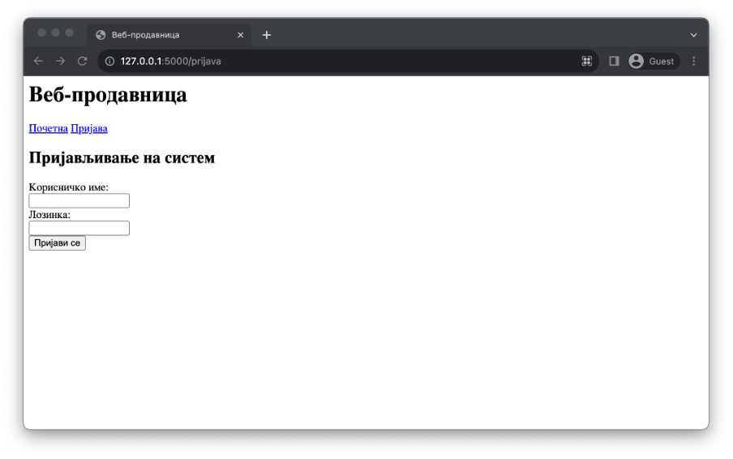
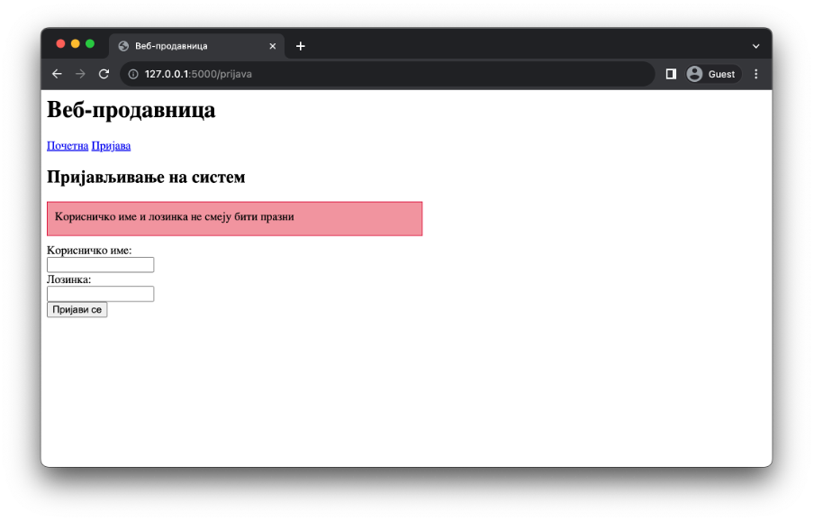
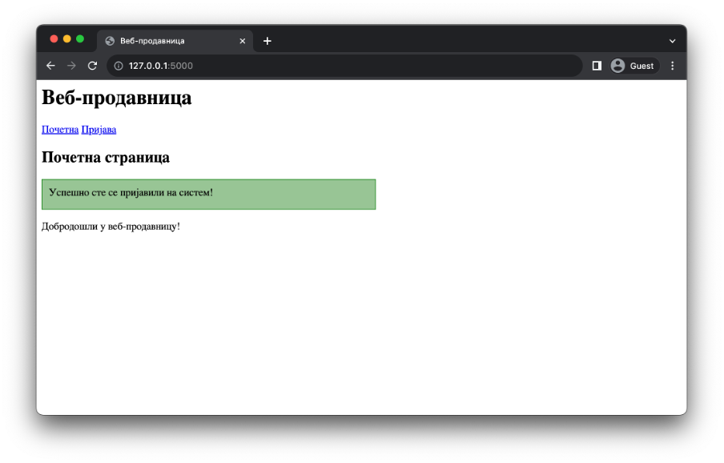

Обрада података
===============

Велики број веб-апликација очекује од корисника да унесу податке како би испунили захтеве. У случају веб-продавника, приликом наручивања производа, корисници уносе податке о адреси за испоруку или податке за плаћање производа. Без тих информација, захтеви не би могли бити испуњени.

Подаци се најчешће достављају серверској веб-апликацији путем формулара. У лекцији о формуларима смо навели да постоје два метода за слање података: GET и POST. Сваки од њих има своје карактеристике којих треба да будеш свестан приликом одлучивања који метод је најпогоднији за слање података. 

Метод GET
_________

Подаци које корисник уноси у формулар се помоћу метода GET шаљу као део URL адресе. Прецизније, подаци се шаљу као параметри (*query parameters*) URL адресе. Да се подсетимо, параметри URL адресе се наводе након знака упитника, при чему се сваки податак записује као пар *ime=vrednost*. Парови су међусобно раздвојени карактером *&*. На пример, URL адреса http://moja-skola.com/?razred=4&odeljenje=1 садржи два податка:

- Први од њих се назива *razred* и има вредност 4.
- Други од њих се назива *odeljenje* и има вредност 1.

У библиотеци Flask је подацима који се прослеђују методом GET могуће приступити кроз објекат *request* који је прво потребно увести из модула flask. Овај објекат садржи поље *аrgs* који представља речник са прослеђеним подацима. Вредностима се прослеђује на основу њиховог имена, на пример: *request.args["razred"]*. Међутим, уколико клијентска веб-апликација	 овај податак не проследи, онда ни речник *request.args* неће садржати име, па ће извршавање резултовати грешком *KeyError*. Уместо тога, препоручује се коришћење функције *request.args.get* која, уколико назив податка не постоји у речнику, може да врати оно што се проследи као други аргумент (ова вредност се сматра подразумеваном вредношћу). Све вредности се прослеђују као ниске (Python тип *str*). Уколико очекујеш вредности неког другог типа, можеш аргументу type проследити класу за коју ће покушати да изврши конверзију (на пример, класу *int* за целобројне вредности).

Наредни пример илуструје коришћење GET метода за обраду података. На почетној страници се налази формулар на којем корисник уноси два податка: разред и одељење. Ове вредности се прослеђују страници *Одељење* која приказује унете податке у свом шаблону, заједно са списком ученика у том одељењу (који је, за сада, фиксиран за све разреде и сва одељења). 

.. code-block:: python

    # Poglavlje5/13/main.py

    from flask import Flask, render_template, request

    app = Flask(__name__)

    @app.route("/")
    def pocetna():
        return render_template("pocetna.html", naslov="Почетна страница")

    @app.route("/odeljenja")
    def odeljenja():
        razred = request.args.get("razred")
        odeljenje = request.args.get("odeljenje")

        return render_template(
            "odeljenja.html",
            naslov="Одељења",
            razred=razred,
            odeljenje=odeljenje,
            ucenici=["Ивана Стаменковић", "Јован Петровић", "Растко Јовић"],
        )

.. code-block:: html

    <!-- Poglavlje5/13/templates/osnovni_sablon.html --!>
    
    <html lang="sr">
        <head>
            <title>Гимназија "Десанка Максимовић"</title>
        </head>
        <body>
            <header>
            <h1 id="glavni-naslov">Гимназија <q>Десанка Максимовић</q></h1>
            <nav>
                <a href="{{url_for('pocetna')}}">Почетна</a>
            </nav>
            </header>

            <h2>{{naslov}}</h2>
            
        
        </body>
    </html>

.. code-block:: html

    <!-- Poglavlje5/13/templates/pocetna.html --!>

    
    
    <form action="{{url_for('odeljenja')}}" method="GET">
        

            <label for="razred">Разред:</label>
             
            <input type="number" name="razred" id="razred">
        

        

            <label for="odeljenje">Одељење:</label>
             
            <input type="number" name="odeljenje" id="odeljenje">
        

        <input type="submit" value="Прикажи ученике">
    </form>
    

.. code-block:: html

    <!-- Poglavlje5/13/templates/odeljenje.html --!> 
    
    
    
    
Одељење: {{razred}}-{{odeljenje}}

    
Ученици:

    <ol>
        
        <li>{{ucenik}}</li>
        
    </ol>
    

Приликом уноса података од корисника се имплицитно очекује да унесу исправне податке. На пример, одељење би требало да буде цели број између 1 и 4, а одељење би могао бити цели број између 1 и 8. Проверу унетих вредности треба извршити и на страни клијента (програмирањем одговарајућих процедура у језику JavaScript), али и на страни сервера.

Наредни пример илуструје како можеш да имплементираш ову проверу у библиотеци Flask. Уколико нека од прослеђених вредности није коректна, можеш искористити функцију *flash* (коју, такође, увозиш из модула *flask*). Ова функција има два параметра:

- Први од њих је текстуална порука која се прослеђује шаблону.
- Други параметар, *category*, представља ниску која одређује категорију поруке. Библиотека Flask препоручује коришћење наредних категорија: *'message'* за поруке опште намене, *'error'* за грешке, *'info'* за информационе поруке и *'warning'* за упозорења. Поред ових, могуће је користити и било које друге категорије. 

Да би могао да позовеш функцију *flash* потребно је да поставиш тзв. тајни кључ на нивоу веб-апликације. О овоме ће бити нешто више речи касније. За сада, довољно је да наведеш наредну линију кода у *main.py* датотеци:

.. code-block:: python3

    app.secret_key = "мој-тајни-кључ"

Прикажимо сада изворни код примера који користи описане функције за приказивање порука кориснику.

.. code-block:: python

    # Poglavlje5/14/main.py

    from flask import Flask, redirect, render_template, request, flash, url_for

    app = Flask(__name__)

    app.secret_key = "мој-тајни-кључ"

    @app.route("/")
    def pocetna():
        return render_template("pocetna.html", naslov="Почетна страница")

    @app.route("/odeljenja")
    def odeljenja():
        greske = False

        razred = request.args.get("razred", type=int)
        odeljenje = request.args.get("odeljenje", type=int)

        if razred < 1 or razred> 4:
            greske = True
            flash("Разред мора бити између 1 и 4", "error")

        if odeljenje < 1 or odeljenje> 8:
            greske = True
            flash("Одељење мора бити између 1 и 8", "error")

        if greske:
            return redirect(url_for("pocetna"))
        else:
            return render_template(
                "odeljenja.html",
                naslov="Одељења",
                razred=razred,
                odeljenje=odeljenje,
                ucenici=["Ивана Стаменковић", "Јован Петровић", "Растко Јовић"],
            )

Сваки позив функције *flash* региструје једну поруку током обраде HTTP захтева. Како би у шаблону дохватио и приказао ове вредности, на располагању ти је функција *get_flashed_messages* која подразумевано враћа листу ниски, тј. списак свих порука. Ово понашање се може додатно подесити помоћу наредна два параметра:

- Први параметар, *with_categories*, ако поставиш на вредност *True*, омогућићеш да ти функција поред поруке врати и категорију којој та порука припада. Другим речима, функција враћа листу уређених парова (*категорија, порука*).
- Други параметар, *category_filter*, представља низ категорија. Ако се наведе, онда ће ти функција вратити само оне поруке које припадају некој од категорија које су наведене у низу.

.. code-block:: html

    <!-- Poglavlje5/14/templates/оsnovni_sablon.html --!>

    <html lang="sr">
        <head>
            <title>Гимназија "Десанка Максимовић"</title>
            <link
                rel="stylesheet"
                type="text/css"
                href="{{url_for('static', filename='stil.css')}}"
            >
        </head>
        <body>
            <header>
            <h1 id="glavni-naslov">Гимназија <q>Десанка Максимовић</q></h1>
            <nav>
                <a href="{{url_for('pocetna')}}">Почетна</a>
            </nav>
            </header>

            <h2>{{naslov}}</h2>

            
                
                    
{{poruka}}

                
            
            
             
        </body>
    </html>

У овом примеру имаш прилику да видиш коришћење још једне Jinja2 директиве. У питању је директива *with* чија је сврха креирање привремених променљивих у шаблону. У коду изнад, директивом *with* дефинишемо блок у оквиру којег ће бити доступна променљива *poruke* која садржи повратну вредност описане функције *get_flashed_messages*, како бисмо тим подацима лакше приступили у шаблону. Основни облик директиве *with* изгледа:

.. code-block:: javascript

    
        ...
    

Прикажимо и остале датотеке из примера.

.. code-block:: html
    
    <!-- Poglavlje5/14/templates/pocetna.html --!>

    
    
    <form action="{{url_for('odeljenja')}}" method="GET">
        

            <label for="razred">Разред:</label>
             
            <input type="number" name="razred" id="razred">
        

        

            <label for="odeljenje">Одељење:</label>
             
            <input type="number" name="odeljenje" id="odeljenje">
        

        <input type="submit" value="Прикажи ученике">
    </form>
    

.. code-block:: html
    
    <!-- Poglavlje5/14/templates/odeljenje.html --!>
    
    
    
    
Одељење: {{razred}}-{{odeljenje}}

    
Ученици:

    <ol>
        
        <li>{{ucenik}}</li>
        
    </ol>
    

.. code-block:: css

    /* Poglavlje5/14/static/stil.css */

    .error {
        background-color: rgba(220, 20, 60, 0.5);
        border: 1px solid crimson;
        height: 25px;
        width: 50%;
        padding: 10px;
        margin: 10px 0;
    }

Покрени овај пример и отвори веб-прегледач на адреси http://127.0.0.1:5000/. За разред унеси вредност 5, за одељење унеси вредност 10, па затим поднеси формулар. С обзиром да су од серверске веб-апликације пристигли неисправни подаци, веб-страница ће приказати исту страницу, али овога пута са порукама, како би корисник знао које вредности треба да исправи.

Одлучили смо да код за приказивање порука наведемо као део шаблона *osnovni_sablon.html* како би све веб-странице које наслеђују овај шаблон могле да користе ову функционалност. Ето још једног примера употребе наслеђивања шаблона.

Подношењем исправних вредности (на пример, за разред унеси 2, а за одељење унеси 3), серверска веб-апликација установљава да нема грешака, па може да прикаже страницу *Одељење*.

Метод POST
__________

Метод GET, који се користи за пренос података преко URL адресе, није увек најбољи избор. Поред тога што су подаци који се преносе јасно видљиви у URL адреси, што представља проблем у случају преноса поверљивих информација (на пример, лозинке), URL адресе су поприлично ограничене у смислу највећег броја карактерима (који износи око 2000). Велики подаци, као и подаци који су осетљиве природе, по правилу се преносе методом POST, који те податке смешта у тело захтева. Додатно, метод GET се по правилу користи за захтеве од којих не очекујемо да дође до промена на серверу (као што су захтеви за читање података), док се метод POST преферира за захтеве који мењају садржај на серверу (на пример, постављање нових података, ажурирање или брисање постојећих података).

Обрада података методом POST је у великој мери налик обради података методом GET, али постоје одређене карактеристике на које треба обратити пажњу. Прво, када користиш декоратор* аpp.route*, подразумевано понашање јесте да URL путања која се наводи у том декоратору одговара само GET методу. Уколико желиш да допустиш да клијент шаље захтев методом POST, потребно је да наведеш вредност за параметар *мethods* тог декоратора. Вредност овог параметра јесте низ метода који веб-апликација допушта да се позове приступна тачка. Другим речима, ако желиш да омогућиш да се нека приступна тачка позива методом POST, потребно је да функцију декоришеш на следећи начин:

.. code-block:: python3

    @app.route("/putanja", methods=["POST"])
    def putanja():
        ...

Подацима који се прослеђују методом POST можеш приступити путем речника *request.form*, слично као што користиш речник *request.args* за податке који се шаљу методом GET.

.. code-block:: python

    # Poglavlje5/15/main.py

    from flask import Flask, render_template, request

    app = Flask(__name__)

    @app.route("/")
    def pocetna():
        return render_template("pocetna.html", naslov="Почетна страница")

    @app.route("/odeljenja", methods=["POST"])
    def odeljenja():
        razred = request.form.get("razred")
        odeljenje = request.form.get("odeljenje")

        return render_template(
            "odeljenja.html",
            naslov="Одељења",
            razred=razred,
            odeljenje=odeljenje,
            ucenici=["Ивана Стаменковић", "Јован Петровић", "Растко Јовић"],
        )

.. code-block:: html

    <!-- Poglavlje5/15/templates/оsnovni_sablon.html --!>
    
    <html lang="sr">
        <head>
            <title>Гимназија "Десанка Максимовић"</title>
        </head>
        <body>
            <header>
            <h1 id="glavni-naslov">Гимназија <q>Десанка Максимовић</q></h1>
            <nav>
                <a href="{{url_for('pocetna')}}">Почетна</a>
            </nav>
            </header>

            <h2>{{naslov}}</h2>
             
        </body>
    </html>

.. code-block:: html

    <!-- Poglavlje5/15/templates/pocetna.html --!>
    
    
    
    <form action="{{url_for('odeljenja')}}" method="POST">
        

            <label for="razred">Разред:</label>
             
            <input type="number" name="razred" id="razred">
        

        

            <label for="odeljenje">Одељење:</label>
             
            <input type="number" name="odeljenje" id="odeljenje">
        

        <input type="submit" value="Прикажи ученике">
    </form>
    

.. code-block:: html

    <!-- Poglavlje5/15/templates/odeljenje.html --!>

    
    
    
Одељење: {{razred}}-{{odeljenje}}

    
Ученици:

    <ol>
        
        <li>{{ucenik}}</li>
        
    </ol>
    

У овом примеру смо дефинисали две руте - једну која се дохвата методом GET за приказивање формулара, а другу која се опслужује методом POST за обраду података из формулара. Оно што је интересантно јесте да на истој путањи можеш да региструјеш више метода. На пример, једна функција се може позвати и за метод GET и за метод POST. Ово можеш урадити навођењем оба метода у аргументу *methods* декоратора *app.route*, на пример, *@app.route("/putanja", methods=["GET", "POST"])*. Код оваквих функција се често проверава о којој врсти захтева је реч, како би се знало која операција треба да се изврши. Ово је могуће урадити провером вредности *request.method* која представља ниску–назив метода који је коришћен за слање захтева. 

Наредни пример илуструје ову технику за обраду формулара за пријављивање на веб-продавницу. У случају да клијент пошаље GET захтев, биће приказан формулар. Формулар на исту адресу шаље POST захтев како би веб-апликација извршила одговарајуће провере унетих података и пријавила корисника на систем. С обзиром да се обе операције односе на пријављивање корисника, има смисла да оба захтева упућујемо на путању */prijava,* само са различитим методима.

.. code-block:: python

    # Poglavlje5/16/main.py

    from flask import Flask, redirect, render_template, request, flash, url_for

    app = Flask(__name__)

    app.secret_key = "мој-тајни-кључ"

    @app.route("/")
    def pocetna():
        return render_template("pocetna.html", naslov="Почетна страница")

    @app.route("/prijava", methods=["GET", "POST"])
    def prijava():
        if request.method == "GET":
            return render_template("prijava.html", naslov="Пријављивање на систем")
        else:
            korisnicko_ime = request.form.get("korisnicko_ime")
            lozinka = request.form.get("lozinka")

            if korisnicko_ime == "" or lozinka == "":
                flash("Корисничко име и лозинка не смеју бити празни", category="error")
                return redirect(url_for("prijava"))

            flash("Успешно сте се пријавили на систем!", category="success")
            return redirect(url_for("pocetna"))

.. code-block:: html

    <!-- Poglavlje5/16/templates/оsnovni_sablon.html --!>

    <html lang="sr">
        <head>
            <title>Веб-продавница</title>
            <link
            rel="stylesheet"
            type="text/css"
            href="{{url_for('static', filename='stil.css')}}"
        >
        </head>
        <body>
            <header>
            <h1 id="glavni-naslov">Веб-продавница</h1>
            <nav>
                <a href="{{url_for('pocetna')}}">Почетна</a>
                <a href="{{url_for('prijava')}}">Пријава</a>
            </nav>
            </header>

            <h2>{{naslov}}</h2>

            
                
                    
{{poruka}}

                
            

             
        </body>
    </html>

.. code-block:: html

    <!-- Poglavlje5/16/templates/pocetna.html --!>
    
    
    
    
Добродошли у веб-продавницу!

    

.. code-block:: html

    <!-- Poglavlje5/16/templates/prijava.html --!>
    
    
    
    <form action="{{url_for('prijava')}}" method="POST">
        

            <label for="korisnicko_ime">Корисничко име:</label>
             
            <input type="text" name="korisnicko_ime" id="korisnicko_ime">
        

        

            <label for="lozinka">Лозинка:</label>
             
            <input type="password" name="lozinka" id="lozinka">
        

        <input type="submit" value="Пријави се">
    </form>
    

.. code-block:: css

    /* Poglavlje5/16/static/stil.css */

    .error {
        background-color: rgba(220, 20, 60, 0.5);
        border: 1px solid crimson;
        height: 25px;
        width: 50%;
        padding: 10px;
        margin: 10px 0;
    }

    .success {
        background-color: rgba(34, 139, 34, 0.5);
        border: 1px solid forestgreen;
        height: 25px;
        width: 50%;
        padding: 10px;
        margin: 10px 0;
    }

Покрени пример и отвори веб-прегледач на адреси http://127.0.0.1:5000/prijava. Веб-прегледач шаље захтев за веб-страницу путем метода GET, што значи да ће веб-апликација приказати формулар за пријављивање.

Приликом подношења формулара, шаље се захтев методом POST на исту URL адресу. Веб-апликација препознаје да је реч о другачијем методу у односу на пређашњи захтев, те приступа обради података (на основу кода из функције *prijava* у датотеци *main.py*). Уколико изоставиш корисничко име или лозинку из формулара, захтев се преусмерава методом GET на исту страницу, чиме се поново приказује формулар (овога пута, са одговарајућом поруком о грешци).

Са друге стране, ако се формулар исправно попуни, захтев се методом GET преусмерава на почетну страницу (уз исписивање поруке о успешности пријављивања).

Обрада података је неизоставан део свих веб-апликација у пракси. Добро познавање карактеристика метода GET и POST, као и различитих техника за обраду података, кључно је за имплементацију веб-апликација које корисницима омогућавају пријатно корисничко искуство.