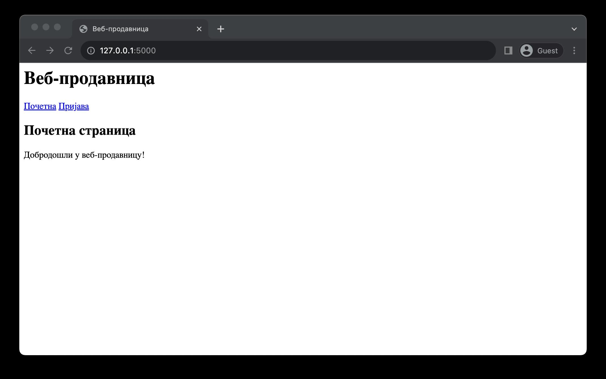
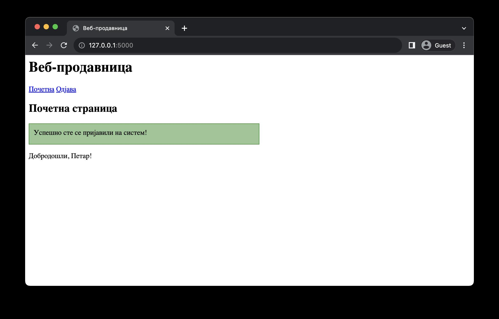
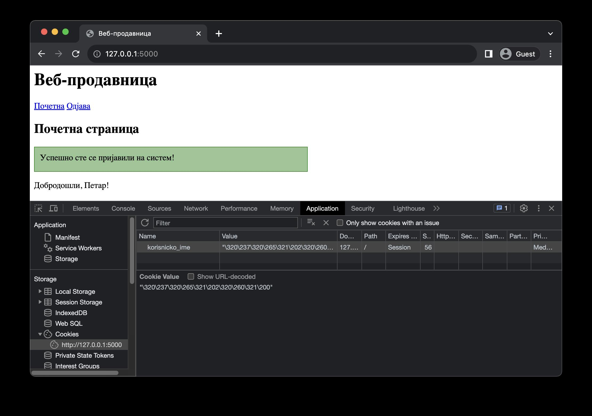
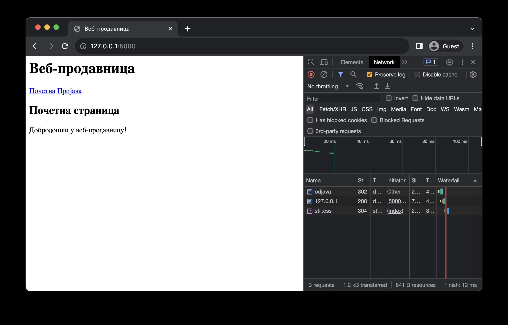
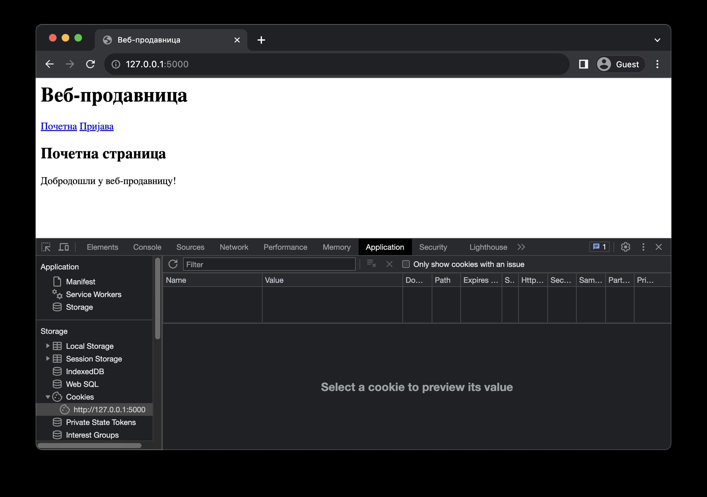

Колачићи
========

Већ знаш да за HTTP протокол кажемо да је без стања (*stateless*) због тога што је сваки пар захтева и одговора независан један од другог. Међутим, некада је потребно одржавати стање током комуникације између клијента и сервера. На пример, након пријављивања на систем, веб-апликација може понудити пријављеном кориснику нове везе у навигацији највишег нивоа. Ове везе, које пре пријављивања нису биле доступне, сервер треба да генерише динамички на основу резултата претходних HТТP захтева.

Колачићи (*cookies*) представљају механизам у којем се подаци од значаја за одржавање стања чувају на страни клијента. О њима треба размишљати као о привременим информацијама који се чувају одређено време, све док им не истекне време важења или док их корисник (или веб-прегледач) не обришу.

У библиотеци Flask колачићи се креирају тако што се прво креира објекат одговора позивом функције *make_response*, која се увози из модула *flask*. Овој функцији се као аргумент прослеђује основни садржај HTTP одговора. То могу бити: ниска која садржи HTTP одговор, резултат позива функције *render_template* или резултат позива функције *redirect*. Над објектом који се добија као повратна вредност функције *make_response* позиваш метод *set_cookie* како би поставио један колачић. Обавезни аргументи овог метода су назив колачића и његова вредност, а карактеристике колачића можеш подесити постављањем додатних параметара. На пример, параметром expires регулишеш када колачић истиче. У функцији у којој желиш да приступиш вредности колачића то можеш урадити путем речника *request.cookies*. 

Наредни пример илуструје како можеш користити колачиће за приказивање различитог садржаја на веб-страницама. 

.. code-block:: python

    # Poglavlje5/17/main.py

    from flask import (
        Flask,
        make_response,
        redirect,
        render_template,
        request,
        flash,
        url_for,
    )

    app = Flask(__name__)

    app.secret_key = "мој-тајни-кључ"

    @app.route("/")
    def pocetna():
        korisnicko_ime = request.cookies.get("korisnicko_ime")

        return render_template(
            "pocetna.html",
            naslov="Почетна страница",
            korisnicko_ime=korisnicko_ime,
        )

    @app.route("/prijava", methods=["GET", "POST"])
    def prijava():
        if request.method == "GET":
            korisnicko_ime = request.cookies.get("korisnicko_ime")
            return render_template(
                "prijava.html",
                naslov="Пријављивање на систем",
                korisnicko_ime=korisnicko_ime,
            )
        else:
            korisnicko_ime = request.form.get("korisnicko_ime")
            lozinka = request.form.get("lozinka")

            if korisnicko_ime == "" or lozinka == "":
                flash("Корисничко име и лозинка не смеју бити празни", category="error")
                return redirect(url_for("prijava"))

            flash("Успешно сте се пријавили на систем!", category="success")

            odgovor = make_response(redirect(url_for("pocetna")))
            odgovor.set_cookie("korisnicko_ime", korisnicko_ime)
            return odgovor

    @app.route("/odjava")
    def odjava():
        odgovor = make_response(redirect(url_for("pocetna")))
        odgovor.set_cookie("korisnicko_ime", "", expires=0)
        return odgovor

.. code-block:: html

    <!-- Poglavlje5/17/templates/оsnovni_sablon.html --!>
    
    <html lang="sr">
        <head>
            <title>Веб-продавница</title>
            <link
            rel="stylesheet"
            type="text/css"
            href="{{url_for('static', filename='stil.css')}}"
        >
        </head>
        <body>
            <header>
            <h1 id="glavni-naslov">Веб-продавница</h1>
            <nav>
                <a href="{{url_for('pocetna')}}">Почетна</a>
                
                <a href="{{url_for('odjava')}}">Одјава</a>
                
                <a href="{{url_for('prijava')}}">Пријава</a>
                
            </nav>
            </header>

            <h2>{{naslov}}</h2>

            
        
            
{{poruka}}

            
    
    
    
        </body>
    </html>

.. code-block:: html

    <!-- Poglavlje5/17/templates/pocetna.html --!>
    
    
    
    
    
Добродошли, {{korisnicko_ime}}!

    
    
Добродошли у веб-продавницу!

    
    

.. code-block:: html

    <!-- Poglavlje5/17/templates/prijava.html --!>

    
    
    <form action="{{url_for('prijava')}}" method="POST">
        

            <label for="korisnicko_ime">Корисничко име:</label>
             
            <input type="text" name="korisnicko_ime" id="korisnicko_ime">
        

        

            <label for="lozinka">Лозинка:</label>
             
            <input type="password" name="lozinka" id="lozinka">
        

        <input type="submit" value="Пријави се">
    </form>
    

.. code-block:: css

    /* Poglavlje5/17/static/stil.css */

    .error {
        background-color: rgba(220, 20, 60, 0.5);
        border: 1px solid crimson;
        height: 25px;
        width: 50%;
        padding: 10px;
        margin: 10px 0;
    }

    .success {
        background-color: rgba(34, 139, 34, 0.5);
        border: 1px solid forestgreen;
        height: 25px;
        width: 50%;
        padding: 10px;
        margin: 10px 0;
    }

Почетна страница на кореној путањи приказује добродошлицу општег карактера уколико корисник није пријављен (у оквиру шаблона *pocetna.html*). Страница за пријављивање на путањи */prijava* приказује формулар за пријављивање из шаблона *prijava.html* (у случају метода GET), односно обрађује захтев за пријављивање (у случају метода POST). 

Приликом успешног пријављивања, информација о кориснику се памти у колачићу, а захтев се преусмерава на почетну страницу. Овога пута, приликом позива функције *pocetna*, колачић се налази у речнику *request.cookies*, те почетна страница приказује персонализовану поруку добродошлице пријављеном кориснику.

Колачиће можеш прегледати у оквиру језичка ”Application” алата за развој у оквиру веб-прегледача. Одабиром URL адресе испод ”Cookies” из леве навигације језичка приказаће ти се сви колачићи које је веб-апликација поставила, заједно са свим њиховим карактеристикама.

.. infonote::

   **Напомена:** Ћирилична слова се сматрају нестандардним карактерима, те због тога текст ”Петар” видиш записано као кодиране карактере ”\320\237\320\265\321\202\320\260\321\200”. Сваки карактер је представљен двојком кодираних карактера. Тако, на пример, карактер ”П” се записује помоћу двојке ”\320\237”.

Примети да се навигација највишег нивоа такође мења у зависности од тога да ли је корисник пријављен или не. Уколико корисник није пријављен, приказује се веза ка страници за пријављивање. У супротном, приказује се веза ка страници за одјављивање. Код за ово можеш пронаћи у шаблону *osnovni_sablon.html*. 

Приликом посећивања странице за одјављивање, потребно је очистити колачиће, чиме се ефективно поништава тренутно стање. У библиотеци Flask не постоји посебна функција за брисање колачића. Уместо тога, колачиће чистиш позивом функције *set_cookie*, с тиме да за вредност параметра *expires* постављаш вредност 0, чиме се ефективно поставља колачић који одмах истиче. Након брисања колачића, веб-апликација преусмерава захтев на почетну страницу. Како би ово испратио, пожељно је да отвориш језичак ”Network” у алатима за развој и означиш опцију ”Preserve log”.

Након одјављивања, колачић *korisnicko_ime* се више не налази у веб-прегледачу, што је јасно видљиво у језичку ”Application”.

