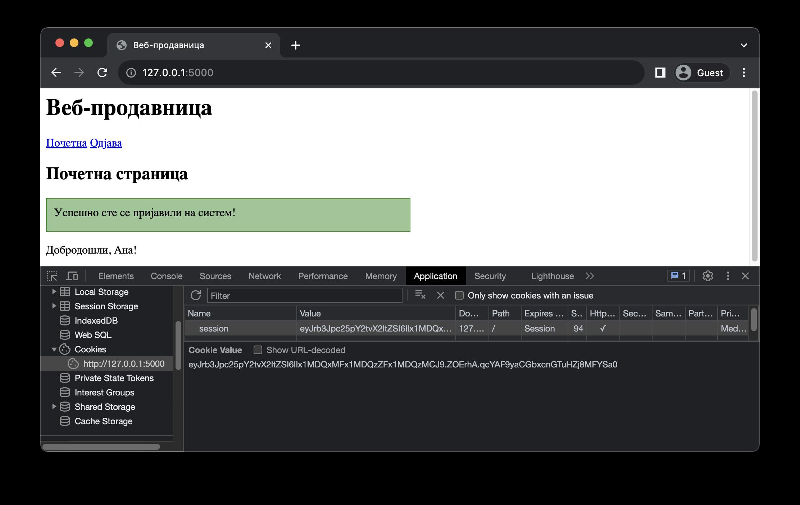
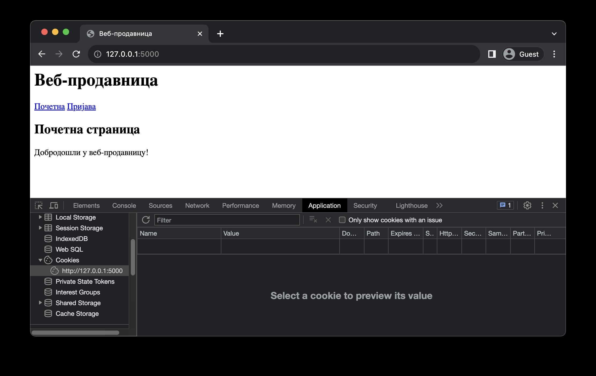

Сесије
======

Колачићи су користан алат за одржавање стања у ситуацијама када корисници користе само једног клијента за приступање веб-апликацији. Узмимо за пример веб-продавницу у којој је потребно чувати садржај корисничке корпе између HTTP захтева (тј. док корисник разгледа производе из каталога). Уколико је веб-продавница намењена да се користи само преко веб-прегледача, садржај корпе је могуће сачувати у колачићу тог веб-прегледача. Са друге стране, уколико корисник одлучи да посети веб-продавницу преко мобилног уређаја (било преко мобилног веб-прегледача или неке мобилне апликације), на том уређају садржај његове корпе биће празан. Штавише, ако корисник посети веб-продавницу на истом уређају, али преко неког другог веб-прегледача, и у том веб-прегледачу ће садржај корпе бити празан. Ово је озбиљно ограничење колачића.

Како би се ово ограничење превазишло, податке је, уместо чувања на страни клијента, могуће чувати на страни сервера. Тако настају сесије (*session*). Механизам сесија се углавном користи за праћење стања које пријављени корисници креирају извршавањем акција у оквиру веб-апликације. 

Сесије функционишу по принципу колачића. Када се корисник пријави на систем, у позадини се креира сесија (на страни сервера) и клијенту се шаље посебан колачић који се назива колачић сесије (*session cookie*). Вредност овог колачића је обично ниска која на јединствен начин идентификује сесију. Када пријављени корисник приступа садржају веб-апликације, клијент уз HTTP захтев шаље и колачић сесије. Серверска веб-апликација на основу њега препознаје о којој се сесији ради и у њој проналази податке који су уписани акцијама корисника. Погодност овог механизма јесте што библиотеке сакривају детаље имплементације, те програмери не морају да воде рачуна о њима.

Прикажимо како сесије функционишу у библиотеци Flask на наредном примеру, који је по функционалностима идентичан претходном, са разликом да овога пута користимо сесије уместо колачића (на непосредан начин) за одржавање стања.

::

    Poglavlje5/18/main.py
    Poglavlje5/18/templates/оsnovni_sablon.html
    Poglavlje5/18/templates/pocetna.html
    Poglavlje5/18/templates/prijava.html

Подаци из сесије су у библиотеци Flask доступни кроз речник *session*, који увозиш из модула *flask*. Почетна страна поново приказује поруку добродошлице, али овога пута се корисничко име потражује у речнику *session*. Као и у случају колачића, овај податак се прослеђује шаблону pocetna.html, која ће приказати одговарајућу поруку.

Пријављивање корисника на систем се врши у функцији *prijava* и, овога пута, како бисмо запамтили корисничко име у сесији, додајемо нови кључ "*korisnicko_ime*" у речник *session*, а његову вредност постављамо на корисничко име које је корисник проследио путем формулара. Након успешног пријављивања, у језичку ”Application” можеш да осмотриш колачић сесије који је серверска веб-апликација послала веб-прегледачу.

Функција *odjava* чисти сесију тако што брише кључ "*korisnicko_ime*" из речника *session* позивом функције *pop* и након тога се захтев преусмерава на почетну страну. Након успешног одјављивања, колачић сесије је обрисан из веб-прегледача.

Нисмо навели још једну важну ствар коју мораш да подесиш како би уопште могао да користиш сесије у својим веб-апликацијама. Да би могао да користиш речник session, апликација мора имати постављен тајни кључ (слично као што смо то радили приликом коришћења функције *flash*), који се поставља као вредност *app.secret_key*. Тајни кључ се користи за шифровање података који се чувају у сесији и колачића који се шаљу клијенту. Због тога, ова вредност не сме бити јавна. Један начин да се креирају добри тајни кључеви јесте да извршиш наредни код у Python интерпретеру:

.. code-block:: python3

    import os
    os.urandom(24)

Излаз може изгледати овако:

::
    
    b'\x16\xd3sT\x97\xa6\xf7\x84\xcbj+\x81\xf8{Y\xa1p:\xca\x11\xf6j\xb6'

За потребе развоја апликације, резултат можеш записати директно у main.py датотеци на следећи начин:

.. code-block:: python3

    app = Flask(__name__)
    app.secret_key = b'\x16\xd3sT\x97\xa6\xf7\x84\xcbj+\x81\xf8{Y\xa1p:\xca\x11(\xf6j\xb6'

У пракси, ова вредност се не записује на овај начин, с обзиром да се код обично складишти у неком од система за верзионисање кода, као што је *GitHub*, што се сматра лошом праксом. Један начин да се ово превазиђе јесте да се вредност тајног кључа упише у променљиву окружења (*environment variable*) оперативног система на којем се серверска веб-апликација покренута, па да се та вредност прочита у Python коду.

Колачићи и сесије представљају сјајне механизме за имплементацију одржавања стања између HTTP захтева. Овладај ових механизмима и бићеш у стању да имплементираш чак и најсложеније веб-апликације.
