Релационе базе података и алат phpMyAdmin
=========================================

Велики број веб-апликација у пракси оперише над неким подацима. Било да ли су у питању подаци о производима који се продају у веб-продавници, информације о рачунима и новчаним трансакцијама у онлајн банкарским системима или објаве и коментари на друштвеним мрежама, веб-апликације ове податке морају да трајно складиште на серверима како би корисницима омогућили сервисе које нуде. Како би ово оствариле, веб-апликације комуницирају са системима за управљање базама података (скраћено пишемо СУБП) како би ове податке смештале у базе података. Традиционално се за ове потребе користе релационе базе података, са којима си се сусрео у трећем разреду. Платформа Петља има и курс посвећен релационим базама података које можеш пронаћи на адреси https://petlja.org/kurs/7963. 

У склопу овог курса, приказаћемо како можеш повезати серверску веб-апликацију програмирану помоћу библиотеке Flask и систем за управљање базама података MySQL. Приликом инсталације XAMPP софтверског пакета, на твом систему је инсталиран овај СУБП. Како би га покренуо, довољно је да покренеш XAMPP алат и да у језичку посвећеном серверима покренеш MySQL Database сервер. Уједно, покрени и Apache Web Server. Иако нећемо користити веб-сервер за потребе опслуживања садржаја (као што смо то радили у претходним темама), користићемо још један алат који долази уз XAMPP, а који ће нам помоћи да управљамо базама података.

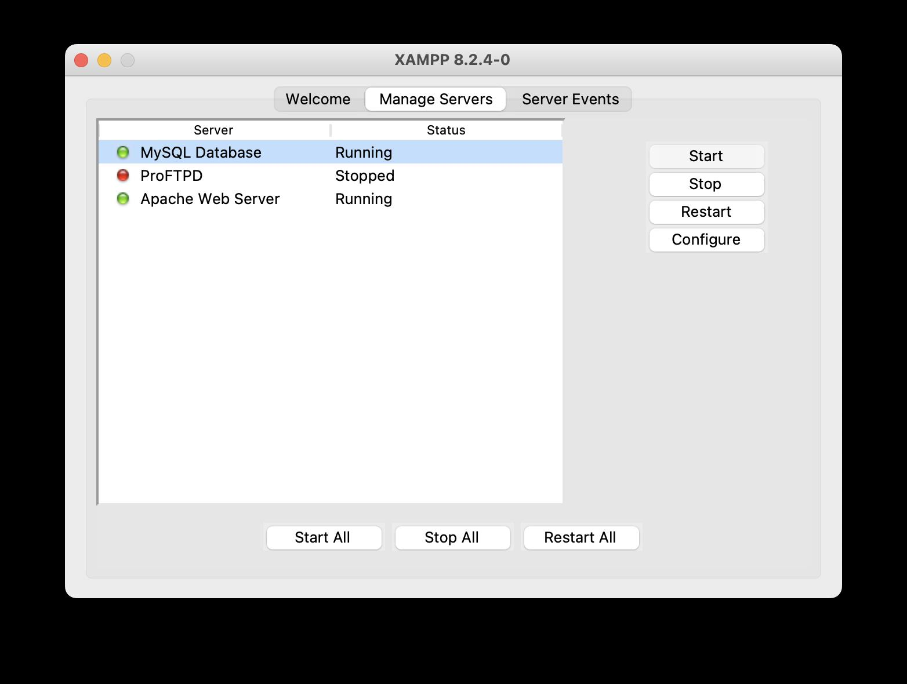

Припрема окружења
_________________

Пре него што се упознаш са управљањем базама података у MySQL СУБП, потребно је да инсталираш Python модул који ће ти омогућити да се повежеш на СУБП из Flask веб-апликације. Отвори терминал и позиционирај се у директоријум *Poglavlje5*. Затим, активирај окружење у којем си инсталирао библиотеку Flask. На пример:

::

    source .venv/bin/activate

Сада можеш да инсталираш модул за конекцију на MySQL СУБП из Python апликација:

::

    pip install mysql-connector-python

Испис који добијаш у терминалу би требало да личи на наредну слику.

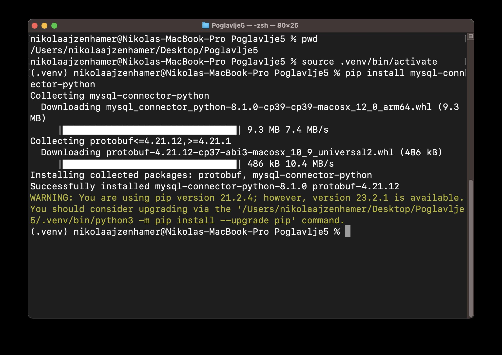

Као и за библиотеку Flask, инсталирање овог модула се врши само једном. Сваки следећи пут је довољно да покренеш окружење и можеш покренути веб-апликацију. Документација за библиотеку mysql-connector-python се налази на адреси https://dev.mysql.com/doc/connector-python/en/. 

Коришћење алата phpMyAdmin
__________________________

Apache Web Server из XAMPP софтверског пакета долази са алатом који ти омогућава да приступиш информацијама из MySQL СУБП. Помоћу овог алата можеш да креираш базе података, подешаваш табеле, управљаш подацима, итд. У питању је алат *phpMyAdmin* који је доступан на URL адреси http://localhost/phpmyadmin/.

Напомена: Уколико ти веб-прегледач прикаже поруку да не може да пронађе веб-апликацију на тој адреси. Провери да ли су оба сервера Apache Web Server и MySQL Database у алату XAMPP покренути.

.. infonote::

    **Напомена:** Званична веб-презентација алата *phpMyAdmin* доступна је на адреси https://www.phpmyadmin.net/. 

Након приступања, алат изгледа као на наредној слици.

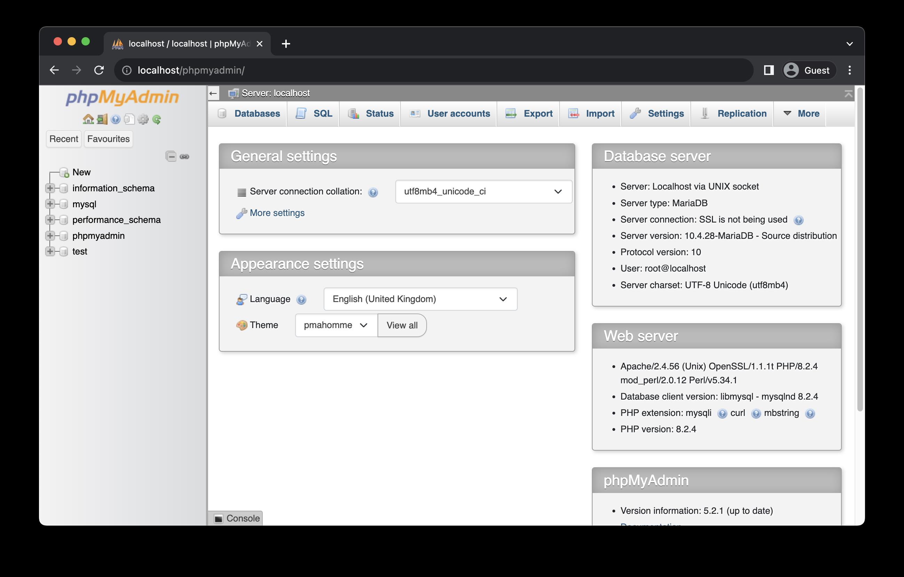

Креирање једноставне релационе базе података
____________________________________________

Да би креирао нову базу података, у левој навигацији алата *phpMyAdmin* одабери дугме *New*. У прозору који се отворио унеси назив базе података *mysql_vezbanje* и одабери дугме *Create*.

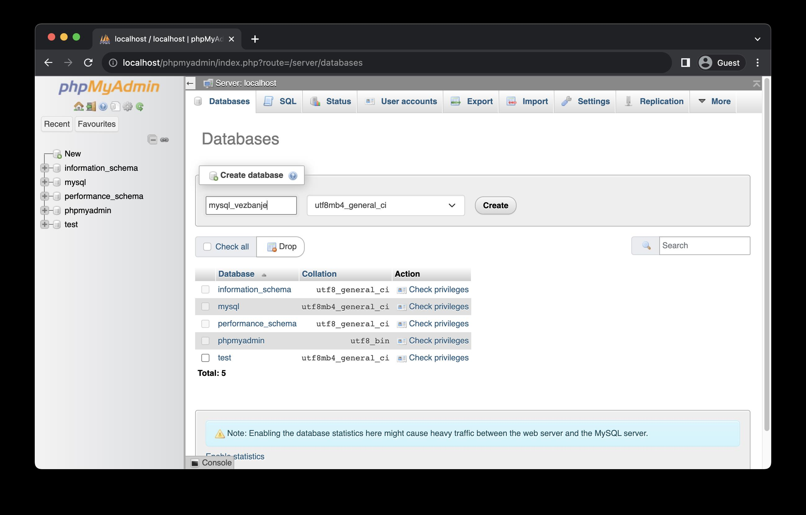

Након тога, отвориће ти се нови прозор за креирање прве табеле. Унеси назив табеле *korisnici* и број колона 5. Одабери дугме *Create*.

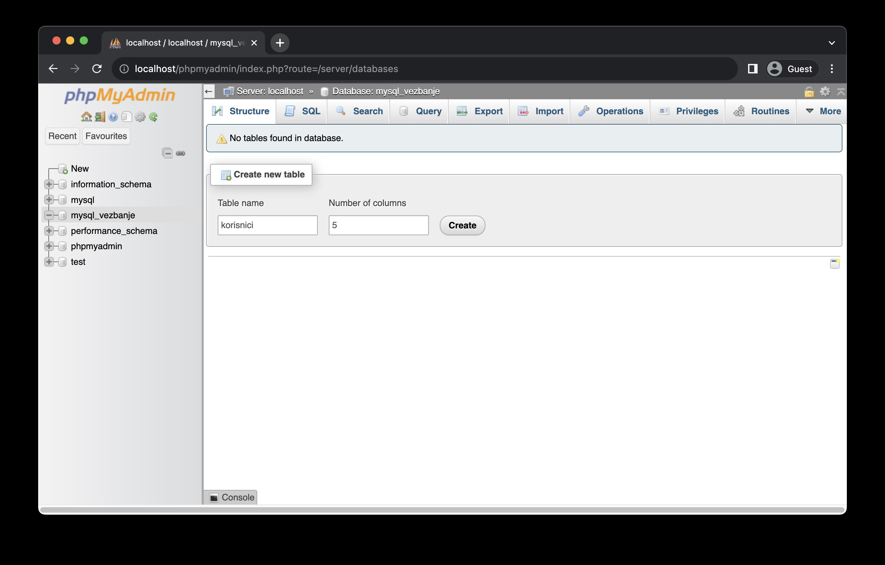

Табела* korisnici* треба да садржи наредне колоне:

- *id_korisnika*: идентификатор који јединствено одређује корисника у бази.
- *ime*: име корисника.
- *prezime*: презиме корисника.
- *korisnicko_ime*: име које ће корисник користити за пријављивање на систем.
- *lozinka*: шифрована лозинка за пријављивање на систем.

Наредна слика приказује како треба попунити прозор са колонама нове табеле. Обрати пажњу на наредне информације: 

- *Name*: назив колоне.
- *Type*: тип вредности које колона садржи.
- *Length/Values*: дужина типа (на пример, број карактера за тип *VARCHAR*).
- *Default*: подразумевана вредност.
- *Null*: ако је ова опција означена, вредност ове колоне може бити *NULL*.
- *Index*: служи за дефинисање индекса табеле, али и за дефинисање колона које улазе у састав примарног кључа табеле. Тако, на пример, колона *id_korisnika* представља примарни кључ табеле *korisnici*, па је потребно да поставиш вредност информације Index за ту колону на PRIMARY.
- *A_I* (*AUTO_INCREMENT*): ако је ова опција означена, СУБП ће аутоматски увећавати вредност ове колоне.

Када попуниш све информације, одабери дугме *Save*.

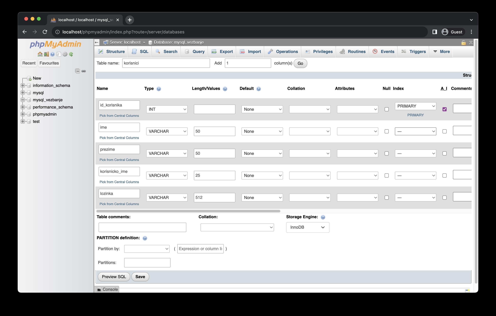

Након успешног креирања табеле, приказаће се прозор са информацијама о креираној табели.

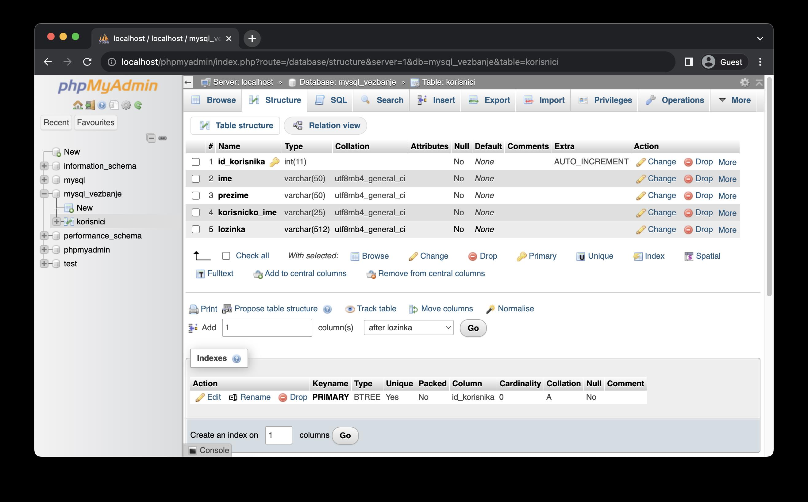

У овом прозору можеш пронаћи велики број језичака путем којих можеш управљати табелом која је тренутно одабрана. У левој навигацији можеш пратити која је табела тренутно одабрана. Језичак *Browse* служи за преглед података који се налазе у табели. Језичак *Structure* садржи опис табеле. У језичку *SQL* можеш извршавати произвољне SQL наредбе везане за табелу. У језичку *Insert* можеш уносити нове податке попуњавањем формулара. Језичак *Export* служи за извожење података из табеле, док језичак *Import* служи за увоз података у табели.

Пробај да унесеш информације о новим корисницима. За почетак, отвори језичак *Insert*. У формулару унеси податке из наредне табеле, па одабери дугме *Go*.

+----------------+-----------------------------------------------------------------+
| ime            | Милица                                                          |
+----------------+-----------------------------------------------------------------+
| prezime        | Јовановић                                                       |
+----------------+-----------------------------------------------------------------+
| korisnicko_ime | milicaj                                                         |
+----------------+-----------------------------------------------------------------+
| lozinka        | b'$2b$12$pZsodwqT96YTgQn2qO7d1.myl3ngf/lzHOmc7KyrSApzRkK/Clsmm' |
+----------------+-----------------------------------------------------------------+

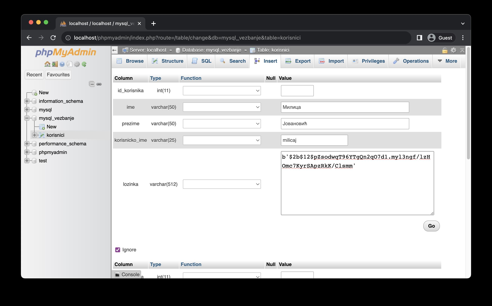

.. infonote::

    **Напомена:** Лозинка коју видиш није заиста лозинка коју би корисник унео у систем, већ представља њену шифровану верзију алгоритмом шифровања који се назива *bcrypt*. У наредним лекцијама ће бити више речи о овом алгоритму и како се шифровање (као и провера лозинке) имплементира у Python апликацијама. За сада, довољно је да запамтиш да се у базама података поверљиве информације никада не чувају у изворном облику, већ да их је увек потребно шифровати. Узгред, лозинка чију шифровану верзију видиш је ”1234”, што се такође сматра лошом праксом, али за потребе развоја наших једноставних веб-апликација биће сасвим допустиво.

Одабери сада језичак *Browse*. Приметићеш да табела садржи ред са унетим информацијама. Примети такође да нисмо унели вредност за идентификатор корисника, али СУБП је знао да треба да унесе вредност због укључене опције *AUTO_INCREMENT* приликом дефинисања табеле.

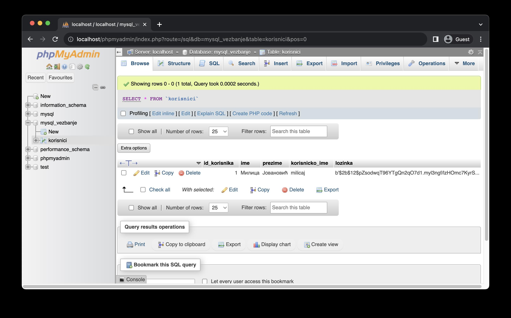

Унеси још једног корисника, овога пута путем језичка *SQL*. Унеси наредни *SQL* код и одабери дугме *Go*.

.. code-block::

    INSERT INTO `korisnici`(`ime`, `prezime`, `korisnicko_ime`, `lozinka`) 
    VALUES (
        'Петар',
        'Илић',
        'petari',
        'b\'$2b$12$PMcguTg6oiNZr9Vkaz/dAehhBdBNEzruGqRwqV2SuLCBWrp7MmQN6\''
    )

У истом језичку унеси наредни SQL код и одабери дугме *Go*. 

:: 

    SELECT * FROM `korisnici`

У резултату* SELECT* упита приметићеш да се налазе два реда.

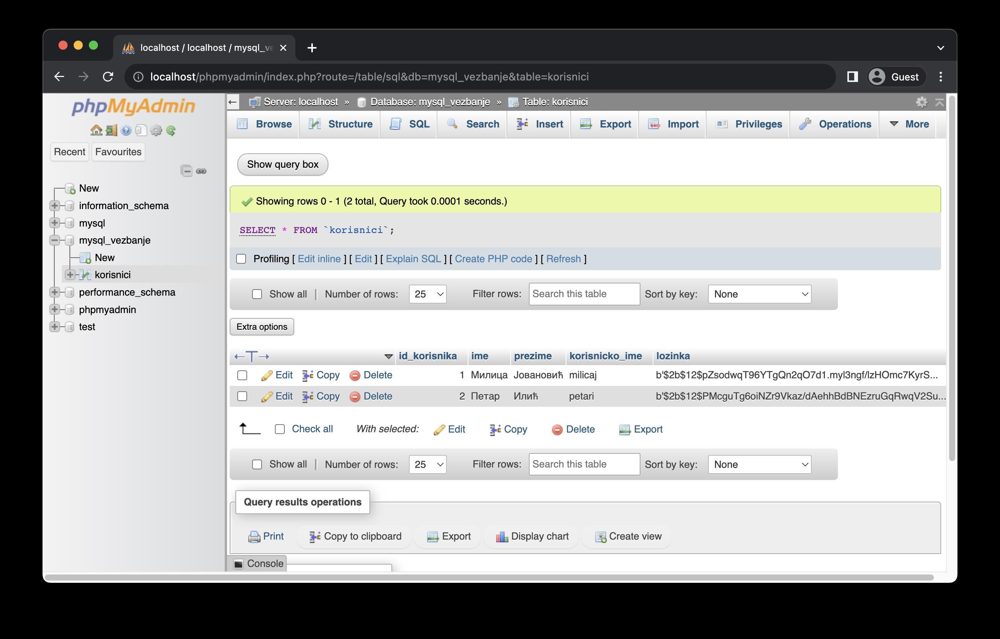

*phpMyAdmin* представља веома користан алат за управљање MySQL релационим базама података. Како би се што боље упознао са њиме, саветујемо ти да самостално истражиш и друге функционалности алата, као што су: креирање табела различите структуре, постављање страних кључева, измена и брисање података итд.

Уколико у било ком тренутку желиш да вратиш стање базе података *mysql_vezbanje* на првобитно стање, прво је потребно да је обришеш, па да је поново креираш помоћу скрипта. То можеш урадити тако што прво одабереш базу података *mysql_vezbanje* из леве навигације, затим отвориш језичак *Operations* и у секцији *Remove database* одабереш опцију *Drop the database (DROP)*. У прозору који ће ти се појавити, као на наредној слици, одабери дугме OK.

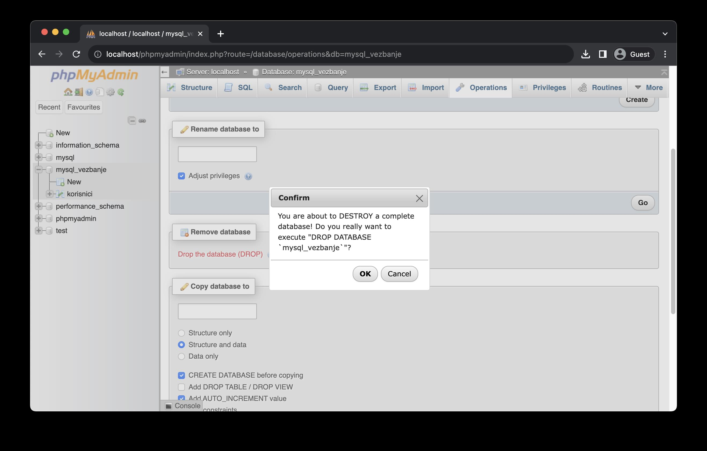

Након успешног брисања, отвориће ти се прозор *Databases*, као на наредној слици.

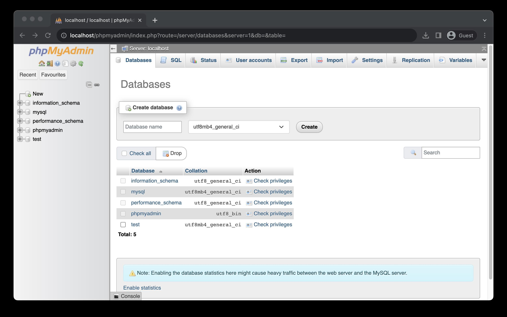

Сада можеш да креираш базу података. Прво преузми датотеку са наредне везе **UNETI VEZU** *mysql_vezbanje.sql* и сачувај је на систему датотека (на пример, у директоријуму *Desktop* или *Downloads*). Одабери језичак *Import*. У секцији *File to import*, одабери *Choose file* и пронађи датотеку *mysql_vezbanje.sql*. На дну странице одабери дугме *Import*.

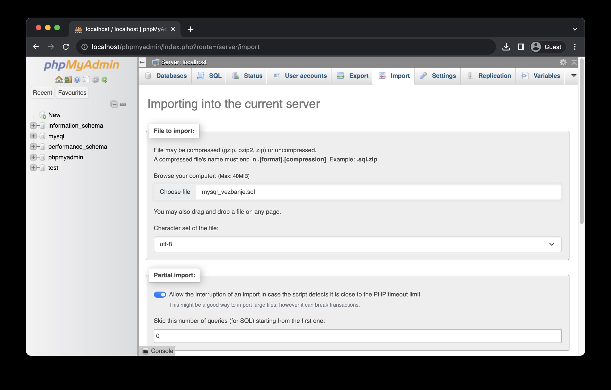

Након успешног увожења, добићеш потврдну поруку и у левој навигацији ће се појавити база података *mysql_vezbanje*.

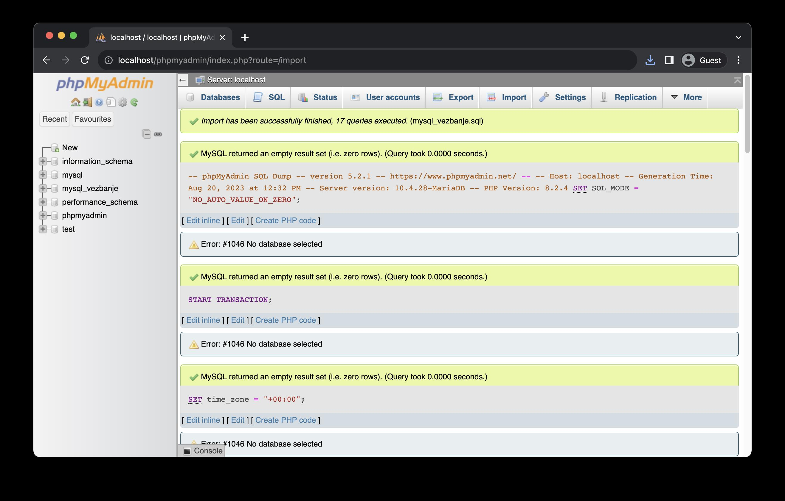