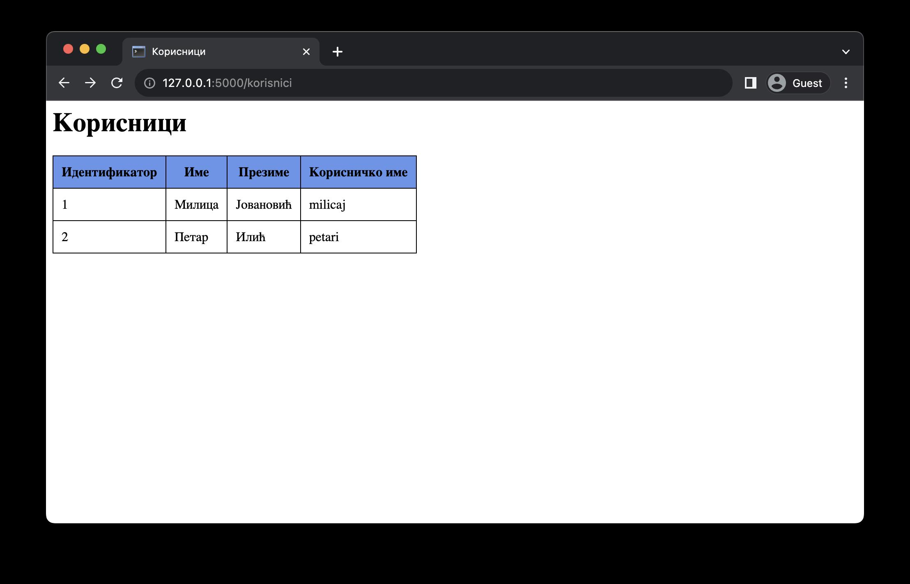
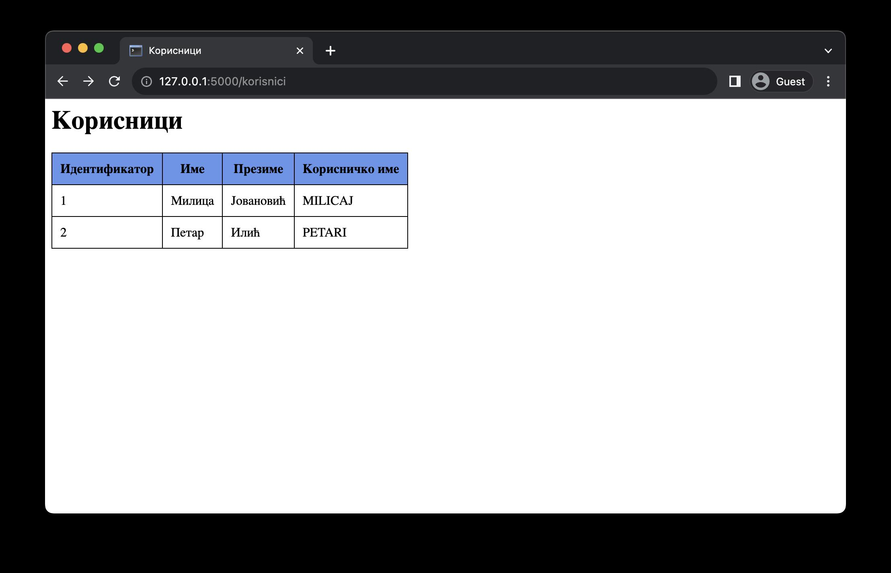
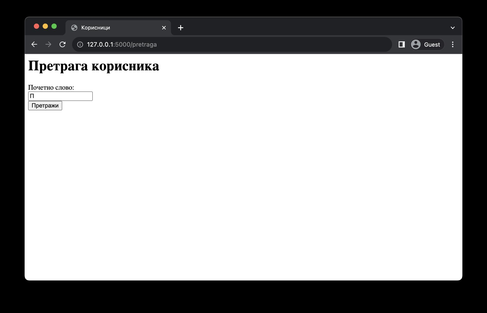
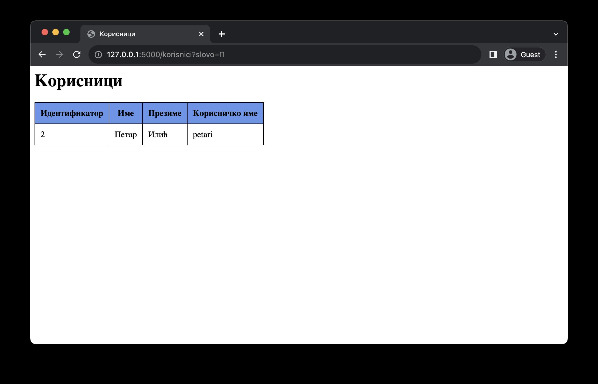

Постављање упита
================

Прву операцију коју ћеш видети јесте постављање упита за претраживање и дохватање података из базе. Као што ти је већ познато, постављање упита СУБП врши се SQL наредбом *SELECT*. Резултат извршавања ове наредбе у СУБП јесте табела, коју можеш разумети и као листу редова.

Да би поставио упит из Python апликације, прво је потребно да направиш тзв. курсор (*cursor*). Курсори представљају објекте у базама података помоћу којих можеш извршавати операције, пре свега за читање података, али и неке друге. У овој лекцији ћеш научити како се користи курсор за читање података.

Курсор се креира тако што над *MySQLConnection* објектом позовеш метод *cursor*.

.. code-block:: python3

    import mysql.connector

    mydb = mysql.connector.connect(
        # ...
    )

    kursor = mydb.cursor()

Након што направиш курсор, потребно је да напишеш SQL наредбу *SELECT* којом ћеш претражити информације из базе података. SQL наредба се једноставно записује као Python ниска. Овакву ниску прослеђујеш методу *execute* над курсором, чиме се операција извршава над базом података.

.. code-block:: python3

    upit = "SELECT ime, prezime FROM korisnici"

    kursor.execute(upit)

У општем случају не можеш предвидети колико редова ће СУБП вратити као одговор на неки упит. То може бити 0, 1 или више редова. Због тога, важно је да разумеш различите начине на које можеш обрадити податке помоћу курсора. Први од њих је најједноставнији и подразумева да дохватиш све редове из резултујуће табеле одједном. За ово користиш метод *fetchall* над курсором. Повратна вредност овог метода је листа торки, при чему свака торка представља један ред у табели. Редослед елемената торке одговара редоследу колона у наредби *SELECT*.

.. code-block:: python3

    korisnici = kursor.fetchall()

    for korisnik in korisnici:
        ime = korisnik[0]
        prezime = korisnik[1]

        # ...

Као што видиш, програмирање са торкама не производи читљив код. Такође, ако промениш редослед колона у наредби *SELECT*, а заборавиш да адаптираш код изнад, произвешћеш грешку коју можда није лако пронаћи. Због тога, много је пожељније користити речнике уместо торки. Ако желиш да ти СУБП врати резултат у виду речника уместо торки, потребно је да то назначиш приликом креирања курсора навођењем параметра *dictionary=True*.

.. code-block:: python3

    kursor = mydb.cursor(dictionary=True)

    upit = "SELECT ime, prezime FROM korisnici"
    kursor.execute(upit)
    korisnici = kursor.fetchall()

    for korisnik in korisnici:
        ime = korisnik["ime"]
        prezime = korisnik["prezime"]

        # ...

Сада, чак и ако промениш редослед колона, код ће радити исправно.

.. infonote::

    **Напомена:** Ако су речници погоднији за рад, зашто су се аутори библиотеке mysql-connector-python одлучили да подразумевано користе торке? Одговор је у томе да програм који ради са торкама има боље перформансе од програма који ради са речницима. С обзиром да су ове разлике у перформансама осетне тек када се ради са стотинама хиљада података, наше веб-апликације ће достизати практично идентичне брзине рада без обзира на структуру података коју користимо, али ће код који користи речнике бити читљиви и лакши за одржавање.

Наредни пример представља веб-апликацију која дохвата информације о свим корисницима из базе података *mysql_vezbanje* и приказује их у виду табеле.

.. code-block:: python

    # Poglavlje5/20/db.py

    import mysql.connector

    mydb = mysql.connector.connect(
        host="localhost", user="root", password="", database="mysql_vezbanje"
    )

.. code-block:: python

    # Poglavlje5/20/main.py

    from flask import Flask, render_template
    from db import mydb

    app = Flask(__name__)

    @app.route("/korisnici")
    def korisnici():
        kursor = mydb.cursor(dictionary=True)
        upit = "SELECT id_korisnika, ime, prezime, korisnicko_ime FROM korisnici"

        kursor.execute(upit)
        korisnici = kursor.fetchall()

        return render_template("korisnici.html", korisnici=korisnici)

    

Поред дохватања свих података одједном, постоји начин да курсор користиш као итератор, односно, да дохваташ један по један ред. Овај приступ је користан уколико обрађујеш велике количине података које не могу све одједном да стану у меморију. Следи пример кода који користи курсор као итератор.

.. code-block:: python3

    kursor = mydb.cursor(dictionary=True)

    upit = "SELECT ..."
    kursor.execute(upit)

    for korisnik in kursor:
        # ...

Наредни пример представља допуну претходног примера у којем се, приликом дохватања података из курсора-итератора, уједно врши трансформација корисничких имена у велика слова.

.. code-block:: python

    # Poglavlje5/21/db.py

    import mysql.connector

    mydb = mysql.connector.connect(
        host="localhost", user="root", password="", database="mysql_vezbanje"
    )

.. code-block:: python

    # Poglavlje5/21/main.py

    from flask import Flask, render_template
    from db import mydb

    app = Flask(__name__)

    @app.route("/korisnici")
    def korisnici():
        kursor = mydb.cursor(dictionary=True)
        upit = "SELECT id_korisnika, ime, prezime, korisnicko_ime FROM korisnici"
        korisnici = []

        kursor.execute(upit)
        for korisnik in kursor:
            korisnik["korisnicko_ime"] = korisnik["korisnicko_ime"].upper()
            korisnici.append(korisnik)

        return render_template("korisnici.html", korisnici=korisnici)

.. code-block:: html

    <!-- Poglavlje5/21/korisnici.html --!>

    <html lang="sr">
        <head>
            <title>Корисници</title>
            <link
            rel="stylesheet"
            type="text/css"
            href="{{url_for('static', filename='stil.css')}}"
        >
        </head>
        <body>
            <h1>Корисници</h1>

            
            <table>
            <tr>
                <th>Идентификатор</th>
                <th>Име</th>
                <th>Презиме</th>
                <th>Корисничко име</th>
            </tr>
            
            <tr>
                <td>{{korisnik["id_korisnika"]}}</td>
                <td>{{korisnik["ime"]}}</td>
                <td>{{korisnik["prezime"]}}</td>
                <td>{{korisnik["korisnicko_ime"]}}</td>
            </tr>
            
    
            
Нема корисника у систему.

            
            </table>
        </body>
    </html>

Постоји још један начин за дохватање података у случају када смо сигурно да резултујућа табела има највише један ред (на пример, када се дохвата податак на основу примарног кључа или колоне која је подешена клаузулом *UNIQUE*). Метод курсора који се може користити у оваквим ситуацијама јесте *fetchone* који ће или дохватити ред или вратити Python вредност *None* уколико је резултујућа табела празна. Следи пример кода који дохвата један ред из курсора.

.. code-block::

    kursor = mydb.cursor(dictionary=True)

    upit = "SELECT ... FROM ... WHERE id = 1"
    kursor.execute(upit)

    korisnik = kursor.fetchone()
    # ...

Параметри упита
________________

Упити у практичним применама често немају све информације унапред познате. На пример, приликом имплементирања претраживања производа по категоријама у веб-продавници, ти не знаш унапред коју категорију ће корисник одабрати током развоја апликације, те не можеш ни да напишеш фиксни упит унапред.

У оваквим ситуацијама се користе параметри упита (*parameter marker*). Параметри упита у SQL наредбама представљају динамичке вредности које ће бити дефинисане приликом извршавања наредбе. Коришћење параметара упита ти омогућава да програмираш SQL наредбе општег карактера, тј. наредбе које се не ослањају на фиксне вредности. Параметре упита можеш навести на два начина, при чему се оба наводе на месту где би се нашла фиксна вредност:

- Навођењем *%s* креираш тзв. неименован параметар упита.
- Навођењем *%(<ime>)s* креираш тзв. именован параметар упита.

Без обзира на приступ, у једној SQL наредби можеш навести произвољан број параметара упита, али није дозвољено мешање приступа. Такође, у оба приступа, вредности за параметре упита наводиш кроз параметар params метода *execute* над курсором. Разлика између приступа се огледа у навођењу вредности приликом извршавања SQL наредбе. У случају коришћења неименованих параметара упита, параметар *params* очекује листу вредности. У позадини, приликом извршавања SQL наредбе, СУБП ће заменити вредности неименованих параметара упита оним редоследом којим су наведени у листи. Следи пример кода који ово илуструје.

.. code-block:: python3

    kursor = mydb.cursor()
    upit = (
        "SELECT ime, prezime FROM zaposleni "
        "WHERE drzava = %(dr)s AND zarada > %(za)s"
    )

    kursor.execute(upit, params={"dr": "Србија", "za": 100000})

Наредни пример илуструје коришћење параметара упита за потребе претраге корисника на основу њиховог почетног слова. Веб-апликација на страници */pretraga* приказује формулар за унос слова. 

.. code-block:: html

    <!-- Poglavlje5/22/templates/osnovni_sablon.html --!>

    <html lang="sr">
        <head>
            <title>Корисници</title>
            <link
            rel="stylesheet"
            type="text/css"
            href="{{url_for('static', filename='stil.css')}}"
        >
        </head>
        <body>
            <h1>{{naslov}}</h1>

            
    
        </body>
    </html>

.. code-block:: html

    <!-- Poglavlje5/22/templates/pretraga.html	 --!>
    
    
    
    <form action="{{url_for('korisnici')}}" method="GET">
        

            <label for="slovo">Почетно слово:</label>
             
            <input type="text" name="slovo" id="slovo">
        

        <input type="submit" value="Претражи">
    </form>
    

Подношењем формулара веб-прегледач се упућује на страницу */korisnici* која извршава претрагу на основу унетог слова и приказује резултате у табели.

.. code-block:: html

    <!-- Poglavlje5/22/templates/korisnici.html	 --!>

    
    
    
    <table>
        <tr>
            <th>Идентификатор</th>
            <th>Име</th>
            <th>Презиме</th>
            <th>Корисничко име</th>
        </tr>
        
        <tr>
            <td>{{korisnik["id_korisnika"]}}</td>
            <td>{{korisnik["ime"]}}</td>
            <td>{{korisnik["prezime"]}}</td>
            <td>{{korisnik["korisnicko_ime"]}}</td>
        </tr>
        
    </table>
    
    
Нема корисника у систему.

    
    

Python код је дат у наставку.

.. code-block:: python

    # Poglavlje5/22/db.py

    import mysql.connector

    mydb = mysql.connector.connect(
        host="localhost", user="root", password="", database="mysql_vezbanje"
    )

    
.. code-block:: python

    # Poglavlje5/22/main.py
    
    from flask import Flask, render_template, request
    from db import mydb

    app = Flask(__name__)

    @app.route("/pretraga")
    def pretraga():
        return render_template("pretraga.html", naslov="Претрага корисника")

    @app.route("/korisnici")
    def korisnici():
        slovo = request.args.get("slovo")

        kursor = mydb.cursor(dictionary=True)
        upit = (
            "SELECT id_korisnika, ime, prezime, korisnicko_ime "
            "FROM korisnici WHERE substring(ime, 1, 1) = %s"
        )

        kursor.execute(upit, params=[slovo])
        korisnici = kursor.fetchall()

        return render_template("korisnici.html", naslov="Корисници", korisnici=korisnici)

.. infonote::

    **Напомена:** У неким другим библиотекама (као што је библиотека JDBC за програмски језик Java), параметри упита се означавају упитником.

Можеш се запитати зашто би користио овако сложен механизам за замену вредности, ако можеш да користиш надовезивање ниски да постигнеш (наизглед) исти ефекат. Код из претходног примера који замењује слово уместо параметра упита си могао да запишеш и на следећи начин:

.. code-block:: python3

    slovo = request.args.get("slovo")

    kursor = mydb.cursor(dictionary=True)
    upit = (
        "SELECT id_korisnika, ime, prezime, korisnicko_ime "
        "FROM korisnici WHERE substring(ime, 1, 1) = " + slovo
    )

    kursor.execute(upit)
    korisnici = kursor.fetchall()

Проблем са оваквим приступом јесте у томе што се ослањаш да корисник неће покушати да поремети рад твог система. Злонамеран корисник може да, уместо уношења слова, унесе наредни садржај

::

    'a'; drop table korisnici

::

    SELECT id_korisnika, ime, prezime, korisnicko_ime FROM korisnici WHERE substring(ime, 1, 1) = 'a'; drop table korisnici

Извршавањем овакве ниске над СУБП резултује брисањем табеле *korisnici*, чиме се (у некој сложенијој варијанте ове веб-апликације) онемогућава корисницима да приступају систему.

Техника коју си управо видео назива се SQL уметање (*SQL injection*) и представља једну од техника злонамерног напада, која се ослања на непажљиву имплементацију провере улазних података. На срећу, коришћење параметара упита представља довољан начин да се овај напад спречи, с обзиром да ће СУБП извршити санирање (*sanitizing*) улазних података пре извршавања наредбе.
