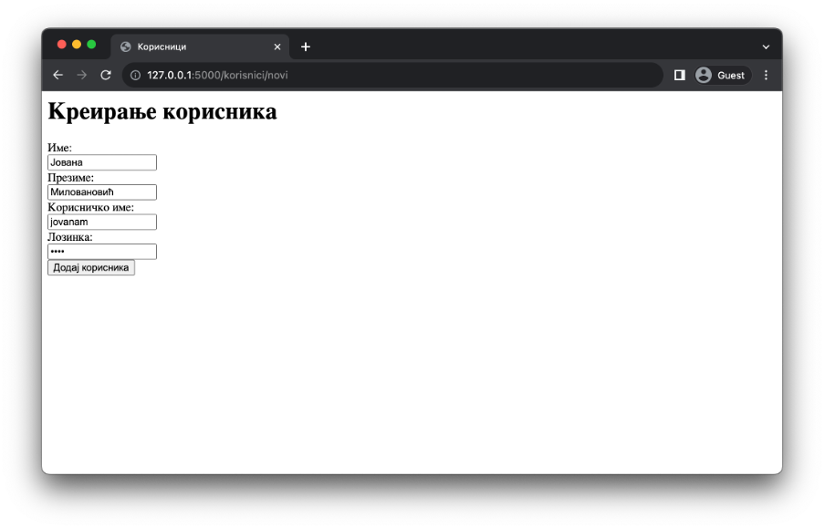
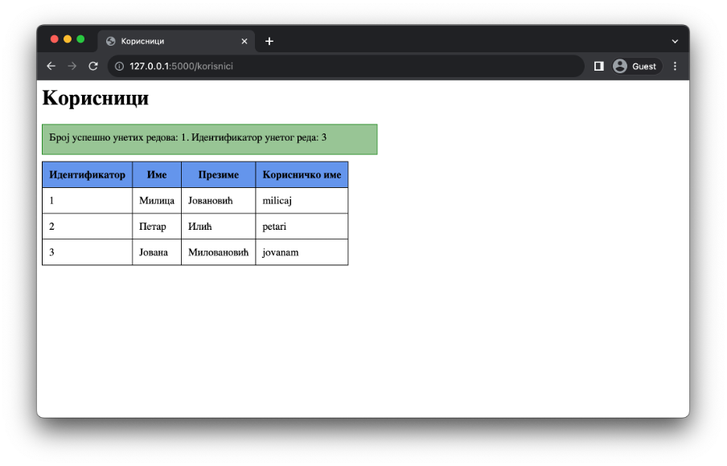
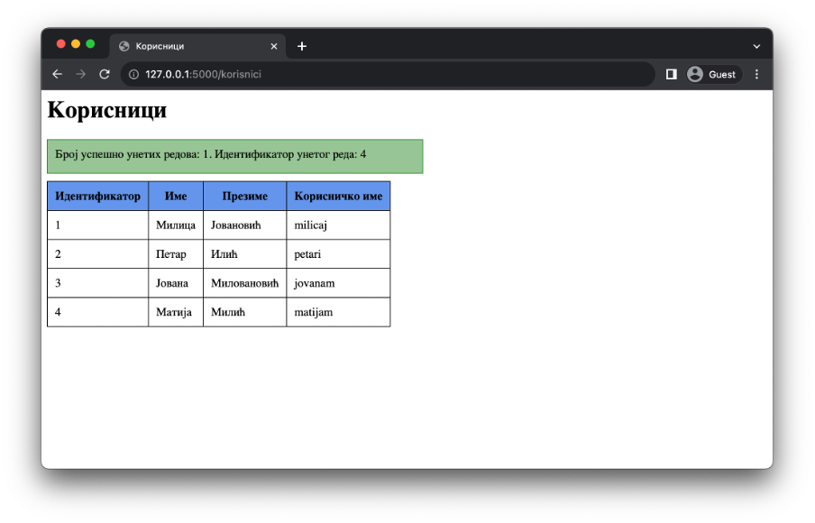
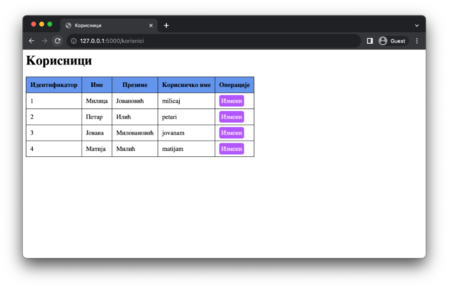
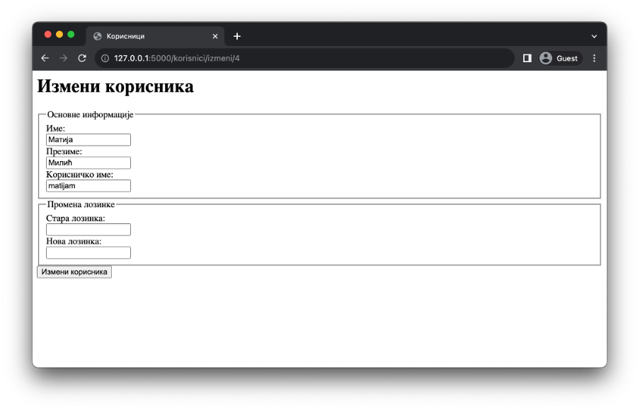
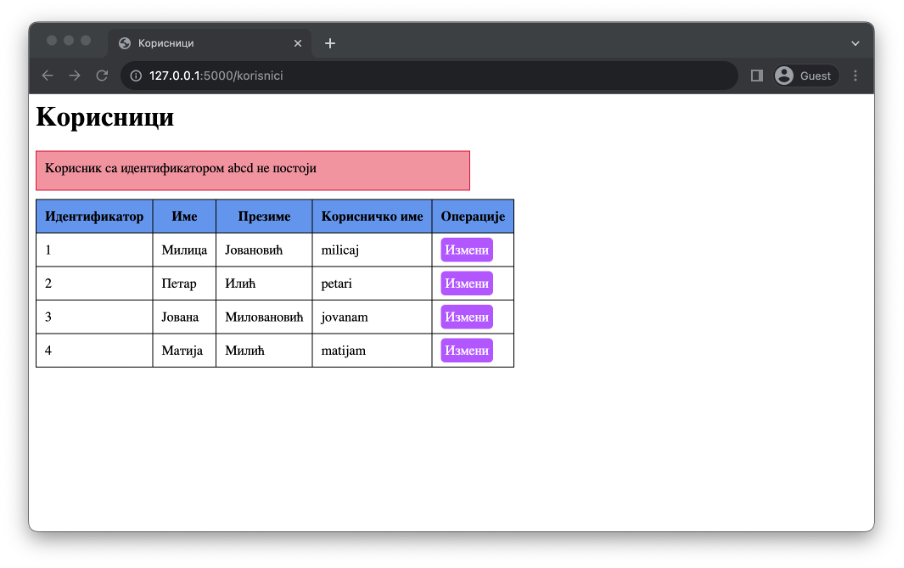
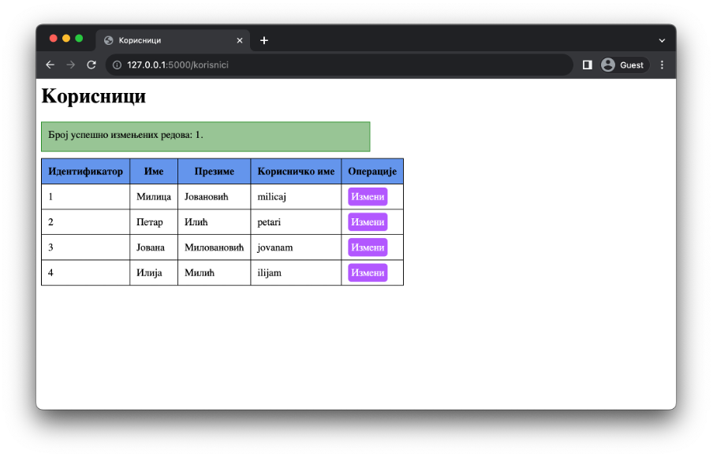
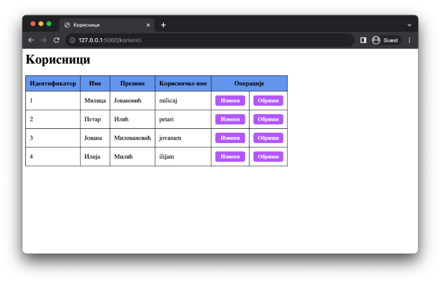
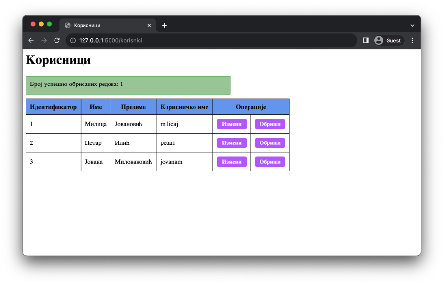

Упис, ажурирање и брисање података
==================================

Поред читања података, важно је да научиш како да упишеш нове податке, измениш и обришеш постојеће податке. Ове четири операције заједно чине основу свих веб-апликација, те ћеш њиховим овладавањем бити у могућности да креираш најразличитије веб-апликације.

Упис података у базу
____________________

Упис нових података умногоме личи на читање података. Пре извршавања уписа, потребно је да оствариш конекцију на базу података у коју желиш да унесеш податке, као и да направиш курсор. Такође, SQL наредбу за упис података (а то је наредба *INSERT*) записујеш као ниску. С обзиром да су вредности које се уписују у базу података динамичке природе, неопходно је да користиш параметре упита. Следи пример кода који илуструје до сада описано.

.. code-block:: python3

    kursor = mydb.cursor()
    sql = (
        "INSERT INTO zaposleni (drzava, zarada) "
        "VALUES (%(dr)s, %(za)s)"
    )

Извршавање SQL наредбе *INSERT* се врши позивом функције *еxecute* над курсором и прослеђивањем вредности (у примеру изнад, именованих) параметара упита путем параметра params овог метода, идентично као у случају читања података.

.. code-block:: python3

    kursor.execute(sql, params={"dr": "Немачка", "za": 50000})

Разлика између читања и уписа (па самим тим и ажурирања, односно брисања) која следи је веома важна. Када читаш податке из базе података, СУБП ти испоручује редове из резултата и тиме се операција сматра завршеном. Међутим, операције упита, ажурирања и брисања се могу и поништавати, уколико има потребе за тиме. Дакле, у случају наредбе *INSERT*, позив метода *execute* само припрема СУБП за потенцијални унос нових података, али ови подаци нису још увек трајно запамћени. Како би се осигурао да подаци буду трајно уписани у базу података, неопходно је да потврдиш измене. Ово се ради позивом метода *commit* над објектом *MySQLConnection*. Ако заборавиш ово да урадиш, подаци неће бити трајно сачувани.

.. code-block:: python3

    mydb.commit()

.. infonote::

    **Напомена**: Операција потврђивања измена (*commit*) представља основу за имплементирање трансакција. Трансакције превазилазе градиво овог курса, али вредно је знати да се управо помоћу њих одржава коректност података у базама података. Због тога је јако важно да запамтиш да потврдиш све измене које начиниш над неком базом података у својим веб-апликацијама.

Једна корисна функционалност коју вреди споменути су вредности које можеш користити у веб-апликацијама за креирање порука обавештајне природе, али и имплементирање сложенијих операција. Након било које операције измене, СУБП у курсор уписује вредност *rowcount*, која представља број измењених редова. У случају уписа, то је број уписаних редова; у случају ажурирања, то је број ажурираних редова итд. Додатно, након операције уписа података, курсор садржи и информацију о идентификатору унетог реда кроз поље *lastrowid*. Ову информацију можеш искористити, на пример, уколико ”истовремено” уносиш податке у две табеле, при чему ред из друге табеле има страни кључ ка реду из прве табеле.

Са овим знањем и једноставном веб-апликацијом из претходног примера која ти нуди преглед корисника на располагању, можеш приступити допуњавају веб-апликације тако да омогућиш упис нових корисника. У ту сврху, креирај нови шаблон *novi_korisnik.html* који ће садржати формулар за унос података о новом кориснику.

Овај шаблон ће бити приказан када корисник приступи страници путем метода GET. Обрада података у формулару ће бити извршена методом POST на истој страници. Скелет кода нове функције изгледа као у наставку

.. code-block:: python3

    @app.route("/korisnici/novi", methods=["GET", "POST"])
    def novi_korisnik():
        if request.method == "GET":
            return render_template(
                "novi_korisnik.html", naslov="Креирање корисника")
        else:
            # Обрада података...

У овом примеру ћемо демонстрирати једну целовиту обраду података. У случају уписа новог корисника, та обрада се може састојати од наредних корака:

1. Провера података из формулара.
2. Шифровање лозинке.
3. Упис података у базу.
4. Преусмеравање на страницу за приказ свих корисника.

У свим корацима у којима то има смисла, користићемо функцију flash за приказивање порука кориснику о току извршавања операције. Пређимо сада на описе сваког од корака.

Први корак је провера долазних података. За име, презиме и корисничко име ћемо проверити да ли је корисник унео макар један карактер, као и да ли се подаци састоје од алфанумеричких карактера. Лозинка се мора састојати од најмање 4 карактера.

.. code-block:: python3

    greske = False

    ime = request.form.get("ime", "")
    prezime = request.form.get("prezime", "")
    korisnicko_ime = request.form.get("korisnicko_ime", "")
    lozinka = request.form.get("lozinka", "")

    if not ime.isalpha():
        greske = True
        flash(
            "Име не сме бити празно и мора имати алфанумеричке карактере", "error"
        )
    if not prezime.isalpha():
        greske = True
        flash(
            "Презиме не сме бити празно и мора имати алфанумеричке карактере",
            "error",
        )
    if not korisnicko_ime.isalpha():
        greske = True
        flash(
            "Корисничко име не сме бити празно и мора имати алфанумеричке карактере",
            "error",
        )
    if len(lozinka) < 4:
        greske = True
        flash(
            "Лозинка не сме бити празна и мора имати најмање 4 карактера", "error"
        )

    if greske:
        return redirect(url_for("novi_korisnik"))

Детаље другог корака за сада прескачемо. Наведимо само да ће се шифрована лозинка чувати у променљивој *sifrovana_lozinka*.

::

    sifrovana_lozinka = ...

Трећи корак представља упис података у базу. Овај корак је већ добро описан на почетку лекције. Једина разлика је у SQL наредби и подацима који се уписују. Још једном ти скрећемо пажњу на потврђивање измена након извршавања операције *INSERT*.

.. code-block:: python3

    kursor = mydb.cursor()
    sql = (
        "INSERT INTO korisnici (ime, prezime, korisnicko_ime, lozinka) "
        "VALUES (%(ime)s, %(prezime)s, %(korisnicko_ime)s, %(lozinka)s)"
    )

    kursor.execute(
        sql,
        params={
            "ime": ime,
            "prezime": prezime,
            "korisnicko_ime": korisnicko_ime,
            "lozinka": sifrovana_lozinka,
        },
    )

    mydb.commit()

Коначно, последњи корак је регистровање поруке о успешности операције и преусмеравање. Овде користимо вредности *rowcount* и *lastrowid* како бисмо додатно описали кориснику акцију која је извршена у систему.

.. code-block:: python3

    flash(
        f"Број успешно унетих редова: {kursor.rowcount}. Идентификатор унетог реда: {kursor.lastrowid}",
        "success",
    )
    return redirect(url_for("korisnici"))

Све заједно, код за овај пример изгледа као у наставку.

.. code-block:: python

    # Poglavlje5/23/db.py

    import mysql.connector

    mydb = mysql.connector.connect(
        host="localhost", user="root", password="", database="mysql_vezbanje"
    )

.. code-block:: python

    # Poglavlje5/23/main.py

    from flask import Flask, flash, redirect, render_template, request, url_for
    from db import mydb
    import bcrypt

    app = Flask(__name__)

    app.secret_key = b"\xcaO\xeb\xf3\xac\\c\x11_x\xb6\x07\nsu\xef\xe2\x98~\xfe\x08Y~h"

    @app.route("/korisnici/novi", methods=["GET", "POST"])
    def novi_korisnik():
        if request.method == "GET":
            return render_template("novi_korisnik.html", naslov="Креирање корисника")
        else:
            greske = False

            ime = request.form.get("ime", "")
            prezime = request.form.get("prezime", "")
            korisnicko_ime = request.form.get("korisnicko_ime", "")
            lozinka = request.form.get("lozinka", "")

            if not ime.isalpha():
                greske = True
                flash(
                    "Име не сме бити празно и мора имати алфанумеричке карактере", "error"
                )
            if not prezime.isalpha():
                greske = True
                flash(
                    "Презиме не сме бити празно и мора имати алфанумеричке карактере",
                    "error",
                )
            if not korisnicko_ime.isalpha():
                greske = True
                flash(
                    "Корисничко име не сме бити празно и мора имати алфанумеричке карактере",
                    "error",
                )
            if len(lozinka) < 4:
                greske = True
                flash(
                    "Лозинка не сме бити празна и мора имати најмање 4 карактера", "error"
                )

            if greske:
                return redirect(url_for("novi_korisnik"))

            sifrovana_lozinka = bcrypt.hashpw(lozinka.encode(), bcrypt.gensalt())

            kursor = mydb.cursor()
            sql = (
                "INSERT INTO korisnici (ime, prezime, korisnicko_ime, lozinka) "
                "VALUES (%(ime)s, %(prezime)s, %(korisnicko_ime)s, %(lozinka)s)"
            )

            kursor.execute(
                sql,
                params={
                    "ime": ime,
                    "prezime": prezime,
                    "korisnicko_ime": korisnicko_ime,
                    "lozinka": sifrovana_lozinka,
                },
            )

            mydb.commit()

            flash(
                f"Број успешно унетих редова: {kursor.rowcount}. Идентификатор унетог реда: {kursor.lastrowid}",
                "success",
            )
            return redirect(url_for("korisnici"))

    @app.route("/korisnici")
    def korisnici():
        kursor = mydb.cursor(dictionary=True)
        upit = "SELECT id_korisnika, ime, prezime, korisnicko_ime FROM korisnici"

        kursor.execute(upit)
        korisnici = kursor.fetchall()

        return render_template("korisnici.html", naslov="Корисници", korisnici=korisnici)

.. code-block:: html

    <!-- Poglavlje5/23/static/osnovni_sablon.html --!>     

    <html lang="sr">
        <head>
            <title>Корисници</title>
            <link
                rel="stylesheet"
                type="text/css"
                href="{{url_for('static', filename='stil.css')}}"
            >
        </head>
        <body>
            <h1>{{naslov}}</h1>

            
                
                    
{{poruka}}

                
            
            
             
        </body>
    </html>

.. code-block:: html

    <!-- Poglavlje5/23/static/korisnici.html --!>  

    
    
    
    <table>
        <tr>
            <th>Идентификатор</th>
            <th>Име</th>
            <th>Презиме</th>
            <th>Корисничко име</th>
        </tr>
        
        <tr>
            <td>{{korisnik["id_korisnika"]}}</td>
            <td>{{korisnik["ime"]}}</td>
            <td>{{korisnik["prezime"]}}</td>
            <td>{{korisnik["korisnicko_ime"]}}</td>
        </tr>
        
        </table>
    
    
Нема корисника у систему.

    
    

.. code-block:: html

    <!-- Poglavlje5/23/static/novi_korisnik.html --!>  

    
    
    <form action="{{url_for('novi_korisnik')}}" method="POST">
        

            <label for="ime">Име:</label>
             
            <input type="text" name="ime" id="ime">
        

        

            <label for="prezime">Презиме:</label>
             
            <input type="text" name="prezime" id="prezime">
        

        

            <label for="korisnicko_ime">Корисничко име:</label>
             
            <input type="text" name="korisnicko_ime" id="korisnicko_ime">
        

        

            <label for="lozinka">Лозинка:</label>
             
            <input type="password" name="lozinka" id="lozinka">
        

    <input type="submit" value="Додај корисника">
    </form>
    

    

Успешно подношење формулара резултује веб-страницом као на наредној слици.

Укратко о шифровању осетљивих података
______________________________________

Већ смо рекли да се осетљиви подаци не чувају у базама података у изворном облику. Са становишта безбедности података, ово представља најнепогодније решење. Било који упад на сервер који би злонамерним корисницима омогућио приступ осетљивим подацима уједно би обезбедио и све поверљиве информације, било да су у питању лозинке, бројеви кредитних картица, пин кодови итд.

Због тога, пре уписивања у базу података, програмери прибегавају неким од техника шифровања података, одн. претварања оригиналне вредности (на пример, 1234) у вредност која није читљива (на пример, 7110eda4d09e062aa5e4a390b0a572ac0d2c0220), која се назива хеширана вредност или хеш (*hash*). Раније су се користили алгоритми хеширања (*hashing*) као што су *md5, sha1*, итд. Ови алгоритми могу веома брзо да на основу улазне вредности добију хеширану вредност, али је веома тешко претворити хеширану вредност у оригиналну вредност. Проблем са овим приступом је у томе што корисници често користе једноставне лозинке које се лако памте за које се на интернету могу пронаћи хеширане вредности за различите алгоритме. На основу ових података и откривених хешираних вредности из база података, злонамерни корисници могу једноставно да реконструишу твоју лозинку.

Како би заштитили кориснике од напада сличног типа, програмери уобичајено користе технику засољавања (*salting*) пре него што се приступи хеширању лозинке. Овај поступак подразумева додавање додатног низа карактера или бајтова, познатог као со (*salt*), лозинци пре него што се хешира. За обезбеђивање највеће сигурности, препоручује се коришћење одвојене и насумично генерисане соли за сваку лозинку. Важно је напоменути да со није тајна информација и може се чувати заједно са хеш вредношћу у бази података. Овакав приступ значајно повећава безбедност обележавања лозинки.

Једна позната и поуздана имплементација засољавања и хеширања заснива се на алгоритму који се назива *bcrypt*. Да би користио ову библиотеку у Python програмима, прво је мораш инсталирати у свом окружењу, помоћу наредне команде.

::

    pip install bcrypt

.. infonote::

    **Напомена:** Не заборави да прво активираш окружење.

У веб-апликацији је потребно да је увезеш преко истоименог модула.

::

    import bcrypt

Након увожења, доступно ти је неколико функција. Функција *bcrypt.gensalt* насумично генерише со (добијена со је низ бајтова). Ова функција се користи као аргумент функције *bcrypt.hashpw* која на основу лозинке и соли врши хеширање. Лозинка, уколико се у програму налази као ниска (тј. типа је *str*), потребно ју је прво претворити у низ бајтова позивом метода *encode*. У наставку следи пример кода који илуструје коришћење ових функција.

.. code-block:: python3

    lozinka = "..."
    sifrovana_lozinka = bcrypt.hashpw(lozinka.encode(), bcrypt.gensalt())

Приликом пријављивања корисника на систем потребно је проверити да ли се унета вредност поклапа са лозинком коју је корисник унео приликом регистрације. Ово се може проверити позивом функције *bcrypt.checkpw* чији су аргументи лозинка коју треба проверити (као низ бајтова) и хеширана вредност из базе података. Повратна вредност функције је Булова вредност – да ли се лозинке поклапају или не.

.. code-block:: python3

    uneta_lozinka = "..."
    sifrovana_lozinka = "..."
    poklapanje = bcrypt.checkpw(uneta_lozinka.encode(), sifrovana_lozinka.encode())

Организација програмског кода
______________________________

Ако погледаш датотеку *main.py* из претходног примера, приметићеш да њен садржај расте великом брзином. Свака нова путања доноси нову Python функцију која имплементира неку сложену функционалност. На пример, функција *novi_korisnik* издваја податке из формулара, проверава те вредности, уписује корисника у базу података и конструише HTTP одговор. Све ово представља велику одговорност за само једну функцију, а и додавање нових функција на овај начин ће убрзо довести до датотеке коју је веома тешко одржавати. 

Због тога, када код имаш сложене функционалности које треба да имплементираш, а у програмирању веб-апликација то је готово увек случај, боље је да распоредиш код по функцијама тако да свака функција има једну одговорност, а да функције даље групишеш у Python модуле. На пример, уместо да датотека *main.py* буде та која имплементира операције над базом података, више има смисла да направиш нови модул који ће садржати ове операције, а да у датотеци *main.py* увозиш функције из тог модула и позиваш их по потреби. У ту сврху, сав код који се тиче управљања подацима из базе података ћемо преместити у већ постојећу датотеку *db.py*, која већ садржи један део кода који се тиче радом са базом података. Пожељно је да функције именујеш описним називима како би на основу имена брзо закључио шта је садржај те функције, без да анализираш код.

.. code-block:: python

    # Poglavlje5/24/db.py

    import mysql.connector
    import bcrypt
    from flask import flash

    mydb = mysql.connector.connect(
        host="localhost", user="root", password="", database="mysql_vezbanje"
    )

    def dohvati_sve_korisnike():
        kursor = mydb.cursor(dictionary=True)
        upit = "SELECT id_korisnika, ime, prezime, korisnicko_ime FROM korisnici"

        kursor.execute(upit)
        korisnici = kursor.fetchall()

        return korisnici

    def unesi_novog_korisnika(ime, prezime, korisnicko_ime, lozinka):
        sifrovana_lozinka = bcrypt.hashpw(lozinka.encode(), bcrypt.gensalt())

        kursor = mydb.cursor()
        sql = (
            "INSERT INTO korisnici (ime, prezime, korisnicko_ime, lozinka) "
            "VALUES (%(ime)s, %(prezime)s, %(korisnicko_ime)s, %(lozinka)s)"
        )

        kursor.execute(
            sql,
            params={
                "ime": ime,
                "prezime": prezime,
                "korisnicko_ime": korisnicko_ime,
                "lozinka": sifrovana_lozinka,
            },
        )

        mydb.commit()

        flash(
            f"Број успешно унетих редова: {kursor.rowcount}. Идентификатор унетог реда: {kursor.lastrowid}",
            "success",
        )

Поред операција са базом података, и све провере вредности података је корисно издвојити у посебан модул, на пример, *validacija.py*. 

.. code-block:: python

    # Poglavlje5/24/validacija.py

    from flask import flash

    def proveri_podatke_korisnika(ime, prezime, korisnicko_ime, lozinka):
        greske = False

        if not ime.isalpha():
            greske = True
            flash("Име не сме бити празно и мора имати алфанумеричке карактере", "error")
        if not prezime.isalpha():
            greske = True
            flash(
                "Презиме не сме бити празно и мора имати алфанумеричке карактере",
                "error",
            )
        if not korisnicko_ime.isalpha():
            greske = True
            flash(
                "Корисничко име не сме бити празно и мора имати алфанумеричке карактере",
                "error",
            )
        if len(lozinka) < 4:
            greske = True
            flash("Лозинка не сме бити празна и мора имати најмање 4 карактера", "error")

        return greske

Сада, датотека *main.py* изгледа много чистије и лакше ју је одржавати.

.. code-block:: python

    # Poglavlje5/24/main.py

    from flask import Flask, redirect, render_template, request, url_for
    from db import unesi_novog_korisnika, dohvati_sve_korisnike
    from validacija import proveri_podatke_korisnika

    app = Flask(__name__)

    app.secret_key = b"\xcaO\xeb\xf3\xac\\c\x11_x\xb6\x07\nsu\xef\xe2\x98~\xfe\x08Y~h"

    @app.route("/korisnici/novi", methods=["GET", "POST"])
    def novi_korisnik():
        if request.method == "GET":
            return render_template("novi_korisnik.html", naslov="Креирање корисника")
        else:
            ime = request.form.get("ime", "")
            prezime = request.form.get("prezime", "")
            korisnicko_ime = request.form.get("korisnicko_ime", "")
            lozinka = request.form.get("lozinka", "")

            greske = proveri_podatke_korisnika(ime, prezime, korisnicko_ime, lozinka)
            if greske:
                return redirect(url_for("novi_korisnik"))

            unesi_novog_korisnika(ime, prezime, korisnicko_ime, lozinka)

            return redirect(url_for("korisnici"))

    @app.route("/korisnici")
    def korisnici():
        korisnici = dohvati_sve_korisnike()

        return render_template("korisnici.html", naslov="Корисници", korisnici=korisnici)

Апликација је функционално остала непромењена. Покрени овај пример и унеси новог корисника у систем.

Ажурирање података
___________________

Наредна операција коју ћеш упознати јесте ажурирање података. Осим тога што се користи друга SQL наредба, операција ажурирања у бази података функционише по идентичном принципу као операција уписа у базу података. Кораци које треба да преузмеш су следећи (примети да су сви кораци идентични осим корака 2, где се у случају операције уписа користи SQL наредба *INSERT*):

1. Направи нови курсор.
2. Напиши SQL наредбу *UPDATE* за ажурирање жељених података у бази.
3. Изврши SQL наредбу помоћу курсора (и, евентуално, проследи параметре упита).
4. Потврди измене над објектом *MySQLConnection*.

Наредни пример кода илуструје описане кораке.

.. code-block:: python3

    # Корак 1
    kursor = mydb.cursor()

    # Корак 2
    sql = (
        "UPDATE zaposleni "
        "SET drzava = %(dr)s, zarada = %(za)s "
        "WHERE id = %(id)s"
    )

    # Корак 3
    kursor.execute(sql, params={"dr": "Србија", "za": 75000, "id": 1})

    mydb.commit()

.. infonote::

    **Напомена:** Као и у случају уписа података, неопходно је да потврдиш измене како би трајно запамтио измене у бази података. У супротном, ажурирани подаци неће бити сачувани.

У веб-апликацијама имплементирање ажурирања података по много чему личи на упис података. Прво, неопходно је обезбедити формулар за унос измењених вредности. Друго, потребно је регистровати два рутирања у веб-апликацији – једно, методом GET за приказивање формулара и друго, методом POST за обраду података. Наравно, постоје и неке разлике. Обично, када кориснику желиш да омогућиш измену вредности, добра је пракса да му у формулару за измену прикажеш тренутне вредности. Такође, поверљиви подаци, као што је лозинка, обично се посебно обрађује тако што се захтева да се унесе и стара и нова вредност. Стара вредност служи да се осигураш да случајан упад на систем (на пример, ако корисник заборави да се одјави са рачунара за којим сада ради злонамерни корисник) неће онемогућити злонамерном кориснику који не зна стару лозинку да промени лозинку на неку нову вредност.

С обзиром да кориснику желимо да омогућимо измену података, на страници на путањи */korisnici* додајемо нову колону у табели која ће садржати ”дугме” за измену податка за корисника. Ово ”дугме” представља ништа друго до везу (HTML елемент а), која је стилизована да изгледа као дугме, а која води ка путањи */korisnici/izmeni/<id_korisnika>* (која ће бити регистрована као рута за функцију *izmeni_korisnika* u датотеци *main.py*). Приликом генерисања шаблона, за сваку везу је потребно припремити одговарајућу URL адресу. Присети се да за то можеш искористити функцију *url_for* тако што проследиш додатни именовани аргумент (у овом случају, то је аргумент *id_korisnika*) који ће заменити параметар *id_korisnika* у путањи.

.. code-block:: html
    
    <!-- Poglavlje5/25/templates/korisnici.html --!>

    
    
    
    <table>
        <tr>
            <th>Идентификатор</th>
            <th>Име</th>
            <th>Презиме</th>
            <th>Корисничко име</th>
            <th>Операције</th>
        </tr>
        
        <tr>
            <td>{{korisnik["id_korisnika"]}}</td>
            <td>{{korisnik["ime"]}}</td>
            <td>{{korisnik["prezime"]}}</td>
            <td>{{korisnik["korisnicko_ime"]}}</td>
            <td>
            <a
                class="dugme-operacija"
                href="{{url_for('izmeni_korisnika', id_korisnika=korisnik['id_korisnika'])}}"
            >
                Измени
            </a>
            </td>
        </tr>
        
    </table>
    
    
Нема корисника у систему.

    
    

Посећивањем неке од генерисаних веза шаље се GET захтев на путању */korisnici/izmeni/<id_korisnika>* која приказује шаблон са формуларом за измену података. Примети да су основни подаци о кориснику унети на основу постојећих података у бази, као и да је промена лозинке одвојена у засебну секцију. Наравно, обе секције су и даље део једног формулара, што значи да ће се сви подаци послати заједно методом POST на исту путању.

.. code-block:: html
    
    <!-- Poglavlje5/25/templates/izmeni_korisnika.html --!>

    
    
        <form
        action="{{url_for('izmeni_korisnika', id_korisnika=korisnik['id_korisnika'])}}"
        method="POST"
        >
        <fieldset>
            <legend>Основне информације</legend>
            

            <label for="ime">Име:</label>
             
            <input type="text" name="ime" id="ime" value="{{korisnik['ime']}}">
            

            

            <label for="prezime">Презиме:</label>
             
            <input
                type="text"
                name="prezime"
                id="prezime"
                value="{{korisnik['prezime']}}"
            >
            

            

            <label for="korisnicko_ime">Корисничко име:</label>
             
            <input
                type="text"
                name="korisnicko_ime"
                id="korisnicko_ime"
                value="{{korisnik['korisnicko_ime']}}"
            >
            

        </fieldset>
        <fieldset>
            <legend>Промена лозинке</legend>
            

            <label for="stara_lozinka">Стара лозинка:</label>
             
            <input type="password" name="stara_lozinka" id="stara_lozinka">
            

            

            <label for="nova_lozinka">Нова лозинка:</label>
             
            <input type="password" name="nova_lozinka" id="nova_lozinka">
            

        </fieldset>

        <input type="submit" value="Измени корисника">
    </form>
    

На серверској страни, приликом обраде захтева, потребно је прво проверити да ли корисник постоји у систему. Ово радимо у случају било код метода, с обзиром да не желимо да прикажемо формулар, а такође, не желимо ни да обрађујемо измењене податке уколико корисник којег покушавамо да изменимо ни не постоји у систему. На пример, посећивањем странице http://127.0.0.1:5000/korisnici/izmeni/abcd добијамо поруку као на наредној слици (након преусмеравања захтева на страницу са корисницима).

Кораци за имплементирање ажурирања података личе на упис података, са разликом да је потребно посебно обрадити случајеве када су лозинке наведене и када нису. Додатно, потребно је да водиш рачуна о томе да провериш да ли су обе лозинке исправне – стара лозинка мора да одговара хешираној вредности из базе података, док нова лозинка мора да поштује ограничења која смо поставили приликом уписа нових корисника.

.. code-block:: python

    # Poglavlje5/25/db.py

    import mysql.connector
    import bcrypt
    from flask import flash

    mydb = mysql.connector.connect(
        host="localhost", user="root", password="", database="mysql_vezbanje"
    )

    def dohvati_korisnika(id_korisnika):
        kursor = mydb.cursor(dictionary=True)
        upit = (
            "SELECT id_korisnika, ime, prezime, korisnicko_ime, lozinka "
            "FROM korisnici WHERE id_korisnika = %s"
        )

        kursor.execute(upit, params=[id_korisnika])
        korisnik = kursor.fetchone()

        return korisnik

    def izmeni_postojeceg_korisnika(
        id_korisnika, ime, prezime, korisnicko_ime, nova_lozinka
    ):
        kursor = mydb.cursor()

        if nova_lozinka:
            sql = (
                "UPDATE korisnici SET ime = %(ime)s, prezime = %(prezime)s, "
                "korisnicko_ime = %(korisnicko_ime)s, lozinka = %(lozinka)s "
                "WHERE id_korisnika = %(id_korisnika)s"
            )

            sifrovana_lozinka = bcrypt.hashpw(nova_lozinka.encode(), bcrypt.gensalt())

            kursor.execute(
                sql,
                params={
                    "id_korisnika": id_korisnika,
                    "ime": ime,
                    "prezime": prezime,
                    "korisnicko_ime": korisnicko_ime,
                    "lozinka": sifrovana_lozinka,
                },
            )
        else:
            sql = (
                "UPDATE korisnici SET ime = %(ime)s, prezime = %(prezime)s, "
                "korisnicko_ime = %(korisnicko_ime)s "
                "WHERE id_korisnika = %(id_korisnika)s"
            )

            kursor.execute(
                sql,
                params={
                    "id_korisnika": id_korisnika,
                    "ime": ime,
                    "prezime": prezime,
                    "korisnicko_ime": korisnicko_ime,
                },
            )

        mydb.commit()

        flash(
            f"Број успешно измењених редова: {kursor.rowcount}.",
            "success",
        )

    def dohvati_sve_korisnike():
        kursor = mydb.cursor(dictionary=True)
        upit = "SELECT id_korisnika, ime, prezime, korisnicko_ime FROM korisnici"

        kursor.execute(upit)
        korisnici = kursor.fetchall()

        return korisnici

    def unesi_novog_korisnika(ime, prezime, korisnicko_ime, lozinka):
        sifrovana_lozinka = bcrypt.hashpw(lozinka.encode(), bcrypt.gensalt())

        kursor = mydb.cursor()
        sql = (
            "INSERT INTO korisnici (ime, prezime, korisnicko_ime, lozinka) "
            "VALUES (%(ime)s, %(prezime)s, %(korisnicko_ime)s, %(lozinka)s)"
        )

        kursor.execute(
            sql,
            params={
                "ime": ime,
                "prezime": prezime,
                "korisnicko_ime": korisnicko_ime,
                "lozinka": sifrovana_lozinka,
            },
        )

        mydb.commit()

        flash(
            f"Број успешно унетих редова: {kursor.rowcount}. Идентификатор унетог реда: {kursor.lastrowid}",
            "success",
        )

.. code-block:: python

    # Poglavlje5/25/main.py
    
    from flask import Flask, flash, redirect, render_template, request, url_for
    from db import (
    unesi_novog_korisnika,
    dohvati_sve_korisnike,
    dohvati_korisnika,
    izmeni_postojeceg_korisnika,
    )
    from validacija import (
        proveri_podatke_novog_korisnika,
        proveri_podatke_postojeceg_korisnika,
    )

    app = Flask(__name__)

    app.secret_key = b"\xcaO\xeb\xf3\xac\\c\x11_x\xb6\x07\nsu\xef\xe2\x98~\xfe\x08Y~h"

    @app.route("/korisnici/izmeni/<id_korisnika>", methods=["GET", "POST"])
    def izmeni_korisnika(id_korisnika):
        korisnik = dohvati_korisnika(id_korisnika)
        if korisnik is None:
            flash(f"Корисник са идентификатором {id_korisnika} не постоји", "error")
            return redirect(url_for("korisnici"))

        if request.method == "GET":
            return render_template(
                "izmeni_korisnika.html", naslov="Измени корисника", korisnik=korisnik
            )
        else:
            ime = request.form.get("ime", "")
            prezime = request.form.get("prezime", "")
            korisnicko_ime = request.form.get("korisnicko_ime", "")
            stara_lozinka = request.form.get("stara_lozinka", "")
            nova_lozinka = request.form.get("nova_lozinka", "")

            greske = proveri_podatke_postojeceg_korisnika(
                ime, prezime, korisnicko_ime, stara_lozinka, nova_lozinka, korisnik
            )
            if greske:
                return redirect(url_for("izmeni_korisnika", id_korisnika=id_korisnika))

            izmeni_postojeceg_korisnika(
                id_korisnika, ime, prezime, korisnicko_ime, nova_lozinka
            )

            return redirect(url_for("korisnici"))

    @app.route("/korisnici/novi", methods=["GET", "POST"])
    def novi_korisnik():
        if request.method == "GET":
            return render_template("novi_korisnik.html", naslov="Креирање корисника")
        else:
            ime = request.form.get("ime", "")
            prezime = request.form.get("prezime", "")
            korisnicko_ime = request.form.get("korisnicko_ime", "")
            lozinka = request.form.get("lozinka", "")

            greske = proveri_podatke_novog_korisnika(ime, prezime, korisnicko_ime, lozinka)
            if greske:
                return redirect(url_for("novi_korisnik"))

            unesi_novog_korisnika(ime, prezime, korisnicko_ime, lozinka)

            return redirect(url_for("korisnici"))

    @app.route("/korisnici")
    def korisnici():
        korisnici = dohvati_sve_korisnike()

        return render_template("korisnici.html", naslov="Корисници", korisnici=korisnici)

Брисање података
_________________

До сада си стекао довољно знања да можеш да претпоставиш како се имплементира последња операција над подацима – брисање.

Кораци које треба да преузмеш су следећи:

1. Направи нови курсор.
2. Напиши SQL наредбу *DELETE* за брисање жељених података из базе.
3. Изврши SQL наредбу помоћу курсора (и, евентуално, проследи параметре упита).
4. Потврди измене над објектом *MySQLConnection*.

Наредни пример кода илуструје описане кораке.

.. code-block:: python3

    # Корак 1
    kursor = mydb.cursor()

    # Корак 2
    sql = (
        "DELETE FROM zaposleni "
        "WHERE id = %(id)s"
    )

    # Корак 3
    kursor.execute(sql, params={"id": 1})

    # Корак 4
    mydb.commit()

.. infonote::

    **Напомена:** Као и у случају уписа и ажурирања података, **неопходно је да потврдиш измене** како би трајно обрисао податке из базе података. У супротном, подаци ће остати сачувани у табели.

Приликом брисања података, обично се истичу два приступа када корисник одабере опцију за брисање:

- Попут ажурирања података, шаље се GET захтев за страницу на којој се налази једноставан формулар са пољима за потврђивање или поништавање избора. Тек када корисник потврди брисање путем овог формулара, шаље се POST захтев на исту путању којом се врши брисање.
- Подаци се бришу без потврде непосредним слањем POST захтева.

Други приступ некада није пожељан, на пример, уколико желиш да се осигураш да корисник није случајно одабрао опцију за брисање. У нашој веб-апликацији ћемо ипак искористити тај приступ, како бисмо илустровали како је могуће послати непосредан POST захтев. (Први приступ си већ видео двапут – приликом имплементације уписивања и ажурирања података.)

Језик HTML не подржава могућност да се POST захтеви шаљу путем веза (тј. HTML елемента *a*). Због тога, уколико желиш да пошаљеш POST захтев са веб-странице, у обавези си да искористиш HTML елемент *form*. Ипак, чињеница да ови елементи немају посебне визуелне карактеристике омогућава ти да их користиш на нестандардне начине. На пример, у шаблону странице */korisnici* можеш додати нову колону табеле, која ће у сваком реду садржати по један формулар који шаље POST захтев на путању */korisnici/obrisi/<id_korisnika>*. Евентуално ће бити потребно да стилизујеш дугме за подношење формулара како би се визуелно уклопило са осталим елементима. У пракси, овај посао се делегира веб-дизајнерима који ће уклопити дизајн потребних елемената према теми веб-апликације.

.. code-block:: html

    <!-- Poglavlje5/26/templates/korisnici.html --!>

    
    
    
    <table>
        <tr>
            <th>Идентификатор</th>
            <th>Име</th>
            <th>Презиме</th>
            <th>Корисничко име</th>
            <th colspan="2">Операције</th>
        </tr>
        
        <tr>
            <td>{{korisnik["id_korisnika"]}}</td>
            <td>{{korisnik["ime"]}}</td>
            <td>{{korisnik["prezime"]}}</td>
            <td>{{korisnik["korisnicko_ime"]}}</td>
            <td>
            <a
                class="dugme-operacija"
                href="{{url_for('izmeni_korisnika', id_korisnika=korisnik['id_korisnika'])}}"
            >Измени</a
            >
            </td>
            <td>
            <form
                class="forma-operacija"
                action="{{url_for('obrisi_korisnika', id_korisnika=korisnik['id_korisnika'])}}"
                method="POST"
            >
                <input type="submit" value="Обриши" class="dugme-operacija">
            </form>
            </td>
        </tr>
        
    </table>
    
    
Нема корисника у систему.

    
    

Одабиром дугмета Обриши, шаље се POST захтев на путању */korisnici/obrisi/<id_korisnika>* која је регистрована за функцију *obrisi_korisnika*. Функција је сама по себи једноставна – на основу параметра путање *id_korisnika* шаље се захтев за брисањем корисника са датим идентификатором из базе података. Након успешности операције, захтев се преусмерава на страницу *Korisnici*, одакле је иницијални захтев и потекао.

.. code-block:: python

    # Poglavlje5/26/db.py

    import mysql.connector
    import bcrypt
    from flask import flash

    mydb = mysql.connector.connect(
        host="localhost", user="root", password="", database="mysql_vezbanje"
    )

    def obrisi_korisnika_sa_id(id_korisnika):
        kursor = mydb.cursor()
        sql = "DELETE FROM korisnici WHERE id_korisnika = %s"

        kursor.execute(
            sql,
            params=[id_korisnika],
        )

        mydb.commit()

        flash(
            f"Број успешно обрисаних редова: {kursor.rowcount}",
            "success",
        )

    def dohvati_korisnika(id_korisnika):
        kursor = mydb.cursor(dictionary=True)
        upit = (
            "SELECT id_korisnika, ime, prezime, korisnicko_ime, lozinka "
            "FROM korisnici WHERE id_korisnika = %s"
        )

        kursor.execute(upit, params=[id_korisnika])
        korisnik = kursor.fetchone()

        return korisnik

    def izmeni_postojeceg_korisnika(
        id_korisnika, ime, prezime, korisnicko_ime, nova_lozinka
    ):
        kursor = mydb.cursor()

        if nova_lozinka:
            sql = (
                "UPDATE korisnici SET ime = %(ime)s, prezime = %(prezime)s, "
                "korisnicko_ime = %(korisnicko_ime)s, lozinka = %(lozinka)s "
                "WHERE id_korisnika = %(id_korisnika)s"
            )

            sifrovana_lozinka = bcrypt.hashpw(nova_lozinka.encode(), bcrypt.gensalt())

            kursor.execute(
                sql,
                params={
                    "id_korisnika": id_korisnika,
                    "ime": ime,
                    "prezime": prezime,
                    "korisnicko_ime": korisnicko_ime,
                    "lozinka": sifrovana_lozinka,
                },
            )
        else:
            sql = (
                "UPDATE korisnici SET ime = %(ime)s, prezime = %(prezime)s, "
                "korisnicko_ime = %(korisnicko_ime)s "
                "WHERE id_korisnika = %(id_korisnika)s"
            )

            kursor.execute(
                sql,
                params={
                    "id_korisnika": id_korisnika,
                    "ime": ime,
                    "prezime": prezime,
                    "korisnicko_ime": korisnicko_ime,
                },
            )

        mydb.commit()

        flash(
            f"Број успешно измењених редова: {kursor.rowcount}.",
            "success",
        )

    def dohvati_sve_korisnike():
        kursor = mydb.cursor(dictionary=True)
        upit = "SELECT id_korisnika, ime, prezime, korisnicko_ime FROM korisnici"

        kursor.execute(upit)
        korisnici = kursor.fetchall()

        return korisnici

    def unesi_novog_korisnika(ime, prezime, korisnicko_ime, lozinka):
        sifrovana_lozinka = bcrypt.hashpw(lozinka.encode(), bcrypt.gensalt())

        kursor = mydb.cursor()
        sql = (
            "INSERT INTO korisnici (ime, prezime, korisnicko_ime, lozinka) "
            "VALUES (%(ime)s, %(prezime)s, %(korisnicko_ime)s, %(lozinka)s)"
        )

        kursor.execute(
            sql,
            params={
                "ime": ime,
                "prezime": prezime,
                "korisnicko_ime": korisnicko_ime,
                "lozinka": sifrovana_lozinka,
            },
        )

        mydb.commit()

        flash(
            f"Број успешно унетих редова: {kursor.rowcount}. Идентификатор унетог реда: {kursor.lastrowid}",
            "success",
        )

.. code-block:: python

    # Poglavlje5/26/main.py

    from flask import Flask, redirect, render_template, request, url_for
    from db import (
        unesi_novog_korisnika,
        dohvati_sve_korisnike,
        dohvati_korisnika,
        izmeni_postojeceg_korisnika,
        obrisi_korisnika_sa_id,
    )
    from validacija import (
        proveri_podatke_novog_korisnika,
        proveri_podatke_postojeceg_korisnika,
    )

    app = Flask(__name__)

    app.secret_key = b"\xcaO\xeb\xf3\xac\\c\x11_x\xb6\x07\nsu\xef\xe2\x98~\xfe\x08Y~h"

    @app.route("/korisnici/obrisi/<id_korisnika>", methods=["POST"])
    def obrisi_korisnika(id_korisnika):
        obrisi_korisnika_sa_id(id_korisnika)
        return redirect(url_for("korisnici"))

    @app.route("/korisnici/izmeni/<id_korisnika>", methods=["GET", "POST"])
    def izmeni_korisnika(id_korisnika):
        korisnik = dohvati_korisnika(id_korisnika)

        if request.method == "GET":
            return render_template(
                "izmeni_korisnika.html", naslov="Измени корисника", korisnik=korisnik
            )
        else:
            ime = request.form.get("ime", "")
            prezime = request.form.get("prezime", "")
            korisnicko_ime = request.form.get("korisnicko_ime", "")
            stara_lozinka = request.form.get("stara_lozinka", "")
            nova_lozinka = request.form.get("nova_lozinka", "")

            greske = proveri_podatke_postojeceg_korisnika(
                ime, prezime, korisnicko_ime, stara_lozinka, nova_lozinka, korisnik
            )
            if greske:
                return redirect(url_for("izmeni_korisnika", id_korisnika=id_korisnika))

            izmeni_postojeceg_korisnika(
                id_korisnika, ime, prezime, korisnicko_ime, nova_lozinka
            )

            return redirect(url_for("korisnici"))

    @app.route("/korisnici/novi", methods=["GET", "POST"])
    def novi_korisnik():
        if request.method == "GET":
            return render_template("novi_korisnik.html", naslov="Креирање корисника")
        else:
            ime = request.form.get("ime", "")
            prezime = request.form.get("prezime", "")
            korisnicko_ime = request.form.get("korisnicko_ime", "")
            lozinka = request.form.get("lozinka", "")

            greske = proveri_podatke_novog_korisnika(ime, prezime, korisnicko_ime, lozinka)
            if greske:
                return redirect(url_for("novi_korisnik"))

            unesi_novog_korisnika(ime, prezime, korisnicko_ime, lozinka)

            return redirect(url_for("korisnici"))

    @app.route("/korisnici")
    def korisnici():
        korisnici = dohvati_sve_korisnike()

        return render_template("korisnici.html", naslov="Корисници", korisnici=korisnici)

    
Овиме завршавамо имплементацију једноставне веб-апликације која приказује основне операције приликом рада са MySQL базама података. Ипак, иако једноставна, ова апликација је довољна да ти помогне да имплементираш најразличитије веб-апликације.