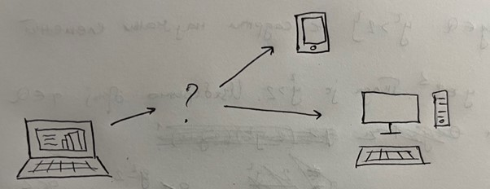
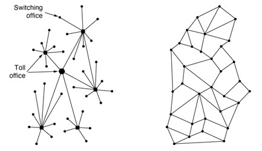
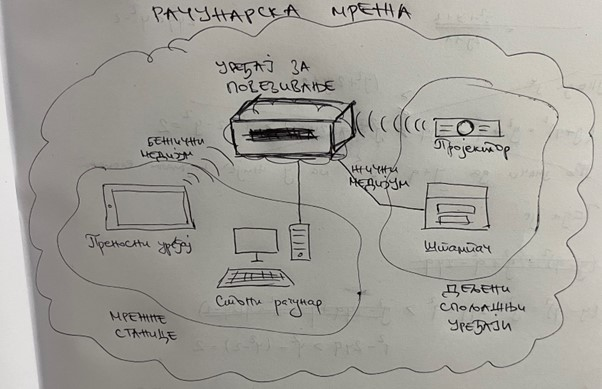
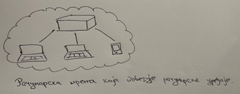
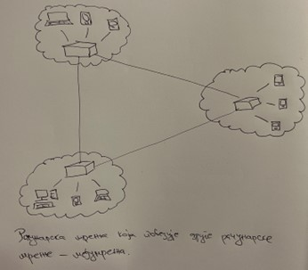

Појам и сврха рачунарске мреже
==============================

До сада сте упознали велики број аспеката рачунарства и његових примена. Свако од вас је у могућности да покрене неки алат који поседује на рачунару и да изврши неки задатак у том алату. Можете и да напишете програм у програмском језику који ће обавити неки задатак.   На пример, можеш да осмислиш и израдиш презентацију о твом омиљеном алату за прављење презентација (на пример, Microsoft PowerPoint).

Овако израђена презентација се налази складиштена на хард-диску твог рачунара и само јој ти имаш приступ (уз одговарајуће постављена права приступа). Шта ако желиш да поделиш презентацију са остатком одељења? Или ако желиш да пошаљеш презентацију професору на оцењивање? Осим што је свакоме од њих неопходан рачунар на ком би могли да погледају твоју презентацију, потребно је и да се ти рачунарски уређаји на неки начин повежу са твојим тако да се омогући размена датотека.

Зачеци рачунарских мрежа
________________________

Повезивање рачунарских уређаја, као што можеш да претпоставиш, није нова ствар. Па чак и приликом гледања овог курса твој рачунарски уређај је повезан са рачунарским уређајем на којем се овај курс налази. Међутим, да ли знаш да су се прве идеје повезивања рачунара јавиле у САД током шездесетих година прошлог века. Са једне стране, истраживачи су желели да комуницирају међусобно како би размењивали радове и документа. Са друге стране, војска САД је имала потребу за комуникационом мрежом између својих војних база која ће бити отпорна на офанзивне нападе Совјетског Савеза. Инжењер Пол Баран је, 1961. године, осмислио концепт размене пакета (*packet switching*). Његове напоре је препознала организација под називом *Advanced Research Project Agency* (*ARPA*), која је била део Министарства одбране САД, а финансирала је развој мреже рачунара познате као *ARPAnet*. Циљ ове мреже било је коришћење удаљених са подељеним временом (*timesharing*), чиме је било омогућено дељење телефонских линија на великим растојањима, што је у то време било веома скупо. *ARPAnet* мрежа је као идеја предложена 1966. и своју прву имплементацију је имала 1969. године. Због тога се *ARPAnet* данас сматра пиониром рачунарских мрежа.

Дефиниција рачунарске мреже. Интернет.
______________________________________

Рачунарска мрежа (*computer network*) представља систем који се састоји од хардверских уређаја који су међусобно повезани комуникационим водовима а снабдевен је софтверским системом који омогућава пренос података између умрежених уређаја.

Хардверски уређаји који учествују у рачунарској мрежи могу бити рачунарски уређаји (стони рачунари, лаптоп рачунари, преносни уређаји, паметни уређаји и сл.), а називају се мрежним станицама или хостовима (*host*). Они представљају примарне хардверске уређаје у мрежи, с обзиром на то да је најчешћи циљ управо умрежавање  таквих уређаја. Поред њих, постоје и други хардверски уређаји који учествују у рачунарским мрежама. То су дељени спољашњи уређаји. Њихов циљ је да опслуже кориснике услугама које примарни хардверски уређаји не поседују, и то су скенери, штампачи и др. Зовемо их дељеним зато што се они најчешће умрежавају са већим бројем мрежних станица. На пример, у једној канцеларији се може пронаћи на десетине стоних рачунара за којима раде запослени, а сви ти рачунари су умрежени са једним штампачем који корисници деле међу собом. Коначно, можемо говорити и о уређајима за повезивање или активним мрежним уређајима, који на неки начин активно учествују у остваривању мреже међу осталим уређајима. Примери уређаја за повезивање су: понављач, мост, усмеривач, итд. О њима ће бити више речи касније.
Комуникациони водови представљају физичке канале комуникације путем којих се извршава пренос података у виду сигнала. Они се деле на жичне и бежичне. Под жичним подразумевамо све оне технологије код којих се сигнал преноси опипљивим медијумима (бакарна жица, коаксијални кабл, оптички кабл, итд.). Бежичне комуникационе водове карактеришу медијуми који су најчешће део електромагнетног спектра (радио-таласи, микроталаси, светлосни зраци, итд.). Одабир комуникационог вода може утицати на разне карактеристике мреже приликом њеног успостављања.

Као што видиш, рачунарске мреже представљају мреже које повезују различите уређаје. Често није довољно успоставити везу између пара рачунара (и, евентуално, неких уређаја за повезивање) како бисмо успоставили комуникацију. Узмимо за пример твоју средњу школу. У њеним кабинетима постоје рачунари које могу да користе ученици, рачунари за професоре, рачунари за запослене у администрацији, итд. Они су повезани различитим комуникационим водовима у мрежу твоје средње школе. На сличан начин, нека друга средња школа има успостављену мрежу својих рачунара. Ако желимо да успоставимо комуникацију између тих средњих школа, потребно је да повежемо њихове мреже у једну, већу мрежу (сада говоримо о умрежавању мрежа). На сличан начин можемо повезати све средње школе у једном граду у једну мрежу града, па затим све градове у мрежу државе, итд. Када говоримо о успостављању мрежа између мрежа, говоримо о међумрежама (*internetwork*), односно о интернету (*internet*). Ако сада проширимо дискусију на све рачунарске уређаје и све мреже које постоје на свету, онда добијамо једну мрежу за коју можемо рећи да представља „мрежу свих мрежа“. Та мрежа се назива интернет (*Internet*). 

.. infonote::

    **Обратите пажњу**: Примети разлику између два појма „интернет“ – на енглеском језику постоји и разлика у писању, малим, односно великим словом.   Интернет (властита именица) представља мрежу која се добија када се умреже све мреже на свету, док је интернет (заједничка именица) назив за било које (макар две) мреже међу којима је успостављена комуникација. Иако би било пожељније да се други (општији) појам назива неким другим именом (отуда смо и навели прво термин „међумрежа“) како би се избегло мешање појмова. Установљен је превод „интернет“ добијен као позајмљеница од речи *internet* на енглеском језику (што је, само по себи, скраћени облик термина *internetwork*).

