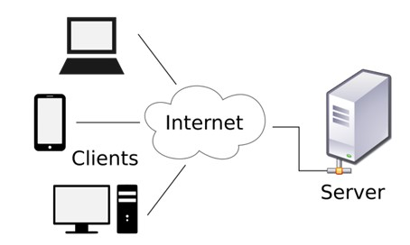
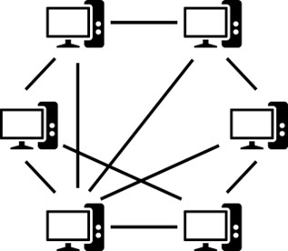

Основне класификације мрежа
===========================

Видели смо да мрежне уређаје повезујемо у мреже, а да тако настале мреже можемо повезати у нове мреже „на вишем нивоу“, које поново можемо повезивати у нове мреже, итд. То значи да су мреже организоване по хијерархијском принципу. Мреже „ниског нивоа“ у таквој хијерархији имају мањи распон, с обзиром на то да повезују уређаје који су релативно близу једни другима (у истој просторији, у истом објекту и сл.). Са друге стране, мреже „високог нивоа“ имају виши распон, јер повезују уређаје на потенцијално удаљеним локацијама (у оквиру града или државе или између држава и континената). Према томе, мреже према распону можемо класификовати на:

- Личне мреже (*personal area network, PAN*), које углавном служе за потребе једног лица. На пример, можеш повезати лаптоп рачунар и мобилни телефон коришћењем бежичне *Bluetooth* технологије како би ти нотификације са мобилног телефона пристигле на рачунар док радиш на њему. Додатно, можеш повезати штампач и рачунар како би штампао докумената или рачунар и телевизор за пројекцију мултимедијалног садржаја.
- Локалне мреже (*local area network, LAN*) углавном су приватне мреже које оперишу на нивоу стамбене јединице, канцеларијског простора или фабрике. Главни задаци локалних мрежа јесу дељење ресурса међу корисницима личних рачунара у тој мрежи и размена информација. Поред жичаних технологија као што су коаксијални каблови или *Ethernet*, данас су све чешће бежичне конекције, као што је *WiFi*.
- Мреже градског распона (*metropolitan area network, MAN*), као што им име говори, покривају једну градску зону. Вероватно најпознатији пример оваквих мрежа јесу мреже кабловске телевизије. Као пример врста мрежа које су умрежене на „високом нивоу“ у хијерархији мрежа, у оваквим мрежама је реткост да рачунари буду директно повезани (за разлику од, на пример, *PAN* мрежа). Приликом комуникације између два рачунара, подаци од једног рачунара путују кроз велики број уређаја за повезивање (и, наравно, комуникационих водова) пре него ли буду испоручени до другог рачунара.
- Мреже широког распона (*wide area network, WAN*) представљају мреже које покривају велике географске просторе, као што су државе, континент, па чак и више континената. У случају пословних мрежа, компанија која има представништва у Београду, Минхену и Чикагу може конструисати *WAN* мрежу која ће повезивати канцеларије у наведеним представништвима за потребе размене информација и датотека, организовање састанака „на даљину“, итд. *WAN* мреже су мреже на још „вишем нивоу“ у хијерархијској организацији мрежа, те подаци у комуникацији између два рачунара који пролазе кроз овакве мреже, бивају обрађени од стране још више уређаја за повезивање. Интернет се може сматрати још и као *WAN* мрежа на „највишем нивоу“ у хијерархији мрежа.

.. learnmorenote:: Ако желиш да знаш више: Образложи зашто је вероватније да ћеш исту датотеку брже пребацити преко рачунарске мреже између два рачунара у истој учионици него од твог кућног рачунара до наставничког рачунара?

    Два рачунара у истој учионици су повезани у *LAN* мрежу врло ниског нивоа, те због тога подаци прелазе мањи пут (с обзиром на број уређаја за повезивање и комуникационих водова), док су кућни рачунар и наставнички рачунар повезани у *MAN* мрежи, те ће више уређаја за повезивање учествовати у комуникацији. Сваки од тих уређаја мора да врши разна израчунавања како би се подаци послали на исправно одредиште, те је време за које подаци пређу пут који садржи мање уређаја за повезивање (по правилу, али не нужно) краће.

Поред овакве поделе мрежа, можемо говорити и о улогама које рачунари имају у мрежама. Различите улоге диктирају различите моделе по којима можемо поделити мреже. У том смислу говоримо о подели рачунарских мрежа на клијент-сервер мреже и мреже равноправних рачунара.

У клијент-сервер (*client-server*) моделима, сви рачунари се могу сврстати у две групе – клијентски рачунари (или само „клијенти“) и серверски рачунари (или само „сервери“). На пример, ако желиш да претражиш додатне информације о темама на које су професори причали на неком од часова у школи или желиш да пронађеш рецепт за колаче, вероватно ћеш отворити веб-прегледач на свом рачунару и консултовали Гугл претраживач. У претрази ћеш пронаћи неке од популарних електронских енциклопедија, као што је Википедија, или веб-портале посвећене кувању. У оба случаја, твој рачунар комуницира са удаљеним рачунарским системима који ти пружају могућност да претражујеш информације о разним темама (Википедија), односно да научиш неки нови рецепт (кулинарски веб-портал). У таквој комуникацији твој рачунар представља клијентски уређај, чији је циљ да омогући кориснику комуникацију са удаљеним рачунарским системима, који заузврат опслужују разне сервисе, те се стога називају серверски рачунарски системи. Сервери су рачунари који представљају ослонац оваквог модела, с обзиром на то да су они ти који испуњавају захтеве великог броја клијентских уређаја. Сва комуникација се врши између клијентских уређаја и сервера, док клијентски уређаји (по правилу) не комуницирају међу собом. Клијентски уређаји, поред остваривања комуникације са серверима, служе још и да кориснику прикажу информације које добију од сервера, да пошаљу нови кориснички захтев серверу (захтев за нови Википедија чланак или нови рецепт) и сл. Напоменимо да у случају неких сложенијих сервиса клијентски уређаји могу имати и сложеније улоге (обрада догађаја у видео-играма) премда се сервери и даље сматрају кључним уређајима у мрежи. 

Са друге стране, имамо модел равноправних рачунара (*peer-to-peer*) у којима се информације размењују између уређаја који чине једну рачунарску групу. Сви рачунарски уређаји могу комуницирати са свим осталим уређајима у групи. Не постоји један издвојени уређај који управља комуникацијом. Најпознатији пример мреже са моделом равноправних рачунара је *BitTorrent*, који не поседује јединствену базу клијената у мрежи, већ сваки уређај управља својом локалном базом осталих уређаја. Уређај који приступи мрежи може од неког, већ умреженог уређаја преузети базу уређаја и приступити информацијама о садржају на тим уређајима и њиховим базама уређаја. Овакве мреже често служе за размену садржаја, углавном мултимедијалних, али и докумената и других информација.

Занимљивост: Концепт торента (*torrent*) често се доводи у везу са пиратеријом, с обзиром на то да разни системи за пиратерију користе торент за размену садржаја. Важно је да разумеш да систем торента, сам по себи, није нелегалан, али да размена садржаја за које немамо лиценцу која дозвољава слободну дистрибуцију јесте пример пиратерије.