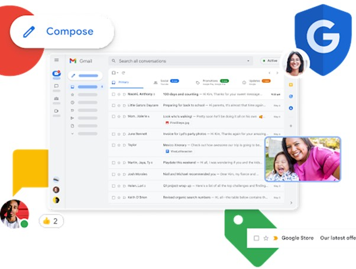
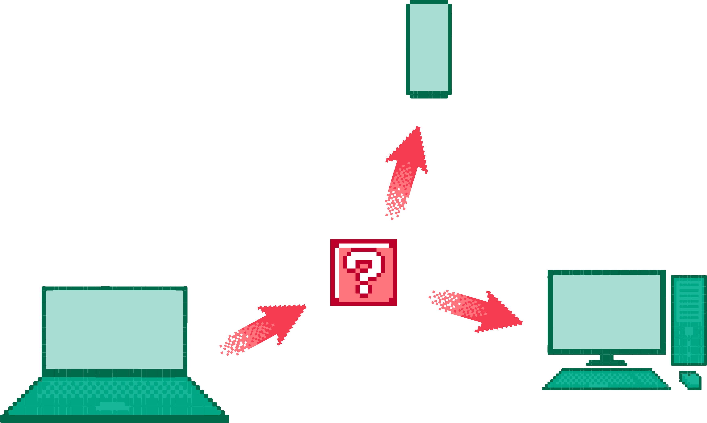
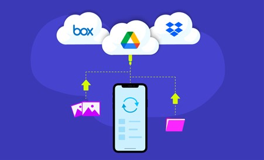
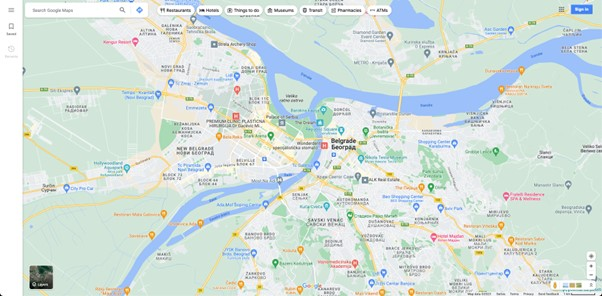

Интернет сервиси
================

Не можемо говорити о интернету, а да не поменемо неке од најважнијих услуга које су развијене захваљујући њему. Због своје архитектуре, интернет је омогућио развој великог броја сервиса. Неки од њих, као што су електронска пошта или дискусионе групе, датирају још од доба *ARPAnet* мреже. Пошто се развој интернет сервиса не зауставља, природно је очекивати да ћемо у будућности видети и неке нове.

Веб
___

Као најкоришћенији сервис који је изграђен над интернетом, глобална рачунарска мрежа (www – *world wide web*), која се популарно назива само „веб“ (*web*), често се меша са самим појмом интернета. Веб није ништа друго него скуп протокола и софтвера који, ослањајући се на механизме које интернет као рачунарска мрежа пружа, омогућава корисницима да приступају и прегледају документе у формату који називамо хипертекст (*hypertext*). Основна одлика хипертекста у односу на традиционалне документе јесте могућност нелинеарног прегледања садржаја. На пример, када читамо неку књигу, то обично радимо тако што читамо текст одозго-надоле (тј. од врха до дна странице). За разлику од књига и сличних докумената, хипертекст омогућава појаву веза (*link*) између садржаја, те корисници могу читати, на пример, садржај који се налази на једној страници, а затим, пратити везу која се налази на средини странице која води ка садржају било на истој или на некој другој страници. Дакле, не постоји јединствен начин за конзумирање садржаја. У поглављу 2 ћемо детаљније разматрати аспекте веба када будемо изучавали језик за обележавање хипертекста. Апликације које омогућавају прегледање веба су: *Google Chrome*, *Firefox*, *Opera*, *Safari*, *Microsoft Edge* и др.

.. learnmorenote:: Занимљивост: Укратко о историјату веба. 

    Тим Бернерс-Ли је крајем осамдесетих година 20. века започео развој на алату који би истраживачима у Европској организацији за нуклеарно истраживање (*фран.  Conseil Européen pour la Recherche Nucléaire, CERN*) помогао да побољшају механизме за управљање и дељење докумената. Године 1991. CERN је први пут употребио апликацију за чију је имплементацију Тим Бернерс-Ли најзаслужнији. Од тада до данас појавио се велики број сличних апликација, а све њих називамо веб-серверима (*web server*). Те апликације се инсталирају на рачунаре који потом користе тај софтвер да опслуже захтеве за документима у формату хипертекста. Обрати пажњу да рачунаре на којима се инсталирају веб-сервер апликације такође називамо веб-серверима. Као што видимо, терминологија у рачунарским мрежама има тенденцију да више појмова назива истим именима, те је потребно да пажљиво усвајаш те појмове, како те не би збуњивали.

Електронска пошта
__________________

Потреба за разменом порука датира још од древног Египта, када су фараони користили курире како би разгласили одредбе по својој територији (око 2400. п.н.е.). Због тога није ни чудно што електронска пошта представља један од најстаријих сервиса интернета. Годишње се размени неколико милијарди порука. Електронска пошта функционише по принципу приватних поштанских сандучића (*inbox*), који се налазе на неким серверима на интернету, а које обезбеђују компаније, универзитети, добављачи интернета и др. Свако сандуче се на јединствен начин идентификује електронском адресом која садржи карактер „@“ који раздваја корисничко име (*username*) од домена (*domain*) сервера електронске поште. Поруке се шаљу у текстуалном формату (што је основна одлика и „обичне“ поште), али могу да обухвате и прилоге (*attachment*), најчешће у виду мултимедијалних и других датотека. Уз сваку поруку би требало навести наслов (*subject*) и главног примаоца. Додатно, могуће је послати поруку на више адреса. Преглед сандучета, слање и подешавање порука, али и многе друге могућности, корисници имају на располагању кроз разне клијентске апликације за електронску пошту (инсталиране на свом рачунару или доступне путем веб-прегледача). Неке од најпознатијих апликација су *Microsoft Outlook*, *Apple Mail*, *Mozilla Thunderbird*, *Google Gmail*, *Yahoo! Mail* и др. Три најважнија протокола која се користе у имплементацији ових сервиса су: *POP3*, *IMAP* и *SMTP*.

Пренос датотека
________________

Поред електронске поште, пренос датотека такође представља један од старијих интернет сервиса, који датира још од раних седамдесетих година прошлог века. Пренос датотека по правилу подразумева двосмеран пренос између клијента и сервера. Сервери који складиште датотеке обично се идентификују адресом која почиње на „ftp“. Главни протокол који се користи у ове сврхе јесте *FTP*, а поред њега се користе још и *SFTP* и *SCP*, који почивају на употреби *SSH* протокола како би се омогућила заштита комуникације између клијента и сервера путем шифровања.

Удаљен приступ
______________

Овај сервис омогућава корисницима да путем интернета приступе удаљеним рачунарима. Након успешног пријављивања, они имају могућност да користе удаљени рачунар као да је у питању локални рачунар. У основној варијанти, корисници имају приступ командној линији удаљеног рачунара. Задавањем команди, удаљени рачунар извршава одговарајуће акције, а резултати тих акција се приказују кориснику у оквиру командне линије. Најчешће коришћени протоколи за удаљен приступ су *TELNET* и *SSH*. Неки сложенији алати омогућавају удаљени приступ комплетног графичког корисничког интерфејса, као што су *Remote Desktop*, *TeamViewer*, итд.

Складишта датотека
__________________

С обзиром на то да већина сервиса електронске поште ограничава величину датотека које се прилажу порукама, развијени су сервиси за складиштење и дељење датотека. Корисници могу да поставе велике датотеке на сервере и да затраже адресе са којих се те датотеке могу касније преузети. Ови сервиси обично нуде знатно сложеније управљање датотекама у односу на сервисе за пренос датотека. Неке од могућности које издвајају ове сервисе су: подешавања контрола приступа на нивоу појединачне датотеке (модели „само-за-читање“ (*read-only*) и „читање-и-измена“ (*read-write*)), дељење датотека са другим корисницима, конкурентне измене, аутоматска синхронизација, итд. Поред клијентских веб-апликација, које раде на принципу *HTTP* протокола, савремени сервиси за складиштење датотека обично нуде и велики број матичних апликација на разним уређајима, како би корисници могли да приступају својим датотекама у било ком тренутку. Примери најпознатијих сервиса овог типа су: *Microsoft OneDrive*, *Google Drive*, *MEGA*, *Dropbox*, итд.

Човек-човек комуникација
________________________

Како је електронска пошта представљала одговор интернета на традиционалну пошту, тако се јавила потреба за интернет сервисима који би на неки начин представљали пандан мобилној телефонији. 

Као први од таквих сервиса размотрићемо „ћаскање“ (*chat*), које омогућава корисницима да се повежу и дискутују о темама уживо. Теме су обично представљене собама за ћаскање (*chat room*), којима корисници приступају како би се укључили у дискусију. Собе су обично јавног или приватног карактера, уколико је тема намењена за дискурс између циљаних корисника. Сервиси ћаскања су данас обично засновани на специфичним протоколима (као што је *Internet Relay Chat, IRC*) или се користе веб-собе за ћаскање (као у случају апликације *Discord*).

Размена порука уживо се може обавити путем сервиса за инстант поруке (*instant messaging*). Основна разлика између ова два сервиса је у томе да се, подразумевано, инстант поруке размењују између два лица, док ћаскање обухвата већу групу људи. Неки од популарних сервиса који су специјализовани за инстант поруке, али подржавају и разне друге услуге, јесу: *Viber*, *WhatsApp*, *Telegram*, *Skype*, итд.

Друштвене мреже се могу сматрати кулминацијом развоја видова интеракције између људи. Можемо их разумети као системе у којима је ток информација диктиран везама између корисника. За разлику од система ћаскања где ће поруку неког корисника видети сви чланови собе у којој је та порука послата (тј. ток информација је одређен тиме да ли неко припада соби или не), у оквиру друштвене мреже имамо сложеније односе који одређују до којих корисника ће нека информација досегнути. На примеру друштвене мреже Фејсбук, објаву неких корисника могу видети:

1. само корисници који су поставили објаву, 
2. њихови „пријатељи“, 
3. „пријатељи њихових пријатеља“ или 
4. свако ко досегне до те објаве. 

Поред размена порука, друштвене мреже омогућавају још и склапање нових познанстава, слање вести и др. Неке од друштвених мрежа су специјализоване за садржаје који нису чисто текстуални, као што је Јутјуб, систем у оквиру којег се дискусија између корисника води на нивоу постављених видео-записа у оквиру канала. Поред специфичности формата садржаја, постоје и друштвене мреже које су специјализоване за одређене домене. На пример, друштвена мрежа Линкдин је намењена за склапање пословних конекција, претрагу база послова и др. Примери друштвених мрежа су: Фејсбук, Твитер, Инстаграм, ТикТок, Јутјуб, Линкдин, итд.

.. learnmorenote:: Занимљивост: Да ли сте знали да готово свака друштвена мрежа своје податке моделује помоћу графова?

    Због својих алгоритамских карактеристика, графови су се показали као подесна структура за обраду великих података међу којима постоји велики број односа. На примеру друштвене мреже Фејсбук, сваког корисника, страницу, па чак и објаву бисмо могли да моделирамо по једним чвором графа, а односе међу њима („корисник А је пријатељ корисника Б“, „корисник А прати страницу Ц“) по једном граном између одговарајућих чворова. Анализирањем оваквог графа могли бисмо донети закључке који нам не би били видљиви на први поглед. Овакве анализе се користе, на пример, у системима препоручивања реклама.

Електронска трговина и банкарство
__________________________________

Не би било погрешно рећи да је интернет омогућио експлозиван раст пословања. Данас је веома једноставно отворити онлајн компанију која корисницима нуди производе или услуге. Због погодности „куповине од куће“, корисници се све више ослањају на електронску трговину, поготово у случајевима када се куповина врши из интернет продавница у другим градовима или државама, уз могућност доставе на кућну адресу. У случају било каквих потешкоћа са коришћењем производа, често је могуће консултовати онлајн приручнике за употребу.

Поред електронске трговине, још један сервис који корисници све више користе јесте електронско банкарство. Овај сервис подразумева вођење банкарских рачуна, пренос новца између банкарских рачуна, плаћање рачуна, па чак и управљање инвестицијама.

Неки од најпопуларнијих модела електронске трговине наведени су у наредној табели:

+---------------------------------+------------+----------------------------------------------------+
| Име модела електронске трговине | Скраћеница | Пример                                             |
+=================================+============+====================================================+
| *Bussiness-to-consumer*         | B2C        | Наручивање књига онлајн.                           |
+---------------------------------+------------+----------------------------------------------------+
| *Bussiness-to-bussiness*        | B2B        | Произвођач аутомобила наручује гуме од добављача.  |
+---------------------------------+------------+----------------------------------------------------+
| *Government-to-government*      | G2C        | Влада испоручује формуларе за порезе становништву. |
+---------------------------------+------------+----------------------------------------------------+
| *Consumer-to-consumer*          | C2C        | Корисници лицитирају половну робу.                 |
+---------------------------------+------------+----------------------------------------------------+
| *Peer-to-peer*                  | P2P        | Дељење аудио и осталих датотека.                   |
+---------------------------------+------------+----------------------------------------------------+

Електронско учење. *MOOC*
__________________________

Огромна количина информација је данас распрострањена на интернету. У добу када готово свако домаћинство има уређај са приступом интернету, никада није било једноставније доћи до информација на најразличитије теме. Неки сервиси су се издвојили као незаобилазне ризнице знања, као што је електронска енциклопедија *Wikipedia*, која има и српску верзију, Википедију. Овај сервис нуди могућност претраживања појмова и преглед доступних информација у виду чланака који су повезани са тим појмовима. Поред тога, корисници могу бити и уредници чланака, односно могу изменити постојеће садржаје или отварати нове чланке. Овакав сервис називамо слободним (*open-source*), јер свако ко има приступ интернету има могућност управљања садржајем. Због тога се често тачност информација у чланцима доводи у питање. Пре него што се ослонимо на добијене информације, увек их је неопходно проверити са другим изворима. Један механизам у ове сврхе који Википедија подржава јесте цитирање, односно повезивање тврдњи у чланку са изворима изван Википедије који потврђују те тврдње.

Електронске енциклопедије су корисне када знамо тачно шта претражујемо. Оно што таквим сервисима недостаје јесте редослед усвајања информација у циљу остваривања комплетнијег знања из неке области. У ту сврху постоје сервиси који систематизују знање на начин који представља пандан традиционалном формалном или стручном образовању. У овим, масовним, слободно доступним онлајн курсевима (*massive open online courses, MOOC*), предавачи потпуно електронски организују знање постављањем текстуалног, али и мултимедијалног садржаја, као и садржаја за вежбу. Курсеви који обрађују елементарније теме могу бити организовани тако да не захтевају никакво предзнање од полазника, док је за неке напредније теме потребно познавање одређених тема. Петља је пример сервиса на којем потпуно бесплатно можете пронаћи и похађати велики број курсева који систематично представљају знање из најразличитијих области рачунарства и информатике. Штавише, овај курс који похађате у оквиру нет.кабинет платформе је управо пример *MOOC* курса. Други примери оваквих платформи су: *Coursera*, *edX*, *Udacity*, *Udemy*, итд.

Географски информациони системи
_______________________________

Зарад једноставности сналажења у простору данас је доступан велики број сервиса који садрже географске информације, као што су мапе, сателитски снимци, базе података са географским позицијама од интереса (стајалишта јавног превоза, продавнице, ресторани, музеји и др.). Овакви сервиси се називају географски информациони системи. Поред претраживања и прегледа ових информација, они често имплементирају и неке напредније функције попут израчунавања руте између одабраних локација, предвиђања оптималног пута између локација и сл. Сервиси овог типа су: *Google Maps*, *Apple Maps*, *PlanPlus*, итд.

Рачунарство „у облацима“
________________________

Поред сервиса који су намењени широком спектру људи, неки сервиси се издвајају као подршка раду у сложеним пословним доменима. Ови сервиси нуде подршку на различитим нивоима – од готових софтверских решења спремних за употребу па све до контроле рачунарских ресурса на ниском нивоу, као што је управљање диском и инсталација софтвера на оперативном систему, зависно од потреба које пословни домени захтевају. Све сервисе овог типа, који апстрахују детаље имплементације (на различитим нивоима) и омогућавају корисницима да их употребљавају без подешавања у оквиру својих рачунарских центара, чије одржавање може бити веома напорно и скупо, сврставамо под термином рачунарство „у облацима“ (*cloud computing*). Ове сервисе можемо сврстати у наредне три категорије:

- Инфраструктура као сервис (*infrastructure as a service, IaaS*) – где се корисницима нуде услуге ниског нивоа, као што су: виртуелне машине, непосредно управљање серверима, уређајима за складиштење података, мрежом, итд.
- Платформа као сервис (*platform as a service, PaaS*) – где се корисницима нуде услуге за развој и одржавање апликација, као што су: базе података, окружења за покретање апликација, веб-сервери, складишта података, алати за развој и осматрање рада апликација, итд.
- Софтвер као сервис (*software as a service, SaaS*) – где се корисницима нуде саме апликације које опслужују захтеве, као што су: системи за управљање садржајем, системи за управљање пројектима, системи за обраду финансија, веб-конференције, четовање, аналитика, видео-игре, итд.

За оне који развијају софтвере најпопуларнији системи који нуде услуге платформе као сервиса данас су: *Amazon Web Services*, *Microsoft Azure* и *Google Cloud Platform*. Ови системи дају готове сервисе који су спремни за употребу путем интерфејса за програмирање апликација (*Application Programming Interface, API*). На развијаоцима софтвера је да користе ове интерфејсе приликом развоја апликација, а да притом не брину о инфраструктурним проблемима.

