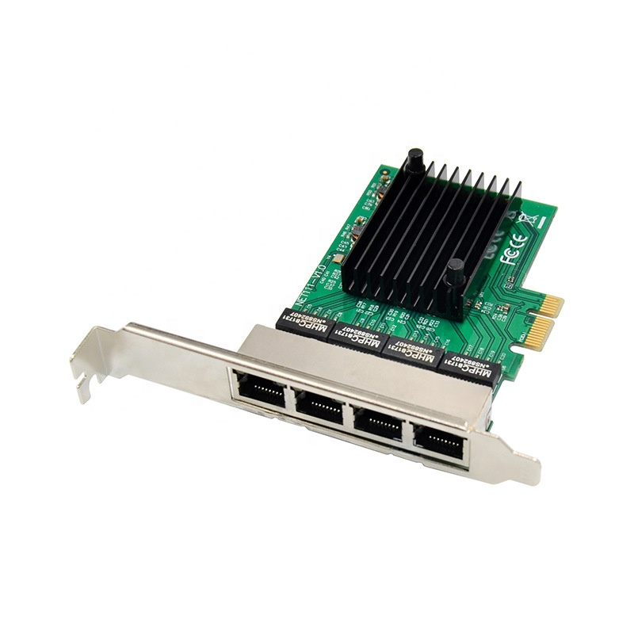
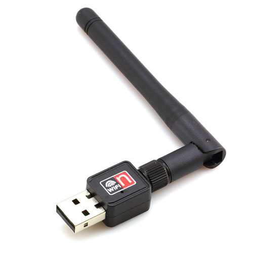

Улоге мрежног хардвера
======================

Мрежне станице (*host*), као што смо већ рекли, представљају рачунарске уређаје између којих је неопходно успоставити комуникациону везу. У зависности од тога које су карактеристике рачунарске мреже са којом је потребно умрежити неку мрежну станицу, мрежна станица мора да садржи одговарајуће хардверске компоненте. Већина рачунара данас поседује мрежне картице за жичано (на пример, стони рачунари) или бежично повезивање (на пример, мобилни телефони и таблети). Постоје и уређаји који омогућавају оба приступа (на пример, лаптоп рачунари).

За жичано повезивање рачунари имају мрежну картицу или мрежни контролер (*Network Interface Controller, NIC*), који се уграђује у рачунар или му се придодаје као спољашњи додатак (на пример, путем USB порта). Излаз из мрежне картице данас је најчешће прикључак на који се прикључује одговарајући мрежни кабл (обично је то *RJ45* прикључак на који се прикључује *UTP* кабл). 

    *NIC* са *RJ45* прикључком

    *UTP* кабл

За бежично повезивање користи се мрежна картица за бежично повезивање (*Wireless Network Interface Controller, WNIC*) која обично долази у виду картице која се уграђује на матичну плочу рачунара или прикључује на USB улаз.

    *WNIC* који се прикључује на матичну плочу

    *WNIC* са *USB* прикључком

Постоји неколико технологија које се користе за пренос података у мрежним картицама. Обично се у мрежама „ниског нивоа“ користи технологија *Ethernet*. Због тога се данас мрежне картице некада називају Ethernet картице, прикључци *RJ45* *Ethernet* прикључци, а *UTP* каблови *Ethernet* каблови.