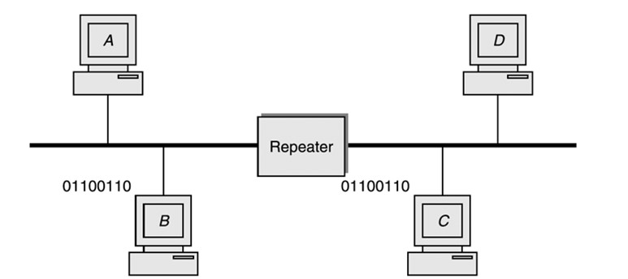
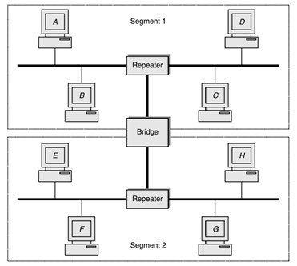
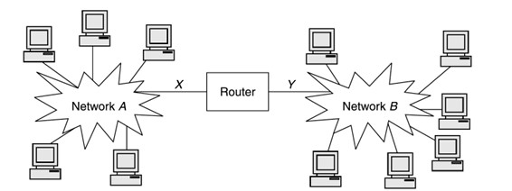
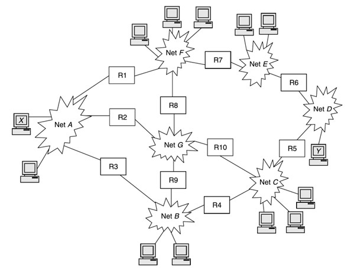
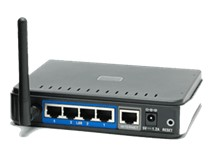

Уређаји за повезивање
=====================

Уређаји за повезивање служе за умрежавање и чине окосницу рачунарских мрежа. Сви мрежни уређаји се могу груписати у две категорије: 
1. мрежни уређаји  
2. међумрежни уређаји. 

Мрежни уређаји служе за повезивање мрежних станица у оквиру једне мреже, док међумрежни уређаји служе за повезивање између мрежа. У мрежне уређаје убрајамо појачиваче и мостове, док у међумрежне уређаје убрајамо усмериваче и мрежне пролазе.

Понављач или репетитор (*repeater*) представља електронски уређај чија је улога да регенерише сигнал. Сигнали путују путем неког медијума – на пример, жицом – и на том путу слабе или се кваре под утицајем спољашњих сметњи. Понављач прихвата овакав сигнал и регенерише га, пре него што сигнал настави даље свој пут кроз медијум. Овде користимо термин „регенерација“ сигнала уместо „појачавање“ како се понављачи не би довели у конфузију са уређајима који се називају појачивачи (*amplifier*), који се користе за аналогне сигнале.

За разлику од понављача који представљају једноставне електронске уређаје, мост (*bridge*) је уређај налик поједностављеном рачунару (са својим процесором, меморијом и двема мрежним картицама) који повезује два дела једне мреже и олакшава комуникацију између два мрежна уређаја. Главна идеја за коришћење мостова јесте разбијање сложене мреже на мање делове које називамо сегменти (*segment*). На наредној слици видимо пример мреже која је подељена на два сегмента коришћењем моста. Иако делује да је улога моста идентична улози понављача, ипак постоји значајна разлика. За разлику од понављача који једноставно прослеђује регенерисани улазни сигнал, мост прослеђује податке искључиво оном сегменту мреже коме је улазни сигнал од значаја. Овим се омогућава смањење количине непотребног протока података кроз мрежу.

Мостови се ослањају на чињеницу да сви уређаји у мрежи користе исту технологију за умрежавање. У случају да постоје уређаји који су повезани у различите врсте мрежа (на пример, једна жична и једна бежична), мост неће моћи да умрежи уређаје у овим мрежама. У те сврхе се користе напреднији уређаји за комуникацију, као што је усмеривач или рутер (*router*). У примеру на наредној слици усмеривач повезује мреже А и Б, од које свака има своју технологију повезивања мрежних станица. Усмеривач остварује везу између ове две мреже тако што се повезује са мрежом А путем приступне тачке :math:`ПТ_{А}` користећи мрежну картицу за умрежавање на мрежу прстена, док се са мрежом Б повезује преко приступне тачке :math:`ПТ_{Б}` користећи мрежну картицу за умрежавање на мрежу магистрале. Наравно, могуће су и друге комбинације технологија, па чак и повезивање између више од две мреже коришћењем више од једног усмеривача.

Поред комуникације између различитих типова мрежа, усмеривачи имају још једну важну функционалност. На наредној слици можемо видети међумрежу која садржи већи број мрежа и усмеривача. Уколико је потребно да се подаци пренесу са рачунара :math:`Р_{A}` у мрежи *А* на рачунар :math:`Р_{Д}` у мрежи *Д*, постоји више путева кроз међумрежу којим ти подаци могу проћи. Неки од њих су:

- РА – A – У2 – Г – У10 – Ц – У5 – Д – Y
- РА – A – У1 – Ф – У7 – E – У6 – Д – Y
- РА – A – У3 – Б – У4 – Ц – У5 – Д – Y
- …

Није свеједно којим ће путем подаци тећи кроз мрежу. Велики број параметара утиче на одабир пута којим ће податак протећи кроз неки део мреже. Узимајући те параметре у обзир, задатак усмеривача је да одабере најоптималнији пут којим ће проследити податке даље кроз мрежу. Овај задатак се назива усмеравање или рутирање (*routing*).

Као што смо видели, усмеривачи могу да проследе податке између хетерогених типова мрежа. Међутим, да би то функционисало, мреже морају имати заједничке протоколе за пренос података. Ако две мреже не користе исте протоколе, усмеривач неће моћи да проследи пакете из једне мреже у другу. Мрежни пролази (*gateway*) представљају уређаје који имају могућност да преброде ово ограничење. Да би то испунио, мрежни пролаз мора да узме у обзир све различитости које карактеришу хетерогене мреже и да изврши трансформацију података између тих мрежа. Због тога мрежни пролази представљају најсложенији тип уређаја за повезивање.

Још један мрежни уређај који издвајамо јесте модем (*modem*, скраћено од *modulator-demodulator*). Модем је уређај који претвара податке из дигиталног записа у формат погодан за аналогни преносни медијум, као што је телефон или радио. Примарни циљ модема јесте повезивање уређаја у мрежи путем жице која није оригинално намењена за дигитални пренос података или путем бежичног медијума. Модем се обично набавља од добављача интернета и повезује се на неки од комуникационих водова који одговарајући добављач интернета нуди (на пример, упредене парице фиксне телефоније, коаксијални кабл кабловске телевизије или на бежичне мреже мобилних оператера).

Напоменимо још да данас постоје уређаји који имају вишефункционалну улогу. На пример, уређај за успостављање бежичне комуникације може имати улогу приступне тачке, моста и рутера.

