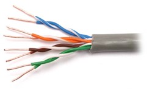
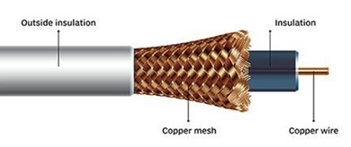
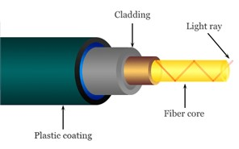

Комуникациони водови
====================

Подсетимо се да су комуникациони водови (*transmission media*) жични или бежични медијуми који преносе податке кроз мрежу. Основна мера квалитета комуникационог вода јесте брзина преноса, или проток (*bandwidth*), која се изражава бројем битова који се пренесу кроз медијум у једној секунди, у ознаци b/s, односно bps (*bit per second*). Пошто се датотеке на рачунарима изражавају у бајтовима, често је од значаја изразити брзину преноса бројем бајтова у секунди, у ознаци B/s, односно Bps (*byte per second*). С обзиром на знање које до сада имаш, можеш претпоставити да важе следећи односи:

::

    1 bps = 0,125 Bps
    1 Bps = 8 bps

Узимајући у обзир данашње технологије преноса података   у рачунарским мрежама, обично говоримо о овим јединицама мере у милионима (*Mbps* за милион битова (мегабит) у секунди, односно MBps за милион бајтова (мегабајт) по секунди) или милијардама (Gbps за милијарду битова (гигабит) у секунди, односно GBps за милијарду бајтова (гигабајт) по секунди).

.. learnmorenote:: **Ако желиш да знаш више**: Замислимо да постоји компанија која је дуго пословала на западу САД, а која жели да пресели своје пословнице на исток САД. Један од задатака који има пред собом јесте пребацивање огромне количине архивираних података (реда величине у петабитовима, а који су складиштени на спољашњим дисковима) између тих пословница. Један начин да се ти подаци пренесу јесте путем мреже широког распона која је установљена између тих пословница. Можеш ли да осмислиш алтернативни приступ преноса истих података који би био знатно бржи?

    За огромне количине података складиштење на спољашњим дисковима и пренос путем саобраћајних возила, често је брже решење. Рецимо да један диск може складиштити 30 TB. У кутију величине 60  60  60 cm можемо сместити 1000 оваквих дискова, чији је укупни капацитет складишта 800 TB, односно 6,4 петабита. Кутија дискова се може доставити било где у САД у року од једног дана. Једноставном рачуницом добијамо пропусност трансфера од 6400 терабитова/86.400 секунди, односно мало више од 70 Gbps (гигабајта по секунди). Ако је путно растојање између пословница свега један сат, онда се пропусност трансфера подиже на 1700 Gbps. Ниједна мрежа данас не може достићи ову пропусност.

Друга важна мера квалитета је кашњење (*latency*), које представља време које је потребно да се компонента припреми за приступ подацима. У мрежама „ниског нивоа“ мери се у микросекундама, док се у оквиру већих мрежа мери у милисекундама.

Жичне технологије преноса података
__________________________________

Један од најстаријих медијума за пренос података која се и данас активно користи јесте упредена парица (*twisted pair*). Упредена парица се састоји од две бакарне жице, обично пречника по 1 милиметар. Жице су испреплетене попут навоја у ДНК молекулу. Разлог за упредање јесте што се таласи који се емитују из различитих жица поништавају чиме се умањује таласно зрачење. Сигнал се обично преноси као разлика у напону између упарених жица. Преношење сигнала као разлике између два нивоа напона уместо апсолутног напона обезбеђује бољу отпорност на спољашње сметње јер шум има тенденцију да утиче на напон који путује кроз обе жице на исти начин остављајући диференцијал релативно непромењеним. Најчешћа примена упредених парица је у системима телефоније. И телефонски позиви и ADSL приступ интернету могу да протичу кроз овај медијум. Упредене парице могу да пренесу сигнал неколико километара пре него што сигнал захтева употребу понављача. Упредене парице се могу користити за пренос аналогних или дигиталних информација. Брзина преноса зависи од дебљине жице и пређене удаљености, али за неколико километара могу се постићи брзине од неколико стотина Mbps.

Други уобичајени медијум за пренос података је коаксијални кабл (*coaxial cable*). Коаксијални кабл се састоји од чврсте бакарне жице као језгра, окружене изолационим материјалом. Изолатор је обложен цилиндричним проводником, често као уско плетена мрежа. Спољни проводник је прекривен заштитним пластичним омотачем. Коаксијални кабл има бољу заштиту и већи пропусни опсег од незаштићених упредених парица, тако да подаци могу да прођу веће удаљености при већим брзинама. Обично се користе за пренос радио и телевизијског сигнала (зато се називају још и антенски каблови), али су са појавом кабловског интернета постали значајан део рачунарских мрежа.

Оптички каблови (*optical fiber cable*) користе се за пренос података преко великих раздаљина, високопропусним *LAN* мрежама и за брзи приступ интернету. Систем оптичког преноса података има три кључне компоненте: извор светлости, медијум за пренос и детектор. Уобичајено, пулс светлости означава бит 1, док одсуство светлости означава бит 0. Преносни медијум је ултратанко стаклено влакно. Детектор генерише електрични импулс када светлосни зрак падне на њега. Повезивањем извора светлости на један крај оптичког влакна и детектора на други добијамо једносмерни систем преноса података који прихвата електрични сигнал, претвара га и преноси светлосним импулсима, а затим поново конвертује излаз у електрични сигнал на крај који га прихвата. Чињеница да оптичка технологија има изузетно велику пропусну моћ чини ову технологију скупом за инсталирање и одржавање, те се она углавном користи за кичмени стуб (*backbone*) интернета. Достижни пропусни опсег са оптичком технологијом је већи од 50.000 Gbps (50 Tbps), међутим, ми нисмо ни близу достизања ових граница. Тренутна практична граница од око 100 Gbps долази од наше немогућности да електрични сигнал брже претварамо у оптички. 

Бежичне технологије преноса података
_____________________________________

*Bluetooth* је бежична технологија која је намењена за комуникацију на веома малим раздаљинама. У зависности од класе уређаја та раздаљина је до десет, односно до сто метара. Брзине преноса овом технологијом могу ићи до 3 Mbps. *Bluetooth* технологија је заснована на радио-таласима, те може да прође и кроз чврсте препреке. Њена примарна употреба је у комуникацији рачунара са периферијским уређајима, у мобилној технологији, као и у уређајима који учествују као део технологије „интернет ствари“ (*Internet of Things, IoT*). *Bluetooth Low Energy* (*BLE*) стандард, мада дели име са *Bluetooth* стандардом, представља независну бежичну технологију у *PAN* мрежама са циљем да се смањи количина потрошене енергије. Усмерен је пре свега на нове примене у здравству, индустрији фитнеса, безбедности, малих паметних уређаја у комерцијалним окружењима и индустрији кућне забаве.

Бежични *LAN* (*wireless LAN, WLAN*) представља технологију која користи радио-таласе за бежичну комуникацију више уређаја на ограниченом растојању реда величине *Bluetooth* технологије. Међутим, њена пропусна моћ иде далеко више од пропусне моћи *Bluetooth* технологије. Најраспрострањенији стандард за бежичну *LAN* комуникацију је *IEEE* 802.11, познатији под именом *Wi-Fi* (*wireless fidelity*). Брзина преноса зависи од верзије стандарда. У наредној табели можете пронаћи брзине преноса за различите верзије стандарда. Може се рећи да су код нас данас најзаступљеније верзије стандарда 802.11g и 802.11n.

+--------------------------+-----------------+-------------------------------+
| Верзија *IEEE* стандарда | Година усвајања | Највећа брзина протока (Mbps) |
+==========================+=================+===============================+
| 802.11be                 | 2024            | 1367 - 46120                  |
+--------------------------+-----------------+-------------------------------+
| 802.11ax                 | 2019/2020       | 574 , 9608                    |
+--------------------------+-----------------+-------------------------------+
| 802.11ac                 | 2014            | 433 - 6933                    |
+--------------------------+-----------------+-------------------------------+
| 802.11n                  | 2008            | 72 - 600                      |
+--------------------------+-----------------+-------------------------------+
| 802.11g                  | 2003            | 6 - 54                        |
+--------------------------+-----------------+-------------------------------+
| 802.11.a                 | 1999            | 6 - 54                        |
+--------------------------+-----------------+-------------------------------+
| 802.11b                  | 1999            | 1 - 11                        |
+--------------------------+-----------------+-------------------------------+
| 802.11                   | 1997            | 1 - 2                         |
+--------------------------+-----------------+-------------------------------+

Бежичној *LAN* мрежи се приступа преко приступних тачака (*access point*). Област простора у којој је мрежа доступна назива се тачка приступа (*hotspot*). Поменимо још један стандард, *IEEE 802.16*, који је познат под именом *WiMAX* (*worldwide interoperability for microwave access*), који представља бежичну мрежу која покрива шира подручја. Иницијално, овај стандард је дизајниран да подржи протоке до 40 Mbps, али постоји унапређење из 2011. године које даје проток до 1 Gbps за фиксне станице.

Ћелијски системи (*cellular network* или *mobile network*) представља бежичну телекомуникациону мрежу, дистрибуирану преко неке регије која се састоји од ћелија, те отуда и назив система. Свака ћелија садржи макар једну базну станицу која тој ћелији омогућава покривеност мрежом. Како су ћелијски системи, пре свега, намењени за повезивање преносних уређаја на интернет, у ћелијским системима важан је концепт примопредаје сигнала (*handover*). Примопредаја сигнала се дешава када уређај који има остварену конекцију са базном станицом у једној ћелији пређе у другу ћелију. У тој ситуацији се фреквенција из прве ћелије аутоматским механизмом претвара у фреквенцију у другој ћелији, без прекида сигнала.

За повезивање удаљених тачака и пренос података, али и телефонског и телевизијског сигнала, користе се и комуникациони сателити постављени у орбиту на висини од 36.000 километара. Брзина комуникације је релативно мала у поређењу с оптичким кабловима (нa пример, 100 Mbps), али ипак има случајева у којима је сателитска комуникација погоднија (пре свега, када је постављање кабла скупо или неизводљиво).
