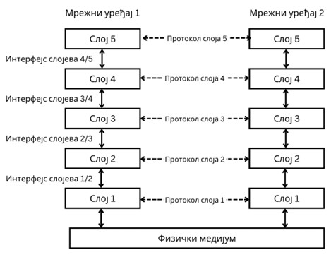
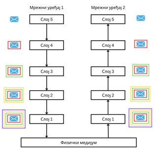
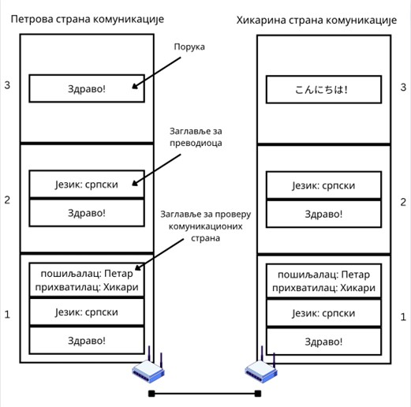

Слојеви и протоколи
===================

Рачунарске мреже су изузетно сложене, што се показало и када смо говорили о њиховим компонентама. Тада је било прилике да видиш само неке од изазова са којима се сусрећеш при конструкцији рачунарских мрежа, а говорили смо и о неким њиховим решењима. Неки од тих изазова су високог нивоа, као што је, на пример, питање на који начин ће веб-прегледач са клијентског рачунара формирати захтев за неки веб-сервер. Са друге стране, можеш се запитати како смо сигурни да се низови битова који се шаљу кроз жицу заиста преносе без грешака. Ово је питање веома ниског нивоа. Наравно, постоје и изазови који су смештени између ове две крајности, као што је питање остваривања комуникације између две хетерогене мреже. 

Како би се ови и многи други изазови пребродили, било је неопходно осмислити модел који ће категорисати сва сродна питања у имплементацији мрежа, управо са циљем да се поједностави начин на који разматрамо комуникацију између делова мрежа. Тако су настала два популарна модела која почивају на концепту слојева (*layer*) који су организовани у стек (*stack*), односно слојеви вишег нивоа су изграђени над слојевима нижих нивоа. Оваква организација омогућава да слојеви нижих нивоа нуде могућности слојевима виших нивоа а да ови други притом не брину о детаљима имплементације, вођењу рачуна о грешкама и сл. У рачунарству се ова појава назива апстракција (*abstraction*). Апстракција нижих слојева се врши тако што нижи слој своје могућности нуди посредством интерфејса (*interface*), што не представља ништа друго него уговор путем којег виши слој користи могућности нижег слоја. 

На пример, ако желиш да пошаљеш електронску поруку неком од ученика из одељења, апликација електронске поште ти даје могућност слања и примања електронских порука – то је уговор који ти имаш са том апликацијом (интерфејс). Како се тачно поруке размењују, теби није важно, све док је порука успешно послата (апстракција). 

Још један важан концепт који описана организација омогућава назива се протокол (*protocol*). Протокол, у општем смислу, представља унапред дефинисан договор између две стране у комуникацији. У слојевитој организацији рачунарских мрежа, када говоримо о протоколу, говоримо о стандардима који се имплементирају и оквиру слојева на истим нивоима како би се омогућила комуникација између мрежних уређаја. Апстракција је од изузетног значаја за омогућавање протокола јер, како би два уређаја комуницирала коришћењем истог протокола (дакле, на истом слоју комуникације), важно је да се подразумева функционисање протокола нижих слојева а да и не познајемо детаље о њима. 

У поменутом примеру са електронском поштом, ти као пошиљалац поруке и одговарајући прималац поруке морате прво разменити адресе електронске поште пре него пошаљеш поруку. Размена адреса у овом примеру представља протокол који сте установили пре извршавања комуникације. Уместо тога, могли сте користити неки други протокол, као што је размена корисничких имена у оквиру неких система за ћаскање или друштвених мрежа. Наравно, сви ови протоколи подразумевају да су ваши уређаји повезани на интернет и да је могуће остварити комуникацију на нижим слојевима.

На слици изнад можеш видети односе између слојева, интерфејса и протокола у примеру организације мреже на пет слојева. Важно је да разумеш да се подаци у стварности не преносе између слојева на истим нивоима. На пример, када говоримо о томе да слојеви на нивоу 3 комуницирају путем протокола 3, то заправо значи да слој 3 на мрежној станици 1 прослеђује податке слоју 2, који (након обраде пристиглих података) даље те податке прослеђује слоју 1, који (поново, након обраде пристиглих података) прослеђује те податке путем неког физичког медијума (електричним импулсима, фотонима, радио-таласима, итд.). Када сигнали са физичког медијума стигну до мрежног уређаја 2, онда их слој 1 коришћењем протокола 1 обрађује и прослеђује слоју 2, који (поново, након обраде пристиглих података) даље те податке прослеђује слоју 3. Наредна слика илуструје описано понашање. 

Иако сте ти и прималац твоје електронске поруке остварили комуникацију разменом адреса електронских пошти, ти подаци су се коначно пренели кроз мрежу неким комуникационим водовима. Лепота слојевите организације рачунарских мрежа нам омогућава да не бринемо о проблемима који се могу јавити на ниским нивоима приликом слања електронских порука.

У пракси, број слојева, одабир протокола и интерфејса се може дефинисати на различите начине. Сви ови елементи заједно чине архитектуру мреже (*network architecture*). Специфично, одабир протокола и њихова подела на слојеве је позната као стек протокола (*protocol stack*). У вези са овим је важно разумети на који начин се поруке (*message*) размењују између слојева. 

Као пример узећемо размену порука на системима за ћаскање. Замислимо два ученика, Петра из Србије и Хикари из Јапана. Петар жели да пошаље поруку Хикари да је обавести да ће његова породица бити њен домаћин приликом размене ученика између њихових школа. Наставници су унапред обавестили Петра и Хикари о њиховим корисничким именима путем измишљеног система за ћаскање „Моје друштво“. Петар шаље поруку „Здраво!“ на српском језику путем мобилне апликације. На следећем слоју, апликација прихвата његову поруку и додаје информације о језику поруке као заглавље (*header*) те поруке, формирајући на тај начин нову поруку која ће бити прослеђена нижем слоју операцијом која се зове замотавање (*packing*). На следећем слоју, апликација дописује информације о пошиљаоцу и примаоцу, како би порука стигла на право одредиште. Посредством мобилног оперативног система порука се шаље радио-таласима Wi-Fi комуникационим водом у оквиру Петрове PAN мреже на интернет. Порука путује кроз Интернет мрежу док коначно не стигне у PAN мрежу у Хикариној соби. На Хикарином преносном рачунару, који је повезан Ethernet прикључком, сигнали се прихватају и обрада пристигле поруке се врши у редоследу супротном него у Петровом случају. Прво најнижи слој проверава заглавље пристигле поруке. 

С обзиром на то да се користи исти стек протокол између апликација на Петровом мобилном уређају и Хикарином преносном рачунару, најнижи слој на Хикарином уређају унапред очекује да пронађе информацију о пошиљаоцу и примаоцу у заглављу поруке. Након што је провера заглавља била успешна, из поруке се уклања заглавље чиме се добија нова порука која се прослеђује слоју изнад процесом који се назива одмотавање (*unpacking*). На овом слоју апликација очекује да добије поруку која у заглављу садржи изворни језик поруке. Проналази да је у питању српски језик и покреће преводилац који ће одмотану поруку претворити у јапански језик. Порука се шаље слоју изнад који приказује поруку `こんにちは` (*kon’nichiwa* – јапански поздрав приликом сусрета двоје људи) у оквиру Хикарине апликације. У случају да су се стек протоколи између апликација разликовали на било који начин (било бројем слојева, редоследом примене или одабиром протокола на слојевима), комуникација не би била успешна и грешка би била пријављена.

Иако је овај пример био једноставан, формални модели архитектура рачунарских мрежа који су данас у употреби користе идентичне принципе. Постоје два модела који су од значаја: OSI модел и TCP/IP модел.