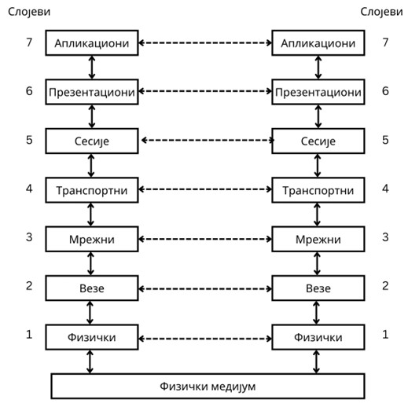
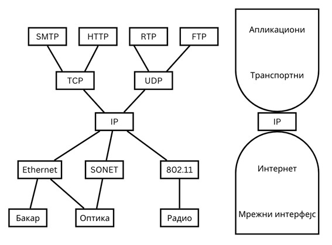
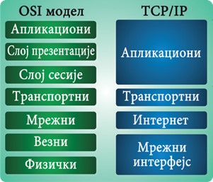

Преглед модела архитектура рачунарских мрежа
============================================

OSI модел (*Open Systems Interconnection*) предложила је Међународна организација за стандарде (*International Standards Organization, ISO*) као први корак у стандардизацији протокола рачунарских мрежа. Први предлог је осмишљен 1983. године, а 1995. године је ревидиран. Као што видиш са наредне слике, OSI модел подразумева постојање седам слојева (без физичког медијума).

Са друге стране, TCP/IP модел (*Transmission Control Protocol/Internet Protocol*) представља најпопуларнији модел за архитектуру рачунарских мрежа. Он се користио у оквиру ARPAnet мреже, а користи се и данас у оквиру интернета. Због тога ћемо обратити управо ову архитектуру у оквиру овог курса. TCP/IP модел се састоји од наредна четири слоја (овде набројаних од највишег до најнижег):

- Апликациони слој (*application layer*) описује две врсте протокола. Први су кориснички протоколи који омогућавају сервисе корисницима директно, а други су протоколи подршке који омогућавају основне системске функције. Међу најзначајнијим корисничким протоколима су HTTP (веб), SMTP (електронска пошта) и TELNET   (удаљени приступ), а међу протоколима подршке вероватно најинтересантније је поменути DNS (систем имена домена).
- Транспортни слој (*transport layer*), као што му назив говори, одговоран је да се порука у целовитости пренесе са једног на други крај комуникације. У протоколе транспортног слоја припадају TCP и UDP.
- Интернет слоју (*internet layer*) припада протокол IP који користе сви транспортни протоколи за пренос података. Интернет слој је задужен за усмеравање пакета преко различитих уређаја у оквиру мреже.
- Слој мрежног интерфејса (*link layer*) служи како би се омогућило да мрежни уређај пошаље, односно прихвати поруке у мрежи у којој је повезан. Протокол слоја мрежног интерфејса обезбеђује овај интерфејс. Прецизније, он одређује како се порука организује у оквире (*frame*) и како доставити те оквире кроз мрежу. Очигледно, исправна испорука порука је једна од главних одговорности овог слоја.

Наредна слика приказује поглед на TCP/IP модел у виду „фигуре пешчаног сата“ и илуструје IP протокол као средишњи протокол који повезује протоколе вишег нивоа (на апликационом и транспортом слоју) и протоколе нижег нивоа (на интернет и мрежном слоју).

Однос између OSI и TCP/IP модела се може поједностављено приказати наредном сликом.

Иако ниједан од модела не помиње физички медијум експлицитно, важно је назнанчити да се на дну стека протокола мора налазити још један слој, који ћемо назвати слој физичког медијума (*physical medium layer*), који дефинише правила по којима се битови преносе са једног краја медијума на други крај. Ова правила говоре о механичким, електричним, функционалним и процедуралним аспектима тог механизма.