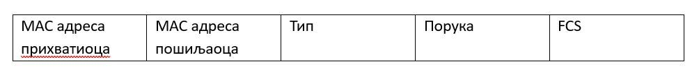

Слој мрежног интерфејса
=======================

Поменули смо да је слој мрежног интерфејса одговоран за пренос битова између компонената у рачунарској мрежи. На поруку која пристиже са интернет слоја додаје се заглавље на почетак и контролни суфикс на крају поруке. Тиме се добије група битова који чини један оквир (*frame*). Овај оквир представља јединицу података која ће бити прослеђена кроз физички медијум у виду одговарајућих сигнала.

Задаци слоја мрежног интерфејса
_______________________________

Пошто се на овом слоју комуникација врши између суседних уређаја у истој мрежи, приликом комуникације ти уређаји морају да се договоре око великог броја фактора како би се битови послали између тих уређаја. Неки од тих параметара су: напон који чини вредност бита 0, напон који чини вредност бита 1, који је интервал између слања два бита (тј. брзина бита), да ли се комуникација одвија само у једном или у оба смера истовремено, итд. Овај слој се такође бави електричним и механичким спецификацијама каблова, конектора и интерфејса, итд.

Контрола тока (*flow control*) представља механизам управљања количином података која се шаље кроз мрежу пре прихватања потврде да су ти подаци стигли на другу страну и представља један од најважнијих задатака мрежног слоја. У већини протокола, контрола тока се састоји од скупа процедура којима се пошаљиоцу налаже колико података може да пренесе пре него што мора да сачека потврду од прихватиоца. 

Предах: Више пута смо скренули пажњу на то да комуникација између два уређаја у мрежи може да се упореди са разговором две особе. Зашто она особа која говори мора да води рачуна о брзини којом изговара речи? Можеш ли да препознаш макар два разлога која иду у прилог овој чињеници? Покушај да направиш паралелу са контролом тока података између два уређаја у мрежи.

Један од разлога зашто је контрола тока важна јесте због тога што сваки уређај који прихвата податке има ограничену количину меморије у коју складишти те податке. Велика количина долазних података може да оптерети онога ко те податке прихвата. Прихватилац такође мора да буде у стању да обавести уређај који шаље податке о томе да ће његова меморија бити препуњена и да захтева од пошиљаоца да шаље мањи број оквира или да привремено заустави слање. 

Други разлог је тај што долазни подаци морају бити проверени и процесирани пре него што их уређај искористи. Количина података која се подвргава овим операцијама је често спорија од брзине преноса. Због тога, уређаји који прихватају податке садрже блок меморије који се зове бафер (*buffer*) и резервисан је за складиштење долазних података пре него што се процесирају. Међутим, и овај бафер је ограничене величине, те ако постоји бојазан да се препуни подацима, прихватилац мора да обавести пошиљаоца да обустави слање података док не буде у стању да их поново прихвати.

Оквири и MAC адресе
___________________

У најважније информације заглавља оквира слоја мрежног интерфејса спадају адресе уређаја. Адресе на овом слоју представљају физичке адресе суседних уређаја у оквиру мреже рачунара са којег се оквир шаље. Самим тим, ове адресе се мењају како оквир пролази кроз уређаје у мрежама. Адресе крајњих рачунара, тј. рачунара који се налазе на крајевима комуникације (рачунар са којег се порука шаље и рачунар којем се порука шаље) већ су записане као део података који су прослеђени на слој мрежног интерфејса са интернет слоја, тако да те адресе остају непромењене.

Вероватно се питаш како уређаји у оквиру једне мреже познају адресе својих суседа. Мрежа мора сваком уређају да додели јединствен идентификатор како би уређаји знали коме треба да пошаљу оквире. Ово је једна од главних одговорности мрежних картица. У оквиру сваке мрежне картице се уграђује јединствени идентификатор од 48 битова који се назива MAC адреса (*Media Access Control*). MAC адресе се обично представљају помоћу 6 парова хексадекадних бројева раздвојених карактером „:“ (на пример, A4:09:4D:FF:13:9C). Произвођачи мрежних картица су у обавези да контактирају Институт инжењера електронике и електротехнике (*Institute of Electrical and Electronics Engineers, IEEE*) како би заузели MAC адресе које се уграђују у ROM меморију мрежних картица. Прва три пара јединствено одређују произвођача, док преостала три пара представљају серијски број мрежне картице.

.. suggestionnote:: **За оне који желе да знају више:**

    Можеш једноставно проверити MAC адресу мрежне картице свог рачунара позивом одговарајућих алата командне линије у зависности од оперативног система:

    - За *Windows* фамилију система је доступан алат: *ipconfig /all*
    - За *macOS* фамилију система је доступан алат: *ifconfig*
    - За *Linux* фамилију система је доступан алат: *ip a*

    Пример резултата позива алата *ifconfig* за *macOS* оперативни систем можеш да видиш на наредној слици. Покушај да пронађеш MAC адресу у датом испису.

    .. image:: ../../_images/slika_33a.jpg
        :width: 780
        :align: center

На наредној слици можеш видети како се MAC адресе користе приликом конструисања оквира у Ethernet технологији. Примети да оквир почиње MAC адресом мрежне картице уређаја којем се подаци шаљу, за којом следи MAC адреса мрежне картице уређаја који тај податак шаље. Следеће поље се односи на тип протокола којим се означава шта је учаурено унутар оквира. Затим, следи поље које садржи поруку, односно конкретне податке које је неопходно пренети кроз мрежу. Мрежна картица, која процесира оквир, уопште не узима у обзир садржај овог поља. То може бити захтев за веб-страницом, делић неког документа, коментар на Инстаграм објави или било шта друго. Мрежна картица ће пренети тај податак кроз мрежу на идентичан начин, без обзира на то о чему је реч. Коначно, последње поље у оквиру представља специјалан део који се назива секвенца за проверу оквира (*Frame Check Sequence, FCS*), а чија је улога у провери валидности података. FCS секвенца користи алгоритам бинарне аритметике који се назива CRC (*Cyclic Redundancy Check*), који мрежна картица користи како би проверила да ли су пристигли подаци без грешака.

Класе сервиса слоја мрежног интерфејса и грешке
_______________________________________________

Слој мрежног интерфејса се може дизајнирати тако да пружи различите сервисе интернет слоју. Можемо размотрити наредне три класе сервиса:

- Сервис без конекције и без потврде (*connectionless service without acknowledgement*): У овом сервису подразумева се да рачунар који шаље податке то ради тако што шаље независне оквире а да их рачунар који их прихвата не потврђује. Ethernet је пример сервиса мрежног интерфејса који функционише по овом принципу. Не постоји никаква логичка конекција која се успоставља пре слања оквира, односно раскида након завршетка комуникације. Ако је неки оквир изгубљен у тој комуникацији, не постоји никакав механизам детекције и опоравка на овом слоју. Ова класа сервиса је погодна када су грешке ретке и обрада грешака се препушта вишим слојевима. Такође, корисна је у ситуацијама када је брзина преноса важнија од квалитета података, као што су гласовни или видео позиви.
- Сервис без конекције и са потврдом (*connectionless service with acknowledgement*): Ни у овом сервису не постоји конекција која се успоставља између уређаја, али овога пута се сваки оквир потврђује. На тај начин, рачунар који шаље оквире зна да ли је оквир успешно пристигао на одредиште или је изгубљен. Ако није пристигао у неком разумном времену, онда се може послати поново. Ова класа сервиса је погодна у непоузданим окружењима, као што су бежични системи. Wi-Fi је пример овог типа сервиса.
- Сервис са конекцијом и са потврдом (*connection-oriented service with acknowledgement*): Представља најсофистициранији тип сервиса на којем уређаји прво успоставе конекцију пре слања оквира. Сваки оквир који се шаље у оквиру конекције је нумерисан и слој мрежног интерфејса гарантује да је сваки оквир пристигао. Штавише, гарантовано је да је сваки оквир пристигао тачно једном и у исправном редоследу. Користан је за дугачке, непоуздане везе као што је сателитска конекција или дугачка телефонска линија. 

Како би понудио ове сервисе, мрежни слој мора да трансформише пристиглу поруку у низ битова које ће послати кроз физички медијум. Ниједан физички медијум није савршен и разни спољашњи утицаји, али и саме карактеристике медијума, могу довести до појаве грешака. Неки битови могу имати различите вредности, па чак и број прихваћених битова може бити различит од броја послатих битова. Дакле, мрежни слој мора да препозна да је дошло до грешке и, ако је потребно, изврши исправљање тих грешака. Постоје различити начини да се ово испуни, а алгоритми који се баве овим користе тзв. кодове за откривање и исправљање грешака (*error detection and correction code*).

