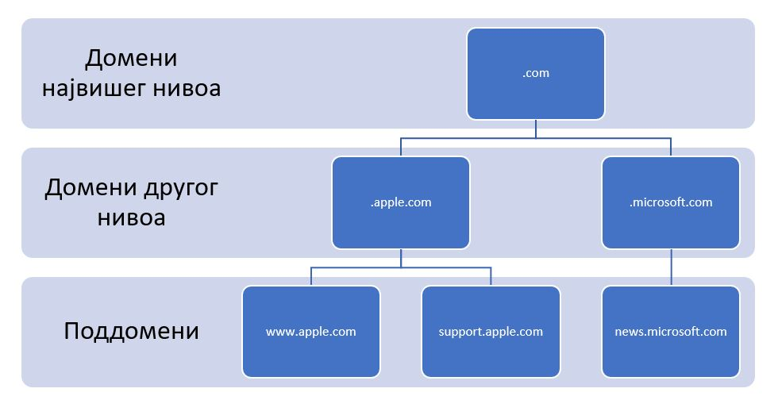

Интернет слој
=============

У претходној секцији је било прилике да видиш како подаци теку између два суседна уређаја у истој мрежи. Сада ћеш прећи на разматрање како подаци теку између мрежа.

Сврха интернет слоја
____________________

Поменули смо да је сврха интернет слоја усмеравање података између мрежа. Другим речима, потребно је пренети податке на путу између уређаја који шаље податке и уређаја који те податке прихвата. Како би се овај задатак остварио, можемо препознати две основне функционалности интернет слоја: 

- Адресирање (*forwarding*): Односи се на додељивање идентификатора уређајима и мрежама. У овом контексту, адресирање се обично односи на IP адресе. IP адресе се користе да би се јединствено идентификовали уређаји и мреже на интернету. IP адресе су 32-битни (у случају IPv4 верзије) или 128-битни (у случају IPv6 верзије) бројеви који су додељени различитим уређајима и мрежама. Сваки уређај или интерфејс мреже треба да има своју јединствену IP адресу како би могао да комуницира са другим уређајима на мрежи.
- Усмеравање или рутирање (*routing*): Представља процес одређивања пута којим се подаци шаљу између различитих мрежа на интернету. Када се подаци пошаљу са изворног уређаја ка одредишном уређају, усмеравање је задужено за налажење најефикаснијег пута (који се често зове још и „рута“, те отуда чешћи назив „рутирање“) којим ће подаци прећи преко мрежа. Усмеривачи (рутери) играју кључну улогу у усмеравању. Они анализирају информације у заглављима података и користе информације из својих табела усмеравања да би одлучили којим путем да проследе податке ка њиховим одредиштима. Усмеравањем се осигурава да ће подаци стићи на исправну адресу уз минималан трошак и омогућава комуникацију између уређаја на различитим мрежама.

Протокол IP
___________

IP (*Internet Protocol*) протокол је један од основних протокола у TCP/IP протокол стеку и служи за адресирање и преусмеравање података на интернету. Основна функција IP протокола је пренос података између различитих рачунара и мрежа на интернету. Он је одговоран за осматрање података који долазе са транспортног слоја и паковање тих података у пакете (*packet*), доделу IP адреса уређајима и усмеравање пакета преко мрежа на основу адреса.

Постоје две верзије IP протокола:

1. IPv4 (*Internet Protocol version 4*): Ово је најраспрострањенија верзија IP протокола која користи 32-битне IP адресе. IPv4 адресе се обично представљају у облику четири декадна броја између 0 и 255 раздвојених тачком, на пример, „117.045.000.255“. Често се водеће нуле изостављају, па ћеш чешће видети запис „117.45.0.255“. Број адреса које се могу записати у овој верзији је 232, што је око 4,3 милијарде.

 .. image:: ../../_images/slika_34a.jpg
        :width: 780
        :align: center
    
2. IPv6 (*Internet Protocol version 6*): Ова верзија IP протокола је осмишљена како би решила проблем ограниченог броја доступних IP адреса у IPv4 у добу када број мрежних уређаја расте великом брзином. IPv6 користи 128-битне IP адресе и обично се представљају у облику осам група четвороцифрених хексадекадних бројева раздвојених двотачкама, на пример, „2001:0db8:85a3:0000:0000:8a2e:0370:7334“. Као и у случају IPv4 адреса, водеће нуле се могу изоставити, а додатно, групе узастопних нула се могу скратити на „::“, чиме се добија наредни запис претходне адресе „2001:db8:85a3::8a2e:370:7334“.

Због распрострањености IPv4 адреса и спорог преласка на IPv6 адресе, у наставку ћемо разматрати аспекте IPv4 адреса. 

IP адресе су организоване у хијерархијску структуру која омогућава организацију и преусмеравање података на интернету. IP адресе се састоје од мрежног дела и хост дела. Мрежни део идентификује мрежу у којој се уређај налази, док хост део идентификује конкретан уређај (или подмрежу у случају да говоримо о међумрежама, због чега ћемо у наставку подразумевати и овај сценарио, a да га експлицитно не напомињемо) на тој мрежи. Још један важан појам је мрежна маска, битовска маска која дефинише колико битова у IP адреси представља мрежни део адресе. Она се користи за раздвајање мрежног дела и хост дела IP адресе. Мрежна маска одређује величину мреже и број доступних адреса у мрежи. На пример, ако прва 24 бита представљају мрежни део (самим тим, преосталих 8 битова представљају хост део) адресе, онда за пример хијерархијске организације неке мреже можемо узети, на пример, опсег адреса између 117.45.0.0 и 117.45.0.255. У овом примеру, сви уређаји у оквиру те мреже имају иста прва 24 бита (тј. део „117.45.0“), док последњих 8 битова јединствено идентификују уређаје у оквиру те мреже. Дакле, број уређаја у оваквој мрежи је 255, и један од њих може бити, на пример, 117.45.0.23. Како би се означила информација о мрежном и хост делу, користи се CIDR (*Classless Inter-Domain Routing*) нотација. У овој нотацији IP адреса је представљена у формату „адреса/маска“, где је „адреса“ сама IP адреса, а „маска“ одређује битове који представљају мрежни део адресе. У датом примеру, мрежа се може записати у CIDR нотацији као „117.45.0.23/24“. У оквиру сваке мреже, прва и последња адреса се користе у специјалне сврхе. Прва адреса (у нашем примеру „117.45.0.0/24“) сматра се адресом саме мреже, те се не препоручује за коришћење уређаја у оквиру те мреже, док се последња адреса (у нашем примеру, „117.45.0.255/24“) користи као адреса за јавно емитовање (*broadcast address*) тако што сваки пакет који се пошаље на ту адресу бива прослеђен свим уређајима у мрежи. 

Како би се решио проблем несташице адреса, одређене адресе су проглашене као приватне адресе, резервисане су за употребу у приватним мрежама и нису јавно приступне на интернету. Ове адресе се могу користити у локалним мрежама, као што су личне мреже или канцеларијске мреже. Приватни адресни опсези су:

- 10.0.0.0/8 (то су адресе од 10.0.0.0 до 10.255.255.255)
- 172.16.0.0/12 (то су адресе од 172.16.0.0 до 172.31.255.255)
- 192.168.0.0/16 (то су адресе од 192.168.0.0 до 192.168.255.255)

Занимљивост: Вероватно ти је позната IP адреса 192.168.1.1, позната као локални уређај (*localhost*). У питању је IP адреса која се за сваки рачунарски уређај односи управо на сам тај уређај. Ова адреса ти омогућава да приступиш ресурсима на свом рачунару. У поглављу о серверском програмирању ћеш се често сусрести са овом адресом, па је важно да је запамтиш.

Вероватно се питаш како усмеривачи знају да одреде уређај на који ће послати пакет. Сваки усмеривач садржи списак правила и информација за усмеравање IP пакета који се назива табела усмеравања (*routing table*). У табели усмеравања се налазе информације о доступним мрежама и најбољим путевима за прослеђивање пакета. Додатно, потребно је разрешити различите записе адреса између мрежа. У те сврхе користи се техника која се назива превођење мрежних адреса (*Network Address Translation, NAT*). NAT је технологија која се користи за превођење IP адреса из једног опсега у други опсег. Она омогућава да више уређаја из једне приватне мреже користи једну јавну IP адресу при комуникацији са интернетом.

Формат IP пакета
_________________

Пакети у IP протоколу се називају IP пакети или IP датаграми (*datagram*). Они се састоје од следећих елемената:

1. Заглавље (*header*): Садржи информације потребне за адресирање и усмеравање пакета. Укључује изворну IP адресу, одредишну IP адресу, информације о верзији протокола, контролне провере и друге параметре.
2. Подаци (*payload)*: Ово су сами подаци који се преносе у оквиру IP пакета, који су на интернет слој послати са транспортног слоја.

 .. image:: ../../_images/slika_34b.jpg
        :width: 780
        :align: center
    
IP пакети се прослеђују на слој мрежног интерфејса и користе се за одређивање најефикаснијег пута преко мрежа ка одредишту. Током преноса, рутери анализирају IP заглавље и користе информације из својих табела рутирања да одлуче како да преусмере пакете.

Стратегије додељивања IP адреса
________________________________

Вероватно се питаш како уређаји добијају IP адресе. Већ смо видели да сваки уређај у мрежи има своју јединствену MAC адресу која му се додељује на основу уграђене адресе NIC контролера (мрежне картице) којима се уређај повезује на мрежу. За разлику од њих, IP адресе се не уграђују у мрежне картице. Ипак, сваки уређај мора имати IP адресу како би рутери знали где да усмере пакете. Постоје две стратегије додељивања IP aдреса: статичко и динамичко.

При статичком додељивању, администратор мреже ручно задаје IP адресе уређајима. Ове IP адресе остају непромењене за сваки уређај. Основна карактеристика статичког додељивања је да се уређају додељује иста IP адреса при сваком подизању и спуштању мреже. Статичко додељивање има своје предности. С обзиром да се уређају увек додељује иста IP адреса, тиме су управљање мрежом и конфигурација уређаја једноставнији. Статичке IP адресе могу омогућити бољу безбедност, пошто се може ограничити приступ одређених IP адреса одређеним ресурсима. Међутим, статичко додељивање има и неке мане. Ручно додељивање IP адреса захтева више времена и напора администратора мреже, посебно у већим мрежама са више уређаја. Такође, ако два уређаја имају исту статичку IP адресу, може доћи до сукоба на мрежи. На пример, усмеривачи који претпостављају јединственост IP адреса у оквиру исте мреже неће знати којем уређају да пошаљу поруку.

При динамичком додељивању, IP адресе се аутоматски додељују уређајима помоћу протокола за динамичко додељивање IP адреса (*Dynamic Host Configuration Protocol, DHCP*). Када се уређај прикључи на мрежу, он захтева IP адресу од DHCP сервера, који му додељује доступну IP адресу из скупа свих слободних адреса. Динамичким додељивањем се аутоматски врши подешавање IP адреса на уређајима, што убрзава и поједностављује процес умрежавања. Из скупа доступних IP адреса, DHCP сервер додељује адресу само када је уређај активан, а када се искључи, адреса се поново ставља на располагање. Ово омогућава ефикасно и економично коришћење IP адресног простора. Један од изазова динамичког додељивања јесте што захтева конфигурацију и постављање DHCP сервера у мрежи, што може бити комплексно и захтевно у већим мрежама. Додатно, при сваком подизању мреже, уређају се може доделити друга IP адреса, што може ометати неке апликације или услуге које захтевају непроменљиву IP адресу.

Избор између статичког и динамичког додељивања IP адреса зависи од потреба и захтева мреже. Статичко додељивање се чешће користи за специфичне ситуације где су потребне непроменљиве IP адресе, док се динамичко додељивање користи за опште сценарије где су флексибилност и ефикасност битни.

+-----------------------------------+-------------------------------------------+
| **Статичко додељивање IP адреса** | **Динамичко додељивање IP адреса**        |
+===================================+===========================================+
| Постојаност и предвидљивост       | Променљивост IP адреса                    |
+-----------------------------------+-------------------------------------------+
| Боља безбедност                   | Аутоматско конфигурисање                  |
+-----------------------------------+-------------------------------------------+
| Ручна конфигурација               | Ефикасно и економично коришћење IP адреса |
+-----------------------------------+-------------------------------------------+
| Могућност колизије                | Изазови са конфигурацијом                 |
+-----------------------------------+-------------------------------------------+
    
DNS и IP адресе
________________

IP aдресе су првенствено намењене уређајима зарад извршавања алгоритама попут рутирања. Дизајн IP адреса никад није био намењен за људску употребу. Сложићеш се да ћеш много теже препоручити пријатељима да посете неки веб-сајт тако што унесу IP адресу у веб-прегледач. Било би значајно једноставније ако би се осмислио систем адреса који би био читљив за људе.

Систем имена домена (*Domain Name System, DNS*) представља управо такав систем. Његова главна одговорност јесте превођење читљивих имена домена (којима људи боље баратају) у IP адресе (којима уређаји боље баратају) и обрнуто. Адреса *petlja.org* коју унесеш у веб-прегледач када желиш да погледаш неки од доступних курсева на платформи Петља представља један пример имена домена.

Трансформација имена домена у IP aдресе назива се разрешавање имена (*name resolution*). Овај процес започиње, на пример, када унесеш име домена у адресну линију веб-прегледача. Тада, веб-прегледач шаље захтев за разрешавањем имена делу оперативног система који се назива DNS разрешивач (DNS *resolver*). DNS разрешивач прво претражује кеширане податке како би пронашао IP адресу која одговара имену домена. У случају да то не успе, захтев се прослеђује DNS серверима, који су организовани у хијерархијску структуру, све док се не нађе онај DNS сервер који има захтевану информацију (или се врати одговор о неуспешности разрешавања).

.. learnmorenote::

    **Занимљивост:** Покушавајући да посетиш непостојећу адресу http://petlja.organizacija/ у веб-прегледачу *Google Chrome*, добићеш обавештење као на наредној слици, које говори да је процес разрешавања имена завршен неуспешно, односно да не постоји IP адреса (па самим тим ни веб-сервер) који одговара имену домена *petlja.organizacija.*

    .. image:: ../../_images/slika_34d.jpg
        :width: 780
        :align: center
    
Као и DNS сервери тако и имена домена имају хијерархијску структуру. Угрубо, имена домена можемо сврстати у наредне три категорије (поређане од највише до најниже у хијерархији):

- Домени највишег нивоа: Представљају домене који обухватају домене највећег домена примене. У ове домене спадају:

    - Општи домени, који означавају сврху, тј. услуге које веб-сервер пружа, као што су *.com* (намењени за сврхе рекламирања), *.org* (намењени за употребу различитих организација), *.net* (традиционално намењени за добављаче интернет услуга, а данас се користе за различите сервисе на интернету), *.edu* и *.ac* (намењени за образовне институције), *.gov* (намењени за државне органе), и сл.
    - Државни домени, који означавају државу (често тиме и главни језик) на коју се веб-сервер односи, као што су: *.rs* (Република Србија), *.us* (Сједињене Америчке Државе), *.jp* (Јапан), и сл.

- Домени другог нивоа, који се бирају од стране организација, компанија, приватних лица и других ентитета како би на препознатљив начин репрезентовао њихов бренд, намена или услуга коју пружају, као што су: *google.com* (Гугл), *amazon.com* (Амазон), *petlja.org* (Петља) и сл.
- Поддомени, који служе зарад још прецизнијег степена категоризације у оквиру домена. На пример, компанија Гугл свој домен *google.com* може додатно категорисати у сврху претраживања веба доменом *www.google.com*, односно у сврху размене електронске поште доменом *mail.google.com*.

Напоменимо да домени највишег нивоа сами по себи нису намењени за идентификацију веб-сервера, већ се у те сврхе користе заједно са доменима другог нивоа и, евентуално, поддоменима.