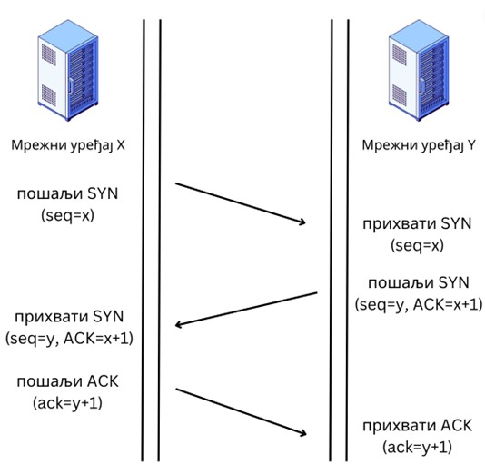

Транспортни слој
================

У TCP/IP стек протоколу транспортни слој је одговоран за поуздано достављање података између крајњих система (као што су рачунарски уређаји) преко мреже. Он нуди услуге за протоколе апликативног слоја и користи услуге интернет слоја испод њега. Два најзначајнија протокола транспортног слоја су: UDP (*User Datagram Protocol*) и TCP (*Transmission Control Protocol*).

Улоге транспортног слоја
________________________

Главне одговорности транспортног слоја су:

1.	Сегментација и поновно састављање: Транспортни слој прихвата податке примљене из протокола вишег слоја и дели их на мање јединице које се називају сегменти (у случају TCP протокола) или датаграми (у случају UDP протокола). Сегментација омогућава да се велике количине података ефикасно пренесу кроз мрежу и омогућава боље коришћење ресурса.
2.	Успостављање и прекидање везе: У случају TCP протокола, транспортни слој успоставља поуздану везу између пошиљаоца и примаоца пре него што почне пренос података. Механизам за успостављање везе се назива тросмерно руковање (*three-way handshake*), док се механизам за раскидање везе назива четворосмерно руковање (*four-way handshake*). UDP протокол, будући да се не ослања на остварену конекцију између уређаја, не укључује успостављање нити прекид везе.
3.	Поуздана испорука података: TCP обезбеђује поуздану испоруку података применом механизама као што су потврђивање, секвенцирање и поновно слање. Подаци се прихватиоцу достављају без грешке и у исправном редоследу. Приликом прихватања сегмента, прихватилац ће послати информацију о потврђивању. Ако је сегмент изгубљен или оштећен током преноса, пошиљалац ће га поново пренети.
4.	Контрола протока: Транспортни слој управља протоком података између пошиљаоца и примаоца како би спречио преоптерећење уређаја који добија више података него што може да обради. Механизми за контролу тока у TCP протоколу регулишу брзину преноса података на основу способности прихватиоца да обради податке.
5.	Контрола загушења: TCP укључује механизме за контролу загушења за спречавање загушења мреже, до чега долази када се мрежа преплави већом количином саобраћаја него што може да поднесе. 
6.	Мултиплексирање и демултиплексирање: Транспортни слој користи портове како би омогућио да више апликација или услуга истовремено раде на једном уређају. Мултиплексирање подразумева комбиновање података из различитих апликација у један ток за пренос. Демултиплексирање на крају пријема раздваја долазни ток података на основу портова и испоручује их одговарајућој апликацији. Тиме се остварује да свака апликација добије само оне податке који су јој намењени.
7.	Откривање грешака: Док TCP обезбеђује откривање грешака и поновно слање података, UDP нема уграђене механизме за опоравак од грешака. Уместо тога, UDP врши једноставан контролни механизам да би открио било какве грешке током преноса. Међутим, он не захтева поновни пренос изгубљених или оштећених пакета.

Протоколи транспортног слоја
_______________________________

Оба протокола имају своје карактеристике и користе се у различите сврхе.

UDP протокол
''''''''''''

UDP представља протокол без конекције, што значи да не постоје механизми за остваривање конекције пре слања података. Коришћењем UDP протокола пакети података (датаграми) шаљу се без гаранције да ће бити достављени, а при томе нису ни уређени. UDP не омогућава функционалности као што су: поузданост, контрола тока или контрола загушења. Уместо тога, апликационом слоју је остављено да води рачуна о препознавању грешака, поновном слању и другим механизмима, ако за тим има потребе.

На први поглед, може ти звучати као да UDP протокол има много мана, те се можеш записати зашто се он уопште и користи. Испоставља се да особине UDP протокола које смо поменули не само да не сметају великом броју апликација, већ су и пожељне. UDP је умногоме ”лакши” протокол од његовом стабилнијег рођака TCP по питању утрошње ресурса за обраду података, те је и његова обрада бржа. Због тога, апликације као што су стримовање аудио и видео садржаја, онлајн видео-игре, пренос уживо, и др., којима је важнија брзина и ефикасност испоруке података у односу на поузданост, пре ће се определити за слање података коришћењем UDP него TCP протокола.

Сваки UDP датаграм се састоји од заглавља, које садржи информације као што су изворни порт, одредишни порт, дужина и разне контролне информације, и података који садрже поруку коју апликације размењују.

TCP протокол
''''''''''''

TCP представља протокол који се заснива на конекцији и омогућава поуздану, уређену и робустну (отпорну на грешке) комуникацију између тачака пре самог слања података. TCP обезбеђује поуздану испоруку података кроз механизме као што су: потврђивање, поновни пренос и откривање грешака. Пружа функције као што су контрола протока и контрола загушења ради оптимизације брзине преноса података и спречавања загушења мреже. TCP се обично користи за апликације које захтевају поуздану и уређену испоруку података, као што су прегледање веба, пренос датотека, електронска пошта и било која друга апликација која захтева пренос без грешака.

Опишимо сада како функционише тросмерно руковање, механизам за успостављање конекције у TCP протоколу. Као што му и само име каже, овај механизам се састоји од три корака:

1.	Мрежни уређај X који жели да успостави конекцију шаље сегмент који садржи код SYN (*Synchronize Sequence Number*), којим се мрежном уређају Y са којим се конекција успоставља ставља до знања да ће мрежни уређај X започети комуникацију и којом секвенцом бројева ће започети сегменте.
2.	Мрежни уређај Y одговара слањем сегмента који садржи код SYS-ACK (*Acknowledgement*), којим се мрежном уређају X ставља до знања да је иницијални сегмент прихваћен. Уједно, наводи се и секвенца бројева којом ће мрежни уређај Y слати своје сегменте мрежном уређају X.
3.	Мрежни уређај X шаље сегмент који садржи код ACK, чиме се успоставља поуздана конекција којом ће се подаци слати.

TCP сегмент се састоји од заглавља и података. Неки од података који се налазе у TCP заглављу су: изворни и одредишни број порта, бројеви секвенце, бројеви потврђивања, заставице за потребе контроле (SYN, ACK, и др.), разне контролне информације, итд.

.. image:: ../../_images/slika_35b.jpg
        :width: 780
        :align: center

Портови
_______

Када пакет пристигне до неке мреже, на основу информација о IP адреси, рутери знају којем мрежном уређају треба да испоставе тај пакет. Међутим, како да рачунар коме је пакет пристигао зна којој апликацији да проследи податке. Приликом анализирања пакета на транспортном слоју, узима се у обзир одредишни број порта (*port*), који се чита из заглавља поруке. Порт је 16-битни број из опсега од 0 до 65535, који идентификује апликацију или сервис који је покренут на мрежном уређају. Комбинација IP адресе и порта јединствено идентификује крајњу тачку у оквиру неке мреже, такође познату као сокет (*socket*). На овај начин је омогућено да више апликација истовремено остварује независну конекцију са истог мрежног уређаја.

Приликом TCP руковања, мрежни уређаји размењују IP aдресе и бројеве портова како би остварили конекцију. Једном када је конекција остварена, мрежни уређаји могу да размењују податке коришћењем оствареног сокета, чиме се омогућава да подаци стижу исправним апликацијама на мрежним уређајима.

Како би се остварила доследност између широко-употребљивих интернет сервиса, организација позната под именом *Internet Assigned Numbers Authority* (*IANA*) прописала је неке бројеве портова одговарајућим сервисима и интернет протоколима. Поштовање ових прописа се сматра добром праксом у ИТ индустрији. Неки од тих портова и одговарајући сервиси, односно протоколи, наведени су у наредној табели.

+---------+-------------------+-----------------------------------------------------------------------+
| Порт    | Сервис / протокол | Опис                                                                  |
+=========+===================+=======================================================================+
| 80      | HTTP              | Веб-прегледање                                                        |
+---------+-------------------+-----------------------------------------------------------------------+
| 443     | HTTPS             | Безбедно веб-прегледање (преко SSL/TLS енкрипције)                    |
+---------+-------------------+-----------------------------------------------------------------------+
| 21      | FTP               | Пренос датотека                                                       |
+---------+-------------------+-----------------------------------------------------------------------+
| 22      | SSH               | Безбедни удаљени приступ и пренос датотека                            |
+---------+-------------------+-----------------------------------------------------------------------+
| 23      | TELNET            | Удаљени приступ терминалу                                             |
+---------+-------------------+-----------------------------------------------------------------------+
| 25/587  | SMTP              | Размена електронских писама између сервера електронске поште          |
+---------+-------------------+-----------------------------------------------------------------------+
| 53      | DNS               | За DNS упите                                                          |
+---------+-------------------+-----------------------------------------------------------------------+
| 67      | DHCP              | Користи се за потребе DHCP сервера ради додељивања IP адреса          |
+---------+-------------------+-----------------------------------------------------------------------+
| 110/995 | POP3              | Добијање електронских писама од сервера електронске поште             |
+---------+-------------------+-----------------------------------------------------------------------+
| 143/993 | IMAP              | Приступ и управљање електронским писмима на серверу електронске поште |
+---------+-------------------+-----------------------------------------------------------------------+

