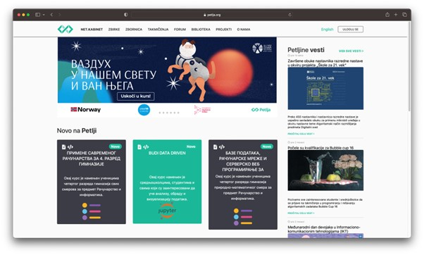
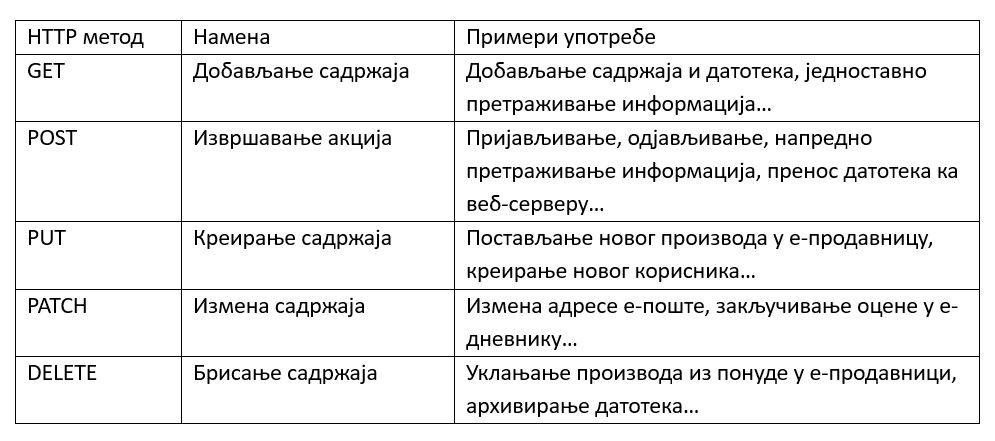

Протокол HTTP
=============

Како би се остварила размена веб-ресурса између удаљених софтверских система у рачунарској мрежи, на апликативном слоју користи се протокол за размену хипертекста (*HyperText Transfer Protocol*, HTTP). Већ смо рекли да је основна карактеристика хипертекста постојање веза између докумената (или веза ка деловима унутар истог документа) које омогућавају нелинеарно конзумирање садржаја. HTTP протоколом се дефинише начин на који се овакви ресурси размењују између рачунара.

Када унесеш адресу *www.petlja.org* у адресну линију свог веб-прегледача, веб-прегледач пошаље HTTP захтев (HTTP *request*) којим се захтева приступ веб-ресурсу који је доступан на тој адреси. Веб-сервер до којег захтев дође преко мреже проналази ресурс који се захтева и шаље HTTP одговор (HTTP *response*) који садржи информације о захтеваном ресурсу и његов садржај. Након што веб-прегледач добије одговор, његов задатак је да ти прикаже садржај, односно у случају горње адресе, почетну страницу веб-сајта организације Петља. Ова захтев–одговор парадигма се примењује за сваки ресурс који је потребно добавити, што поред хипертекст докумената подразумева и документа за стилизовање садржаја (тзв. стилски листови), мултимедијалне ресурсе (слике, аудио и видео записе, и др.), документа које корисник преузима на свој рачунар, итд.

HTTP методе и статусни кодови
_______________________________

Иако HTTP протокол најчешће користиш за преглед веб-садржаја, то није његова једина сврха. На пример, приликом пријављивања на портал организације Петља, ти обавештаваш веб-сервер да желиш да садржај посматраш не као гост веб-сајта, већ као корисник који има одређене привилегије (као што је праћење напретка). Пријављивање, само по себи, не представља чин једноставног прегледања веб-садржаја, већ извршавање услуге коју ти веб-сајт портала Петља нуди. 

Као што видиш, веб-сервери могу извршавати и друге услуге осим једноставног прегледа веб-садржаја. Како би се разликовала различита значења HTTP захтева, стандард HTTP протокола прописује коришћење тзв. HTTP метода (HTTP *method*), кључних речи које носе основну намену свих HTTP захтева. У наредној табели можеш пронаћи најкоришћеније HTTP методе и њихове основне намене. Наравно, стандард не прописује обавезну употребу ових метода, већ је на програмерима да се договоре о њиховој употреби. На пример, метод POST се може искористити и за брисање садржаја.

Нису ни сви HTTP одговори идентични. На пример, захтев за неким ресурсом се може испунити успешно, чиме се тај ресурс испоручује клијенту који га је захтевао. Међутим, шта ако захтевани ресурс не постоји на веб-сајту? Или ако корисник који захтева ресурс нема довољна права да приступи том ресурсу? Или ако је ресурс померен на другу адресу?

У зависности од ових, али и разних других параметара, веб-сервер може на исти упит   дати различите одговоре. Како би се сигнализирао тип одговора, HTTP протокол прописује употребу статусних кодова (HTTP *status code*). Статусни код представља троцифрени број којем је придружено одговарајуће значење. Значење статусног кода се наводи кратком статусном поруком (HTTP *status message*), која увек прати статусни код. Слично као и код HTTP метода, коришћење статусних кодова у сврхе којима су намењени није обавезно, али се сматра добром праксом.

Статусни кодови су груписани у категорије према цифри стотина на следећи начин:

- Информациони кодови (1xx): служе за добијање информација о захтеву и најчешће се користе између унутрашњих механизама протокола:

    - 100 Continue – индикатор да је иницијални део захтева пристигао и да је веб-сервер спреман да настави прихватање остатка захтева;
    - 101 Switching Protocols – индикатор да се веб-сервер слаже са променом протокола онако како је клијент напоменуо у захтеву.

- Кодови успешности (2xx):

    - 200 OK – индикатор да је захтев за ресурсом успешно обрађен и да веб-сервер испоручује захтевани ресурс у одговору;
    - 201 Created – индикатор да је захтев за креирањем новог садржаја успешно обрађен (типично се користи за POST или PUT захтеве);
    - 204 No Content – индикатор да је веб-сервер успешно обрадио захтев, али да не постоји садржај који се испоручује у одговору.

- Кодови преусмеравања (3xx):

    - 301 Moved Permanently – индикатор да је захтевани ресурс трајно померен на другу локацију, те да текућу адресу не треба користити убудуће;
    - 302 Found – индикатор да је захтевани ресурс могуће пронаћи привремено на другој локацији, али да се убудуће може користити иста адреса;
    - 304 Not Modified – индикатор да је ресурс, који је кеширан на страни клијента, и даље валидан, те да нема потребе добављати га поново са веб-сервера.

- Кодови клијентских грешака (4xx):

    - 400 Bad Request – индикатор да веб-сервер не може да одговори на захтев због грешака у захтеву који је клијент послао (на пример, неки од обавезних параметара захтева недостаје или је у неисправном формату);
    - 401 Unauthorized – индикатор да клијент мора да пошаље креденцијале за приступ захтеваном садржају (на пример, корисник мора прво да се пријави на систем пре него што приступи садржају);
    - 403 Forbidden – индикатор да креденцијали које је клијент послао немају довољна права за приступ захтеваном садржају (на пример, корисник који има право читања неког ресурса покушава да изврши акцију измене или брисања тог ресурса);
    - 404 Not Found – индикатор да захтевани ресурс није могуће пронаћи на веб-серверу.

- Кодови серверских грешака (5xx):

    - 500 Internal Server Error – индикатор да је веб-сервер наишао на неочекивано стање које га је спречило да обради захтев;
    - 503 Service Unavailable – индикатор да веб-сервер тренутно није у могућности да обради захтев због преоптерећења или одржавања.

URL
___

Рекли смо да је веб-серверима неопходно послати HTTP захтев који ће они обрадити како бисмо добили некакав резултат, на пример, хипертекст документ или пријављивање на систем. Иако је могуће да један веб-сервер опслужује само једну врсту захтева, оваква структура би водила ка веома лошој употреби ресурса, јер бисмо за сваки тип захтева морали да подешавамо по један рачунар. Због тога, сасвим је за очекивати да један веб-сервер може да опслужи већи број типова захтева.

Када веб-сервер који може да опслужи више врста HTTP захтева добије неки захтев, како да зна који тип услуге треба да испоручи клијенту? Коришћење HTTP метода јесте један начин да разазна тип услуге, али често то није довољно. На пример, ако веб-сервер опслужује дигитални албум слика, како да веб-сервер зна коју од тих слика треба да врати као одговор на клијентов GET захтев?

Одговор лежи у униформним адресама ресурса (*Uniform Resource Locators*, URL), којe се користе зарад идентификације и проналажења ресурса у оквиру рачунарске мреже. Сваки URL јединствено одређује тачно један ресурс, а коришћење различитих HTTP метода над неким ресурсом одређује операције које је могуће применити над тим ресурсом.

Узмимо за пример наредни URL: `http://moj-sajt.rs:8080/album/1/slika/15`. Основни елементи које можемо пронаћи у овом примеру су:

- Схема (*scheme*): Oдређује протокол који се користи за приступ ресурсу. У случају веб-захтева, то ће бити http:// или https://.

    - http://

- Ауторитет (*authority*): Идентификује веб-сервер путем имена домена или IP адресе и, додатно, броја порта (уколико има потребе за њиме).

    - moj-sajt.rs:8080

- Путања (*path*): Дефинише специфичан ресурс или услугу којима се приступа. Путања не мора нужно одговарати стварној локацији на диску веб-сервера (и, најчешће, то није ни случај).

    - /album/1/slika/15

Погледајмо сада нешто сложенији пример: `http://moj-sajt.rs/galerija?ceo_ekran=da&navigacija=ne#komentari`. Поред основних елемената, овај URL садржи још неке, необавезне елементе:

- Параметри (*query parameters*): Користе се за прослеђивање додатних информација веб-серверу. Сваки параметар има своје име и вредност који су одвојени симболом „=“, док се два параметра раздвајају симболом „&“. Симбол „?“ на почетку се користи како би се параметри раздвојили од осталих URL елемената.

    - ?ceo_ekran=da&navigacija=ne

- Фрагмент (*fragment identifier*): Идентификује специфичну секцију у оквиру ресурса, најчешће у случају хипертекста. Симбол „#“ на почетку се користи како би се фрагмент раздвојио од осталих URL eлемената.
    
    - #komentari

HTTP заглавља
_____________

У комуникацији између клијента и сервера, осим садржаја који они размењују или врсте услуга коју клијент захтева, а сервер пружа, често је важно разменити и неке информације о самим захтевима, односно одговорима. 

Узмимо за пример друштвену мрежу Фејсбук. Уколико посетиш званични веб-сајт ове друштвене мреже на стоном рачунару, добићеш један приказ веб-сајта који садржи доста слика и порука. Са друге стране, ако истом веб-сајту приступиш са неког мобилног уређаја, добићеш нешто сажетији приказ. Због чега би се веб-сајт, који треба да има идентичну улогу, приказивао другачије на другачијим уређајима? Одговор лежи у томе да различити уређаји имају различиту величину екрана (и још неке друге карактеристике), те је важно на интелигентан начин искористити доступан простор. Уместо да веб-сајт од корисника захтева да одабере који приказ жели, много би боље било да веб-сајт унапред добије информацију са каквог уређаја му се приступа. На тај начин, он може сам одлучити који приказ ће искористити приликом враћања одговора клијенту. 

Овакве информације, које ближе описују карактеристике захтева и одговора, називају се HTTP заглавља (HTTP *header*). У случају HTTP захтева, заглавља могу садржати информације као што су: ауторитет веб-сервера од којег се захтева услуга, формат одговора коју клијент уме да обради, информације о клијенту који шаље захтев, креденцијали, и др. У случају HTTP одговора, заглавља могу садржати информације као што су: формат у којем се испоручује садржај у телу (ако постоји), дужина садржаја, датум када је ресурс испоручен и др. 

Свако HTTP заглавље (HTTP *header*) наводи се у засебној линији и састоји се од назива заглавља, праћено симболом „:“ иза којег се наводи вредност заглавља. HTTP заглавља има велики број, а овде наводимо само некa од њих које се могу пронаћи:

- У HTTP захтевима:

1. Accept: text/html

    Клијент наводи да уме да обрати одговоре у HTML формату.

2. Host: petlja.org

    Клијент шаље захтев на ауторитет petlja.org.

3. User-Agent: Mozilla/5.0 (Macintosh; Intel Mac OS X 10_15_7) AppleWebKit/537.36 (KHTML, like Gecko) Chrome/114.0.0.0 Safari/537.36

    Клијент даје информације о врсти и верзији веб-прегледача из којег је захтев послат.

- У HTTP одговорима:

1. Content-Type: text/html; charset=utf-8

    Веб-сервер наводи да се садржај испоручује у HTML формату (са UTF-8 кодном схемом).

2. Date: Sun, 18 Jun 2023 17:49:24 GMT

    Веб-сервер наводи датум када је садржај испоручен.

3. Server: Kestrel

    Веб-сервер наводи врсту веб-серверске технологије која се користи за обраду захтева (Kestrel је веб-сервер апликација коју развија Мајкрософт).

4. X-Powered-By: ASP.NET

    Веб-сервер наводи да је развојни оквир који се користи за имплементацију серверске апликације ASP.NET.

Структура HTTP поруке
_____________________

Сада када познајеш неке важне елементе захтев–одговор парадигме HTTP протокола, видећеш како HTTP протокол дефинише структуру порука које се размењују између клијента и веб-сервера.

Сваки HTTP захтев записује се у наредном формату:

::

    МЕТОД ПУТАЊА ВЕРЗИЈА
    ЗАГЛАВЉА

    ТЕЛО

Елементи HTTP захтева су:

- МЕТОД – неки од HTTP метода (GET, POST, итд.).
- ПУТАЊА – URL ка ресурсу који се захтева (обично се наводи без схеме и ауторитета).
- ВЕРЗИЈА – верзија HTTP протокола који се користи. Тренутно је и даље најраспрострањенија верзија „HTTP/1.1“, али се све више користи и „HTTP/2“ и, најређе, последња верзија „HTTP/3“.
- ЗАГЛАВЉА – HTTP заглавља која ближе описују карактеристике захтева.
- ТЕЛО – необавезни садржај који се прослеђује серверу, уколико услуга која се захтева очекује да буде прослеђен неки садржај (на пример, информације о кориснику за ког се креира нови налог у систему). Приметимо да је последње заглавље обавезно раздвојено од тела захтева једним празним редом.

На пример, захтевање *почетна страница* посвећена курсу „Базе података“ за трећи разред гимназија на платформи Петља може се формулисати наредним HTTP захтевом:

::

    GET /kurs/7963/0 HTTP/1.1
    Accept: text/html
    Host: petlja.org
    User-Agent: Mozilla/5.0 (Macintosh; Intel Mac OS X 10_15_7) AppleWebKit/537.36 (KHTML, like Gecko) Chrome/114.0.0.0 Safari/537.36

Празни ред на крају је важан како би се означило да је „User-Agent“ последње заглавље. Додатно, примети да овај захтев не садржи тело. То и јесте уобичајен случај код GET метода, с обзиром на то да се он користи искључиво за добављање садржаја. Сви евентуални параметри се прослеђују као параметри URL адресе. Слично важи и за метод DELETE. Остали методи, POST, PATCH и PUT уобичајено очекују да се проследи неки садржај у телу захтева. Наредни пример илуструје HTTP захтев којим се корисник пријављује на систем. Приметимо да се подаци о корисничком имену и лозинки прослеђују кроз тело захтева.

::

    POST /login HTTP/1.1
    Host: moj-sajt.rs

    korisnik=admin&lozinka=ne_tako_tajna_lozinka

.. reveal:: HTTPS_zanimljivost
    :showtitle: Занимљивост: Безбедност података и протокол HTTP
    :hidetitle: Сакриј занимљивост

    Сигурно знаш да велики број веб-сајтова који омогућавају корисницима да се пријаве на систем сакривају лозинку приликом уноса, као што је приказано на наредној слици. 

    .. image:: ../../_images/slika_37c.jpg
        :width: 780
        :align: center

    Међутим, код пријављивања на систем, веб-прегледач шаље HTTP захтев који веома личи на претходни који смо навели. Чак и ако неко ко је у твојој близини не може да види лозинку коју уносиш, то не значи нужно да је комуникација са тим системом безбедна. Твој HTTP захтев путује кроз велики број мрежних уређаја на интернету, те злонамерна лица могу да инструишу мрежне уређаје који су у њиховом власништву да отпакују поруку и да прочитају садржај HTTP захтева. Да бисмо били безбедни, потребно је да поверљиве податке делимо са веб-сајтовима који користе сигурни протокол за пренос хипертекста (*HyperText Transfer Protocol Secure*, HTTPS). HTTPS је готово идентичан као HTTP протокол о којем управо учиш, са разликом да се сва комуникација шифрује између лица која учествују у комуникацији. Сигурну комуникацију ћеш препознати тако што се за схему URL адреса користи „https://“, а већина савремених веб-прегледача нуди и додатне информације када веб-сајтови испуњавају безбедносне провере.

    .. image:: ../../_images/slika_37d.jpg
        :width: 780
        :align: center

    Ипак, нису сви `https://` веб-сајтови безбедни. Злонамерна лица такође прибегавају техници познатој под називом пецање (*phishing*), којом се жртве напада упућују на лажан веб-сајт који веома личи (а некада чак идентично изгледа и идентично се понаша) на званични веб-сајт, у намери да се украду креденцијали или други поверљиви подаци (попут бројева на банковним картицама, бројева телефона, итд.). На наредној слици је приказан пример веб-сајта за пецање корисника Фејсбук платформе. Приметићеш да веб-прегледач приказује да је комуникација са веб-сајтом безбедна (што и јесте, с обзиром на то да се користи HTTPS протокол за комуникацију), али URL адреса упућује на очигледну превару. Ипак, некада су URL адресе на први поглед коректне, као у случају *www.faceb00k.com*, те је важно да обратиш пажњу. Неопрезан корисник може угледати овакав веб-сајт и унети своје креденцијале, чиме даје могућност злонамерним лицима да прикупе сав садржај са платформе Фејсбук, укључујући приватне фотографије, разговоре са другим корисницима, па чак и неке поверљиве информације других корисника („пријатеља“ жртве напада) и то у распону од неколико (мили)секунди након што успешно украду жртвине креденцијале. Овакве врсте превара се у Републици Србији сматрају високотехнолошким криминалом и више информација о томе можеш пронаћи на веб-сајту Министарства унутрашњих послова посвећеном овој теми: http://www.mup.gov.rs/wps/portal/sr/gradjani/saveti/Visokotehnoloski+kriminal.

    .. image:: ../../_images/slika_37e.jpg
        :width: 780
        :align: center

Пређимо сада на HTTP одговоре. Сваки HTTP одговор записује се у наредном формату:

::

    ВЕРЗИЈА СТАТУСНИ_КОД СТАТУСНА_ПОРУКА
    ЗАГЛАВЉА

    ТЕЛО

Елементи HTTP одговора су:

- ВЕРЗИЈА – верзија HTTP протокола који се користи. 
- СТАТУСНИ_КОД – индикатор одговора веб-сервера на захтев у виду троцифреног броја
- СТАТУСНА_ПОРУКА – кратка порука која додатно описује индикатор одговора веб-сервера на захтев.
- ЗАГЛАВЉА – HTTP заглавља која ближе описују карактеристике одговора.
- ТЕЛО – необавезни садржај који се прослеђује клијенту. Очекивано, садржај тела одговара врсти захтева који је веб-сервер прихватио. У случају да је приликом обраде захтева дошло до грешке, тело садржаја може садржати и детаљније информације о врсти грешке.

Приметићеш да опет постоји један празан ред који раздваја последње заглавље од тела одговора. Као и у случају HTTP захтева, чак и ако нема тела одговора, важно је да овај празан ред постоји како би се означио крај заглавља.

Примера ради, HTTP одговор на захтев за курс „Базе података“ који смо навели раније, може изгледати овако (тело одговора је скраћено):

::

    HTTP/1.1 200 OK
    Content-Type: text/html; charset=utf-8

    <!DOCTYPE html>
    <html lang="rs">
    ...
    </html>
