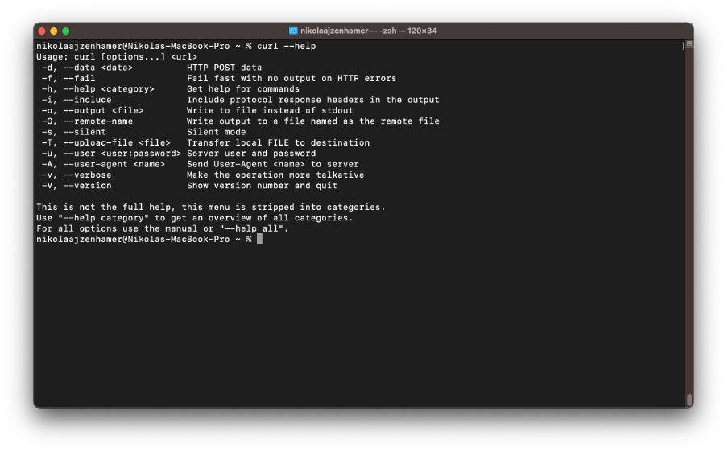
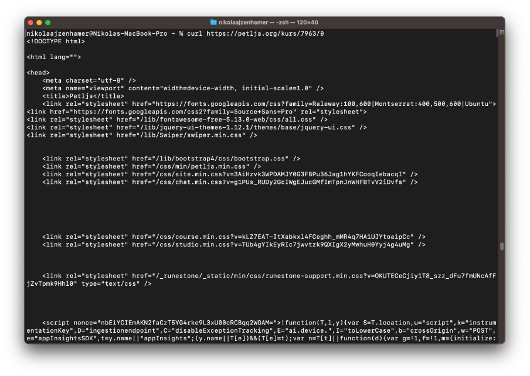

Коришћење HTTP протокола приликом претраживања веба
===================================================

Сада ћеш видети како можеш да шаљеш HTTP захтеве неким постојећим веб-серверима и осматраш HTTP одговоре које ти они узвраћају. Видећеш два начина да се ово уради:

- путем командне линије, и 
- путем веб-прегледача.

Кроз командну линију ћеш користити алат *curl*, који, у зависности од оперативног система који користиш, можда већ и имаш инсталиран. Покушај да отвориш командну линију и унесеш *curl --help*.   Ако добијаш поруку сличну као на наредној слици, онда твој рачунар већ поседује овај алат. У супротном, алат можеш инсталирати праћењем везе https://curl.se/download.html, па одабиром свог оперативног система из секције *Packages* (на пример, за оперативни систем Windows, то ће те одвести до везе https://curl.se/windows/). Након инсталирања софтверских пакета и поновног покретања командне линије, можеш поново тестирати да ли је алат доступан.

Слање једноставног GET захтева се може извршити командом

::

    curl https://petlja.org/kurs/7963/0

Одговор који се добија може изгледати као на наредној слици.

Подразумевано, алат приказује само тело одговора. Ако желиш да видиш цео садржај HTTP захтева и одговора, мораш да наведеш опцију ``-v``:

::

    curl -v https://petlja.org/kurs/7963/0

Линије којима претходи карактер ``>`` односе се на HTTP захтев, док се линије којима претходи карактер ``<`` односе на HTTP oдговор.

Приметићеш да је алат *curl* аутоматски превео URL који смо навели у одговарајуће елементе заглавља пре слања захтева. Навођењем опције ``-H`` можеш дефинисати заглавља која ће се наћи у захтеву:

::

    curl -v -H "Moje-Zaglavlje: Vrednost" https://petlja.org/kurs/7963/0

Ако захтев има више заглавља, свако заглавље мора бити наведено засебном опцијом ``-H``:

::

    curl -v -H "Moje-Zaglavlje: Vrednost" -H "Drugo-Zaglavlje: Druga vrednost" http://petlja.org/kurs/7963/0

Покушај да у испису након покретања претходне наредбе у командној линији пронађеш оба заглавља.

Слање захтева који није GET подразумева коришћење опције ``-X`` иза које се наводи назив HTTP метода. На пример, ако желиш да пошаљеш POST захтев, потребно је да наведеш опцију ``-X POST``. Додатно, уколико желиш да придружиш тело захтеву, потребно је да користиш опцију ``-d`` иза које се наводи ниска која садржи тело захтева. Пробај да извршиш наредну наредбу (примети да смо изоставили опцију ``-v`` како бисмо приказали само тело одговора који добијамо од овог веб-сервера):

::

    curl -X POST -d "ime=Lana&prezime=Djurdjevic" https://httpbin.org/post

Требало би да пронађеш податке из тела у одговору на овај захтев, као на наредној слици:

Слање захтева кроз командну линију је корисно уколико желимо да тестирамо рад неке апликације (на пример, веб-сервера који смо имплементирали). Предност коришћења командне линије јесте могућност писања скриптова командне линије (*Command Line Interface script, CLI script*), извршних датотека које садрже наредбе које се често понављају. На тај начин можемо написати скуп наредби којe тестирају рад неке апликације и пратити њено понашање. Писање скриптова је изван градива овог курса, али као будући програмер, важно је да разумеш предности овог приступа.

Са друге стране, командна линија има и своје недостатке. Један очигледан јесте немогућност интерпретације сложених тела одговора. На пример, кад извршаваш било који од GET захтева које смо навели изнад, приметићеш да се садржај тела наводи у формату HTML и то као изворни код. 

Уместо тога, HTTP комуникацију могуће је пратити из веб-прегледача који нам, поред тога што нам приказује информације о захтевима и одговорима, омогућава приступ и великом броју других корисних алата. У оквиру веб-прегледача, сви ти алати се називају једним именом – алати за развој (*developer tools*). Начин на који се приступа алатима за развој својствен је сваком веб-прегледачу. На пример, у оквиру *Google Chrome* веб-прегледача одабери дугме за више опција (три тачке у горњем десном углу), па опцију *More Tools* и, коначно, опцију *Developer Tools* (поред које се налази и скраћеница за бржи приступ преко тастатуре, која је такође својствена сваком веб-прегледачу, али и оперативном систему).

Приказаће ти се поглед као на наредној слици:

Језичци *Element*s, *Console*, *Sources* и др. представљају разне алате за развој који су ти доступни. Са некима од њих ћеш се сусрести у наредним поглављима.

Ако у адресној линији приступиш неком веб-сајту, на пример, *www.petlja.org*, приметићеш да се променио поглед у алатима за развој. Језичак *Elements* садржи изворни код погледа веб-сајта који посећујеш. У овом случају, то је изворни код почетне странице веб-сајта организације Петља.

Ако отвориш језичак *Network* (који може бити сакривен у оквиру листе за тренутно сакривене језичке – дугме „>>“ поред језичка *Sources* на слици изнад), приказаће ти се алат у којем можеш да осматраш комуникацију између твог веб-прегледача и веб-сервера који опслужује веб-сајт организације Петља.

Примети ћеш да постоји велики број HTTP захтева у листи захтева. Као што смо рекли, HTTP протокол није дизајниран да испоручи све ресурсе у оквиру једног пара <захтев, одговор> са веб-сервера на клијента. Због тога, када се испоручи изворни код странице коју гледаш, сваки ресурс који страница захтева (дакле, свака слика, фонтови, додатне информације доступне на другим веб-серверима, итд.) мора бити накнадно добављен новим паром <захтев, одговор>. 

Ако скролујеш на почетак листе, пронаћи ћеш први HTTP захтев који је веб-прегледач упутио веб-серверу приликом посећивања овог веб-сајта.

Одабиром тог захтева можеш пронаћи разне информације о њему кроз наредне (најважније) језичке:

- *Headers*: Oсновне информације о захтеву и одговору (URL, HTTP метод који је коришћен, статусни код и порука и др.), као и списак свих заглавља која су размењена између веб-прегледача и веб-сервера.
- *Preview*: Интерпретација тела одговора. У случају да је захтев био за неком страницом веб-сајта, може се десити да интерпретација изгледа другачије него коначни приказ који се налази у прозору лево од алата за развој (на пример, одсуство боја, слика и др.). То је зато што језичак *Preview* узима у обзир само садржај тела захтева који се посматра, без ресурса који су добављени другим захтевима.
- *Response*: Садржај тела одговора у формату који је пристигао са веб-сервера.

*Network* језичак је специфичан по томе што, сваки пут када посетимо неки други ресурс на вебу, прво ће бити очишћен садржај језичка, како би се формирала нова листа захтева. Ако на почетној страници веб-сајта организације Петља одабереш „net.kabinet” (док ти је језичак *Network* и даље отворен), приметићеш да се направила нова листа захтева.

Некада је ипак пожељно да се претходна листа захтева не очисти како би се лакше пратио ток свих захтева. У ту сврху, можеш укључити опцију *Preserve log* у линији испод језичка *Network*. Ово ће ти бити веома корисно приликом анализирања веб-серверских апликација које ћеш имплементирати у последњем делу курса.

Још један језичак који ћеш користити често приликом развоја веб-апликација јесте *Application* у којем можеш пронаћи различите информације о клијентској страни HTTP комуникације. На пример, у оквиру овог језичка можеш пронаћи све колачиће који су постављени од стране веб-сервера којима неки веб-сајт приступа. На пример, ако отвориш овај језичак и приступиш веб-сајту ”www.petlja.org”, а затим у оквиру секције *Storage* рашириш опцију *Cookies*, приметићеш да постоје колачићи који су постављени од веб-сервера *https://petlja.org*, као на наредној слици. 

