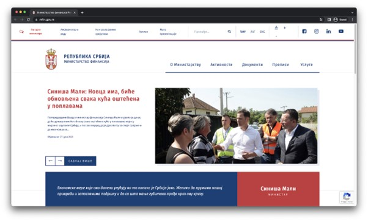
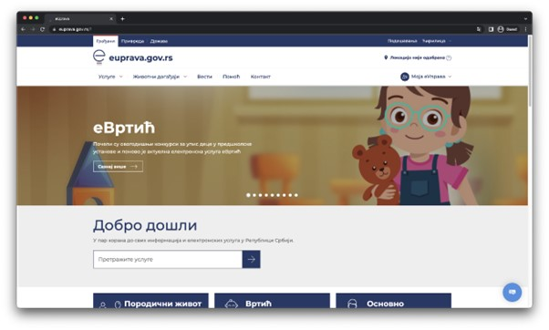

Веб-програмирање
================

Када говоримо о веб-програмирању, говоримо о развоју апликација чије функционалности користимо посредством веб-прегледача. У електронским продавницама можеш да купујеш производе, а да не посетиш продавницу. Путем друштвених мрежа можеш ступити у контакт са познаницима и разменити разне садржаје. Па чак и апликација која ти омогућава да приступиш серверу електронске поште и шаљеш, односно читаш електронска писма представља један пример таквих апликација. Све ове апликације, али и многе друге, називамо једним именом – веб-апликације (*web application*).

Посебну врсту веб-апликација представљају веб-сајтови (*website*). Није јасно направити разлику између веб-сајтова и других веб-апликација. Могло би се рећи да су веб-сајтови оне веб-апликације чија је превасходна намена једноставна претрага информација, путем разних навигационих менија, веза у хипертексту, једноставних претраживачких сервиса и сл. Пример веб-сајта би могла бити званична веб-презентација Министарства финансија (доступна на адреси *https://www.mfin.gov.rs/*). Знатижељни посетилац овог веб-сајта би могао да пронађе информације о раду Министарства, вести, разна документа, прописе и сл. 

Са друге стране, веб-апликацијама се обично сматрају оне апликације које нуде сложеније услуге кориснику. На пример, веб-апликација еУправа (доступна на адреси *https://euprava.gov.rs/*) тешко би се могла назвати веб-сајтом, с обзиром на број и опсег функционалности које ова апликација пружа корисницима. У складу са овим, могло би се рећи да корисници имају пасивнију улогу у случају веб-сајтова (пошто углавном конзумирају доступне информације), док у случају веб-апликација имају активнију улогу (подносе захтеве систему, мењају садржаје у оквиру система, итд.).

Веб-сајтови се састоје од макар једне, али чешће од већег броја веб-страница (webpage). Свака веб-страница се представља једним хипертекстуалним документом и нуди својеврстан садржај. Веб-странице су повезане хипервезама којима се омогућава прелазак са једне на другу, при чему сваки „прелазак“ представља нови HTTP захтев који се шаље веб-серверу (а у одговору тог захтева се налази садржај хипертекст документа који представља веб-страницу на коју се прелази). И у случају веб-апликација можемо говорити о постојању већег броја веб-страница, од којих свака пружа одговарајућу услугу.