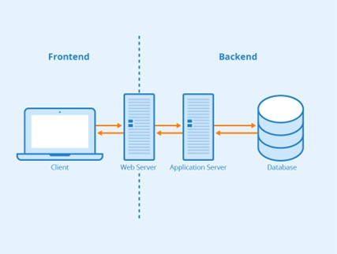

Статички и динамички веб
========================

Од великог значаја је разматрати динамичност садржаја у оквиру неке веб-апликације (сада, а и у наставку текста говоримо о веб-апликацијама у општем смислу, осим ако то није другачије назначено). Садржај према динамичности можемо поделити на статички (*static*) и динамички (*dynamic*). Статички садржај, једном када се испоручи кориснику, остаје непромењен. На пример, захтев за последњих десет објава на неком блогу се може променити између два захтева на почетку и крају месеца, али у тренутку када се један захтев испуни, садржај који се испоручује клијенту се неће променити до наредног захтева (евентуално). Због тога се он сматра статичким. Са друге стране, мапа која показује текућу метеоролошку слику изнад државе и чији се приказ освежава на сваких пола сата како би се кориснику увек приказала последња утврђена слика, без потребе да корисник шаље нови захтев сваки пут, представља пример динамичког садржаја.

Опрез: У литератури често можеш пронаћи да се за веб-сајтове сматрају оне веб-апликације које имају статички садржај, а да је основно својство веб-апликација постојање динамичког садржаја. Ово ипак не можемо прихватити као основу за разликовање веб-сајтова од веб-апликација. Разлог за то јесте што веб-сајтови могу имати секције које се генеришу динамички (на пример, веб-сајт електронских новина може укључити део који приказује временску прогнозу која се освежава аутоматски), а опет их не сматрамо веб-апликацијама, док веб-апликације могу имати делове који су увек непроменљиви (што те делове чини статичким). Због тога, нешто тачније би било рећи да веб-сајтови имају претежно статички садржај, а да веб-апликације обилују динамичким садржајима (дакле, без постављања јасних граница).

У технологије које генеришу статички садржај спадају описни језици, као што је HTML, као и језик стилских листова CSS. Да би се генерисао динамички садржај, потребно је извршити неки програмски код који дефинише понашање којим се тај садржај мења (на пример, слање захтева за дохватање последњих информација о метеоролошкој слици, додавање новог садржаја, замена постојећег садржаја новим садржајем и др.). Постоји велики број технологија којима се ово омогућава. Најчешћи начин за генерисање садржаја јесте путем тзв. скрипт језика (*script*), који припадају истоименој парадигми, а чија је главна сврха једноставно и брзо програмирање (превасходно) веб-апликација.

Динамички садржај је могуће генерисати и на страни клијента и на страни сервера. На страни клијента кажемо да се извршавају клијентски скриптови (*client script*) и међу доступним технологијама најпопуларнији је програмски језик *JavaScript* (и све популарнија варијанта *TypeScript*). На страни сервера се извршавају серверски скриптови (server script) који се пишу у програмским језицима као што су *Python, C#, Java, PHP, Ruby* и др. Занимљиво је напоменути да је, иако се традиционално сматра клијентским скрипт језиком, *JavaScript* данас у огромној употреби и као серверски скрипт језик.

Да би се корисницима омогућили разни сервиси, често није довољно да постоји само веб-апликација која је покренута на неком веб-серверу. Савремене услуге веба подразумевају развијање и веб-апликација које се извршавају на клијентској страни веб-комуникације (најчешће у оквиру веб-прегледача). Раздвајање једне сложене веб-апликације на две веб-апликације, од којих се једна извршава на страни клијента, а друга на страни сервера, довела је до појаве специјализованих технологија. Клијентске веб-апликације се називају још и предње стране (*frontend*), а неке од најпопуларнијих специјализованих технологија у виду библиотека за развој ових апликација су *Angular* (*TypeScript*), *React* (*JavaScript*), *Vue* (*JavaScript*) и др. Са друге стране, серверске веб-апликације се називају још и задње стране (*backend*) и међу најпопуларнијим технологијама које подржавају развој ових апликација су *Flask* (*Python*), *Django* (*Python*), *Node.js (*JavaScript*), *.NET* (*C#*), *Laravel* (*PHP*), *Spring* (*Java*), *Ruby on Rails* (*Ruby*) и др.

.. learnmorenote:: **Занимљивост:**

    Ова специјализација технологија је довела до тога да се програмери такође специјализују. У огласима за послове данас ћеш често видети позиције као што су *frontend developer* (веб-програмер специјализован за технологије предње стране) и *backend developer* (веб-програмер специјализован за технологије задње стране). Својеврсна је и позиција *fullstack developer*, која подразумева познавање технологија и предње и задње стране.

