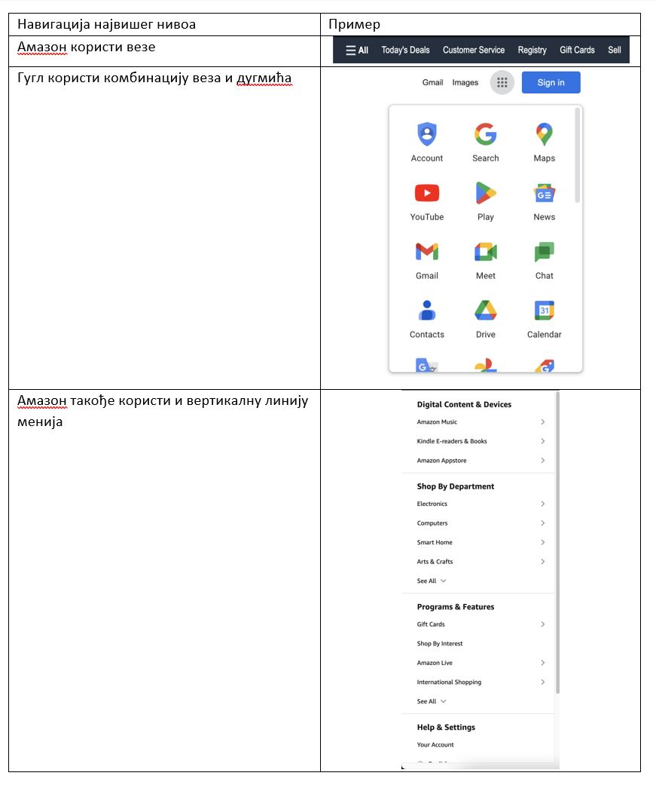
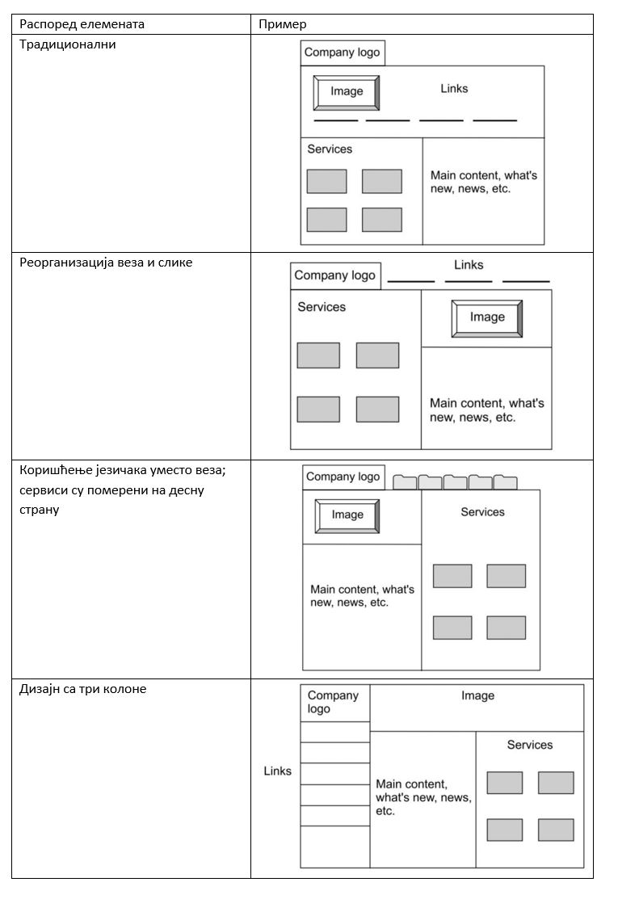
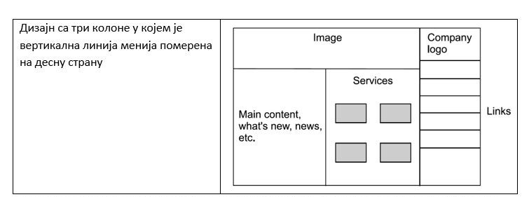

Принципи веб-дизајна
====================

Поред вештина неопходних за конструкцију веб-сајтова, важан елемент, који се често примењује и пре него ли се започне израда веб-сајта, представља скуп знања и вештина који се називају једним именом веб-дизајн (*web design*). Овај процес подразумева креирање и распоређивање визуалних елемената који представљају делове веб-страница неког веб-сајта. Суштина је у томе да се осмисли најпогоднији начин који ће посетиоцима веб-сајта пружити најудобније искуство. 

Како су веб-програмери они који су задужени за конструкцију веб-сајта, тако су веб-дизајнери задужени за осмишљавање његовог изгледа. Едукација за обављање послова веб-дизајнера, иако може имати одређених преклапања са едукацијом за веб-програмере, више се фокусира на визуалне аспекте (распоређивање, теорију боја, типографију, композицију, итд.) и корисничко искуство (креирање веб-сајтова који су интуитивни за коришћење, остваривање потреба циљних група, корисничко тестирање, итд.). Ипак, и савремени веб-програмери би требало да поседују одређено познавање области веб-дизајна како би могли да на прикладан начин пренесу идеју веб-дизајнера у конкретан код.

Главни принцип дизајнирања веб-сајта јесте разбијање садржаја у мање целине, које се потом групишу у хијерархијску структуру. Креирање нацрта ове структуре ти умногоме може помоћи да организујеш веб-странице на логичан начин. Један пример хијерархијске организације елемената можеш пронаћи на наредној слици.

Елементи веб-дизајна
_____________________

Практично је немогуће замислити веб-сајт без навигације највишег нивоа (*top level navigation*), чија је главна сврха да омогући корисницима једноставну претрагу најважнијег садржаја, као и да им прикаже где се налазе у свом претраживању у односу на цео веб-сајт. Постоји неколико варијанти које је могуће одабрати, као што су: дугмићи, линија менија, језичци, везе, комбинација веза и дугмића или вертикална линија менија. Све ове врсте навигација су приказане на наредној слици.

.. image:: ../../_images/slika_43b.jpg
        :width: 780
        :align: center

Неки примери навигација највишег нивоа популарних веб-сајтова су приказани у наредној табели.

Једном када су нацрт и навигација највишег нивоа одабрани, можемо разматрати најподеснији распоред елемената на некој веб-страници. Очекивано, и овде је могуће одабрати разна решења, а нека од њих су наведена у наставку.

Приликом дизајнирања веб-странице, постоје три главна аспекта којима се дизајнери баве:

- Метафора (*metaphor*): Представља главну мисао која је окосница садржаја веб-сајта као и елементе којима ће се тај садржај представити. На пример, веб-сајт посвећен електронској продавници може садржати елементе као што су: табеларни приказ производа, приказ производа у виду листе са детаљима, потрошачка корпа, калкулатор попуста, итд. Такође, боје, фонтови и генерална структура сајта би требало да се осмисли тако да олакша куповину производа.
- Тема (*theme*): Представља корак даље у односу на метафору и њена главна одговорност јесте да веб-сајт одговара циљаним групама. На пример, ако је веб-сајт намењен куповини играчака, изглед би требало да буде атрактиван и пун боја. Са друге стране, веб-апликација намењена информационом систему здравства би требало да буде сведенија, са доста простора између елемената како би се омогућило лакше претраживање информација пацијената.
- Сценаристички план (*storyboard*): Представља визуелизацију дизајна веб-сајта. У оквиру сценаристичког плана могуће је пронаћи комбинације боја које се користе за веб-сајт, начин на који се навигација приказује и начине на које је замишљено да корисници интерагују са елементима.

    *Слика 1. Пример шаблона сценаристичког плана за део веб-апликације у алату Milanote.*
    

